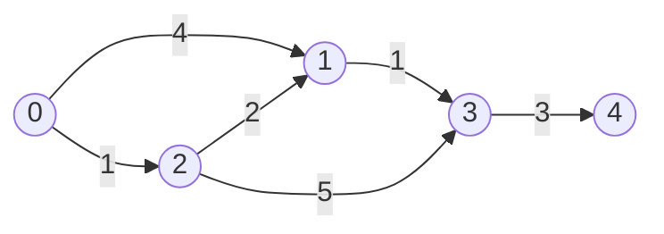
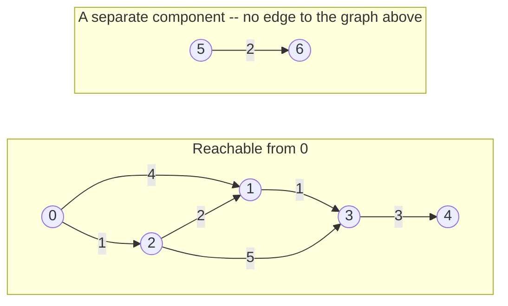

# Lecture 27: Shortest Path: Dijkstra's Algorithm

BFS (Lecture 26) finds the shortest path by *hop count* — perfect when every edge is
equal. Real maps aren't like that: a highway edge and a back-road edge don't cost the
same. **Dijkstra's algorithm** finds the shortest path in a **weighted** graph, and it
does it by combining almost everything this course has built so far: a graph, a
priority queue (Lecture 23), and greedy, step-by-step decision-making.

## In This Lecture

- The shortest-path concept, and single-source shortest path
- Dijkstra's algorithm, built on a min-heap priority queue
- A full step-by-step trace: how `distance[]` evolves as each vertex is finalized
- What happens on a **disconnected** graph — vertices Dijkstra's algorithm can never reach
- Its time complexity
- Real applications, and where the algorithm breaks down

## The Shortest-Path Concept

In a **weighted graph**, the "shortest" path isn't the one with the fewest edges — it's
the one with the smallest total weight along the way. **Single-source shortest path**
means: given one starting vertex, find the shortest distance from it to *every* other
reachable vertex, all at once.



The shortest path from `0` to `1` isn't the direct edge (weight 4) — it's `0 → 2 → 1`
(weight `1 + 2 = 3`), one less than the direct edge. Dijkstra's algorithm finds exactly
this kind of answer, systematically.

## Dijkstra's Algorithm

The core idea: maintain a running "best known distance" to every vertex (starting at
infinity for everyone except the source, which is 0), and repeatedly pick the *closest*
unprocessed vertex, using it to try to improve ("relax") its neighbors' distances. A
min-heap priority queue (Lecture 23) is exactly the tool for "repeatedly pick the
closest" efficiently.

```cpp title="dijkstra.cpp"
#include <iostream>
#include <vector>
#include <queue>
#include <climits>
using namespace std;

class WeightedGraph {
private:
    int numVertices;
    vector<vector<pair<int, int>>> adjList;   // adjList[u] = list of (neighbor, weight)

public:
    WeightedGraph(int v) : numVertices(v), adjList(v) {}

    void addEdge(int u, int v, int weight) {
        adjList[u].push_back({v, weight});
        adjList[v].push_back({u, weight});   // undirected
    }

    vector<int> dijkstra(int source) const {
        vector<int> distance(numVertices, INT_MAX);
        distance[source] = 0;

        // Min-heap of (distance, vertex) pairs -- pair's default comparison
        // orders by distance first, exactly what's needed here.
        priority_queue<pair<int, int>, vector<pair<int, int>>, greater<pair<int, int>>> pq;
        pq.push({0, source});

        while (!pq.empty()) {
            auto [currentDist, current] = pq.top();
            pq.pop();

            if (currentDist > distance[current]) continue;   // a stale, outdated entry

            for (auto& [neighbor, weight] : adjList[current]) {
                int newDist = distance[current] + weight;
                if (newDist < distance[neighbor]) {
                    distance[neighbor] = newDist;
                    pq.push({newDist, neighbor});
                }
            }
        }
        return distance;
    }
};

int main() {
    WeightedGraph graph(5);
    graph.addEdge(0, 1, 4);
    graph.addEdge(0, 2, 1);
    graph.addEdge(2, 1, 2);
    graph.addEdge(1, 3, 1);
    graph.addEdge(2, 3, 5);
    graph.addEdge(3, 4, 3);

    vector<int> distances = graph.dijkstra(0);

    cout << "Shortest distances from vertex 0:" << endl;
    for (int i = 0; i < distances.size(); i++) {
        cout << "  to " << i << ": " << distances[i] << endl;
    }

    return 0;
}
```

```text
$ g++ -std=c++17 -o dijkstra dijkstra.cpp
$ ./dijkstra
Shortest distances from vertex 0:
  to 0: 0
  to 1: 3
  to 2: 1
  to 3: 4
  to 4: 7
```

Confirming by hand: `0 → 2` costs `1`; `0 → 2 → 1` costs `1 + 2 = 3` (beating the direct
edge's `4`, exactly as predicted above); `0 → 2 → 1 → 3` costs `3 + 1 = 4`; and
`0 → 2 → 1 → 3 → 4` costs `4 + 3 = 7`. Every distance the algorithm reports matches a
real, traceable shortest path.

!!! note "Why a stale priority-queue entry can exist at all"
    Because a shorter path to a vertex can be discovered *after* an older, longer-distance
    entry for that same vertex is already sitting in the queue, the queue can hold more
    than one entry per vertex. The `if (currentDist > distance[current]) continue;` line
    skips any entry that's been made obsolete by a better one found in the meantime — a
    small but essential correctness check, easy to forget when first implementing this.

## Tracing Dijkstra's Algorithm Step by Step

The final distances above are correct, but they hide *how* the algorithm got there. The
version below prints `distance[]` in full after every vertex is finalized, along with
exactly which neighbors got relaxed (and their old value → new value), on the same graph
as above.


```cpp title="dijkstra_trace.cpp"
#include <iostream>
#include <vector>
#include <queue>
#include <climits>
#include <string>
using namespace std;

string dstr(int d) {
    return (d == INT_MAX) ? "inf" : to_string(d);
}

class WeightedGraph {
private:
    int numVertices;
    vector<vector<pair<int, int>>> adjList;

public:
    WeightedGraph(int v) : numVertices(v), adjList(v) {}

    void addEdge(int u, int v, int weight) {
        adjList[u].push_back({v, weight});
        adjList[v].push_back({u, weight});
    }

    string distString(const vector<int>& distance) const {
        string s = "[";
        for (int i = 0; i < numVertices; i++) {
            if (i > 0) s += ", ";
            s += dstr(distance[i]);
        }
        s += "]";
        return s;
    }

    void dijkstraTrace(int source) const {
        vector<int> distance(numVertices, INT_MAX);
        distance[source] = 0;

        priority_queue<pair<int, int>, vector<pair<int, int>>, greater<pair<int, int>>> pq;
        pq.push({0, source});

        while (!pq.empty()) {
            auto [currentDist, current] = pq.top();
            pq.pop();

            if (currentDist > distance[current]) continue;

            cout << "  Finalize vertex " << current << " (distance " << currentDist << ")"
                 << " -- relax neighbors:";

            for (auto& [neighbor, weight] : adjList[current]) {
                int newDist = distance[current] + weight;
                if (newDist < distance[neighbor]) {
                    cout << " " << neighbor << "(" << dstr(distance[neighbor]) << "->" << newDist << ")";
                    distance[neighbor] = newDist;
                    pq.push({newDist, neighbor});
                }
            }
            cout << endl;
            cout << "    distance[] = " << distString(distance) << endl;
        }
    }
};

int main() {
    WeightedGraph graph(5);
    graph.addEdge(0, 1, 4);
    graph.addEdge(0, 2, 1);
    graph.addEdge(2, 1, 2);
    graph.addEdge(1, 3, 1);
    graph.addEdge(2, 3, 5);
    graph.addEdge(3, 4, 3);

    cout << "Dijkstra trace from source 0:" << endl;
    graph.dijkstraTrace(0);

    return 0;
}
```

```text
$ g++ -std=c++17 -o dijkstra_trace dijkstra_trace.cpp
$ ./dijkstra_trace
Dijkstra trace from source 0:
  Finalize vertex 0 (distance 0) -- relax neighbors: 1(inf->4) 2(inf->1)
    distance[] = [0, 4, 1, inf, inf]
  Finalize vertex 2 (distance 1) -- relax neighbors: 1(4->3) 3(inf->6)
    distance[] = [0, 3, 1, 6, inf]
  Finalize vertex 1 (distance 3) -- relax neighbors: 3(6->4)
    distance[] = [0, 3, 1, 4, inf]
  Finalize vertex 3 (distance 4) -- relax neighbors: 4(inf->7)
    distance[] = [0, 3, 1, 4, 7]
  Finalize vertex 4 (distance 7) -- relax neighbors:
    distance[] = [0, 3, 1, 4, 7]
```

Laid out as a trace table — the form you'd use to work this by hand on an exam:

| Step | Vertex finalized | Its distance | `distance[0..4]` after this step |
|---|---|---|---|
| 1 | 0 | 0 | `[0, 4, 1, inf, inf]` |
| 2 | 2 | 1 | `[0, 3, 1, 6, inf]` |
| 3 | 1 | 3 | `[0, 3, 1, 4, inf]` |
| 4 | 3 | 4 | `[0, 3, 1, 4, 7]` |
| 5 | 4 | 7 | `[0, 3, 1, 4, 7]` |

Two things worth noticing. First, the **finalize order is not `0, 1, 2, 3, 4`** — it's
`0, 2, 1, 3, 4`, because vertex `2` (distance 1) is genuinely closer to the source than
vertex `1` (distance 4, later improved to 3) at the moment the algorithm has to choose
which one to process next; Dijkstra's algorithm always finalizes vertices in increasing
order of their *final* shortest distance, not the order they happen to appear in the
graph. Second, vertex `1`'s entry in the table changes **twice** before it's finalized —
`inf → 4` (step 1, via the direct edge) and then `4 → 3` (step 2, via `0 → 2 → 1`) — which
is exactly the relaxation check `if (newDist < distance[neighbor])` catching a better path
discovered later. Once a vertex is *finalized* (popped with a non-stale distance), though,
its value never changes again — that's the core guarantee the greedy strategy relies on.

## What About a Disconnected Graph?

Dijkstra's algorithm never assumes the graph is fully connected — it starts `distance[]`
at infinity for *every* vertex and only lowers an entry when it actually finds a path.
If a vertex has no path from the source at all, its distance simply never gets touched,
and it's still sitting at `INT_MAX` when the algorithm finishes.



```cpp title="dijkstra_disconnected.cpp"
#include <iostream>
#include <vector>
#include <queue>
#include <climits>
using namespace std;

class WeightedGraph {
private:
    int numVertices;
    vector<vector<pair<int, int>>> adjList;

public:
    WeightedGraph(int v) : numVertices(v), adjList(v) {}

    void addEdge(int u, int v, int weight) {
        adjList[u].push_back({v, weight});
        adjList[v].push_back({u, weight});
    }

    vector<int> dijkstra(int source) const {
        vector<int> distance(numVertices, INT_MAX);
        distance[source] = 0;

        priority_queue<pair<int, int>, vector<pair<int, int>>, greater<pair<int, int>>> pq;
        pq.push({0, source});

        while (!pq.empty()) {
            auto [currentDist, current] = pq.top();
            pq.pop();

            if (currentDist > distance[current]) continue;

            for (auto& [neighbor, weight] : adjList[current]) {
                int newDist = distance[current] + weight;
                if (newDist < distance[neighbor]) {
                    distance[neighbor] = newDist;
                    pq.push({newDist, neighbor});
                }
            }
        }
        return distance;
    }
};

int main() {
    // Vertices 0-4 form the usual connected graph; vertices 5 and 6 form a
    // SEPARATE, disconnected pair -- no edge links {0..4} to {5, 6} at all.
    WeightedGraph graph(7);
    graph.addEdge(0, 1, 4);
    graph.addEdge(0, 2, 1);
    graph.addEdge(2, 1, 2);
    graph.addEdge(1, 3, 1);
    graph.addEdge(2, 3, 5);
    graph.addEdge(3, 4, 3);
    graph.addEdge(5, 6, 2);   // disconnected component: unreachable from 0

    vector<int> distances = graph.dijkstra(0);

    cout << "Shortest distances from vertex 0 (7-vertex graph, 5 and 6 unreachable):" << endl;
    for (int i = 0; i < (int)distances.size(); i++) {
        if (distances[i] == INT_MAX) {
            cout << "  to " << i << ": unreachable (infinity)" << endl;
        } else {
            cout << "  to " << i << ": " << distances[i] << endl;
        }
    }

    return 0;
}
```

```text
$ g++ -std=c++17 -o dijkstra_disconnected dijkstra_disconnected.cpp
$ ./dijkstra_disconnected
Shortest distances from vertex 0 (7-vertex graph, 5 and 6 unreachable):
  to 0: 0
  to 1: 3
  to 2: 1
  to 3: 4
  to 4: 7
  to 5: unreachable (infinity)
  to 6: unreachable (infinity)
```

The algorithm doesn't crash, throw, or need any special-case code for this — vertices `5`
and `6` are never pushed onto the priority queue at all (nothing ever relaxes an edge into
them, because no edge from the `{0..4}` component reaches them), so the loop simply never
processes them and their `distance[]` entries stay at the sentinel value they started with.
`INT_MAX` is being used here as a stand-in for mathematical infinity — any value large
enough to guarantee it's never mistaken for a real, finite distance works, so watch for
overflow if you ever add a *finite* distance to `INT_MAX` by mistake in your own code (the
`if (currentDist > distance[current]) continue;` guard combined with never relaxing an
edge *out of* an unreached vertex — since it never gets dequeued — is exactly what
prevents that here).

!!! warning "A stale, unreachable vertex is never dequeued — not even once"
    It's tempting to think the algorithm "tries" vertex 5 and "fails." It doesn't — vertex
    5 is never pushed onto `pq` in the first place, because pushing only happens inside the
    relaxation step, triggered by scanning a *neighbor* of some vertex already being
    processed. An unreachable vertex has no incoming edge from the reachable component, so
    that relaxation step is simply never triggered for it.

## Time Complexity

With a binary heap-based priority queue (exactly `std::priority_queue`, Lecture 23), each
vertex can be pushed onto the queue up to once per incoming edge, and each push/pop is
O(log V) — giving a total of **O((V + E) log V)** for the whole algorithm, efficient
enough for graphs with hundreds of thousands of edges.

## Applications

- **GPS and mapping software** — literally this algorithm (or a close variant), finding
  the shortest driving route between two points on a weighted road network.
- **Network routing protocols** — finding the lowest-cost path for data packets across a
  network of routers.
- **Games** — AI pathfinding on a weighted grid or graph representing a game map.

## Limitations of Dijkstra's Algorithm

- **Cannot handle negative edge weights.** The algorithm assumes that once a vertex is
  processed with its best-known distance, that distance can never improve — a negative
  edge encountered later could violate that assumption and produce a wrong answer. (The
  Bellman-Ford algorithm, outside this course's scope, handles negative weights instead.)
- **Single-source only.** It finds shortest paths *from one starting vertex* to everywhere
  else — finding shortest paths between *every* pair of vertices needs a different
  algorithm (or running Dijkstra once per vertex).

## Try It Yourself

1. Compile and run `dijkstra.cpp`, then add a new, much shorter edge —
   `graph.addEdge(0, 4, 2)` — a direct connection from `0` to `4` with weight `2`. Predict
   the new shortest distance to vertex `4` before running it, then confirm.
2. Modify `main()` to also print the actual *path* to each vertex, not just the distance —
   you'll need to track, for each vertex, which neighbor last improved its distance (a
   `vector<int> previous`, updated alongside `distance` inside the relaxation step), then
   walk `previous` backward from the destination to the source.
3. Compile and run `dijkstra_trace.cpp` with the same `graph.addEdge(0, 4, 2)` edge added
   from exercise 1. Work out the new finalize order and the full trace table by hand
   *before* running it, then check your prediction against the real output — pay close
   attention to whether vertex `4` gets relaxed more than once.
4. Compile and run `dijkstra_disconnected.cpp`, then add one more edge,
   `graph.addEdge(4, 5, 100)`, connecting the two previously-separate components with a
   single, expensive edge. Predict which vertices' distances change (and which stay
   `unreachable`) before running, then confirm.
5. In `dijkstra_disconnected.cpp`, change `distance[i] == INT_MAX` to
   `distance[i] >= INT_MAX / 2` and explain, in a sentence, a scenario involving adding two
   large-but-finite distances together where the strict `== INT_MAX` check could
   incorrectly treat a genuinely reachable (but very costly) vertex as unreachable, or vice
   versa, due to integer overflow.

## Key Takeaways

- Dijkstra's algorithm solves **single-source shortest path** on a weighted graph by
  greedily processing the closest unprocessed vertex first, using a min-heap priority
  queue (Lecture 23) to always know which vertex that is.
- **Relaxation** — checking whether going through the current vertex improves a
  neighbor's known distance — is the core operation, repeated until the queue is empty.
- The algorithm **finalizes vertices in increasing order of shortest distance**, not in
  vertex-number order or discovery order — `dijkstra_trace.cpp`'s step-by-step table makes
  this concrete: vertex `2` (distance 1) finalizes before vertex `1` (distance 3), even
  though `1` was discovered first.
- A vertex's `distance[]` entry can be **relaxed more than once** before it's finalized
  (each relaxation only ever lowers it), but once finalized, it never changes again — that
  invariant is the whole reason the greedy strategy produces a correct answer.
- On a **disconnected graph**, an unreachable vertex is never pushed onto the priority
  queue at all — its `distance[]` entry simply stays at the sentinel `INT_MAX`
  ("infinity") the whole array started at, with no special-case code required.
- Runs in **O((V + E) log V)** with a binary heap-based priority queue.
- Fails on graphs with **negative edge weights**, and only answers shortest-path-from-one-
  source — both real limitations worth knowing before reaching for it.
