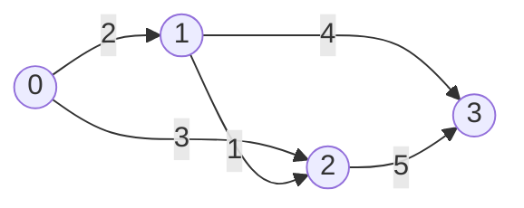

# Lecture 28: Minimum Spanning Trees

Dijkstra's algorithm found the cheapest way to reach *every* vertex from *one* starting
point. This lecture asks a related but different question: what's the cheapest possible
set of edges that connects *all* vertices to each other, period — no designated start,
just "keep everything connected as cheaply as possible"? That's a **Minimum Spanning
Tree**, and there are two classic, very different ways to find one.

## In This Lecture

- The spanning tree concept, and what makes one "minimum"
- Prim's algorithm — grow one connected tree, greedily
- Kruskal's algorithm — sort all edges, greedily avoid cycles
- A direct comparison, and when each is the better fit

## Spanning Tree and Minimum Spanning Tree

A **spanning tree** of a connected graph is a subset of its edges that connects every
vertex, contains no cycles, and — for a graph with `V` vertices — uses exactly `V - 1`
edges (echoing Lecture 16's binary tree edge-count fact). A **Minimum Spanning Tree
(MST)** is the spanning tree whose edges' total weight is the smallest possible, among
every valid spanning tree of that graph.



This graph's MST uses edges `0-1` (2), `1-2` (1), and `1-3` (4) — total weight 7,
connecting all four vertices with no cycle, and no cheaper combination exists.

## Prim's Algorithm

**Prim's algorithm** grows a single tree, one vertex at a time: start from any vertex,
and repeatedly add the *cheapest edge* that connects the growing tree to a vertex not yet
in it — structurally almost identical to Dijkstra's algorithm (Lecture 27), just picking
by edge weight instead of cumulative distance.

```cpp title="prims_algorithm.cpp"
#include <iostream>
#include <vector>
#include <queue>
using namespace std;

class Graph {
private:
    int numVertices;
    vector<vector<pair<int, int>>> adjList;   // (neighbor, weight)

public:
    Graph(int v) : numVertices(v), adjList(v) {}

    void addEdge(int u, int v, int weight) {
        adjList[u].push_back({v, weight});
        adjList[v].push_back({u, weight});
    }

    int primMST() const {
        vector<bool> inMST(numVertices, false);
        priority_queue<pair<int, int>, vector<pair<int, int>>, greater<pair<int, int>>> pq;
        pq.push({0, 0});   // (weight, vertex) -- start from vertex 0, cost 0 to add it
        int totalWeight = 0;

        while (!pq.empty()) {
            auto [weight, current] = pq.top();
            pq.pop();

            if (inMST[current]) continue;   // already added via a cheaper edge
            inMST[current] = true;
            totalWeight += weight;
            cout << "  Added vertex " << current << " (edge weight " << weight << ")" << endl;

            for (auto& [neighbor, edgeWeight] : adjList[current]) {
                if (!inMST[neighbor]) {
                    pq.push({edgeWeight, neighbor});
                }
            }
        }
        return totalWeight;
    }
};

int main() {
    Graph graph(4);
    graph.addEdge(0, 1, 2);
    graph.addEdge(0, 2, 3);
    graph.addEdge(1, 2, 1);
    graph.addEdge(1, 3, 4);
    graph.addEdge(2, 3, 5);

    cout << "Prim's algorithm, starting from vertex 0:" << endl;
    int totalWeight = graph.primMST();
    cout << "Total MST weight: " << totalWeight << endl;

    return 0;
}
```

```text
$ g++ -std=c++17 -o prims_algorithm prims_algorithm.cpp
$ ./prims_algorithm
Prim's algorithm, starting from vertex 0:
  Added vertex 0 (edge weight 0)
  Added vertex 1 (edge weight 2)
  Added vertex 2 (edge weight 1)
  Added vertex 3 (edge weight 4)
Total MST weight: 7
```

## Kruskal's Algorithm

**Kruskal's algorithm** takes a completely different approach: sort *every* edge in the
graph by weight, then walk through them from cheapest to most expensive, adding each edge
**unless it would create a cycle**. Detecting "would this create a cycle?" efficiently
needs a new helper structure: a **Disjoint Set (Union-Find)**, which tracks which
vertices are already connected to each other.

```cpp title="kruskals_algorithm.cpp"
#include <iostream>
#include <vector>
#include <algorithm>
using namespace std;

struct Edge {
    int u, v, weight;
};

class DisjointSet {
private:
    vector<int> parent;

public:
    DisjointSet(int n) : parent(n) {
        for (int i = 0; i < n; i++) parent[i] = i;   // each vertex starts as its own group
    }

    int find(int x) {
        if (parent[x] != x) parent[x] = find(parent[x]);   // path compression
        return parent[x];
    }

    // Returns true if u and v were in different groups (and merges them);
    // false if they were already in the same group (adding this edge would cycle).
    bool unite(int u, int v) {
        int rootU = find(u);
        int rootV = find(v);
        if (rootU == rootV) return false;
        parent[rootU] = rootV;
        return true;
    }
};

int kruskalMST(int numVertices, vector<Edge> edges) {
    sort(edges.begin(), edges.end(), [](const Edge& a, const Edge& b) {
        return a.weight < b.weight;
    });

    DisjointSet ds(numVertices);
    int totalWeight = 0;

    for (const Edge& edge : edges) {
        if (ds.unite(edge.u, edge.v)) {
            cout << "  Added edge " << edge.u << "-" << edge.v
                 << " (weight " << edge.weight << ")" << endl;
            totalWeight += edge.weight;
        }
    }
    return totalWeight;
}

int main() {
    vector<Edge> edges = {
        {0, 1, 2}, {0, 2, 3}, {1, 2, 1}, {1, 3, 4}, {2, 3, 5}
    };

    cout << "Kruskal's algorithm, edges sorted by weight:" << endl;
    int totalWeight = kruskalMST(4, edges);
    cout << "Total MST weight: " << totalWeight << endl;

    return 0;
}
```

```text
$ g++ -std=c++17 -o kruskals_algorithm kruskals_algorithm.cpp
$ ./kruskals_algorithm
Kruskal's algorithm, edges sorted by weight:
  Added edge 1-2 (weight 1)
  Added edge 0-1 (weight 2)
  Added edge 1-3 (weight 4)
Total MST weight: 7
```

Both algorithms chose *different edges* in a *different order* — Prim's grew outward
from vertex 0, Kruskal's picked the globally cheapest edge first regardless of which
vertex it touched — but both arrived at the exact same **total weight, 7**, confirming
there's genuinely one minimum, even though the specific edge set found along the way can
differ when multiple minimum spanning trees exist.

## Comparison of Prim and Kruskal

| | Prim's Algorithm | Kruskal's Algorithm |
|---|---|---|
| Approach | Grows one tree outward, vertex by vertex | Sorts all edges, adds cheapest first if no cycle |
| Data structure | Min-heap priority queue | Sorted edge list + Disjoint Set (Union-Find) |
| Time complexity | O(E log V) with a binary heap | O(E log E) for the sort, dominating overall |
| Best for | Dense graphs (many edges relative to vertices) | Sparse graphs (relatively few edges) |

## Applications of MST

- **Network design** — laying cable, pipeline, or road connections between a set of
  locations at the lowest total cost while keeping everything connected.
- **Approximation algorithms** — MSTs are a building block for approximate solutions to
  other, harder problems (like the traveling salesman problem).
- **Cluster analysis** — removing a spanning tree's most expensive edges is a real
  technique for grouping data points into clusters.

## Try It Yourself

1. Compile and run both `prims_algorithm.cpp` and `kruskals_algorithm.cpp` on the same
   graph with one new edge added — `{0, 3, 1}` (a cheap direct edge from 0 to 3). Confirm
   both algorithms report the same new total weight, even though the specific edges
   chosen will differ from the run above.
2. In `DisjointSet::unite`, the "union" step always attaches `rootU` under `rootV` with
   no regard for which tree is bigger. Look up "union by rank" or "union by size" and
   explain in a sentence or two why arbitrarily picking which root becomes the parent can,
   over many operations, produce a taller (slower) structure than a size-aware choice
   would.

## Key Takeaways

- A **spanning tree** connects every vertex with exactly `V - 1` edges and no cycles; a
  **Minimum Spanning Tree** is the cheapest one possible.
- **Prim's algorithm** grows one tree outward using a min-heap — structurally close to
  Dijkstra's algorithm (Lecture 27), just optimizing edge weight instead of cumulative
  distance.
- **Kruskal's algorithm** sorts all edges and greedily adds the cheapest one that doesn't
  create a cycle, using a **Disjoint Set (Union-Find)** to detect cycles efficiently.
- Both algorithms always find the *same total weight* for a given graph — confirming a
  true minimum exists — even when the specific set of edges chosen differs.
- This closes Unit 6. Unit 7 returns to arrays and lists with a new lens: **searching**
  and **sorting** them as efficiently as possible.
