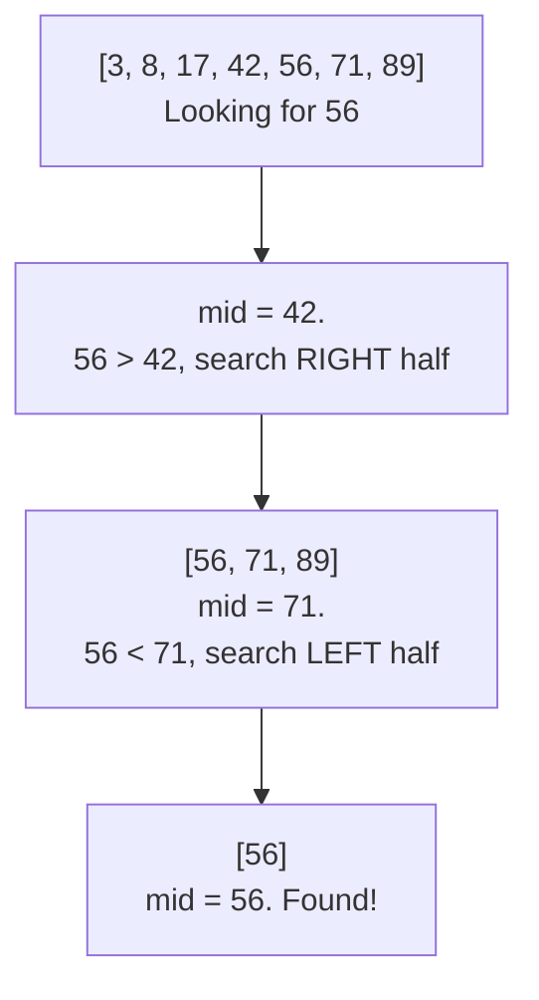
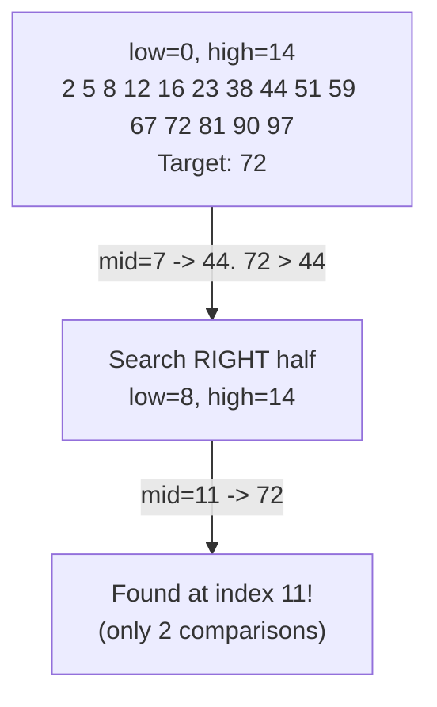
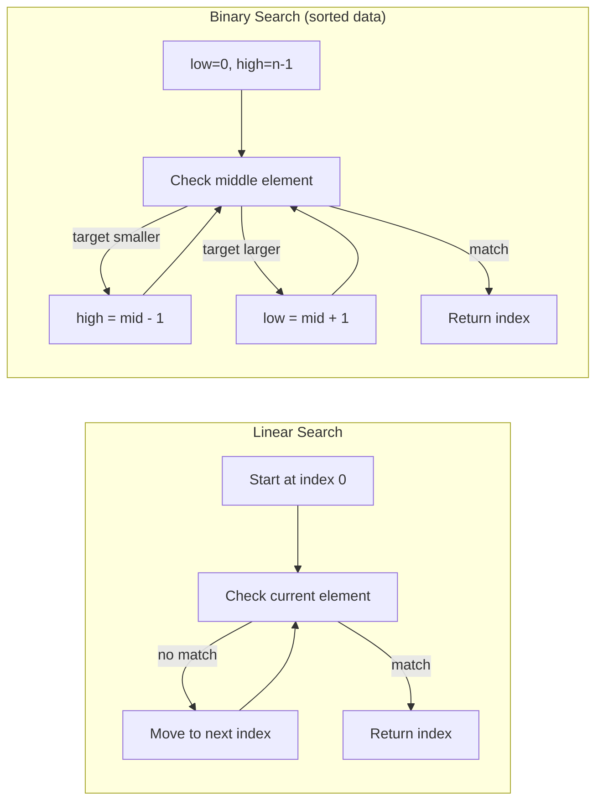

# Lecture 29: Searching Algorithms

Searching — "is this value present, and if so, where?" — has come up informally since
Lecture 3. Unit 7 gives it, and sorting, a proper formal treatment: this lecture compares
the two fundamental searching strategies precisely, and shows exactly why one of them
needs the data to be sorted first.

## In This Lecture

- The searching problem, formally
- Linear search, and its complexity
- Sentinel linear search — a small optimization on the same idea
- Binary search — iterative and recursive — and its complexity
- Tracing binary search step by step on a larger array, with a real comparison count
- Binary search variants: finding the first and last occurrence of a duplicate value
- Common pitfalls that make binary search notoriously easy to get subtly wrong
- A direct comparison, and how the *organization* of data changes which one wins

## The Searching Problem

Given a collection of `n` elements and a target value, **searching** answers: does the
target exist in the collection, and if so, at what position? Every searching algorithm
is a trade-off between how much *work* is needed per search and how much *preparation*
(like sorting) is needed beforehand.

## Linear Search

**Linear search** checks every element in order until it finds the target or exhausts
the collection — no assumptions about the data's order required.

```cpp title="searching_algorithms.cpp"
#include <iostream>
#include <vector>
using namespace std;

int linearSearch(const vector<int>& data, int target) {
    for (int i = 0; i < data.size(); i++) {
        if (data[i] == target) return i;
    }
    return -1;
}

int binarySearchIterative(const vector<int>& sortedData, int target) {
    int low = 0;
    int high = sortedData.size() - 1;

    while (low <= high) {
        int mid = low + (high - low) / 2;   // avoids overflow vs. (low + high) / 2
        if (sortedData[mid] == target) {
            return mid;
        } else if (sortedData[mid] < target) {
            low = mid + 1;    // target must be in the right half
        } else {
            high = mid - 1;   // target must be in the left half
        }
    }
    return -1;
}

int binarySearchRecursive(const vector<int>& sortedData, int target, int low, int high) {
    if (low > high) return -1;   // base case: search space exhausted

    int mid = low + (high - low) / 2;
    if (sortedData[mid] == target) {
        return mid;
    } else if (sortedData[mid] < target) {
        return binarySearchRecursive(sortedData, target, mid + 1, high);
    } else {
        return binarySearchRecursive(sortedData, target, low, mid - 1);
    }
}

int main() {
    vector<int> unsortedData = {42, 17, 89, 3, 56, 71, 8};
    vector<int> sortedData = {3, 8, 17, 42, 56, 71, 89};   // same values, sorted

    cout << "Linear search for 56 in unsorted data: index "
         << linearSearch(unsortedData, 56) << endl;
    cout << "Linear search for 99 (absent): index "
         << linearSearch(unsortedData, 99) << endl;

    cout << "Binary search (iterative) for 56: index "
         << binarySearchIterative(sortedData, 56) << endl;
    cout << "Binary search (recursive) for 56: index "
         << binarySearchRecursive(sortedData, 56, 0, sortedData.size() - 1) << endl;
    cout << "Binary search for 99 (absent): index "
         << binarySearchIterative(sortedData, 99) << endl;

    return 0;
}
```

```text
$ g++ -std=c++17 -o searching_algorithms searching_algorithms.cpp
$ ./searching_algorithms
Linear search for 56 in unsorted data: index 4
Linear search for 99 (absent): index -1
Binary search (iterative) for 56: index 4
Binary search (recursive) for 56: index 4
Binary search for 99 (absent): index -1
```

### Linear Search Complexity

| Case | Complexity |
|---|---|
| Best (target is first) | O(1) |
| Worst (target is last, or absent) | O(n) |

### Sentinel Linear Search: An Optimization

Look closely at `linearSearch`'s loop: `for (int i = 0; i < data.size(); i++)` does **two**
comparisons per iteration — `i < data.size()` (the bounds check) and `data[i] == target`
(the actual work). **Sentinel linear search** eliminates the bounds check by temporarily
planting the target itself at the very last position — guaranteeing the loop will find a
match without ever running off the end, so only one comparison per iteration remains.

```cpp title="sentinel_linear_search.cpp"
#include <iostream>
#include <vector>
using namespace std;

// Sentinel linear search: temporarily place the target at the very end of the
// array so the loop never needs a separate "i < n" bounds check on every
// iteration -- it always terminates because the sentinel guarantees a match.
int sentinelLinearSearch(vector<int> data, int target) {
    int n = data.size();
    int last = data[n - 1];   // remember the real last element
    data[n - 1] = target;      // plant the sentinel

    int i = 0;
    while (data[i] != target) i++;   // only ONE comparison per iteration now

    if (i < n - 1) return i;                  // found before reaching the sentinel slot
    return (last == target) ? n - 1 : -1;      // reached the sentinel: was the real last element it?
}

int main() {
    vector<int> data = {42, 17, 89, 3, 56, 71, 8};

    cout << "Array: ";
    for (int v : data) cout << v << " ";
    cout << endl;

    cout << "sentinelLinearSearch for 56: index " << sentinelLinearSearch(data, 56) << endl;
    cout << "sentinelLinearSearch for 8 (last element): index " << sentinelLinearSearch(data, 8) << endl;
    cout << "sentinelLinearSearch for 99 (absent): index " << sentinelLinearSearch(data, 99) << endl;

    return 0;
}
```

```text
$ g++ -std=c++17 -o sentinel_linear_search sentinel_linear_search.cpp
$ ./sentinel_linear_search
Array: 42 17 89 3 56 71 8 
sentinelLinearSearch for 56: index 4
sentinelLinearSearch for 8 (last element): index 6
sentinelLinearSearch for 99 (absent): index -1
```

Notice the function takes `data` **by value** (a copy), not by reference — planting the
sentinel temporarily overwrites the real last element, and copying means the caller's
original array is never disturbed. The saved-and-restored `last` value is what lets the
function correctly distinguish "found the real last element" from "never found anything
and just hit the sentinel." Sentinel search is still O(n) in the worst case — it hasn't
changed the *growth rate* — but halving the per-iteration comparison count is a real,
measurable constant-factor speedup, the same kind of micro-optimization that shows up
throughout systems-level code.

## Binary Search

**Binary search** requires the data to already be **sorted** — and in exchange, it can
eliminate *half* the remaining search space with every single comparison, instead of
checking one element at a time.



Three comparisons found `56` in a 7-element array — linear search would have needed five
(checking `3, 8, 17, 42` before finally reaching `56`).

### Binary Search Complexity

Each comparison eliminates *half* the remaining elements — exactly the O(log n) pattern
from Lecture 3.

| Case | Complexity |
|---|---|
| Best (target is the middle element) | O(1) |
| Worst (target is at an edge, or absent) | O(log n) |

### Tracing Binary Search on a Larger Array

The 7-element trace above narrows to the answer in three steps, but the O(log n) pattern
is easier to *feel* on a larger array, where each halving visibly eliminates a large chunk
of remaining candidates. Trace `binarySearchIterative` by hand on this 15-element sorted
array, searching for `72`:

| Step | `low` | `high` | `mid` | `sortedData[mid]` | Comparison | Action |
|---|---|---|---|---|---|---|
| 1 | 0 | 14 | 7 | 44 | 72 > 44 | search right half → `low = 8` |
| 2 | 8 | 14 | 11 | 72 | 72 == 72 | **found at index 11** |



Two comparisons located the target among 15 elements — a linear search checking from the
front would have needed 12 (indices 0 through 11). The gap between the two only widens as
`n` grows, which is exactly what the next section measures directly.

### Binary Search Variants: First and Last Occurrence

The `binarySearchIterative` shown earlier assumes the target appears **at most once** —
the instant it finds *a* match, it returns. Real data is often full of duplicates (think:
every log line from a given timestamp, or every student with the same grade), and a common
follow-up question is "where does this run of duplicates *begin* and *end*?" The fix is a
small but easy-to-get-wrong tweak: on finding a match, **don't stop** — record it, then
keep narrowing in the direction that might reveal an earlier (or later) one.

```cpp title="binary_search_bounds.cpp"
#include <iostream>
#include <vector>
using namespace std;

// Returns the index of the FIRST occurrence of target in sortedData, or -1.
int findFirst(const vector<int>& sortedData, int target) {
    int low = 0, high = sortedData.size() - 1;
    int result = -1;
    while (low <= high) {
        int mid = low + (high - low) / 2;
        if (sortedData[mid] == target) {
            result = mid;      // record this match...
            high = mid - 1;    // ...but keep searching LEFT for an earlier one
        } else if (sortedData[mid] < target) {
            low = mid + 1;
        } else {
            high = mid - 1;
        }
    }
    return result;
}

// Returns the index of the LAST occurrence of target in sortedData, or -1.
int findLast(const vector<int>& sortedData, int target) {
    int low = 0, high = sortedData.size() - 1;
    int result = -1;
    while (low <= high) {
        int mid = low + (high - low) / 2;
        if (sortedData[mid] == target) {
            result = mid;
            low = mid + 1;     // keep searching RIGHT for a later one
        } else if (sortedData[mid] < target) {
            low = mid + 1;
        } else {
            high = mid - 1;
        }
    }
    return result;
}

int main() {
    vector<int> data = {2, 4, 4, 4, 4, 7, 9, 9, 12, 15};
    cout << "Array: ";
    for (int v : data) cout << v << " ";
    cout << endl;

    cout << "First occurrence of 4: index " << findFirst(data, 4) << endl;
    cout << "Last occurrence of 4:  index " << findLast(data, 4) << endl;
    cout << "First occurrence of 9: index " << findFirst(data, 9) << endl;
    cout << "Last occurrence of 9:  index " << findLast(data, 9) << endl;
    cout << "First occurrence of 5 (absent): index " << findFirst(data, 5) << endl;

    return 0;
}
```

```text
$ g++ -std=c++17 -o binary_search_bounds binary_search_bounds.cpp
$ ./binary_search_bounds
Array: 2 4 4 4 4 7 9 9 12 15 
First occurrence of 4: index 1
Last occurrence of 4:  index 4
First occurrence of 9: index 6
Last occurrence of 9:  index 7
First occurrence of 5 (absent): index -1
```

`findFirst` and `findLast` differ by exactly one line each from plain binary search — which
direction they keep narrowing *after* a match — yet that single line is the entire
difference between "does this value exist" and "how many times, and exactly where." This
pattern (sometimes called a *lower bound* / *upper bound* search) is what C++'s own
`std::lower_bound` and `std::upper_bound` implement internally.

### Common Pitfalls in Binary Search

Binary search is short — a dozen lines — and yet it has a well-earned reputation as one of
the algorithms professional programmers get subtly wrong most often. Jon Bentley's
*Programming Pearls* famously noted that most published binary search implementations,
across decades, contained bugs. The recurring mistakes:

- **Integer overflow in the midpoint.** Writing `mid = (low + high) / 2` can overflow if
  `low + high` exceeds the maximum representable `int` on a very large array — the exact
  reason every implementation in this lecture instead writes
  `mid = low + (high - low) / 2`, which never sums two large values together.
- **Off-by-one in the loop condition.** `while (low <= high)` is correct here because
  `high` starts at a *valid* last index; writing `while (low < high)` instead silently
  skips checking the case where only one element remains, causing the search to miss a
  target that's genuinely present.
- **Forgetting the sorted precondition entirely.** Binary search doesn't fail loudly on
  unsorted data — it just returns wrong answers (or a false "not found") without any
  warning, because every step trusts an ordering assumption that no longer holds.
- **Infinite loops from a wrong update.** Writing `low = mid` instead of `low = mid + 1`
  (or `high = mid` instead of `high = mid - 1`) can leave the search space unchanged when
  `low` and `high` are adjacent, looping forever instead of terminating.

### Measuring the Advantage: A Larger Worked Example

The complexity tables above say binary search is O(log n) against linear search's O(n) —
here's what that gap actually looks like in counted comparisons, not just theory, searching
for the *worst possible* case for both algorithms (the very last element) in a sorted array
of 2,000 integers:

```cpp title="search_comparison_count.cpp"
#include <iostream>
#include <vector>
using namespace std;

int linearSearchCounted(const vector<int>& data, int target, long& comparisons) {
    for (size_t i = 0; i < data.size(); i++) {
        comparisons++;
        if (data[i] == target) return (int)i;
    }
    return -1;
}

int binarySearchCounted(const vector<int>& sortedData, int target, long& comparisons) {
    int low = 0, high = (int)sortedData.size() - 1;
    while (low <= high) {
        int mid = low + (high - low) / 2;
        comparisons++;
        if (sortedData[mid] == target) return mid;
        else if (sortedData[mid] < target) low = mid + 1;
        else high = mid - 1;
    }
    return -1;
}

int main() {
    const int n = 2000;
    vector<int> data(n);
    for (int i = 0; i < n; i++) data[i] = i * 2;   // sorted: 0, 2, 4, ..., 3998

    int target = data[n - 1];   // worst case for both algorithms: the last element

    long linearComparisons = 0, binaryComparisons = 0;
    int linearResult = linearSearchCounted(data, target, linearComparisons);
    int binaryResult = binarySearchCounted(data, target, binaryComparisons);

    cout << "Searching for the LAST element among " << n << " sorted values" << endl;
    cout << "Linear search: found at index " << linearResult
         << " using " << linearComparisons << " comparisons" << endl;
    cout << "Binary search: found at index " << binaryResult
         << " using " << binaryComparisons << " comparisons" << endl;

    if (binaryComparisons * 10 <= linearComparisons) {
        cout << "Verdict: binary search used at least 10x fewer comparisons." << endl;
    } else {
        cout << "Verdict: binary search did NOT reach a 10x reduction here." << endl;
    }

    return 0;
}
```

```text
$ g++ -std=c++17 -o search_comparison_count search_comparison_count.cpp
$ ./search_comparison_count
Searching for the LAST element among 2000 sorted values
Linear search: found at index 1999 using 2000 comparisons
Binary search: found at index 1999 using 11 comparisons
Verdict: binary search used at least 10x fewer comparisons.
```

2,000 comparisons versus 11 — binary search needed `ceil(log2(2000))`, which is 11,
comparisons no matter which of the 2,000 positions the target sits at, while linear
search's worst case scales linearly with `n` itself. Double `n` to 4,000 and linear search's
worst case roughly doubles too, but binary search only needs **one more** comparison
(`log2(4000) ≈ 12`) — this is the entire reason O(log n) is called "logarithmic": the input
can grow enormously while the work grows by only a small, fixed amount per doubling.

## Comparison of Linear and Binary Search

The two algorithms don't just differ in speed — they differ in *shape*. Linear search's
decision process is a flat loop; binary search's is a shrinking, tree-like halving:



| | Linear Search | Binary Search |
|---|---|---|
| Requires sorted data? | No | **Yes** |
| Worst-case complexity | O(n) | O(log n) |
| Works on a linked list? | Yes (sequential access is fine) | Poorly — needs random access to jump to the middle efficiently |

## Impact of Data Organization on Searching

This comparison reveals the actual trade-off: binary search's speed is not free — it's
paid for by requiring the data to be sorted *first* (Lecture 30's sorting algorithms cost
time too), and by needing an array-like structure with O(1) random access (Lecture 4),
not a linked list, to actually find the middle element quickly. **The right search
algorithm depends on how the data is already organized** — searching once in unsorted
data, linear search's O(n) may beat sorting first (which itself costs at least
O(n log n)) plus a binary search; searching the *same* data repeatedly, sorting once and
reusing binary search every time wins decisively.

## Try It Yourself

1. Compile and run `searching_algorithms.cpp`, then add a counter that increments on every
   comparison inside `linearSearch` and `binarySearchIterative`, and print the final count
   for searching for `89` (the last element) in each. Confirm binary search uses
   noticeably fewer comparisons.
2. Binary search assumes the data never changes between searches. If you needed to search
   the *same* 1,000-element collection 500 times, but the data itself never changes
   between searches, would you prefer to linear-search all 500 times, or sort once
   (Lecture 30/31) and binary-search all 500 times? Justify your answer using Big-O.
3. Compile and run `sentinel_linear_search.cpp`, then add a comparison counter to both
   `sentinelLinearSearch` and the plain `linearSearch` from `searching_algorithms.cpp`,
   and confirm sentinel search's count is roughly half of plain linear search's for the
   same target — direct proof of the "one comparison per iteration instead of two" claim.
4. Compile and run `binary_search_bounds.cpp`, then add a `countOccurrences` function that
   calls `findLast(data, target) - findFirst(data, target) + 1` (careful: only valid when
   the target is actually present). Test it on `4` and `9` from the sample array and
   confirm the counts match what you can see by eye.
5. Modify `search_comparison_count.cpp` to search for the value in the exact **middle** of
   the array instead of the last element, and re-run it. Explain, using the complexity
   tables above, why binary search's comparison count drops dramatically for this target
   while linear search's stays roughly the same as before.

## Key Takeaways

- **Linear search** makes no assumptions about data order, at the cost of O(n) worst-case
  time; **sentinel linear search** is the same algorithm with one comparison eliminated
  per iteration by planting the target as a guaranteed stopping point.
- **Binary search** requires sorted data with random access, in exchange for O(log n)
  worst-case time — each comparison eliminates half the remaining search space, which a
  15-element traced example and a 2,000-element counted example both confirmed directly.
- Binary search generalizes to **`findFirst`/`findLast`** for locating the boundaries of a
  run of duplicate values — the same halving idea, just deciding which direction to keep
  narrowing after a match instead of stopping immediately.
- Binary search's short implementation hides **real, well-documented pitfalls** — midpoint
  overflow, off-by-one loop conditions, an unenforced sorted precondition, and update
  mistakes that cause infinite loops — worth tracing through deliberately, not just
  memorizing.
- The right choice depends on **how the data is organized and how often it's searched** —
  a one-time search of unsorted data rarely justifies sorting first, but repeated searches
  of the same data almost always do.
- Binary search needs **random access** (Lecture 4's array strength) — it does not work
  efficiently on a linked list, even a sorted one.
