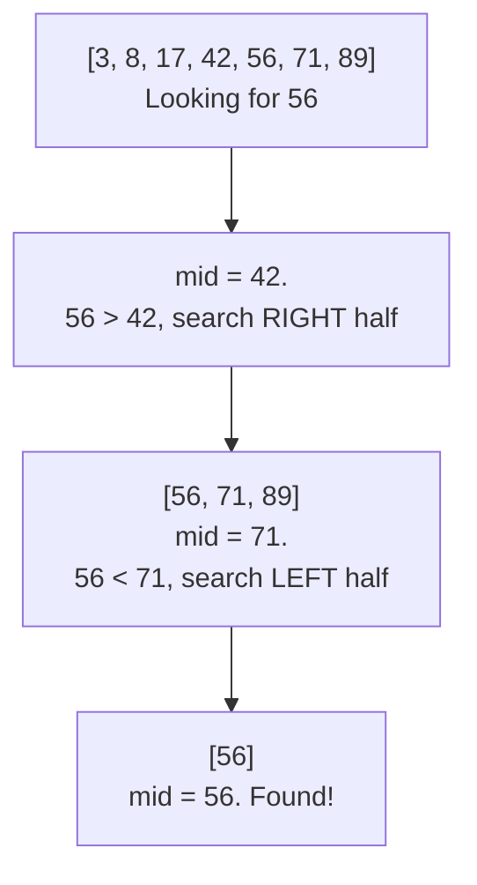

# Lecture 29: Searching Algorithms

Searching — "is this value present, and if so, where?" — has come up informally since
Lecture 3. Unit 7 gives it, and sorting, a proper formal treatment: this lecture compares
the two fundamental searching strategies precisely, and shows exactly why one of them
needs the data to be sorted first.

## In This Lecture

- The searching problem, formally
- Linear search, and its complexity
- Binary search — iterative and recursive — and its complexity
- A direct comparison, and how the *organization* of data changes which one wins

## The Searching Problem

Given a collection of `n` elements and a target value, **searching** answers: does the
target exist in the collection, and if so, at what position? Every searching algorithm
is a trade-off between how much *work* is needed per search and how much *preparation*
(like sorting) is needed beforehand.

## Linear Search

**Linear search** checks every element in order until it finds the target or exhausts
the collection — no assumptions about the data's order required.

```cpp title="searching_algorithms.cpp"
#include <iostream>
#include <vector>
using namespace std;

int linearSearch(const vector<int>& data, int target) {
    for (int i = 0; i < data.size(); i++) {
        if (data[i] == target) return i;
    }
    return -1;
}

int binarySearchIterative(const vector<int>& sortedData, int target) {
    int low = 0;
    int high = sortedData.size() - 1;

    while (low <= high) {
        int mid = low + (high - low) / 2;   // avoids overflow vs. (low + high) / 2
        if (sortedData[mid] == target) {
            return mid;
        } else if (sortedData[mid] < target) {
            low = mid + 1;    // target must be in the right half
        } else {
            high = mid - 1;   // target must be in the left half
        }
    }
    return -1;
}

int binarySearchRecursive(const vector<int>& sortedData, int target, int low, int high) {
    if (low > high) return -1;   // base case: search space exhausted

    int mid = low + (high - low) / 2;
    if (sortedData[mid] == target) {
        return mid;
    } else if (sortedData[mid] < target) {
        return binarySearchRecursive(sortedData, target, mid + 1, high);
    } else {
        return binarySearchRecursive(sortedData, target, low, mid - 1);
    }
}

int main() {
    vector<int> unsortedData = {42, 17, 89, 3, 56, 71, 8};
    vector<int> sortedData = {3, 8, 17, 42, 56, 71, 89};   // same values, sorted

    cout << "Linear search for 56 in unsorted data: index "
         << linearSearch(unsortedData, 56) << endl;
    cout << "Linear search for 99 (absent): index "
         << linearSearch(unsortedData, 99) << endl;

    cout << "Binary search (iterative) for 56: index "
         << binarySearchIterative(sortedData, 56) << endl;
    cout << "Binary search (recursive) for 56: index "
         << binarySearchRecursive(sortedData, 56, 0, sortedData.size() - 1) << endl;
    cout << "Binary search for 99 (absent): index "
         << binarySearchIterative(sortedData, 99) << endl;

    return 0;
}
```

```text
$ g++ -std=c++17 -o searching_algorithms searching_algorithms.cpp
$ ./searching_algorithms
Linear search for 56 in unsorted data: index 4
Linear search for 99 (absent): index -1
Binary search (iterative) for 56: index 4
Binary search (recursive) for 56: index 4
Binary search for 99 (absent): index -1
```

### Linear Search Complexity

| Case | Complexity |
|---|---|
| Best (target is first) | O(1) |
| Worst (target is last, or absent) | O(n) |

## Binary Search

**Binary search** requires the data to already be **sorted** — and in exchange, it can
eliminate *half* the remaining search space with every single comparison, instead of
checking one element at a time.



Three comparisons found `56` in a 7-element array — linear search would have needed five
(checking `3, 8, 17, 42` before finally reaching `56`).

### Binary Search Complexity

Each comparison eliminates *half* the remaining elements — exactly the O(log n) pattern
from Lecture 3.

| Case | Complexity |
|---|---|
| Best (target is the middle element) | O(1) |
| Worst (target is at an edge, or absent) | O(log n) |

## Comparison of Linear and Binary Search

| | Linear Search | Binary Search |
|---|---|---|
| Requires sorted data? | No | **Yes** |
| Worst-case complexity | O(n) | O(log n) |
| Works on a linked list? | Yes (sequential access is fine) | Poorly — needs random access to jump to the middle efficiently |

## Impact of Data Organization on Searching

This comparison reveals the actual trade-off: binary search's speed is not free — it's
paid for by requiring the data to be sorted *first* (Lecture 30's sorting algorithms cost
time too), and by needing an array-like structure with O(1) random access (Lecture 4),
not a linked list, to actually find the middle element quickly. **The right search
algorithm depends on how the data is already organized** — searching once in unsorted
data, linear search's O(n) may beat sorting first (which itself costs at least
O(n log n)) plus a binary search; searching the *same* data repeatedly, sorting once and
reusing binary search every time wins decisively.

## Try It Yourself

1. Compile and run `searching_algorithms.cpp`, then add a counter that increments on every
   comparison inside `linearSearch` and `binarySearchIterative`, and print the final count
   for searching for `89` (the last element) in each. Confirm binary search uses
   noticeably fewer comparisons.
2. Binary search assumes the data never changes between searches. If you needed to search
   the *same* 1,000-element collection 500 times, but the data itself never changes
   between searches, would you prefer to linear-search all 500 times, or sort once
   (Lecture 30/31) and binary-search all 500 times? Justify your answer using Big-O.

## Key Takeaways

- **Linear search** makes no assumptions about data order, at the cost of O(n) worst-case
  time.
- **Binary search** requires sorted data with random access, in exchange for O(log n)
  worst-case time — each comparison eliminates half the remaining search space.
- The right choice depends on **how the data is organized and how often it's searched** —
  a one-time search of unsorted data rarely justifies sorting first, but repeated searches
  of the same data almost always do.
- Binary search needs **random access** (Lecture 4's array strength) — it does not work
  efficiently on a linked list, even a sorted one.
