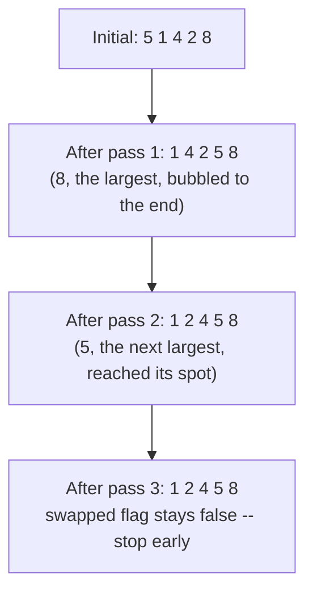
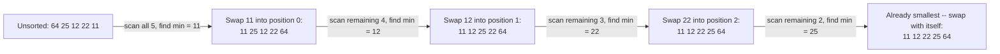
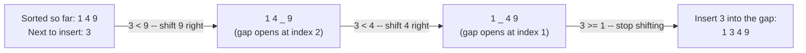

# Lecture 30: Sorting: Elementary Algorithms

Binary search's O(log n) speed had one precondition: the data must already be sorted.
This lecture covers the three classic **elementary** sorting algorithms — simple to
understand and implement, each O(n²) in the worst case, and the natural starting point
before Lecture 31's faster, more sophisticated alternatives.

## In This Lecture

- The sorting problem, and what characterizes a sorting algorithm
- Bubble sort, selection sort, and insertion sort
- Tracing each algorithm pass by pass, and visualizing how the array evolves
- In-place sorting
- Proving bubble sort's O(n) best case with a real, counted comparison
- A head-to-head comparison/swap count across all three algorithms on the same input
- A direct comparison of all three

## The Sorting Problem

**Sorting** rearranges a collection's elements into a defined order (ascending or
descending). Every sorting algorithm in this course works on the same underlying
operation set: **comparing** two elements, and **swapping** (or shifting) them.

## Characteristics of Sorting Algorithms

- **Time complexity** — how the number of comparisons/swaps grows with `n`.
- **Space complexity** — how much *extra* memory beyond the input array is needed.
- **Stability** — do two equal elements keep their original relative order after sorting?
  (Important when sorting records by one field but wanting ties broken by original order.)
- **In-place** — does it sort within the original array, or does it need a separate copy?

## Bubble Sort

**Bubble sort** repeatedly steps through the array, swapping adjacent elements that are
in the wrong order — each full pass "bubbles" the largest remaining unsorted value to its
correct position at the end.

```cpp title="elementary_sorts.cpp"
#include <iostream>
#include <vector>
using namespace std;

void printArray(const vector<int>& arr) {
    for (int v : arr) cout << v << " ";
    cout << endl;
}

void bubbleSort(vector<int> arr) {
    int n = arr.size();
    for (int pass = 0; pass < n - 1; pass++) {
        bool swapped = false;
        for (int i = 0; i < n - 1 - pass; i++) {
            if (arr[i] > arr[i + 1]) {
                swap(arr[i], arr[i + 1]);
                swapped = true;
            }
        }
        if (!swapped) break;   // already sorted -- no need for further passes
    }
    cout << "Bubble sort:    "; printArray(arr);
}

void selectionSort(vector<int> arr) {
    int n = arr.size();
    for (int i = 0; i < n - 1; i++) {
        int minIndex = i;
        for (int j = i + 1; j < n; j++) {
            if (arr[j] < arr[minIndex]) minIndex = j;
        }
        swap(arr[i], arr[minIndex]);
    }
    cout << "Selection sort: "; printArray(arr);
}

void insertionSort(vector<int> arr) {
    int n = arr.size();
    for (int i = 1; i < n; i++) {
        int key = arr[i];
        int j = i - 1;
        while (j >= 0 && arr[j] > key) {
            arr[j + 1] = arr[j];   // shift larger elements one position right
            j--;
        }
        arr[j + 1] = key;   // insert key into its correct position
    }
    cout << "Insertion sort: "; printArray(arr);
}

int main() {
    vector<int> data = {64, 25, 12, 22, 11, 90, 5};

    cout << "Original:       "; printArray(data);
    bubbleSort(data);
    selectionSort(data);
    insertionSort(data);

    return 0;
}
```

```text
$ g++ -std=c++17 -o elementary_sorts elementary_sorts.cpp
$ ./elementary_sorts
Original:       64 25 12 22 11 90 5 
Bubble sort:    5 11 12 22 25 64 90 
Selection sort: 5 11 12 22 25 64 90 
Insertion sort: 5 11 12 22 25 64 90 
```

All three reach the exact same sorted result — they differ only in *how* they get there,
which is what the rest of this lecture unpacks.

### Bubble Sort, in Detail

Bubble sort's `swapped` flag is an important optimization: if a full pass makes zero
swaps, the array is already sorted, and the algorithm can stop early instead of running
all `n - 1` passes regardless. This gives bubble sort a **best case of O(n)** (already
sorted input, detected on the very first pass) even though its worst case is O(n²).

#### Tracing Bubble Sort Pass by Pass

"Bubbles the largest remaining value to the end" is easiest to believe by watching it
happen. Here's every full pass of `bubbleSort` on a 5-element array, with the array
printed after each one:

```cpp title="bubble_sort_pass_by_pass.cpp"
#include <iostream>
#include <vector>
#include <string>
using namespace std;

void printArray(const string& label, const vector<int>& arr) {
    cout << label;
    for (int v : arr) cout << v << " ";
    cout << endl;
}

void bubbleSortTraced(vector<int> arr) {
    int n = arr.size();
    printArray("Initial:          ", arr);
    for (int pass = 0; pass < n - 1; pass++) {
        bool swappedThisPass = false;
        for (int i = 0; i < n - 1 - pass; i++) {
            if (arr[i] > arr[i + 1]) {
                swap(arr[i], arr[i + 1]);
                swappedThisPass = true;
            }
        }
        printArray("After pass " + to_string(pass + 1) + ":   ", arr);
        if (!swappedThisPass) {
            cout << "  (no swaps this pass -- already sorted, stopping early)" << endl;
            break;
        }
    }
}

int main() {
    vector<int> data = {5, 1, 4, 2, 8};
    bubbleSortTraced(data);
    return 0;
}
```

```text
$ g++ -std=c++17 -o bubble_sort_pass_by_pass bubble_sort_pass_by_pass.cpp
$ ./bubble_sort_pass_by_pass
Initial:          5 1 4 2 8 
After pass 1:   1 4 2 5 8 
After pass 2:   1 2 4 5 8 
After pass 3:   1 2 4 5 8 
  (no swaps this pass -- already sorted, stopping early)
```



Notice only **3 passes** ran on a 5-element array, not the full `n - 1 = 4` the outer loop
allows — the third pass made zero swaps, so `swapped` stayed `false` and the early-exit
`break` fired immediately, confirming the best-case optimization described above actually
triggers in practice, not just in theory.

#### Proving the Best Case with Real Counts

"Best case O(n)" is a claim worth *proving*, not just asserting — here's `bubbleSort`
instrumented to count every comparison and swap, run once on 1,000 already-sorted values
and once on 1,000 reverse-sorted values (bubble sort's actual worst case):

```cpp title="bubble_sort_best_case_counter.cpp"
#include <iostream>
#include <vector>
using namespace std;

void bubbleSortCounted(vector<int> arr, long& comparisons, long& swaps) {
    int n = arr.size();
    for (int pass = 0; pass < n - 1; pass++) {
        bool swappedThisPass = false;
        for (int i = 0; i < n - 1 - pass; i++) {
            comparisons++;
            if (arr[i] > arr[i + 1]) {
                swap(arr[i], arr[i + 1]);
                swaps++;
                swappedThisPass = true;
            }
        }
        if (!swappedThisPass) break;
    }
}

int main() {
    const int n = 1000;
    vector<int> sortedData(n), reversedData(n);
    for (int i = 0; i < n; i++) { sortedData[i] = i; reversedData[i] = n - i; }

    long sc = 0, ss = 0, rc = 0, rs = 0;
    bubbleSortCounted(sortedData, sc, ss);
    bubbleSortCounted(reversedData, rc, rs);

    cout << "Bubble sort on " << n << " ALREADY-SORTED elements: "
         << sc << " comparisons, " << ss << " swaps" << endl;
    cout << "Bubble sort on " << n << " REVERSE-SORTED elements: "
         << rc << " comparisons, " << rs << " swaps" << endl;

    if (sc == n - 1 && ss == 0) {
        cout << "Verdict: best case confirmed -- exactly n-1 comparisons, zero swaps." << endl;
    } else {
        cout << "Verdict: best case NOT observed." << endl;
    }

    return 0;
}
```

```text
$ g++ -std=c++17 -o bubble_sort_best_case_counter bubble_sort_best_case_counter.cpp
$ ./bubble_sort_best_case_counter
Bubble sort on 1000 ALREADY-SORTED elements: 999 comparisons, 0 swaps
Bubble sort on 1000 REVERSE-SORTED elements: 499500 comparisons, 499500 swaps
Verdict: best case confirmed -- exactly n-1 comparisons, zero swaps.
```

The numbers make the O(n) vs. O(n²) gap concrete: 999 comparisons (exactly `n - 1`, one
full pass) against 499,500 — almost 500x more — for the same-sized input, differing only
in starting order. `499500 = 999 * 1000 / 2`, exactly the `n(n-1)/2` comparison count the
O(n²) bound predicts for a pass that never exits early.

### Selection Sort, in Detail

Selection sort takes the opposite approach: instead of swapping adjacent
out-of-order pairs, it finds the **minimum** of the remaining unsorted portion and swaps
it directly into place — exactly one swap per outer-loop iteration, `n - 1` swaps total,
regardless of how sorted the input already was. This makes selection sort's best,
average, and worst case all **O(n²)** — it never benefits from partially-sorted input the
way bubble and insertion sort can.



Every round does the **same amount of scanning work** regardless of how the data started —
this is precisely why selection sort has no best-case advantage the way bubble and
insertion sort do: even on already-sorted input, it still scans the entire remaining
unsorted portion looking for a minimum that, this time, happens to already be first.

### Insertion Sort, in Detail

Insertion sort builds the sorted portion one element at a time, from the left: each new
element is shifted backward through the already-sorted portion until it reaches its
correct position — exactly how most people sort a hand of playing cards. Like bubble
sort, insertion sort has a **best case of O(n)** on already-sorted input (the inner `while`
loop never executes at all).



Each already-sorted element only shifts as far as it needs to — insertion sort does the
*least* work of the three on nearly-sorted data, which is exactly why real hybrid sorting
algorithms (Lecture 31's note on standard libraries) fall back to it for small, nearly-sorted
sub-arrays.

## In-Place Sorting

All three algorithms shown are **in-place**: they rearrange the array's own elements
using only a small, constant amount of extra memory (a few loop variables), never
allocating a second array the size of the input. This gives all three **O(1) extra space
complexity** — a real advantage they share, despite their O(n²) time complexity.

## A Head-to-Head Count on the Same Input

The complexity tables below describe *growth rates*, but it's worth seeing all three
algorithms instrumented and run on the exact same 10-element array, to make the practical
difference concrete instead of abstract:

```cpp title="sorting_comparison_swap_counts.cpp"
#include <iostream>
#include <vector>
using namespace std;

vector<int> bubbleSortCounted(vector<int> arr, long& comparisons, long& swaps) {
    int n = arr.size();
    for (int pass = 0; pass < n - 1; pass++) {
        bool swappedThisPass = false;
        for (int i = 0; i < n - 1 - pass; i++) {
            comparisons++;
            if (arr[i] > arr[i + 1]) {
                swap(arr[i], arr[i + 1]);
                swaps++;
                swappedThisPass = true;
            }
        }
        if (!swappedThisPass) break;
    }
    return arr;
}

vector<int> selectionSortCounted(vector<int> arr, long& comparisons, long& swaps) {
    int n = arr.size();
    for (int i = 0; i < n - 1; i++) {
        int minIndex = i;
        for (int j = i + 1; j < n; j++) {
            comparisons++;
            if (arr[j] < arr[minIndex]) minIndex = j;
        }
        swap(arr[i], arr[minIndex]);   // selection sort always swaps, even if minIndex == i
        swaps++;
    }
    return arr;
}

vector<int> insertionSortCounted(vector<int> arr, long& comparisons, long& shifts) {
    int n = arr.size();
    for (int i = 1; i < n; i++) {
        int key = arr[i];
        int j = i - 1;
        while (j >= 0) {
            comparisons++;
            if (arr[j] > key) {
                arr[j + 1] = arr[j];
                shifts++;
                j--;
            } else {
                break;
            }
        }
        arr[j + 1] = key;
    }
    return arr;
}

int main() {
    vector<int> data = {64, 25, 12, 22, 11, 90, 5, 34, 77, 3};

    long bc = 0, bs = 0, sc = 0, ss = 0, ic = 0, ishifts = 0;
    bubbleSortCounted(data, bc, bs);
    selectionSortCounted(data, sc, ss);
    insertionSortCounted(data, ic, ishifts);

    cout << "Sorting 10 elements: 64 25 12 22 11 90 5 34 77 3" << endl;
    cout << "Bubble sort:    " << bc << " comparisons, " << bs << " swaps" << endl;
    cout << "Selection sort: " << sc << " comparisons, " << ss << " swaps" << endl;
    cout << "Insertion sort: " << ic << " comparisons, " << ishifts << " shifts" << endl;

    return 0;
}
```

```text
$ g++ -std=c++17 -o sorting_comparison_swap_counts sorting_comparison_swap_counts.cpp
$ ./sorting_comparison_swap_counts
Sorting 10 elements: 64 25 12 22 11 90 5 34 77 3
Bubble sort:    45 comparisons, 27 swaps
Selection sort: 45 comparisons, 9 swaps
Insertion sort: 31 comparisons, 27 shifts
```

Three results worth pulling apart:

- Bubble sort and selection sort both made **45 comparisons** on this random 10-element
  input — for `n = 10`, `n(n-1)/2 = 45` exactly, since neither one's early-exit path
  triggered (the data wasn't sorted enough for bubble sort to stop early, and selection
  sort never has an early exit at all).
- Selection sort's swap count (**9**, exactly `n - 1`) is far lower than bubble sort's
  (**27**) — selection sort pays for its lack of a best case by *always* doing minimal
  swaps, one guaranteed per outer-loop pass, while bubble sort's adjacent-swap strategy
  needs many more small swaps to walk large values all the way to their final position.
- Insertion sort needed the **fewest comparisons** of the three (31) on this input — proof
  that it does less unnecessary comparing than bubble sort even outside its O(n) best case,
  which is exactly what the "generally preferred in practice" claim below is based on.

## Comparison of Elementary Sorting Algorithms

| | Best case | Average case | Worst case | Space | Stable? |
|---|---|---|---|---|---|
| Bubble Sort | O(n) | O(n²) | O(n²) | O(1) | Yes |
| Selection Sort | O(n²) | O(n²) | O(n²) | O(1) | No (a naive implementation can swap equal elements out of order) |
| Insertion Sort | O(n) | O(n²) | O(n²) | O(1) | Yes |

Despite sharing the same worst-case complexity, **insertion sort is generally preferred**
among the three in practice: it has the same best-case advantage as bubble sort, but does
noticeably less work on average — moving elements directly to their position instead of
bubbling one step at a time — which is why it's often the algorithm real standard
libraries fall back to for very small sub-arrays inside a faster algorithm (Lecture 31).

## Try It Yourself

1. Compile and run `elementary_sorts.cpp` with an **already-sorted** input array (e.g.,
   `{1, 2, 3, 4, 5}`), and add a comparison counter to `bubbleSort` and `selectionSort`.
   Confirm bubble sort's count is dramatically lower than selection sort's on this input —
   direct proof of the best-case difference described above.
2. Modify `insertionSort` to sort in **descending** order instead of ascending, by
   flipping exactly one comparison operator. Confirm your change with the same test data.
3. Compile and run `bubble_sort_pass_by_pass.cpp` with a different 6-element array of your
   choosing, and predict — before running it — how many passes it will take before the
   `swapped` flag stays `false`. Compare your prediction to the actual printed output.
4. Modify `bubble_sort_best_case_counter.cpp` to also run `bubbleSortCounted` on a
   **randomly shuffled** 1,000-element array (use `<random>` as `merge_vs_quick_comparison_count.cpp`
   in Lecture 31 does, or simply shuffle with `std::shuffle`). Confirm its comparison count
   lands somewhere between the already-sorted and reverse-sorted extremes.
5. Modify `sorting_comparison_swap_counts.cpp` to also count insertion sort's **comparisons
   only up to and including the one that stops the inner `while` loop** (i.e., confirm the
   existing counter already does this correctly) and explain, in your own words, why
   insertion sort's comparison count on an already-sorted array would be exactly `n - 1` —
   the same best case bubble sort has, for a related but not identical reason.

## Key Takeaways

- **Bubble sort** repeatedly swaps adjacent out-of-order pairs; its early-exit `swapped`
  flag gives it a best case of O(n) on nearly-sorted input — confirmed directly with a
  1,000-element counted example showing exactly `n - 1` comparisons and zero swaps.
- **Selection sort** repeatedly finds the minimum of the unsorted portion and swaps it
  into place — always O(n²), with no benefit from partially-sorted input, because it scans
  the full remaining unsorted region on every single pass regardless of order.
- **Insertion sort** builds a sorted portion incrementally, shifting elements backward —
  also O(n) best case, and generally the most practically efficient of the three, which a
  head-to-head count on the same 10-element input confirmed (fewest comparisons of the
  three).
- Tracing an algorithm **pass by pass** (or step by step) is often the fastest way to turn
  an abstract claim like "O(n) best case" into something you can actually see happen.
- All three are **O(1) extra space** (in-place), but all three are **O(n²) in the worst
  case** — Lecture 31 covers algorithms that do meaningfully better.
