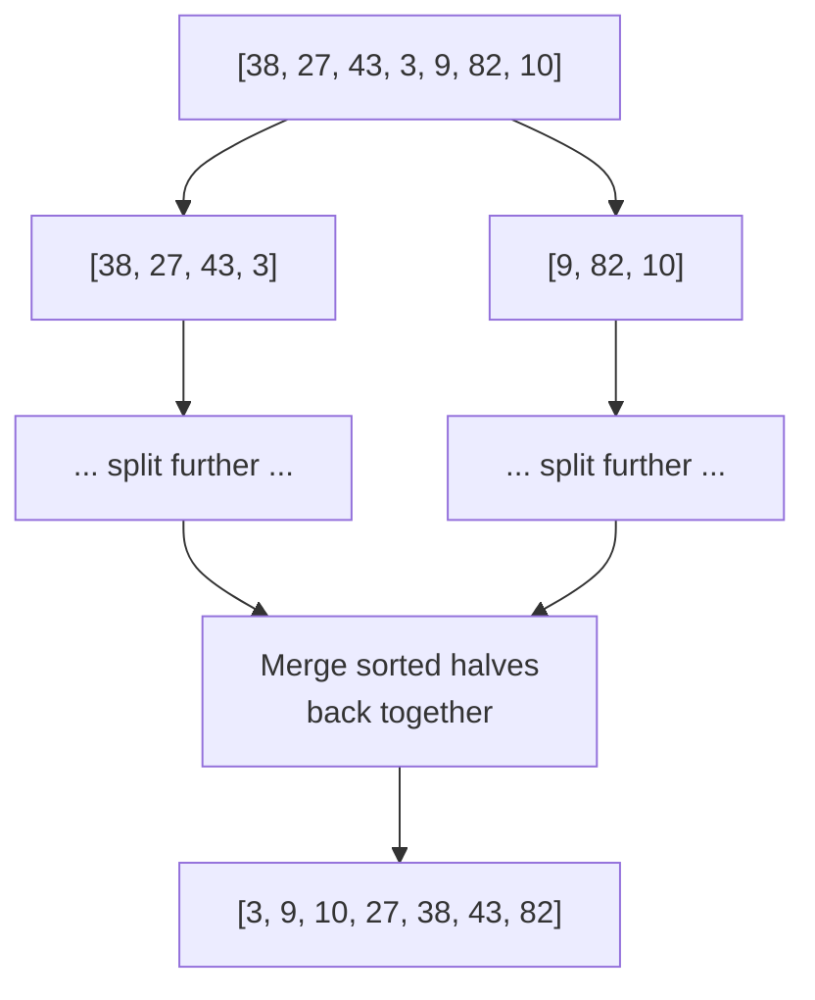

# Lecture 31: Sorting: Efficient Algorithms

Every elementary sort from Lecture 30 tops out at O(n²) in the worst case. **Merge sort**
and **quick sort** both break through that ceiling to O(n log n) — the same growth rate
as binary search's log n, multiplied across every element — by applying the same core
idea: **divide and conquer**.

## In This Lecture

- The divide-and-conquer strategy
- Merge sort: split, sort each half, merge
- Quick sort: partition around a pivot, then recurse
- A direct comparison, and when each one is the better real-world choice

## Divide-and-Conquer Strategy

**Divide and conquer** solves a problem by (1) splitting it into smaller subproblems of
the same kind, (2) solving each subproblem recursively (Lecture 12), and (3) combining
the subproblems' solutions into the original problem's solution. Merge sort and quick
sort both follow this pattern — they differ in *where* the hard work happens: merge
sort's work is in the combine step, quick sort's is in the divide step.

## Merge Sort

Merge sort splits the array in half, recursively sorts each half, then **merges** the two
already-sorted halves back together in linear time.



```cpp title="merge_sort.cpp"
#include <iostream>
#include <vector>
using namespace std;

void printArray(const vector<int>& arr) {
    for (int v : arr) cout << v << " ";
    cout << endl;
}

void merge(vector<int>& arr, int left, int mid, int right) {
    vector<int> leftHalf(arr.begin() + left, arr.begin() + mid + 1);
    vector<int> rightHalf(arr.begin() + mid + 1, arr.begin() + right + 1);

    int i = 0, j = 0, k = left;
    while (i < leftHalf.size() && j < rightHalf.size()) {
        if (leftHalf[i] <= rightHalf[j]) {
            arr[k++] = leftHalf[i++];
        } else {
            arr[k++] = rightHalf[j++];
        }
    }
    while (i < leftHalf.size()) arr[k++] = leftHalf[i++];
    while (j < rightHalf.size()) arr[k++] = rightHalf[j++];
}

void mergeSort(vector<int>& arr, int left, int right) {
    if (left >= right) return;   // base case: 0 or 1 elements, already "sorted"

    int mid = left + (right - left) / 2;
    mergeSort(arr, left, mid);        // conquer: sort the left half
    mergeSort(arr, mid + 1, right);   // conquer: sort the right half
    merge(arr, left, mid, right);      // combine: merge the two sorted halves
}

int main() {
    vector<int> data = {38, 27, 43, 3, 9, 82, 10};
    cout << "Original:   "; printArray(data);

    mergeSort(data, 0, data.size() - 1);
    cout << "Merge sort: "; printArray(data);

    return 0;
}
```

```text
$ g++ -std=c++17 -o merge_sort merge_sort.cpp
$ ./merge_sort
Original:   38 27 43 3 9 82 10 
Merge sort: 3 9 10 27 38 43 82
```

Merge sort's `merge` step is where the real work happens: given two already-sorted
halves, it can build the fully sorted result in one linear pass, always comparing just
the current front of each half — this is the same idea as merging two sorted linked
lists, and it's what guarantees merge sort's O(n log n) **regardless of the input's
initial order**.

## Quick Sort

Quick sort picks a **pivot** element, **partitions** the array so everything smaller than
the pivot ends up to its left and everything larger ends up to its right, then recurses
on each side — the pivot itself is already in its final sorted position after
partitioning, needing no further work.

```cpp title="quick_sort.cpp"
#include <iostream>
#include <vector>
using namespace std;

void printArray(const vector<int>& arr) {
    for (int v : arr) cout << v << " ";
    cout << endl;
}

int partition(vector<int>& arr, int low, int high) {
    int pivot = arr[high];   // choose the last element as the pivot
    int i = low - 1;          // boundary of "elements smaller than pivot so far"

    for (int j = low; j < high; j++) {
        if (arr[j] < pivot) {
            i++;
            swap(arr[i], arr[j]);
        }
    }
    swap(arr[i + 1], arr[high]);   // place the pivot in its final position
    return i + 1;                   // the pivot's final index
}

void quickSort(vector<int>& arr, int low, int high) {
    if (low >= high) return;   // base case: 0 or 1 elements

    int pivotIndex = partition(arr, low, high);
    quickSort(arr, low, pivotIndex - 1);    // conquer: everything smaller than the pivot
    quickSort(arr, pivotIndex + 1, high);   // conquer: everything larger than the pivot
}

int main() {
    vector<int> data = {38, 27, 43, 3, 9, 82, 10};
    cout << "Original:   "; printArray(data);

    quickSort(data, 0, data.size() - 1);
    cout << "Quick sort: "; printArray(data);

    return 0;
}
```

```text
$ g++ -std=c++17 -o quick_sort quick_sort.cpp
$ ./quick_sort
Original:   38 27 43 3 9 82 10 
Quick sort: 3 9 10 27 38 43 82
```

Unlike merge sort, quick sort does its hard work **before** recursing (partitioning),
not after — and unlike merge sort, it sorts entirely **in-place**, needing no second
array to merge into.

## Comparison of Merge Sort and Quick Sort

| | Merge Sort | Quick Sort |
|---|---|---|
| Best/average case | O(n log n) | O(n log n) |
| Worst case | O(n log n) — **always** | O(n²) — if the pivot is consistently the smallest or largest element |
| Space | O(n) — needs a second array to merge into | O(log n) — just the recursion stack, sorts in-place |
| Stable? | Yes | No (equal elements can be reordered by swaps) |
| Typical real-world speed | Consistently good | Usually faster in practice, due to better cache behavior and no extra array allocation |

!!! note "Why quick sort's worst case happens, and how real libraries avoid it"
    If the input is already sorted (or reverse-sorted) and the pivot is always chosen as
    the last element (as in the code above), every partition splits the array as
    unevenly as possible — one side empty, one side everything else — degrading to O(n²),
    the same as an elementary sort. Real-world implementations avoid this by picking the
    pivot **randomly**, or as the median of a few sampled elements, making the worst case
    astronomically unlikely in practice rather than eliminating it in theory.

Despite quick sort's theoretical worst case, it is what most real standard libraries use
by default (often a hybrid, switching to insertion sort for very small sub-arrays, as
Lecture 30 hinted), because its practical, average-case speed usually beats merge sort's
guaranteed-but-more-overhead performance.

## Try It Yourself

1. Compile and run `merge_sort.cpp` and `quick_sort.cpp` on the *same* larger, randomly
   shuffled array of your choosing (10-20 elements), and confirm both produce identical
   sorted output.
2. Modify `partition` to choose the pivot as `arr[low]` (the *first* element) instead of
   `arr[high]`. Run your modified `quickSort` on an already-**sorted** array of 10
   elements and think through, using the "Why quick sort's worst case happens" note
   above, why this specific pivot choice on this specific input would trigger the O(n²)
   worst case.

## Key Takeaways

- **Divide and conquer** — split, solve recursively, combine — is the strategy behind
  both merge sort and quick sort, achieving O(n log n) where elementary sorts only manage
  O(n²).
- **Merge sort** does its work in the *combine* step (merging two sorted halves); it's
  always O(n log n), stable, but needs O(n) extra space.
- **Quick sort** does its work in the *divide* step (partitioning around a pivot); it
  sorts in-place with only O(log n) extra space, but can degrade to O(n²) with a poor
  pivot choice on already-sorted input.
- In practice, quick sort (with a randomized or median-of-few pivot) is usually faster
  than merge sort — which is why most real language standard libraries default to a
  quick-sort-based algorithm, hybridized with insertion sort for small inputs.
