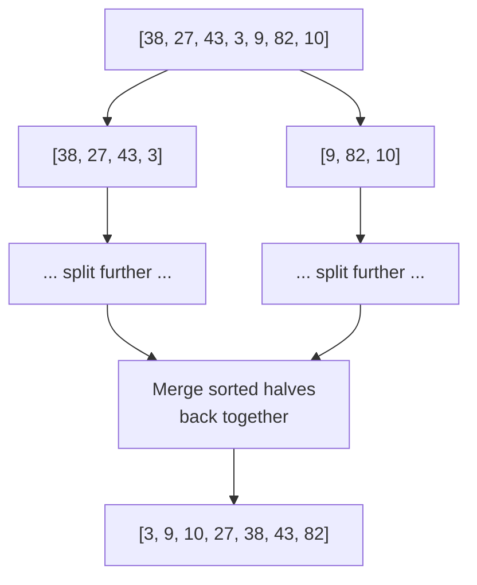
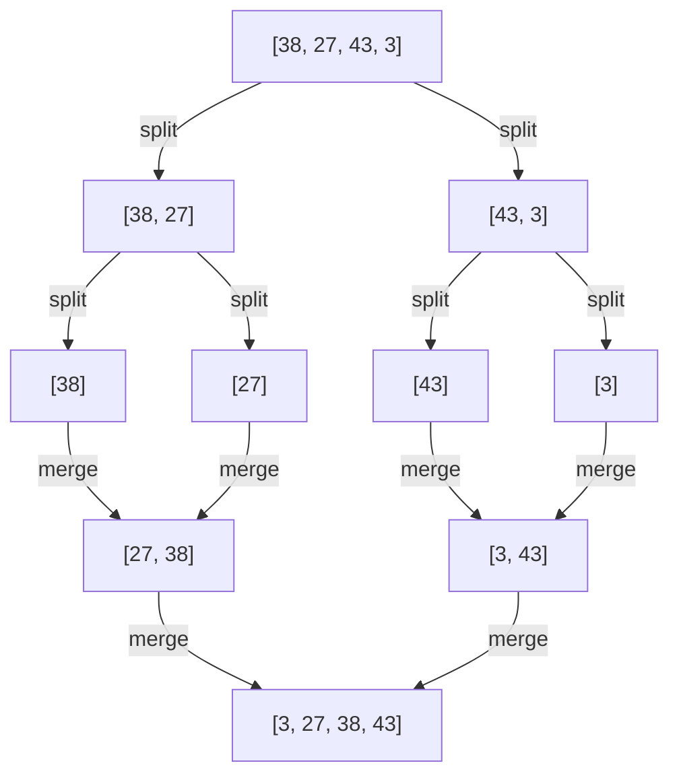
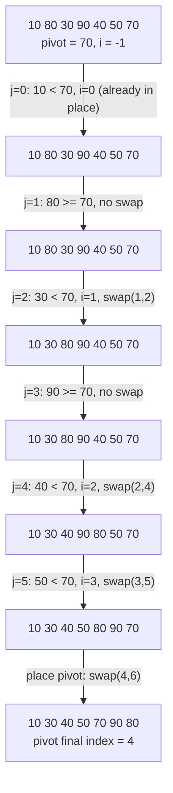

# Lecture 31: Sorting: Efficient Algorithms

Every elementary sort from Lecture 30 tops out at O(n²) in the worst case. **Merge sort**
and **quick sort** both break through that ceiling to O(n log n) — the same growth rate
as binary search's log n, multiplied across every element — by applying the same core
idea: **divide and conquer**.

## In This Lecture

- The divide-and-conquer strategy
- Merge sort: split, sort each half, merge
- Tracing merge sort's divide and merge phases as a full recursion tree
- Quick sort: partition around a pivot, then recurse
- Tracing quick sort's partition step swap by swap
- A real, counted comparison between merge sort and quick sort on the same input
- A direct comparison, and when each one is the better real-world choice

## Divide-and-Conquer Strategy

**Divide and conquer** solves a problem by (1) splitting it into smaller subproblems of
the same kind, (2) solving each subproblem recursively (Lecture 12), and (3) combining
the subproblems' solutions into the original problem's solution. Merge sort and quick
sort both follow this pattern — they differ in *where* the hard work happens: merge
sort's work is in the combine step, quick sort's is in the divide step.

## Merge Sort

Merge sort splits the array in half, recursively sorts each half, then **merges** the two
already-sorted halves back together in linear time.



```cpp title="merge_sort.cpp"
#include <iostream>
#include <vector>
using namespace std;

void printArray(const vector<int>& arr) {
    for (int v : arr) cout << v << " ";
    cout << endl;
}

void merge(vector<int>& arr, int left, int mid, int right) {
    vector<int> leftHalf(arr.begin() + left, arr.begin() + mid + 1);
    vector<int> rightHalf(arr.begin() + mid + 1, arr.begin() + right + 1);

    int i = 0, j = 0, k = left;
    while (i < leftHalf.size() && j < rightHalf.size()) {
        if (leftHalf[i] <= rightHalf[j]) {
            arr[k++] = leftHalf[i++];
        } else {
            arr[k++] = rightHalf[j++];
        }
    }
    while (i < leftHalf.size()) arr[k++] = leftHalf[i++];
    while (j < rightHalf.size()) arr[k++] = rightHalf[j++];
}

void mergeSort(vector<int>& arr, int left, int right) {
    if (left >= right) return;   // base case: 0 or 1 elements, already "sorted"

    int mid = left + (right - left) / 2;
    mergeSort(arr, left, mid);        // conquer: sort the left half
    mergeSort(arr, mid + 1, right);   // conquer: sort the right half
    merge(arr, left, mid, right);      // combine: merge the two sorted halves
}

int main() {
    vector<int> data = {38, 27, 43, 3, 9, 82, 10};
    cout << "Original:   "; printArray(data);

    mergeSort(data, 0, data.size() - 1);
    cout << "Merge sort: "; printArray(data);

    return 0;
}
```

```text
$ g++ -std=c++17 -o merge_sort merge_sort.cpp
$ ./merge_sort
Original:   38 27 43 3 9 82 10 
Merge sort: 3 9 10 27 38 43 82
```

Merge sort's `merge` step is where the real work happens: given two already-sorted
halves, it can build the fully sorted result in one linear pass, always comparing just
the current front of each half — this is the same idea as merging two sorted linked
lists, and it's what guarantees merge sort's O(n log n) **regardless of the input's
initial order**.

### Tracing Merge Sort's Divide and Merge Phases

The diagram above shows the shape of the recursion; here's every individual `split` and
`merge` call, printed as it actually happens, on a smaller 4-element array so the full
tree fits on screen:

```cpp title="merge_sort_traced.cpp"
#include <iostream>
#include <vector>
#include <string>
using namespace std;

void printArray(const vector<int>& arr, int left, int right) {
    cout << "[";
    for (int i = left; i <= right; i++) {
        cout << arr[i];
        if (i < right) cout << ", ";
    }
    cout << "]";
}

void merge(vector<int>& arr, int left, int mid, int right, int depth) {
    vector<int> leftHalf(arr.begin() + left, arr.begin() + mid + 1);
    vector<int> rightHalf(arr.begin() + mid + 1, arr.begin() + right + 1);

    int i = 0, j = 0, k = left;
    while (i < (int)leftHalf.size() && j < (int)rightHalf.size()) {
        if (leftHalf[i] <= rightHalf[j]) arr[k++] = leftHalf[i++];
        else arr[k++] = rightHalf[j++];
    }
    while (i < (int)leftHalf.size()) arr[k++] = leftHalf[i++];
    while (j < (int)rightHalf.size()) arr[k++] = rightHalf[j++];

    string indent(depth * 2, ' ');
    cout << indent << "merge -> ";
    printArray(arr, left, right);
    cout << endl;
}

void mergeSortTraced(vector<int>& arr, int left, int right, int depth) {
    string indent(depth * 2, ' ');
    if (left >= right) {
        cout << indent << "base case: [" << arr[left] << "]" << endl;
        return;
    }
    cout << indent << "split ";
    printArray(arr, left, right);
    cout << endl;

    int mid = left + (right - left) / 2;
    mergeSortTraced(arr, left, mid, depth + 1);
    mergeSortTraced(arr, mid + 1, right, depth + 1);
    merge(arr, left, mid, right, depth);
}

int main() {
    vector<int> data = {38, 27, 43, 3};
    cout << "Tracing merge sort on [38, 27, 43, 3]:" << endl;
    mergeSortTraced(data, 0, (int)data.size() - 1, 0);

    cout << "Final: ";
    printArray(data, 0, (int)data.size() - 1);
    cout << endl;

    return 0;
}
```

```text
$ g++ -std=c++17 -o merge_sort_traced merge_sort_traced.cpp
$ ./merge_sort_traced
Tracing merge sort on [38, 27, 43, 3]:
split [38, 27, 43, 3]
  split [38, 27]
    base case: [38]
    base case: [27]
  merge -> [27, 38]
  split [43, 3]
    base case: [43]
    base case: [3]
  merge -> [3, 43]
merge -> [3, 27, 38, 43]
Final: [3, 27, 38, 43]
```



The indentation in the printed trace mirrors the diagram's depth exactly: the recursion
splits all the way down to single-element base cases (the bottom of the tree) *before* any
merging starts, then merges work their way back **up**, each level combining the results
the level below it just produced. This down-then-up shape is why merge sort's total work
is `O(n log n)`: there are `log n` levels of recursion (repeatedly halving until reaching
size 1), and each level does `O(n)` total work across all its merges combined.

## Quick Sort

Quick sort picks a **pivot** element, **partitions** the array so everything smaller than
the pivot ends up to its left and everything larger ends up to its right, then recurses
on each side — the pivot itself is already in its final sorted position after
partitioning, needing no further work.

```cpp title="quick_sort.cpp"
#include <iostream>
#include <vector>
using namespace std;

void printArray(const vector<int>& arr) {
    for (int v : arr) cout << v << " ";
    cout << endl;
}

int partition(vector<int>& arr, int low, int high) {
    int pivot = arr[high];   // choose the last element as the pivot
    int i = low - 1;          // boundary of "elements smaller than pivot so far"

    for (int j = low; j < high; j++) {
        if (arr[j] < pivot) {
            i++;
            swap(arr[i], arr[j]);
        }
    }
    swap(arr[i + 1], arr[high]);   // place the pivot in its final position
    return i + 1;                   // the pivot's final index
}

void quickSort(vector<int>& arr, int low, int high) {
    if (low >= high) return;   // base case: 0 or 1 elements

    int pivotIndex = partition(arr, low, high);
    quickSort(arr, low, pivotIndex - 1);    // conquer: everything smaller than the pivot
    quickSort(arr, pivotIndex + 1, high);   // conquer: everything larger than the pivot
}

int main() {
    vector<int> data = {38, 27, 43, 3, 9, 82, 10};
    cout << "Original:   "; printArray(data);

    quickSort(data, 0, data.size() - 1);
    cout << "Quick sort: "; printArray(data);

    return 0;
}
```

```text
$ g++ -std=c++17 -o quick_sort quick_sort.cpp
$ ./quick_sort
Original:   38 27 43 3 9 82 10 
Quick sort: 3 9 10 27 38 43 82
```

Unlike merge sort, quick sort does its hard work **before** recursing (partitioning),
not after — and unlike merge sort, it sorts entirely **in-place**, needing no second
array to merge into.

### Tracing Quick Sort's Partition Step

`partition` is the one part of quick sort actually worth watching swap by swap — everything
else is just recursion. Here's `partition` instrumented to print every comparison and every
swap on the classic textbook example `{10, 80, 30, 90, 40, 50, 70}`, pivot `70`:

```cpp title="quick_sort_partition_trace.cpp"
#include <iostream>
#include <vector>
using namespace std;

void printArray(const vector<int>& arr) {
    for (int v : arr) cout << v << " ";
    cout << endl;
}

int partitionTraced(vector<int>& arr, int low, int high) {
    int pivot = arr[high];
    cout << "  pivot = " << pivot << " (arr[" << high << "])" << endl;
    int i = low - 1;

    for (int j = low; j < high; j++) {
        cout << "  compare arr[" << j << "]=" << arr[j] << " with pivot " << pivot;
        if (arr[j] < pivot) {
            i++;
            if (i != j) {
                cout << " -> smaller, swap arr[" << i << "] and arr[" << j << "]";
                swap(arr[i], arr[j]);
            } else {
                cout << " -> smaller, already in place (i == j)";
            }
        } else {
            cout << " -> not smaller, no swap";
        }
        cout << endl;
    }
    swap(arr[i + 1], arr[high]);
    cout << "  place pivot: swap arr[" << (i + 1) << "] and arr[" << high << "]" << endl;
    return i + 1;
}

int main() {
    vector<int> data = {10, 80, 30, 90, 40, 50, 70};
    cout << "Before: "; printArray(data);
    cout << "Partitioning around pivot arr[6]=" << data[6] << ":" << endl;
    int pivotIndex = partitionTraced(data, 0, (int)data.size() - 1);
    cout << "After partition: "; printArray(data);
    cout << "Pivot " << data[pivotIndex] << " landed at final index " << pivotIndex << endl;
    return 0;
}
```

```text
$ g++ -std=c++17 -o quick_sort_partition_trace quick_sort_partition_trace.cpp
$ ./quick_sort_partition_trace
Before: 10 80 30 90 40 50 70 
Partitioning around pivot arr[6]=70:
  pivot = 70 (arr[6])
  compare arr[0]=10 with pivot 70 -> smaller, already in place (i == j)
  compare arr[1]=80 with pivot 70 -> not smaller, no swap
  compare arr[2]=30 with pivot 70 -> smaller, swap arr[1] and arr[2]
  compare arr[3]=90 with pivot 70 -> not smaller, no swap
  compare arr[4]=40 with pivot 70 -> smaller, swap arr[2] and arr[4]
  compare arr[5]=50 with pivot 70 -> smaller, swap arr[3] and arr[5]
  place pivot: swap arr[4] and arr[6]
After partition: 10 30 40 50 70 90 80 
Pivot 70 landed at final index 4
```



Every element strictly smaller than the pivot (`10, 30, 40, 50`) ends up to the left of
index 4; every element strictly larger (`90, 80`) ends up to the right — `partition` never
sorts either side, it only guarantees that split, which is exactly what lets `quickSort`
recurse independently on `[low, pivotIndex - 1]` and `[pivotIndex + 1, high]` without ever
needing to look at the other side again.

## Comparison of Merge Sort and Quick Sort

| | Merge Sort | Quick Sort |
|---|---|---|
| Best/average case | O(n log n) | O(n log n) |
| Worst case | O(n log n) — **always** | O(n²) — if the pivot is consistently the smallest or largest element |
| Space | O(n) — needs a second array to merge into | O(log n) — just the recursion stack, sorts in-place |
| Stable? | Yes | No (equal elements can be reordered by swaps) |
| Typical real-world speed | Consistently good | Usually faster in practice, due to better cache behavior and no extra array allocation |

!!! note "Why quick sort's worst case happens, and how real libraries avoid it"
    If the input is already sorted (or reverse-sorted) and the pivot is always chosen as
    the last element (as in the code above), every partition splits the array as
    unevenly as possible — one side empty, one side everything else — degrading to O(n²),
    the same as an elementary sort. Real-world implementations avoid this by picking the
    pivot **randomly**, or as the median of a few sampled elements, making the worst case
    astronomically unlikely in practice rather than eliminating it in theory.

Despite quick sort's theoretical worst case, it is what most real standard libraries use
by default (often a hybrid, switching to insertion sort for very small sub-arrays, as
Lecture 30 hinted), because its practical, average-case speed usually beats merge sort's
guaranteed-but-more-overhead performance.

### A Real, Counted Comparison

Raw wall-clock timing isn't reproducible from one run (or one machine) to the next, but a
**comparison count** is — it depends only on the algorithm and the input, never on the
computer running it. Here both algorithms sort the *same* 2,000-element array (built from
a fixed random seed, so it's identical every time this program runs) and report exactly
how many element comparisons each one performed:

```cpp title="merge_vs_quick_comparison_count.cpp"
#include <iostream>
#include <vector>
#include <random>
using namespace std;

long mergeComparisons = 0;
long quickComparisons = 0;

void mergeStep(vector<int>& arr, int left, int mid, int right) {
    vector<int> leftHalf(arr.begin() + left, arr.begin() + mid + 1);
    vector<int> rightHalf(arr.begin() + mid + 1, arr.begin() + right + 1);
    int i = 0, j = 0, k = left;
    while (i < (int)leftHalf.size() && j < (int)rightHalf.size()) {
        mergeComparisons++;
        if (leftHalf[i] <= rightHalf[j]) arr[k++] = leftHalf[i++];
        else arr[k++] = rightHalf[j++];
    }
    while (i < (int)leftHalf.size()) arr[k++] = leftHalf[i++];
    while (j < (int)rightHalf.size()) arr[k++] = rightHalf[j++];
}

void mergeSort(vector<int>& arr, int left, int right) {
    if (left >= right) return;
    int mid = left + (right - left) / 2;
    mergeSort(arr, left, mid);
    mergeSort(arr, mid + 1, right);
    mergeStep(arr, left, mid, right);
}

int partition(vector<int>& arr, int low, int high) {
    int pivot = arr[high];
    int i = low - 1;
    for (int j = low; j < high; j++) {
        quickComparisons++;
        if (arr[j] < pivot) {
            i++;
            swap(arr[i], arr[j]);
        }
    }
    swap(arr[i + 1], arr[high]);
    return i + 1;
}

void quickSort(vector<int>& arr, int low, int high) {
    if (low >= high) return;
    int pivotIndex = partition(arr, low, high);
    quickSort(arr, low, pivotIndex - 1);
    quickSort(arr, pivotIndex + 1, high);
}

int main() {
    const int n = 2000;
    mt19937 rng(42);   // fixed seed -> the same "random" array every run
    uniform_int_distribution<int> dist(1, 1000000);

    vector<int> original(n);
    for (int i = 0; i < n; i++) original[i] = dist(rng);

    vector<int> forMerge = original;
    vector<int> forQuick = original;

    mergeSort(forMerge, 0, n - 1);
    quickSort(forQuick, 0, n - 1);

    bool sameResult = (forMerge == forQuick);

    cout << "Sorting " << n << " random integers (fixed seed, reproducible)" << endl;
    cout << "Merge sort comparisons: " << mergeComparisons << endl;
    cout << "Quick sort comparisons: " << quickComparisons << endl;
    cout << "Both algorithms agree on the sorted result: " << (sameResult ? "yes" : "no") << endl;

    if (quickComparisons < mergeComparisons) {
        cout << "Verdict: quick sort used fewer comparisons on this input." << endl;
    } else {
        cout << "Verdict: merge sort used fewer (or equal) comparisons on this input." << endl;
    }

    return 0;
}
```

```text
$ g++ -std=c++17 -o merge_vs_quick_comparison_count merge_vs_quick_comparison_count.cpp
$ ./merge_vs_quick_comparison_count
Sorting 2000 random integers (fixed seed, reproducible)
Merge sort comparisons: 19393
Quick sort comparisons: 23831
Both algorithms agree on the sorted result: yes
Verdict: merge sort used fewer (or equal) comparisons on this input.
```

Both land close to the `n log2 n ≈ 2000 * 11 ≈ 22000` estimate the O(n log n) bound
predicts, confirming neither algorithm is secretly doing quadratic work on this input — but
merge sort's guaranteed, always-balanced split gave it slightly fewer comparisons here than
quick sort's partition-based split, which depends on how evenly the (random, in this case
well-behaved) pivot choices happened to divide the array. This is the real-world trade-off
described in the table above: merge sort's O(n log n) is a *guarantee*; quick sort's is a
(usually very safe) bet that depends on the pivot never repeatedly landing near an extreme.

## Try It Yourself

1. Compile and run `merge_sort.cpp` and `quick_sort.cpp` on the *same* larger, randomly
   shuffled array of your choosing (10-20 elements), and confirm both produce identical
   sorted output.
2. Modify `partition` to choose the pivot as `arr[low]` (the *first* element) instead of
   `arr[high]`. Run your modified `quickSort` on an already-**sorted** array of 10
   elements and think through, using the "Why quick sort's worst case happens" note
   above, why this specific pivot choice on this specific input would trigger the O(n²)
   worst case.
3. Compile and run `merge_sort_traced.cpp` with a 5- or 6-element array instead of the
   4-element one shown, and draw the resulting recursion tree by hand before comparing it
   to the printed trace — pay attention to how an odd-length array splits unevenly (one
   half gets one more element than the other) yet still merges correctly.
4. Compile and run `quick_sort_partition_trace.cpp` with the pivot chosen as `arr[low]`
   instead of `arr[high]` (you'll need to adjust which index `partitionTraced` reads the
   pivot from, and swap it to the end first, or trace through the consequences by hand).
   Confirm, from the printed swap-by-swap trace, which elements end up left vs. right of
   the pivot's final position.
5. Modify `merge_vs_quick_comparison_count.cpp` to use `n = 20000` instead of `2000`, and
   re-run it. Confirm both comparison counts roughly follow the `n log2 n` estimate at the
   new size (compute `20000 * log2(20000)` by hand or with a calculator to check).

## Key Takeaways

- **Divide and conquer** — split, solve recursively, combine — is the strategy behind
  both merge sort and quick sort, achieving O(n log n) where elementary sorts only manage
  O(n²).
- **Merge sort** does its work in the *combine* step (merging two sorted halves); it's
  always O(n log n), stable, but needs O(n) extra space — a full traced example confirmed
  the divide phase always bottoms out at single-element base cases before any merging
  starts.
- **Quick sort** does its work in the *divide* step (partitioning around a pivot); it
  sorts in-place with only O(log n) extra space, but can degrade to O(n²) with a poor
  pivot choice on already-sorted input — a swap-by-swap partition trace showed exactly how
  the pivot lands in its final sorted position after a single pass.
- A real, counted comparison on the same 2,000-element input showed both algorithms
  landing close to the `n log2 n` estimate — proof that neither is secretly doing
  quadratic work on well-behaved input, and a reminder that **comparison counts, not raw
  wall-clock time, are the reproducible way to measure this**.
- In practice, quick sort (with a randomized or median-of-few pivot) is usually faster
  than merge sort — which is why most real language standard libraries default to a
  quick-sort-based algorithm, hybridized with insertion sort for small inputs.
