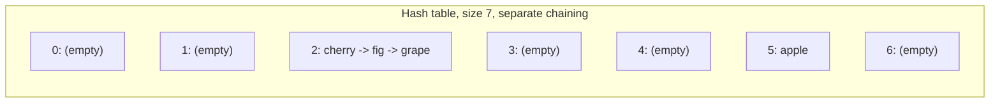
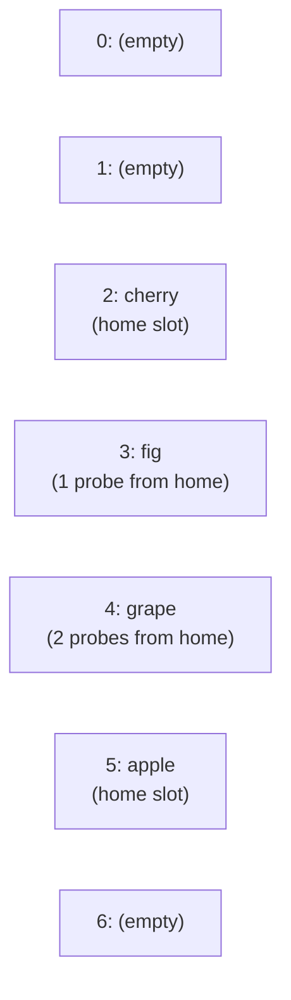
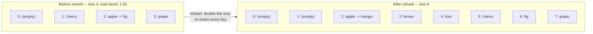

# Lecture 32: Hashing and Efficient Data Access

The course closes with the fastest data structure covered yet. A BST (Unit 5) gets
search down to O(log n); **hashing** gets it down to O(1) *on average* — by trading away
ordering entirely and computing, directly, roughly where a value should live.

## In This Lecture

- The need for O(1) data access, and the hashing concept
- Hash tables, key-value mapping, and hash functions
- What makes a hash function "good"
- Collisions, and open vs. closed hashing
- Three collision resolution strategies: separate chaining, linear probing, and double hashing
- A second, independently-verified collision example, to confirm collisions aren't a fluke
  of one specific table size
- Rehashing, worked through with real before/after table sizes and bucket contents
- Chaining vs. probing, compared with real measured performance data
- Real applications of hashing

## Need for Efficient Data Access

A BST answers "is this value present?" in O(log n) by comparing against a handful of
nodes on the way down. Hashing asks a bolder question: what if you could compute
*exactly* where a value belongs, with simple arithmetic, and skip the comparisons
entirely? That's the idea behind every hash table, dictionary, and cache-lookup you've
ever used.

## Hashing Concept and the Hash Table

A **hash table** stores **key-value pairs**, using a **hash function** to convert a key
directly into an array index — the same array-indexing O(1) access from Lecture 4, now
applied to arbitrary keys (strings, not just integers).

```mermaid
flowchart LR
    K["Key: \"apple\""] --> H["Hash Function"]
    H --> I["Index: 5"]
    I --> T["table[5] = (\"apple\", value)"]
```

## Hash Function

A **hash function** takes a key and returns an integer index within the table's bounds. A
simple one for strings: sum the ASCII value of every character, then take the result
modulo the table's size.

```cpp title="hash_table_chaining.cpp"
#include <iostream>
#include <vector>
#include <list>
#include <string>
using namespace std;

int hashFunction(const string& key, int tableSize) {
    int sum = 0;
    for (char c : key) sum += c;
    return sum % tableSize;
}

int main() {
    int tableSize = 7;
    for (string key : {"apple", "cherry", "fig", "grape"}) {
        cout << "hash(\"" << key << "\") = " << hashFunction(key, tableSize) << endl;
    }
    return 0;
}
```

```text
$ g++ -std=c++17 -o hash_demo hash_table_chaining.cpp
$ ./hash_demo
hash("apple") = 5
hash("cherry") = 2
hash("fig") = 2
hash("grape") = 2
```

## Properties of a Good Hash Function

- **Deterministic** — the same key must always produce the same index.
- **Fast to compute** — the whole point is speed; a slow hash function defeats the purpose.
- **Uniform distribution** — keys should spread evenly across the table, not cluster in a
  few indices. Notice above: `"cherry"`, `"fig"`, and `"grape"` all hashed to index 2 —
  a **collision**, and exactly what a good hash function tries to minimize (this simple
  sum-of-characters function is easy to understand but poor in practice for exactly this
  reason — real hash functions mix bits far more thoroughly).

## Collisions

A **collision** happens when two different keys hash to the same index — as just shown,
this is common even with reasonable data, not a rare edge case, and every real hash table
implementation needs a strategy to handle it.

### A Second, Independently-Verified Collision

The `"cherry"`/`"fig"`/`"grape"`/`"kiwi"` collision at table size 7, used throughout the
rest of this lecture, isn't a one-off fluke tied to that specific table size — collisions
show up just as easily at other sizes, with entirely different words. Changing only the
table size to 11 and testing three unrelated fruit names confirms this:

```cpp title="second_collision_check.cpp"
#include <iostream>
#include <string>
using namespace std;

int hashFunction(const string& key, int tableSize) {
    int sum = 0;
    for (char c : key) sum += c;
    return sum % tableSize;
}

int main() {
    int tableSize = 11;
    for (string key : {"lemon", "melon", "cocoa"}) {
        cout << "hash(\"" << key << "\") = " << hashFunction(key, tableSize) << endl;
    }
    return 0;
}
```

```text
$ g++ -std=c++17 -o second_collision_check second_collision_check.cpp
$ ./second_collision_check
hash("lemon") = 0
hash("melon") = 0
hash("cocoa") = 0
```

`"lemon"`, `"melon"`, and `"cocoa"` share no letters in common and aren't even the same
length — they collide purely because their character sums happen to agree modulo 11. That's
the real lesson: with a simple sum-of-characters hash function, *any* table size will have
some set of keys that collides at it — collisions are a mathematical certainty of the
pigeonhole principle (more possible keys than table slots) combined with a hash function
that mixes its input only weakly, not a rare accident specific to one demo.

## Open Hashing: Separate Chaining

**Open hashing** (also called **separate chaining**) handles a collision by storing a
**list** at each index — every key that hashes there just gets appended to that index's
list.

```cpp title="hash_table_chaining_full.cpp"
#include <iostream>
#include <vector>
#include <list>
#include <string>
using namespace std;

class HashTableChaining {
private:
    int tableSize;
    vector<list<pair<string, int>>> table;

    int hashFunction(const string& key) const {
        int sum = 0;
        for (char c : key) sum += c;
        return sum % tableSize;
    }

public:
    HashTableChaining(int size) : tableSize(size), table(size) {}

    void insert(const string& key, int value) {
        int index = hashFunction(key);
        table[index].push_back({key, value});
    }

    bool search(const string& key, int& valueOut) const {
        int index = hashFunction(key);
        for (auto& pair : table[index]) {
            if (pair.first == key) { valueOut = pair.second; return true; }
        }
        return false;
    }

    void printBucket(const string& key) const {
        int index = hashFunction(key);
        cout << "Bucket " << index << ": ";
        for (auto& pair : table[index]) {
            cout << "(" << pair.first << ", " << pair.second << ") ";
        }
        cout << endl;
    }
};

int main() {
    HashTableChaining table(7);
    table.insert("apple", 100);
    table.insert("cherry", 75);   // hashes to index 2
    table.insert("fig", 40);       // collides with "cherry" (also index 2)
    table.insert("grape", 60);     // also collides (also index 2)

    table.printBucket("cherry");

    int value;
    if (table.search("fig", value)) {
        cout << "Found fig: " << value << " (correctly found despite the collision)" << endl;
    }

    return 0;
}
```

```text
$ g++ -std=c++17 -o hash_table_chaining_full hash_table_chaining_full.cpp
$ ./hash_table_chaining_full
Bucket 2: (cherry, 75) (fig, 40) (grape, 60) 
Found fig: 40 (correctly found despite the collision)
```

All three colliding keys live together in the same bucket's list — `search` still finds
`"fig"` correctly, it just has to check each entry in that one bucket instead of going
straight there in one step. Here's what every bucket in that 7-slot table actually looks
like after those four inserts, matching the printed output above exactly:



Five of the seven buckets sit empty while bucket 2 holds a three-entry chain — exactly the
"clustering" concern that motivates a *good* hash function's uniform-distribution property:
a poor hash function doesn't just cause occasional collisions, it can leave most of the
table's capacity completely unused while a handful of buckets do all the work.

## Closed Hashing: Linear Probing

**Closed hashing** keeps every entry directly in the table array itself — on a collision,
it looks for the **next available slot** instead of using a separate list.
**Linear probing** is the simplest strategy: check `index + 1`, then `index + 2`, and so
on (wrapping around, like Lecture 14's circular queue), until an empty slot is found.

```cpp title="hash_table_probing.cpp"
#include <iostream>
#include <vector>
#include <string>
using namespace std;

class HashTableProbing {
private:
    int tableSize;
    vector<string> keys;
    vector<int> values;
    vector<bool> occupied;

    int hashFunction(const string& key) const {
        int sum = 0;
        for (char c : key) sum += c;
        return sum % tableSize;
    }

public:
    HashTableProbing(int size) : tableSize(size), keys(size), values(size), occupied(size, false) {}

    void insert(const string& key, int value) {
        int index = hashFunction(key);
        int originalIndex = index;
        int probes = 0;
        while (occupied[index]) {
            index = (index + 1) % tableSize;   // linear probing: try the next slot
            probes++;
        }
        keys[index] = key;
        values[index] = value;
        occupied[index] = true;
        cout << "Inserted \"" << key << "\" at index " << index
             << " (home index " << originalIndex << ", " << probes << " probe(s))" << endl;
    }
};

int main() {
    HashTableProbing table(7);
    table.insert("apple", 100);
    table.insert("cherry", 75);
    table.insert("fig", 40);
    table.insert("grape", 60);

    return 0;
}
```

```text
$ g++ -std=c++17 -o hash_table_probing hash_table_probing.cpp
$ ./hash_table_probing
Inserted "apple" at index 5 (home index 5, 0 probe(s))
Inserted "cherry" at index 2 (home index 2, 0 probe(s))
Inserted "fig" at index 3 (home index 2, 1 probe(s))
Inserted "grape" at index 4 (home index 2, 2 probe(s))
```

`"cherry"`, `"fig"`, and `"grape"` all "want" index 2, exactly like the chaining example
— but instead of a list, linear probing physically walks forward through the array until
it finds room, landing `"fig"` at 3 and `"grape"` at 4. Laid out as the array it actually
is, matching the printed probe counts above:



Unlike chaining's separate lists, every entry here lives directly in the array itself —
`"fig"`'s *logical* home is index 2, but it physically occupies index 3, one slot past
where `"cherry"` (which arrived first) already claimed. Searching for `"fig"` later means
starting at its home index and walking forward exactly the same way `insert` did, stopping
at the first match or the first empty slot.

### Quadratic Probing and Double Hashing

Linear probing has a known weakness called **clustering**: once several keys land near
each other, new collisions become *more* likely to land in that same crowded region,
making the clustering worse over time. Two alternatives address this:

- **Quadratic probing** — checks `index + 1²`, `index + 2²`, `index + 3²`, ... instead of
  `index + 1, + 2, + 3`, spreading probes out faster to avoid clustering.
- **Double hashing** — uses a *second* hash function to compute the probe step size
  itself (`index + 1*step`, `index + 2*step`, ...), so different keys that collide at the
  same home index scatter in different probe patterns instead of all following the same
  path.

## Rehashing

As a hash table fills up, collisions become more frequent and performance degrades
toward O(n). **Rehashing** creates a new, larger table (commonly double the size) and
re-inserts every existing key using the new table's hash function — the same idea as a
`std::vector` growing past its capacity, applied to a hash table's **load factor**
(entries ÷ table size) instead of raw element count.

### A Worked Example: What Triggers a Rehash

A chaining hash table that rehashes whenever its load factor exceeds `0.75` starts at size
4 and inserts seven keys, one at a time. Watch the load factor climb, then reset the
instant the table doubles:

```cpp title="hash_table_load_factor.cpp"
#include <iostream>
#include <vector>
#include <list>
#include <string>
#include <iomanip>
using namespace std;

class HashTableChaining {
private:
    int tableSize;
    int count;
    vector<list<pair<string, int>>> table;

    int hashFunction(const string& key) const {
        int sum = 0;
        for (char c : key) sum += c;
        return sum % tableSize;
    }

    double loadFactor() const {
        return (double)count / tableSize;
    }

    void rehash() {
        int oldSize = tableSize;
        vector<list<pair<string, int>>> oldTable = table;
        tableSize = tableSize * 2;
        table.assign(tableSize, {});
        for (auto& bucket : oldTable) {
            for (auto& kv : bucket) {
                int idx = hashFunction(kv.first);
                table[idx].push_back(kv);
            }
        }
        cout << "  >> REHASH triggered (load factor exceeded 0.75): table size "
             << oldSize << " -> " << tableSize << endl;
    }

public:
    HashTableChaining(int size) : tableSize(size), count(0), table(size) {}

    void insert(const string& key, int value) {
        if (loadFactor() > 0.75) {
            rehash();
        }
        int index = hashFunction(key);
        table[index].push_back({key, value});
        count++;
        cout << "Inserted \"" << key << "\" -> bucket " << index
             << "  (table size=" << tableSize << ", entries=" << count
             << ", load factor=" << fixed << setprecision(2) << loadFactor() << ")" << endl;
    }

    int size() const { return tableSize; }

    void printTable() const {
        for (int i = 0; i < tableSize; i++) {
            cout << "  bucket " << i << ": ";
            if (table[i].empty()) {
                cout << "(empty)";
            } else {
                bool first = true;
                for (auto& kv : table[i]) {
                    if (!first) cout << " -> ";
                    cout << kv.first;
                    first = false;
                }
            }
            cout << endl;
        }
    }
};

int main() {
    HashTableChaining table(4);
    vector<string> beforeRehash = {"apple", "cherry", "fig", "grape"};
    vector<string> afterRehash = {"kiwi", "lemon", "mango"};

    for (auto& k : beforeRehash) table.insert(k, 0);

    cout << "\nTable contents right before the next insert triggers a rehash:" << endl;
    table.printTable();

    for (auto& k : afterRehash) table.insert(k, 0);

    cout << "\nFinal table size after all insertions: " << table.size() << endl;
    cout << "Final table contents:" << endl;
    table.printTable();
    return 0;
}
```

```text
$ g++ -std=c++17 -o hash_table_load_factor hash_table_load_factor.cpp
$ ./hash_table_load_factor
Inserted "apple" -> bucket 2  (table size=4, entries=1, load factor=0.25)
Inserted "cherry" -> bucket 1  (table size=4, entries=2, load factor=0.50)
Inserted "fig" -> bucket 2  (table size=4, entries=3, load factor=0.75)
Inserted "grape" -> bucket 3  (table size=4, entries=4, load factor=1.00)

Table contents right before the next insert triggers a rehash:
  bucket 0: (empty)
  bucket 1: cherry
  bucket 2: apple -> fig
  bucket 3: grape
  >> REHASH triggered (load factor exceeded 0.75): table size 4 -> 8
Inserted "kiwi" -> bucket 4  (table size=8, entries=5, load factor=0.62)
Inserted "lemon" -> bucket 3  (table size=8, entries=6, load factor=0.75)
Inserted "mango" -> bucket 2  (table size=8, entries=7, load factor=0.88)

Final table size after all insertions: 8
Final table contents:
  bucket 0: (empty)
  bucket 1: (empty)
  bucket 2: apple -> mango
  bucket 3: lemon
  bucket 4: kiwi
  bucket 5: cherry
  bucket 6: fig
  bucket 7: grape
```

Two details worth noticing. First, the check happens **before** each insert, using the
load factor as it stood *before* adding the new key — that's why `"grape"` was still
allowed in at a load factor of exactly `0.75` (the condition is `> 0.75`, not `>= 0.75`),
and it was the *next* insert (`"kiwi"`) whose pre-check found `1.00 > 0.75` and triggered
the rehash. Second, rehashing doesn't just move entries to new slots arbitrarily — every
key's index is **recomputed from scratch** with the new table size, because `sum % 4` and
`sum % 8` generally give different answers for the same key. That's visible directly in the
before/after table contents: `"apple"` and `"fig"` shared bucket 2 at size 4, but after the
rehash `"fig"` moved to bucket 6 on its own while `"apple"` stayed at bucket 2 (later joined
by `"mango"`) — the collision that existed at size 4 didn't necessarily survive at size 8.



Rehashing is not free — it's an O(n) pass over every existing entry — but because it only
happens occasionally (each rehash roughly doubles the *capacity* before the next one is
needed), the cost **amortizes** to O(1) per insertion on average, the exact same argument
Lecture 4 used for `std::vector`'s growth strategy.

### Chaining vs. Probing: A Performance Comparison

| | Separate Chaining | Linear Probing |
|---|---|---|
| Where entries live | A list per bucket, outside the array | Directly inside the array itself |
| Behavior as load factor → 1.0 | Degrades gracefully — chains just get longer | Degrades sharply — probe sequences overlap and clustering compounds |
| Can load factor exceed 1.0? | Yes — a bucket's list can always grow | No — the table physically runs out of slots at 1.0 |
| Extra memory per entry | A list node's overhead (pointers) | None — no extra structure, just the array |
| Cache behavior | Worse — list nodes scattered in memory (Lecture 5) | Better — probing walks through contiguous memory |
| Deletion | Simple — remove from the bucket's list | Tricky — naively marking a slot empty can break probe sequences for *later* keys that probed past it |

The table's middle rows aren't just theory — they show up directly in measured data. Here,
80 keys (`"key0"` through `"key79"`) are inserted into both structures at three different
load factors, counting the **average chain length** for chaining and the **average number
of probes per insert** for linear probing:

```cpp title="chaining_vs_probing_stats.cpp"
#include <iostream>
#include <vector>
#include <list>
#include <string>
#include <iomanip>
#include <set>
using namespace std;

int hashFunction(const string& key, int tableSize) {
    int sum = 0;
    for (char c : key) sum += c;
    return sum % tableSize;
}

// Measures average chain length across all NON-EMPTY buckets after inserting
// `keys` into a chaining hash table of the given size.
double averageChainLength(const vector<string>& keys, int tableSize) {
    vector<list<string>> table(tableSize);
    for (auto& k : keys) table[hashFunction(k, tableSize)].push_back(k);

    int nonEmptyBuckets = 0;
    for (auto& bucket : table) if (!bucket.empty()) nonEmptyBuckets++;
    return (double)keys.size() / nonEmptyBuckets;
}

// Measures average number of probes needed to INSERT each key into a linear
// probing table of the given size (assumes the table is large enough that
// every key eventually finds a slot).
double averageLinearProbes(const vector<string>& keys, int tableSize) {
    vector<bool> occupied(tableSize, false);
    long totalProbes = 0;
    for (auto& k : keys) {
        int index = hashFunction(k, tableSize);
        int probes = 0;
        while (occupied[index]) {
            index = (index + 1) % tableSize;
            probes++;
        }
        occupied[index] = true;
        totalProbes += probes;
    }
    return (double)totalProbes / keys.size();
}

int main() {
    // Generate 80 distinct string keys: "key0", "key1", ... "key79"
    vector<string> keys;
    for (int i = 0; i < 80; i++) keys.push_back("key" + to_string(i));

    cout << fixed << setprecision(2);
    cout << "Load factor | Avg chain length (chaining) | Avg probes per insert (linear probing)" << endl;

    for (double targetLoad : {0.5, 0.7, 0.9}) {
        int tableSize = (int)(keys.size() / targetLoad);
        vector<string> subset(keys.begin(), keys.begin() + (int)(tableSize * targetLoad));

        double chainLen = averageChainLength(subset, tableSize);
        double probes = averageLinearProbes(subset, tableSize);

        set<int> distinctHomes;
        for (auto& k : subset) distinctHomes.insert(hashFunction(k, tableSize));

        cout << targetLoad << "        | " << chainLen << "                         | " << probes
             << "   (distinct home indices used: " << distinctHomes.size() << " / " << tableSize << ")" << endl;
    }

    return 0;
}
```

```text
$ g++ -std=c++17 -o chaining_vs_probing_stats chaining_vs_probing_stats.cpp
$ ./chaining_vs_probing_stats
Load factor | Avg chain length (chaining) | Avg probes per insert (linear probing)
0.50        | 3.08                         | 23.62   (distinct home indices used: 26 / 160)
0.70        | 3.16                         | 23.75   (distinct home indices used: 25 / 114)
0.90        | 3.16                         | 27.04   (distinct home indices used: 25 / 88)
```

These numbers look worse than a textbook's idealized "1.5 probes at load factor 0.5" —
and the `distinct home indices used` column explains exactly why: the simple sum-of-
characters hash function applied to `"key0"`...`"key79"` only ever produces 25-26 distinct
home indices, no matter how large the table is, because the shared `"key"` prefix
dominates the sum and the trailing one or two digits barely change it. That's severe
clustering caused by a **weak hash function**, not by the probing strategy itself — but
look at how differently the two structures absorb it: chaining's average chain length
stays a modest ~3 across all three load factors (a few extra entries per bucket is cheap),
while linear probing's average probe count balloons past 20 and keeps climbing as the load
factor rises. This is the clustering weakness from the "Quadratic Probing and Double
Hashing" section made concrete: **probing is far more sensitive to a poor hash function
than chaining is**, because a probing sequence that starts near an already-crowded region
has to walk through that entire crowd, while a chain just grows by one link no matter how
many other keys already share its bucket.

## Applications of Hashing

- **Dictionaries and language maps** — Python's `dict`, JavaScript's objects, and C++'s
  `unordered_map` (used back in Lecture 24's Huffman coding) are all hash tables.
- **Caching** — a web browser's cache, a CPU's memory cache, and a CDN's edge cache all
  use hashing to check "do I already have this?" in O(1).
- **Password storage** — passwords are hashed (with a one-way, cryptographic hash
  function) so the original password is never stored in plain text.
- **Duplicate detection** — checking whether a value has been seen before, in O(1) per
  check instead of an O(n) linear scan or an O(log n) BST lookup.

## Try It Yourself

1. Compile and run `hash_table_probing.cpp`, then add a fifth key, `"mango"` (home index
   5, the same as `"apple"`), and predict how many probes it will need before running it,
   based on which indices are already occupied.
2. Implement `search` for `HashTableProbing` (mirroring `HashTableChaining::search`, but
   walking forward through occupied slots via the same linear-probing pattern
   `insert` uses, stopping either when the key is found or an **empty** slot is reached —
   an empty slot proves the key was never inserted, since insertion never leaves gaps
   before a key's actual position).
3. Compile and run `second_collision_check.cpp`, then find a *third* independent collision
   at a table size of your choosing (try sizes 13 through 20 with common English words) —
   confirm it with real compiled output before trusting it, exactly like this lecture did
   both times.
4. Modify `hash_table_load_factor.cpp`'s rehash threshold from `0.75` to `0.5`, then
   re-run it on the same seven keys. Confirm a rehash now triggers **earlier** (after
   fewer insertions) and explain, using the load factors printed, exactly which insert
   triggers it this time.
5. Modify `chaining_vs_probing_stats.cpp` to generate its 80 keys as `"item" + to_string(i)`
   instead of `"key" + to_string(i)`, and re-run it. Compare the new `distinct home indices
   used` counts to the original — do they change much? What does that tell you about
   whether the *specific words* matter, or whether the *weakness of the hash function
   itself* is really what's driving the clustering?

## Key Takeaways

- **Hashing** computes an index directly from a key, achieving O(1) average-case access —
  the fastest data access this course covers, at the cost of giving up any ordering.
- A **collision** — two keys hashing to the same index — is common, not rare, and every
  real hash table needs a resolution strategy; a second, independently-verified collision
  at a different table size (`"lemon"`/`"melon"`/`"cocoa"` at size 11) confirmed this isn't
  a fluke of one specific demo.
- **Open hashing (separate chaining)** stores a list per index; **closed hashing
  (probing)** keeps every entry in the array itself, searching forward for empty slots.
- **Linear probing** is simple but clusters; **quadratic probing** and **double hashing**
  spread collisions out more evenly.
- **Rehashing** grows the table and re-inserts everything once the load factor gets too
  high, keeping average-case O(1) performance intact as data grows — a worked example
  showed exactly which insert crosses the `0.75` threshold, and confirmed that every key's
  index is recomputed from scratch at the new size, not simply carried over.
- **Chaining tolerates a weak hash function far better than probing does** — measured data
  on the same clustered input showed chaining's average chain length staying near 3 while
  linear probing's average probe count climbed past 20, because a crowded probe sequence
  has to walk through the entire crowd while a chain only grows by one link.

## Where to Go From Here

Congratulations — you've reached the end of Algorithms and Data Structures (CSC211).
You started this semester with a single question — "how should data be organized?" —
and by now you've built, by hand and in real, compiled C++, every major answer to it:
linear structures that trade off access speed against insertion cost, trees that turn
search into a logarithmic walk (and, with AVL, *guarantee* it stays that way), graphs
that model any network of relationships at all, and finally hashing, which sidesteps the
whole search problem with direct computation.

None of this stops being relevant once the course ends. Every data structure here
reappears constantly in the courses ahead: databases index their tables with balanced
trees and hash tables; operating systems schedule processes with queues and priority
queues; compilers parse code with trees and stacks; and every serious job interview in
this field will, at some point, ask you to reason about exactly the trade-offs this
course spent a semester building your intuition for. The goal was never to memorize these
implementations — it was to build the habit of asking, for any new problem: *what does
this data actually need to do quickly, and which structure gives me that?* That question
will serve you for the rest of your career.
