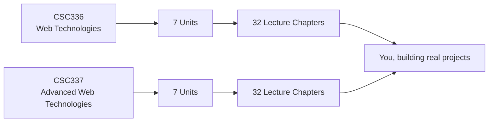

  <h1>The Web Dev Book</h1>
  

    A free, lecture-by-lecture online textbook built from the official COMSATS course plans
    for <strong>Web Technologies (CSC336)</strong> and
    <strong>Advanced Web Technologies (CSC337)</strong> — from your very first
    <code>&lt;h1&gt;</code> to shipping a production Next.js application on Vercel.
  

  

    CSC336 · SEMESTER 5
    <h3>Web Technologies</h3>
    

      Start here if you're new to web development. HTML, CSS, modern JavaScript, a
      server-side API with a database, and your first React app — 32 lectures, explained
      simply with plenty of examples.
    

    
  

  

    CSC337 · SEMESTER 6
    <h3>Advanced Web Technologies</h3>
    

      For students who've completed CSC336. Enterprise architecture, API design,
      authentication and OWASP security, caching and scalability, and production-grade
      Next.js — 32 lectures.
    

    
  

## How this book is organized

Each course is split into **7 units** (matching the official course description form), and
every unit is a group of **lectures** — one chapter per lecture, exactly as taught in class.

Every chapter follows the same shape, so you always know what to expect:

| Section | What you'll find there |
|---|---|
| **In this lecture** | A short preview of what you're about to learn and why it matters |
| **Explanation + examples** | Plain-language explanations with runnable code samples |
| **Diagrams** | Mermaid diagrams for architectures, flows, and sequences where a picture helps |
| **Try it yourself** | A small hands-on exercise to reinforce the lecture |
| **Key takeaways** | A quick recap you can revise from before a quiz or exam |

## Where to start

- **New to web development?** Begin at [Web Technologies → Lecture 1](web-technologies/lecture-01-introduction-to-web-development.md).
- **Finished CSC336 already?** Jump into [Advanced Web Technologies → Lecture 1](advanced-web-technologies/lecture-01-course-overview-and-enterprise-architecture.md).
- **Looking for a specific topic?** Use the search bar at the top of the page, or browse the [tag index](tags.md).

## Downloads

### Official Course Documents

The source documents this book is generated from, as PDFs.

**Web Technologies (CSC336)**

- [Course Description Form (CDF)](downloads/course-cdf/CSC336%20WT%20CDF%20V5.0.pdf)
- [Lecture-wise Plan](downloads/course-cdf/CSC336%20Web%20Technologies%20-%20Lecture-wise%20Plan.pdf)

**Advanced Web Technologies (CSC337)**

- [Course Description Form (CDF)](downloads/course-cdf/CSC337%20AWT%20CDF%20V5.0.pdf)
- [Lecture-wise Plan](downloads/course-cdf/CSC337%20Advanced%20Web%20Technologies%20-%20Lecture-wise%20Plan.pdf)

### Legacy Lecture Slides

Older slide decks from earlier offerings of these courses, kept here for reference
alongside the book. Listed in teaching order within each unit.

**1 - HTML, CSS, JS, Bootstrap, jQuery**

- [Technology Course Overview](downloads/pdf-slides/1%20-%20HTML%20CSS%20JS%20Bootstrap%20JQuery/0%20Technology_Courser%20OverView.pdf)
- [HTML Basics](downloads/pdf-slides/1%20-%20HTML%20CSS%20JS%20Bootstrap%20JQuery/1%20HTML%20Basics.pdf)
- [More Basic HTML/CSS](downloads/pdf-slides/1%20-%20HTML%20CSS%20JS%20Bootstrap%20JQuery/2%20More%20Basic%20HTMLCSS.pdf)
- [Page Sections and the CSS Box Model](downloads/pdf-slides/1%20-%20HTML%20CSS%20JS%20Bootstrap%20JQuery/3%20Page%20Sections%20and%20the%20CSS%20Box%20Model.pdf)
- [Layout Designing with CSS](downloads/pdf-slides/1%20-%20HTML%20CSS%20JS%20Bootstrap%20JQuery/4%20Layout%20Designing%20CSS.pdf)
- [Bootstrap 5](downloads/pdf-slides/1%20-%20HTML%20CSS%20JS%20Bootstrap%20JQuery/5%20-%20Bootstrap%205.pdf)
- [Basic JS](downloads/pdf-slides/1%20-%20HTML%20CSS%20JS%20Bootstrap%20JQuery/6%20Basic%20JS.pdf)
- [JS Intro](downloads/pdf-slides/1%20-%20HTML%20CSS%20JS%20Bootstrap%20JQuery/7%20JS%20Intro.pdf)
- [Unobtrusive JavaScript](downloads/pdf-slides/1%20-%20HTML%20CSS%20JS%20Bootstrap%20JQuery/8%20JS%20Unobtrusive%20JavaScript.pdf)
- [JS DOM Manipulation](downloads/pdf-slides/1%20-%20HTML%20CSS%20JS%20Bootstrap%20JQuery/9%20JS%20DOM%20Manipulation.pdf)
- [More jQuery](downloads/pdf-slides/1%20-%20HTML%20CSS%20JS%20Bootstrap%20JQuery/10%20More%20JQuery.pdf)
- [RESTful APIs with jQuery Ajax](downloads/pdf-slides/1%20-%20HTML%20CSS%20JS%20Bootstrap%20JQuery/11%20RestFul%20API%20JQuery%20Ajax.pdf)

**2 - Node**

- [Advanced JS](downloads/pdf-slides/2%20-%20Node/0-%20Advance%20JS.pdf)
- [Node](downloads/pdf-slides/2%20-%20Node/1-%20Node.pdf)
- [NPM](downloads/pdf-slides/2%20-%20Node/2-%20NPM.pdf)
- [RESTful API Using Express](downloads/pdf-slides/2%20-%20Node/3-%20RestFul%20API%20Using%20Express.pdf)
- [Express Routes and Middlewares](downloads/pdf-slides/2%20-%20Node/4-%20Express%20Routes%20And%20Middlewares.pdf)
- [Express Server-Side Rendering](downloads/pdf-slides/2%20-%20Node/5-%20Express%20Server%20Side%20Rendering.pdf)
- [API and Server-Side Rendering CRUD Recap](downloads/pdf-slides/2%20-%20Node/5-1%20API%20And%20Server%20Side%20Rendering%20CRUD%20Recap.pdf)
- [Mongo and Mongoose](downloads/pdf-slides/2%20-%20Node/6-%20Mongo%20and%20Mongoose.pdf)
- [Express Cookies and Sessions](downloads/pdf-slides/2%20-%20Node/7-%20express%20cookies%20and%20sessions.pdf)
- [Authentication and Authorization](downloads/pdf-slides/2%20-%20Node/8-%20Authentication%20and%20Authorization.pdf)

**3 - React**

- [Intro to React](downloads/pdf-slides/3%20-%20React/1-%20Intro.pdf)
- [Components](downloads/pdf-slides/3%20-%20React/2-%20Components.pdf)
