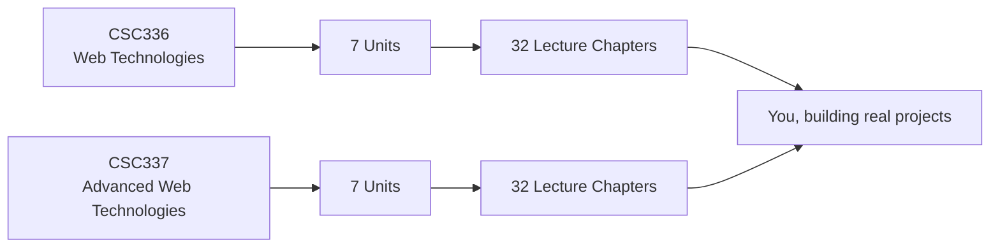

  <h1>The Web Dev Book</h1>
  

    A free, lecture-by-lecture online textbook built from the official COMSATS course plans
    for <strong>Web Technologies (CSC336)</strong> and
    <strong>Advanced Web Technologies (CSC337)</strong> — from your very first
    <code>&lt;h1&gt;</code> to shipping a production Next.js application on Vercel.
  

  

    CSC336 · SEMESTER 5
    <h3>Web Technologies</h3>
    

      Start here if you're new to web development. HTML, CSS, modern JavaScript, a
      server-side API with a database, and your first React app — 32 lectures, explained
      simply with plenty of examples.
    

    
  

  

    CSC337 · SEMESTER 6
    <h3>Advanced Web Technologies</h3>
    

      For students who've completed CSC336. Enterprise architecture, API design,
      authentication and OWASP security, caching and scalability, and production-grade
      Next.js — 32 lectures.
    

    
  

## How this book is organized

Each course is split into **7 units** (matching the official course description form), and
every unit is a group of **lectures** — one chapter per lecture, exactly as taught in class.

Every chapter follows the same shape, so you always know what to expect:

| Section | What you'll find there |
|---|---|
| **In this lecture** | A short preview of what you're about to learn and why it matters |
| **Explanation + examples** | Plain-language explanations with runnable code samples |
| **Diagrams** | Mermaid diagrams for architectures, flows, and sequences where a picture helps |
| **Try it yourself** | A small hands-on exercise to reinforce the lecture |
| **Key takeaways** | A quick recap you can revise from before a quiz or exam |

## Where to start

- **New to web development?** Begin at [Web Technologies → Lecture 1](web-technologies/lecture-01-introduction-to-web-development.md).
- **Finished CSC336 already?** Jump into [Advanced Web Technologies → Lecture 1](advanced-web-technologies/lecture-01-course-overview-and-enterprise-architecture.md).
- **Looking for a specific topic?** Use the search bar at the top of the page, or browse the [tag index](tags.md).

## Downloads, Demos, and Tutorials

  

    PDF · PRESENTATION-READY
    <h3>Lecture Slides</h3>
    

      Full slide decks for CSC336 Lectures 1–10, one slide per PDF page — use full-screen
      view for a proper presentation, or print them for offline study.
    

    
  

  

    STANDALONE · TOOL-FOCUSED
    <h3>Tutorials</h3>
    

      Self-contained, beginner-to-intermediate walkthroughs that sit alongside the lecture
      chapters — environment setup, layout patterns, Git and GitHub, and more.
    

    
  

  

    RUNNABLE · HTML/CSS/JS
    <h3>Demos</h3>
    

      A companion repository of small, self-contained demos and mini projects, one folder
      per topic, that go with these chapters — open <code>index.html</code> and run.
    

    
  

  

    CDF · LECTURE PLAN
    <h3>Course Documents</h3>
    

      Official CSC336 and CSC337 Course Description Forms and lecture-wise plan PDFs, plus
      legacy slide decks from earlier course offerings, kept here for reference.
    

    
  

