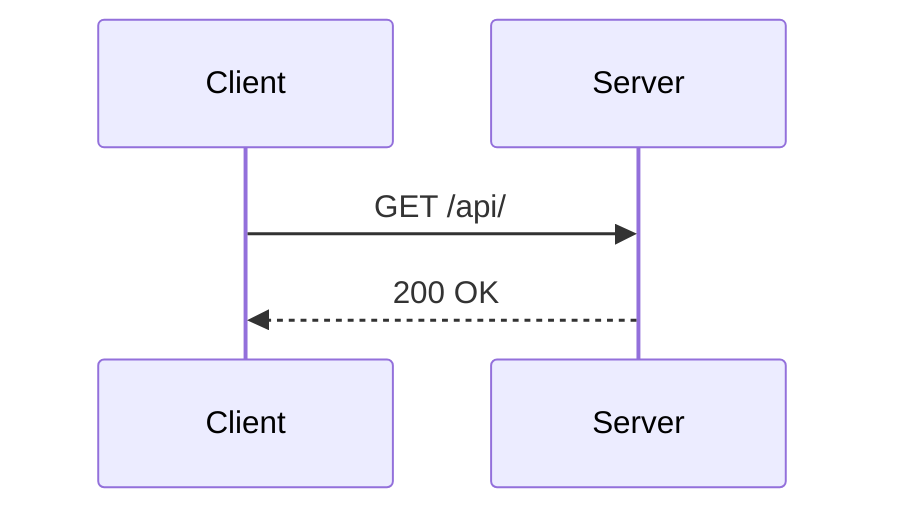

# Node & Express


## Node & Express


---

## What is Node.js?

- JavaScript runtime
- Non-blocking I/O
- Event-driven

---

## Basic Express App

```js
const express = require('express');
const app = express();

app.get('/', (req, res) => {
  res.send('Hello');
});
```

---

## Mermaid Example


