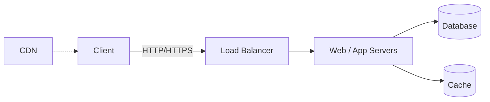

# Web Architecture

## Web Architecture

```mermaid
flowchart LR
    Browser[Client] -->|HTTP/HTTPS| LB[Load Balancer]
    LB --> Web[Web / App Servers]
    Web --> DB[(Database)]
    Web --> Cache[(Cache)]
    CDN[CDN] -.-> Browser
```

---

## Notes

- Use diagrams to explain how components interact.
