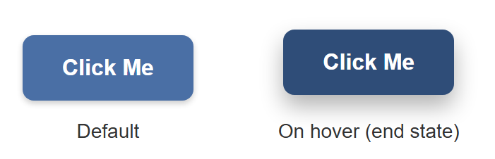
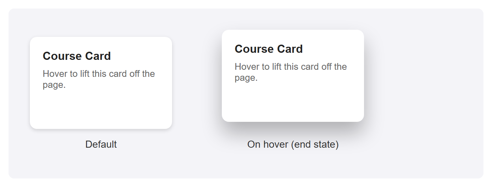
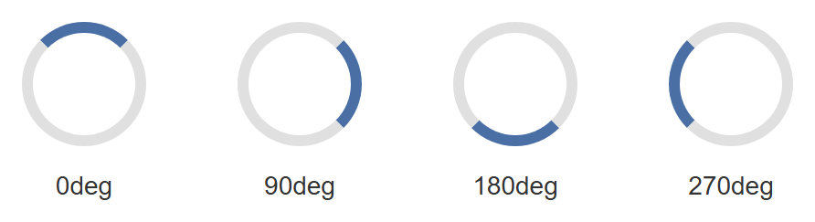
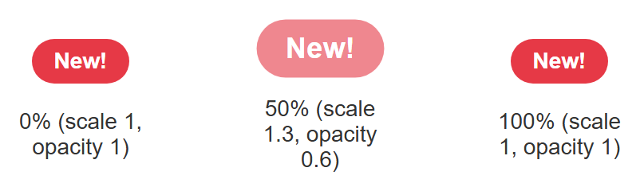

# Tutorial: CSS Transitions and Animations

Static pages feel static. The difference between a page that feels merely functional and
one that feels polished is almost always small, deliberate motion: a button that responds
when you hover over it, a card that lifts off the page, a spinner that tells you something
is loading. This tutorial builds five of these effects from scratch — a button, a card, a
loading spinner, a pulsing badge, and a fade-in entrance — so you come away able to build
your own.

**Prerequisites:** [Lecture 8: CSS3 Features](../web-technologies/lecture-08-css3-features.md),
which introduces transitions and `@keyframes` from the lecture's perspective. This tutorial
is the hands-on, project-style companion to that lecture — expect to write and run a lot
more CSS here than you read.

## In This Tutorial

- The real difference between a `transition` and an `animation`, and when to reach for each
- Every transition property (`transition-property`, `-duration`, `-timing-function`,
  `-delay`) and what the common timing functions actually feel like
- A hover button and a hover-lift card, built with transitions
- `@keyframes` syntax, and every animation property (`animation-name`, `-duration`,
  `-timing-function`, `-iteration-count`, `-direction`, `-fill-mode`, `-delay`)
- A loading spinner, a pulsing "New!" badge, and a fade-in-and-slide-up entrance effect
- Why some CSS properties animate more smoothly than others
- A one-sentence introduction to respecting `prefers-reduced-motion`

---

## Part 1: Transitions vs. Animations

CSS gives you two separate tools for movement, and it is worth being precise about the
difference before writing any code.

A **transition** smoothly interpolates ("fills in the in-between frames") between an
element's old value for a property and its new value, whenever that value changes for some
other reason — most commonly a `:hover`, a `:focus`, or a class being added or removed by
JavaScript. A transition never starts on its own; something else has to change the property
first.

An **animation**, defined with `@keyframes`, is a self-contained sequence of one or more
steps that can play automatically the moment the page loads, with no trigger required. It
can also repeat forever, run in reverse, and move through many intermediate steps instead of
just a start and an end.

| | Transition | Animation |
|---|---|---|
| Needs a trigger? | Yes — hover, focus, class toggle, etc. | No — can run on page load |
| Number of steps | Exactly two (old value, new value) | Any number, via `@keyframes` |
| Can it loop? | No | Yes (`animation-iteration-count: infinite`) |
| Typical use | Hover/focus feedback, small state changes | Spinners, badges, entrance effects |

!!! tip "Rule of thumb"
    If the motion only ever happens in response to something the user does, reach for a
    `transition`. If the motion should play by itself, or needs more than a start and an end
    state, reach for `@keyframes` and `animation`.

## Part 2: The Transition Properties

A transition is controlled by four separate properties, usually combined into one
shorthand.

```css
.box {
  transition-property: background-color, transform;
  transition-duration: 0.3s;
  transition-timing-function: ease;
  transition-delay: 0s;

  /* the same four values, as the shorthand: property | duration | timing-function | delay */
  transition: background-color 0.3s ease 0s, transform 0.3s ease 0s;
}
```

- **`transition-property`** — which CSS property (or properties, comma-separated) should
  animate. You can also write `all` to animate every property that changes, which is
  convenient but can make the browser do unnecessary work if several unrelated properties
  change at once.
- **`transition-duration`** — how long the transition takes, in seconds (`0.3s`) or
  milliseconds (`300ms`).
- **`transition-timing-function`** — the *pace* of the change over that duration (see
  below).
- **`transition-delay`** — how long to wait before the transition starts.

### Timing functions, in plain language

A timing function controls whether the transition moves at a constant speed or speeds up
and slows down along the way.

| Timing function | What it feels like |
|---|---|
| `linear` | Constant speed the whole way through — no speeding up or slowing down. |
| `ease` | Starts a little slow, speeds up in the middle, ends slow. The default, and usually the most natural-feeling choice. |
| `ease-in` | Starts slow, then accelerates and stays fast right up to the end. |
| `ease-out` | Starts fast, then decelerates smoothly into the end — good for something that should feel like it's settling into place. |
| `ease-in-out` | Slow to start, fast in the middle, slow to finish — a more pronounced version of `ease`. |

!!! note "Where do these numbers actually come from?"
    Under the hood, every one of these keywords is shorthand for a mathematical curve
    (`cubic-bezier(...)`) that maps time to progress. You do not need to understand the
    math to use them — just remember the plain-language behavior in the table above, and
    try a couple in a real browser if you want to feel the difference for yourself.

## Part 3: A Hover Button, Built with a Transition

Here is a complete, practical transition: a button that changes background color and lifts
slightly when the user hovers over it.

```css
.hover-button {
  padding: 14px 28px;
  font-size: 16px;
  font-weight: bold;
  color: white;
  background-color: #4a6fa5;
  border: none;
  border-radius: 8px;
  box-shadow: 0 2px 4px rgba(0, 0, 0, 0.2);
  cursor: pointer;
  transition: background-color 0.25s ease, transform 0.25s ease, box-shadow 0.25s ease;
}

.hover-button:hover {
  background-color: #2f4d78;
  box-shadow: 0 8px 16px rgba(0, 0, 0, 0.3);
  transform: translateY(-4px);
}
```

Every property named in `transition-property` (background-color, transform, box-shadow)
animates smoothly the instant `:hover` applies the new values — and, just as importantly,
animates smoothly back the instant the mouse leaves. `transform: translateY(-4px)` moves the
button up by 4 pixels; a negative Y value moves an element *up*, since Y increases downward
in CSS.

A still image cannot show the smooth motion in between — that part you have to see by
actually hovering the button in a browser — but it can honestly show the two endpoints the
transition moves between: the button at rest, and the `:hover` styles applied directly as
the end state.



## Part 4: A Card Hover-Lift, Built the Same Way

The exact same technique — a `transition` on `transform` and `box-shadow`, triggered by
`:hover` — works on any element, not just buttons. Here it is applied to a card:

```css
.hover-card {
  width: 200px;
  padding: 18px;
  background: white;
  border-radius: 10px;
  box-shadow: 0 2px 6px rgba(0, 0, 0, 0.15);
  transition: transform 0.25s ease, box-shadow 0.25s ease;
}

.hover-card:hover {
  box-shadow: 0 16px 28px rgba(0, 0, 0, 0.28);
  transform: translateY(-10px);
}
```

Again, the default card next to its `:hover` end state — a bigger lift than the button
above, paired with a noticeably larger, softer shadow, which is what sells the illusion that
the card has physically risen off the page:



!!! tip "Why transform and not top/margin?"
    You could move the card up with `margin-top: -10px` or `top: -10px` instead of
    `transform: translateY(-10px)` — but you shouldn't. Part 10 explains why `transform` is
    the better choice for anything animated.

## Part 5: @keyframes Syntax

A transition only ever has two states: old and new. The moment you need more than that —
multiple steps, or something that should play automatically instead of waiting for a
`:hover` — you need `@keyframes`.

A `@keyframes` rule defines a name, and then describes what the animated element should look
like at various points along the animation's timeline, as percentages from `0%` (the very
start) to `100%` (the very end):

```css
@keyframes bounce {
  0%   { transform: translateY(0); }
  50%  { transform: translateY(-20px); }
  100% { transform: translateY(0); }
}
```

If your animation only has a start and an end state (no steps in between), you can write
`from` and `to` instead, which is just a more readable alias for `0%` and `100%`:

```css
@keyframes fade-in {
  from { opacity: 0; }
  to   { opacity: 1; }
}
```

Defining `@keyframes` on its own does nothing yet — it is just a named recipe sitting in
your stylesheet. You attach it to an element with the `animation` property, covered next.

## Part 6: The Animation Properties

Once you have a named `@keyframes` rule, you play it on an element with these properties:

```css
.ball {
  animation-name: bounce;
  animation-duration: 1s;
  animation-timing-function: ease-in-out;
  animation-iteration-count: infinite;
  animation-direction: alternate;
  animation-fill-mode: forwards;
  animation-delay: 0.5s;

  /* the same values, as the shorthand:
     name | duration | timing-function | delay | iteration-count | direction | fill-mode */
  animation: bounce 1s ease-in-out 0.5s infinite alternate forwards;
}
```

- **`animation-name`** — which `@keyframes` rule to play (must match its name exactly).
- **`animation-duration`** — how long one full pass through the keyframes takes.
- **`animation-timing-function`** — the same pacing keywords from Part 2 (`linear`, `ease`,
  `ease-in-out`, and so on), applied to the animation instead of a transition.
- **`animation-iteration-count`** — how many times to play it: a number like `3`, or
  `infinite` to loop forever.
- **`animation-direction`** — which way to play the keyframes on each pass:
    - `normal` — always 0% to 100% (the default).
    - `reverse` — always 100% to 0%.
    - `alternate` — forwards on the first pass, backwards on the second, forwards on the
      third, and so on — this is what makes a looping animation feel like it bounces back
      and forth instead of snapping back to the start every cycle.
- **`animation-fill-mode`** — what the element looks like *before* the animation starts and
  *after* it ends, outside the `0%`–`100%` window: `none` (the default; the element uses its
  own regular CSS the instant the animation isn't actively running), `forwards` (keep the
  styles from the last keyframe once it finishes), `backwards` (apply the first keyframe's
  styles immediately, even during `animation-delay`, instead of showing the element's normal
  styles while it waits), or `both` (apply both rules).
- **`animation-delay`** — how long to wait before starting.

!!! warning "Shorthand order for animation vs. transition"
    Notice the `animation` shorthand lists more values than `transition`, and in a different
    order (delay comes before iteration-count and direction). There's no way around
    memorizing this — or, more practically, writing the longhand properties out while you're
    still learning, and only compressing to the shorthand once you're comfortable.

## Part 7: A Loading Spinner

A loading spinner is a circle whose border is one color, except for one segment which is a
different, contrasting color — then it spins forever.

```css
.spinner {
  width: 40px;
  height: 40px;
  border: 6px solid #e0e0e0;
  border-top-color: #4a6fa5;
  border-radius: 50%;
  animation: spin 1s linear infinite;
}

@keyframes spin {
  from { transform: rotate(0deg); }
  to   { transform: rotate(360deg); }
}
```

`border-top-color` overrides just the top edge of the border to a different color than the
other three edges, which is what creates the illusion of a moving segment once the whole
circle starts rotating. `linear` is essential here — a spinner that sped up and slowed down
on every rotation would look broken, not smooth.

A screenshot cannot capture something mid-spin — by definition, a single frame of a rotating
element looks identical to that same element sitting still at some angle. What it *can* show
honestly is several fixed rotation angles side by side, each applied directly with
`transform: rotate(...)` instead of through the running animation, to represent points along
one full spin:



## Part 8: A Pulsing "New!" Badge

The same `@keyframes` approach can drive far more than a spinner. Here, a small badge scales
up and fades slightly, then returns to normal, in an endless loop — a common way to draw a
little attention to a "new" label without being obnoxious about it.

```css
.badge {
  display: inline-block;
  background-color: #e63946;
  color: white;
  font-weight: bold;
  padding: 6px 14px;
  border-radius: 999px;
  animation: pulse 1.6s ease-in-out infinite;
}

@keyframes pulse {
  0%   { transform: scale(1);   opacity: 1;   }
  50%  { transform: scale(1.3); opacity: 0.6; }
  100% { transform: scale(1);   opacity: 1;   }
}
```

Notice this `@keyframes` rule has three steps, not two — something a `transition` could
never express on its own, since a transition only ever knows about "old value" and "new
value." Again, shown as three static frames rather than a claim of real motion:



## Part 9: A Fade-In-and-Slide-Up Entrance

This last pattern is one you have almost certainly seen: content that eases into view when
a page first loads, fading in while sliding up slightly from below its final position.

```css
.entrance {
  animation: fade-in-up 0.6s ease-out forwards;
}

@keyframes fade-in-up {
  from {
    opacity: 0;
    transform: translateY(20px);
  }
  to {
    opacity: 1;
    transform: translateY(0);
  }
}
```

`animation-fill-mode: forwards` (folded into the shorthand above) matters here: without it,
the instant the animation finished, the element would snap back to whatever `opacity` and
`transform` its normal CSS specifies — which, if you never set them elsewhere, means popping
back to fully invisible. `forwards` tells the browser to keep the styles from the `to` step
once the animation ends.

An element sitting at true `opacity: 0` would, of course, be completely invisible in a
screenshot — so the "before" frame below is rendered at a low but nonzero opacity purely so
you can see its starting position and size; the actual animation really does start from
`opacity: 0`.


## Part 10: Performance — Prefer transform and opacity

Not every CSS property is equally cheap to animate. Properties like `width`, `height`,
`top`, `left`, and `margin` change an element's position or size within the page's layout —
so on every single frame of the animation, the browser has to redo **layout** (recalculating
where every affected element on the page belongs) before it can even draw anything.

`transform` and `opacity`, by contrast, do not affect layout at all. Translating, scaling, or
rotating an element with `transform`, or fading it with `opacity`, only changes how that
element is drawn on top of the layout the browser already calculated — a much cheaper
operation that, on modern browsers, can often be handed off to the GPU entirely.

This is exactly why every example in this tutorial animates `transform` and `box-shadow` /
`opacity`, and never `top`, `left`, `width`, or `margin`. A button that lifts with
`transform: translateY(-4px)` looks identical to one that lifts with `margin-top: -4px` — but
the `transform` version stays smooth on slower devices and complex pages, while the
`margin` version is more likely to visibly stutter.

!!! tip "The practical rule"
    If you can express a hover or animation effect using only `transform` and `opacity`,
    prefer that over any property that would otherwise sit in the box model (`width`,
    `height`, `top`, `left`, `margin`, `padding`).

## Part 11: Accessibility — Respecting prefers-reduced-motion

Not every visitor wants motion on their screen. Some people experience real discomfort —
dizziness, nausea, headaches — from animated interfaces, often due to vestibular disorders.
Operating systems let users declare this preference once, system-wide, and browsers expose
it to CSS as a media feature: `prefers-reduced-motion`.

A real project should wrap its non-essential animations in a check for this preference, so
that visitors who have asked their system for reduced motion get a calmer, largely static
version of the page instead of every spinner, badge, and entrance effect running at full
force. You do not need new code to see this in practice — some of this book's other CSS
projects already do exactly this, and are worth revisiting with this concept in mind once
you have finished this tutorial.

!!! note "Not just a courtesy"
    For some visitors, `prefers-reduced-motion` is closer to an accessibility requirement
    than a nice-to-have. Treat it the same way you would treat providing `alt` text for
    images: a small, cheap addition that matters a great deal to the people who need it.

## Try It Yourself

1. Take the hover button from Part 3 and change its `transition-timing-function` from
   `ease` to `linear`, then to `ease-in`. Hover it in a real browser after each change and
   notice how differently the motion feels, even though the start and end states never
   change.
2. Add a fourth property to the hover card's `transition-property` list —
   `border-radius` — and change `border-radius` in the `:hover` rule to a different value.
   Confirm the corner rounding itself now animates smoothly along with the lift.
3. Change the spinner's `animation-direction` to `alternate` and its `animation-iteration-count`
   to `4`. Watch it spin forward, then backward, then forward again, four times total,
   instead of spinning in one direction forever.
4. Change the pulsing badge's `@keyframes` to add a fourth step at `75%` that shifts its
   `background-color` to a different value, in addition to the existing `scale`/`opacity`
   changes.
5. Change the fade-in-and-slide-up animation's `transform: translateY(20px)` starting value
   to `translateX(-40px)` instead, so the content slides in from the left rather than from
   below.

## Key Takeaways

- A `transition` smoothly interpolates between two states and needs a trigger (`:hover`,
  `:focus`, a class toggle); an `animation` via `@keyframes` is self-contained, can run
  automatically, can loop, and can have any number of steps.
- The four transition properties are `transition-property`, `transition-duration`,
  `transition-timing-function`, and `transition-delay`, usually combined into the
  `transition` shorthand.
- Timing functions control pacing, not distance: `linear` is constant speed; `ease`,
  `ease-in`, `ease-out`, and `ease-in-out` all start and/or end slower than they move in the
  middle, in different combinations.
- `@keyframes` names a sequence of steps as percentages (or `from`/`to`); `animation-name`,
  `animation-duration`, `animation-timing-function`, `animation-iteration-count`,
  `animation-direction`, `animation-fill-mode`, and `animation-delay` control how it plays,
  usually combined into the `animation` shorthand.
- `animation-iteration-count: infinite` loops forever; `animation-direction: alternate`
  makes each loop reverse direction instead of snapping back to the start;
  `animation-fill-mode: forwards` keeps the animation's final styles once it ends.
- Prefer animating `transform` and `opacity` over layout-affecting properties like `width`,
  `height`, `top`, `left`, and `margin` — the former don't force the browser to recompute
  page layout on every frame.
- Respect `prefers-reduced-motion` in real projects, so visitors who are sensitive to motion
  get a calmer version of the page.
