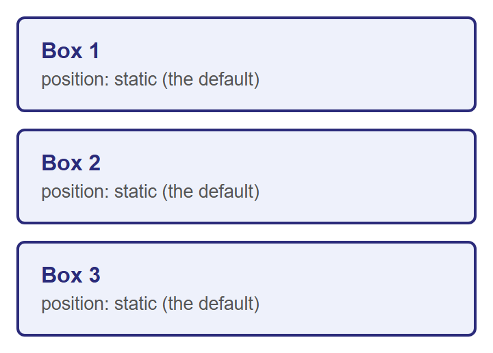
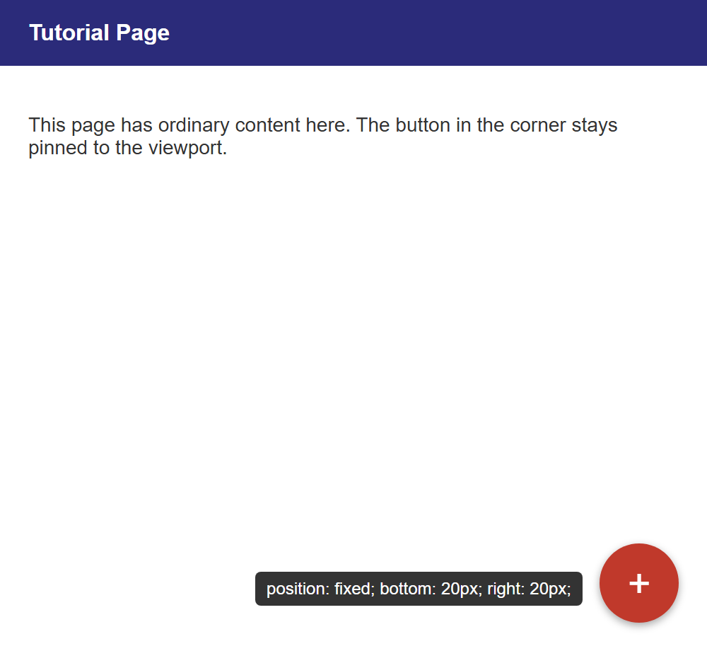
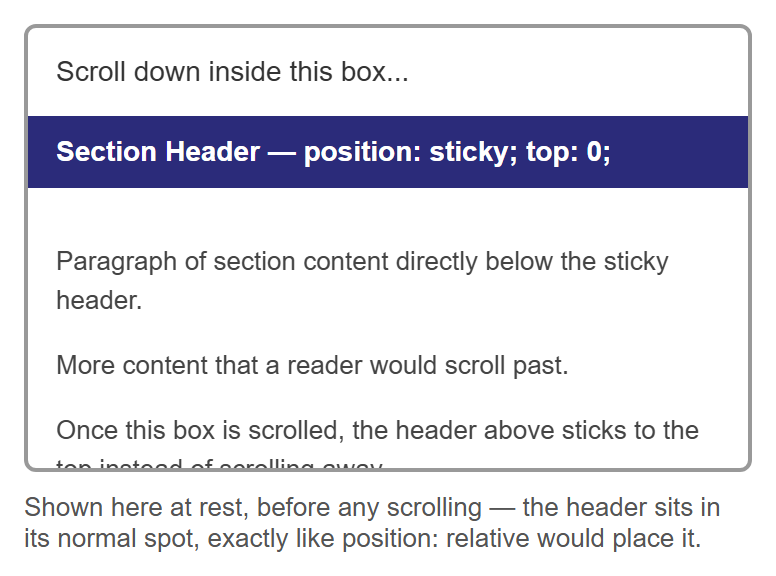
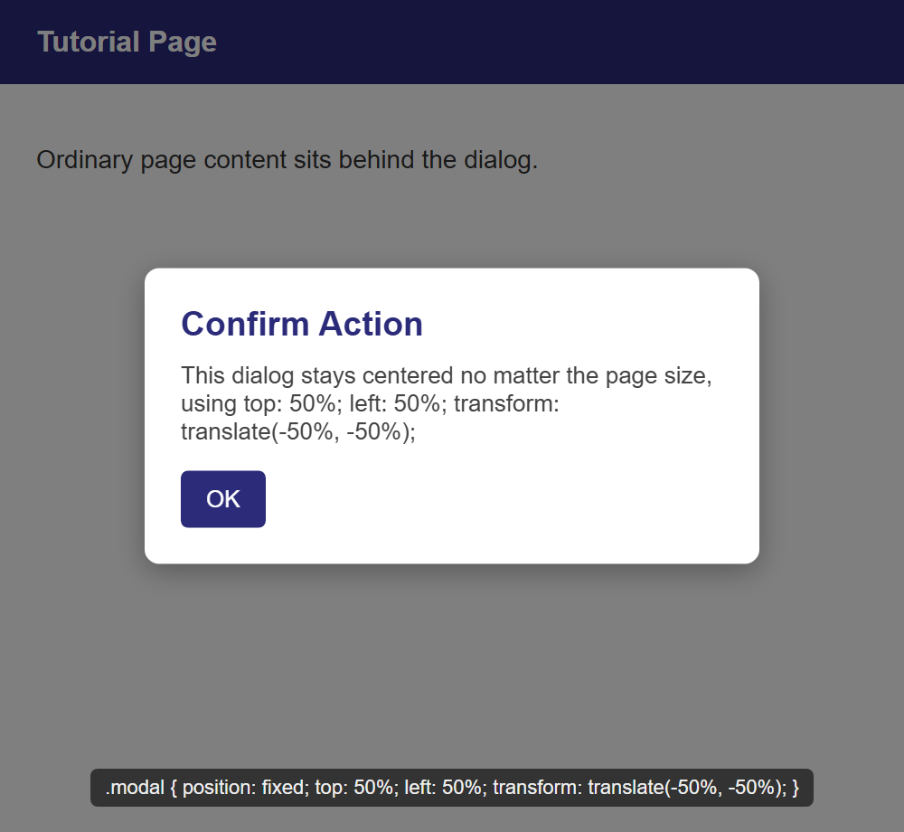

# Tutorial: CSS Positioning

Every layout technique you have used so far — normal block and inline flow, `float` — leaves
elements roughly where the document's structure puts them. CSS's `position` property is
different: it lets you take an element out of that structure and place it exactly where you
want, relative to different reference points. This tutorial covers all five values of
`position` (`static`, `relative`, `absolute`, `fixed`, and `sticky`), the `z-index` property
that controls which overlapping element renders on top, and two real-world UI patterns —
tooltips and modal dialogs — built entirely from these tools.

**Prerequisites:** [CSS Fundamentals](../web-technologies/lecture-05-css-fundamentals.md) and
[the CSS Box Model](../web-technologies/lecture-06-css-box-model-and-display.md).

## In This Tutorial

- Normal document flow, and `position: static` as its formal name
- `position: relative` — shifting an element while its original space stays reserved
- `position: absolute` — removing an element from flow, anchored to a positioned ancestor
- `position: fixed` — anchored to the viewport, ignoring scrolling
- `position: sticky` — a hybrid of `relative` and `fixed`
- `z-index` and stacking order for overlapping positioned elements
- Two complete patterns: a hover tooltip and a centered modal dialog

---

## Part 1: Normal Flow and position: static

Every element you have styled so far — paragraphs, headings, floated columns, list items —
has been placed by the browser's **normal document flow**: block-level elements stack
top to bottom in source order, inline elements flow left to right within a line, and nothing
overlaps unless you specifically pull an element out of that flow (as `float` does).

Formally, this default placement has a name: `position: static`. Every element starts out
`static` unless you say otherwise, and a `static` element ignores the `top`, `right`,
`bottom`, and `left` properties entirely — they simply have no effect on it.

```css
.box {
  position: static; /* the default — you rarely write this explicitly */
}
```

Here are three ordinary boxes with no positioning applied — this is the baseline everything
else in this tutorial is compared against:



The other four values of `position` — `relative`, `absolute`, `fixed`, and `sticky` — are
collectively called **positioned elements**. That label matters later: `z-index` and the
"nearest positioned ancestor" rule for `absolute` both only care whether an element is
positioned (anything but `static`), not which specific value it uses.

## Part 2: position: relative

`position: relative` shifts an element from the spot normal flow would have given it, using
the `top`, `right`, `bottom`, and `left` properties — but critically, the space that element
originally occupied is **still reserved** for it. Nothing else moves to fill the gap.

```css
.box-2 {
  position: relative;
  top: 20px;
  left: 40px;
}
```

`top: 20px` pushes the element 20px down from where it would normally sit, and `left: 40px`
pushes it 40px to the right. (Think of `top`/`left`/`right`/`bottom` here as "push away from
this edge," not "move toward it.")


Box 3 is still exactly where it would be if Box 2 had never moved — proof that Box 2's
original space in the flow is untouched. Only Box 2's own rendered position changed.

!!! note "The most important side effect of position: relative"
    Giving an element `position: relative` — even with no `top`/`left`/`right`/`bottom` at
    all — does something else that matters enormously for the next section: it makes that
    element a **positioning context** for any `absolute`-positioned children inside it. You
    will see exactly why in Part 3.

## Part 3: position: absolute

`position: absolute` is a much bigger change than `relative`: the element is removed from
normal document flow **entirely**. Nothing reserves space for it anymore, and it no longer
affects the size or layout of its parent at all — as far as everyone else on the page is
concerned, it is not there. It is then placed using `top`/`right`/`bottom`/`left`, measured
from the edges of its **nearest positioned ancestor** — the closest ancestor element whose
`position` is anything other than `static`. If no ancestor is positioned, it falls all the
way back to being placed relative to the page itself.

This is exactly why the note at the end of Part 2 mattered: giving a container
`position: relative` (even with no offsets of its own) is the standard way to "claim" it as
the positioning context for an absolutely positioned element inside it. This combination —
a `relative` parent with an `absolute` child — is one of the most common patterns in CSS,
and it's the basis of the classic "badge pinned to a card's corner" component:

```css
.card {
  position: relative; /* becomes the positioning context */
  /* ...width, padding, border, etc... */
}

.badge {
  position: absolute;
  top: -10px;
  right: -10px;
  /* ...background, color, border-radius, etc... */
}
```


Both cards use the exact same `.badge` CSS. The only difference is whether `.card` itself is
positioned. On the left, `.card { position: relative; }` makes the card the badge's nearest
positioned ancestor, so `top: -10px; right: -10px;` places the badge just outside the card's
own corner. On the right, `.card` has no `position` set, so the browser keeps looking up the
ancestor chain, finds nothing positioned, and falls back to the page itself — the badge ends
up pinned to the corner of the entire page instead of the card.

!!! tip "Rule of thumb"
    Whenever you use `position: absolute` on an element, immediately ask: "what should this
    be positioned relative to?" — then make sure that ancestor has `position: relative` (or
    any non-`static` value). Forgetting this step is the single most common `absolute`
    positioning bug.

## Part 4: position: fixed

`position: fixed` also removes an element from normal flow, but instead of anchoring to a
positioned ancestor, it always anchors to the **viewport** — the visible browser window
itself. A fixed element stays glued in the same spot on screen even while the rest of the
page scrolls underneath it. This is the technique behind floating action buttons, "back to
top" buttons, and navigation bars that stay visible as you scroll.

```css
.fab {
  position: fixed;
  bottom: 20px;
  right: 20px;
}
```



This screenshot only shows the button **at rest**. The entire point of `position: fixed` —
that it stays pinned to that same corner while you scroll the rest of the page — cannot be
demonstrated in a still image. You need to open this in a real browser, add enough content
to make the page scroll, and watch the button stay put while everything else moves past it.

## Part 5: position: sticky

`position: sticky` is a hybrid of `relative` and `fixed`. A sticky element behaves like a
normal, `relative`-positioned element — sitting in its regular place in the flow — **until**
the page (or its scrolling container) scrolls past a threshold you define with `top`,
`bottom`, `left`, or `right`. At that point, it switches to behaving like `fixed`, sticking
in place, until its container scrolls out of view entirely and takes it along.

```css
.sticky-header {
  position: sticky;
  top: 0; /* sticks once its top edge reaches the top of its scrolling container */
}
```



Just like `position: fixed` in Part 4, a still image can only show the "before" state — the
header sitting in its ordinary spot, exactly where `position: relative` would put it. The
actual sticking behavior only appears once you scroll this box in a real browser and watch
the header lock to the top of it instead of scrolling away with the rest of the content.

## Part 6: z-index and Stacking Order

When positioned elements overlap — as the badge and card did in Part 3 — the browser needs
a rule for which one renders on top. By default, later elements in the HTML source render
on top of earlier ones. The `z-index` property lets you override that: it takes a plain
number, and **higher values render on top of lower ones**.

`z-index` has one important restriction worth memorizing: **it only has any effect on
positioned elements** — anything with a `position` other than `static`. Setting `z-index` on
a `static` element does nothing at all, no matter how large the number is.

```css
.behind {
  position: relative;
  z-index: 1;
}

.in-front {
  position: relative;
  z-index: 2; /* higher value — renders on top of .behind */
}
```


The gray box proves the restriction: it has the highest `z-index` value of the three (`99`),
but because it is still `position: static`, that `z-index` is completely ignored, and it
stays at the back of the stack. Between the two positioned boxes, the higher `z-index` (red,
`2`) wins over the lower one (blue, `1`), regardless of which one appears later in the HTML.

!!! note "Stacking contexts"
    In more advanced layouts, `z-index` values are only compared *within the same stacking
    context* — certain CSS properties (like `opacity` less than 1, or `transform`) cause an
    element to start a brand-new stacking context for its children, so a child's `z-index`
    is only ever compared against its own siblings, never against elements outside that
    context. You don't need to master this to use `z-index` correctly day-to-day — just know
    the term exists if you ever see a `z-index` that "should" win but doesn't.

## Part 7: Real-World Patterns

### Pattern A: A Tooltip with position: absolute

A tooltip is small text that appears near a trigger element — typically on hover — and is a
direct application of the `relative` parent / `absolute` child pattern from Part 3.

```html
<div class="tooltip-wrapper">
  <span class="tooltip">Position: absolute; bottom: 125%;</span>
  <button class="trigger">Hover me</button>
</div>
```

```css
.tooltip-wrapper {
  position: relative;    /* the positioning context for .tooltip */
  display: inline-block;
}

.tooltip {
  position: absolute;
  bottom: 125%;           /* just above the trigger, with a small gap */
  left: 50%;
  transform: translateX(-50%); /* re-center it, since left: 50% alone only aligns its own left edge */
  opacity: 0;
  pointer-events: none;
}

.tooltip-wrapper:hover .tooltip {
  opacity: 1;             /* reveal on hover */
}
```


`bottom: 125%` positions the tooltip's bottom edge at 125% of `.tooltip-wrapper`'s height
above its top — comfortably clear of the button, with a small gap. `left: 50%` alone would
only align the tooltip's own *left edge* to the wrapper's horizontal center, which is not the
same as centering the whole tooltip — `transform: translateX(-50%)` shifts the tooltip back
by half of its own width to finish the job. In the real page, `.tooltip` starts at
`opacity: 0` and only becomes visible on `:hover`; this screenshot forces it visible so it
can be shown at all, since a still image cannot capture a mouse hovering over the button.

### Pattern B: A Centered Modal Dialog with position: fixed

A modal (or overlay dialog) needs two pieces: a dimmed backdrop covering the whole page, and
a dialog box centered on top of it — both anchored to the viewport with `position: fixed` so
they stay centered regardless of scrolling or page size.

```html
<div class="overlay"></div>
<div class="modal">
  <h3>Confirm Action</h3>
  <p>Are you sure you want to continue?</p>
  <button>OK</button>
</div>
```

```css
.overlay {
  position: fixed;
  top: 0;
  left: 0;
  right: 0;
  bottom: 0;
  background: rgba(0, 0, 0, 0.5); /* dims the page behind the dialog */
}

.modal {
  position: fixed;
  top: 50%;
  left: 50%;
  transform: translate(-50%, -50%);
  /* ...width, background, padding, border-radius... */
}
```



`top: 0; left: 0; right: 0; bottom: 0;` on `.overlay` is a compact way of stretching a fixed
element to fill the entire viewport without knowing its size in advance. The `.modal`
centering trick is worth memorizing on its own: `top: 50%; left: 50%;` moves the dialog's
**top-left corner** to the exact center of the viewport, and
`transform: translate(-50%, -50%)` then shifts the whole box back by half of *its own* width
and height — centering it perfectly without ever needing to know the dialog's dimensions
ahead of time. This is the standard technique for centering anything whose size isn't fixed.

## Try It Yourself

1. Take the three-box example from Part 2 and change `.box-2`'s offsets to
   `top: -20px; left: -40px;` (negative values). Confirm it now shifts up and to the left
   instead, overlapping Box 1 rather than Box 3 — while Box 1 and Box 3 still don't move.
2. In the badge-and-card example from Part 3, remove `position: relative;` from `.card`
   entirely and confirm the badge escapes to the corner of the page, exactly like the
   right-hand card in the screenshot. Then add it back and watch the badge snap back to the
   card's own corner.
3. Build the floating action button from Part 4 in a real HTML file with enough paragraph
   content to make the page taller than the browser window, then scroll and confirm the
   button stays fixed in the corner the entire time.
4. In the tooltip pattern, change `bottom: 125%;` to `top: 125%;` (and remove `bottom`) so
   the tooltip appears *below* the button instead of above it. Adjust the little pointer
   triangle's `border` properties so it points upward at the button instead of downward.
5. In the z-index example from Part 6, change the gray box's `position` from `static` to
   `relative` (keep `z-index: 99`) and confirm it now correctly jumps in front of both the
   blue and red boxes — proving `z-index` only needed a `position` value other than `static`
   to start working.

## Key Takeaways

- `position: static` is the default — normal document flow, with `top`/`right`/`bottom`/
  `left` having no effect.
- `position: relative` shifts an element from its normal spot using `top`/`right`/`bottom`/
  `left`, but its original space in the flow stays reserved — nothing else moves to fill it.
  It also makes the element a positioning context for `absolute` children inside it.
- `position: absolute` removes an element from flow entirely and positions it relative to
  its nearest positioned ancestor (any ancestor with `position` other than `static`), or the
  page itself if there is none.
- `position: fixed` anchors an element to the viewport — it stays in place while the page
  scrolls.
- `position: sticky` behaves like `relative` until a scroll threshold is crossed, then
  behaves like `fixed`.
- `z-index` controls stacking order among overlapping elements, with higher values on top —
  but it only has any effect on positioned elements (anything but `static`).
- `relative` parent + `absolute` child is the standard pattern behind badges, tooltips, and
  countless other UI components; `fixed` plus
  `top: 50%; left: 50%; transform: translate(-50%, -50%);` is the standard pattern for
  centering an element of unknown size, such as a modal dialog.
