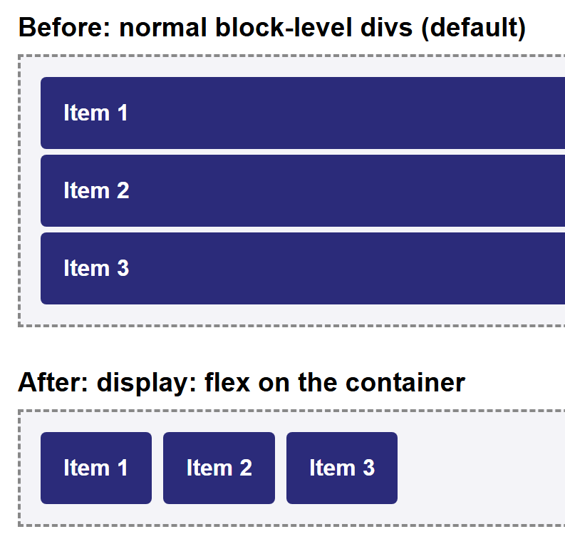
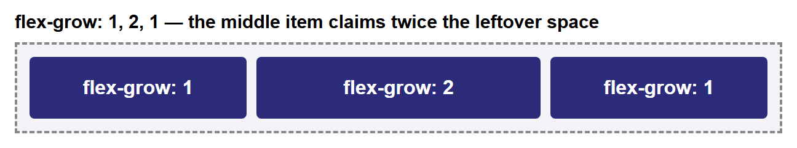
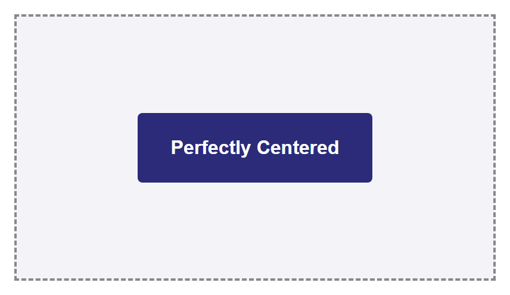

# Tutorial: Flexbox Layout

Flexbox (short for the "Flexible Box" module) is a CSS layout system designed to arrange
items along a single line — either a row or a column — and distribute space between them
automatically. It replaced the `float`-based techniques from the
[Layout Designing](layout-designing.md) tutorial for the vast majority of everyday
layout problems: navigation bars, centering content, evenly spaced cards, and more, all
without the collapsing-parent workarounds that floats require. This tutorial builds up
every core Flexbox property from scratch, with a rendered screenshot for each one, and
ends with two complete real-world layout patterns.

**Prerequisites:** [the CSS Box Model](../web-technologies/lecture-06-css-box-model-and-display.md).
Familiarity with the `float` technique in [Layout Designing](layout-designing.md) is
helpful for context but not required.

## In This Tutorial

- What Flexbox is, and why it replaced `float` for most layout tasks
- `display: flex` and the two axes every flex container has: the main axis and the cross
  axis
- `flex-direction` — choosing whether the main axis runs as a row or a column
- `justify-content` — aligning items along the main axis
- `align-items` — aligning items along the cross axis
- `flex-wrap` — letting items flow onto multiple lines instead of overflowing or shrinking
- `gap` — spacing between items without per-item margins
- `flex-grow`, `flex-shrink`, `flex-basis`, and the `flex` shorthand — controlling how
  items grow and shrink to fill available space
- `align-self` — overriding the cross-axis alignment for a single item
- Two real-world patterns: a left-logo/right-links navbar, and perfect centering

---

## Part 1: What Flexbox Is, and Why It Exists

Flexbox is a **one-dimensional** layout system: at any given moment, it arranges a
group of items along a single line, either a row or a column. (CSS Grid, covered
elsewhere, is the **two-dimensional** counterpart — rows and columns at the same time.)

Before Flexbox existed, developers reached for `float` to build side-by-side layouts, as
shown in [Layout Designing](layout-designing.md). That technique works, but it comes
with real costs:

- Floated elements are pulled out of normal document flow, so their parent's height
  **collapses** unless you remember to add `overflow: hidden` (the "clearfix").
- Centering something both horizontally and vertically inside its container is
  notoriously awkward with `float` and requires fragile tricks (fixed widths, negative
  margins, absolute positioning).
- Distributing leftover space evenly between items — for example, spreading three nav
  links out so they touch both edges of the bar — has no direct `float` equivalent.

Flexbox was designed specifically to solve these problems. You opt an element into it
with one line of CSS, and its direct children immediately become easy to align, space
out, reorder, and resize — no clearfixes required.

## Part 2: display: flex and the Two Axes

Turning any element into a **flex container** takes one declaration:

```css
.container {
  display: flex;
}
```

The moment you do this, every direct child of `.container` becomes a **flex item**, and
two things change immediately, even with no other CSS added:

- Flex items line up in a **row**, left to right, instead of stacking vertically like
  normal block-level elements.
- Flex items shrink to only as wide as their content needs, instead of each filling the
  full available width.

```html
<div class="container">
  <div class="box">Item 1</div>
  <div class="box">Item 2</div>
  <div class="box">Item 3</div>
</div>
```

Here is the same three `<div>`s before and after adding `display: flex` to their parent.



Every other property in this tutorial only makes sense once you understand that a flex
container has **two axes**:

- The **main axis** — the direction items are laid out along (a row, by default).
- The **cross axis** — the direction perpendicular to the main axis.

Which physical direction (horizontal or vertical) each axis points in depends entirely
on one property: `flex-direction`, covered next.

## Part 3: flex-direction

`flex-direction` sets which way the main axis runs, and therefore which way items are
laid out:

```css
.container {
  display: flex;
  flex-direction: row; /* default */
}
```

| Value | Main axis direction | Items laid out |
|---|---|---|
| `row` (default) | Left to right | Horizontally, in source order |
| `row-reverse` | Right to left | Horizontally, reversed |
| `column` | Top to bottom | Vertically, in source order |
| `column-reverse` | Bottom to top | Vertically, reversed |

```css
.row-example    { flex-direction: row; }
.reverse-example { flex-direction: row-reverse; }
.column-example { flex-direction: column; }
```

Note that `row-reverse` and `column-reverse` only reverse the **visual order** — the
underlying HTML source order (and so tab order, and screen-reader order) is unchanged.


!!! note "Main axis vs. cross axis, revisited"
    When `flex-direction` is `row` or `row-reverse`, the main axis is horizontal and the
    cross axis is vertical. When it's `column` or `column-reverse`, that flips: the main
    axis is vertical and the cross axis is horizontal. Keep this in mind for the next
    two sections — `justify-content` always aligns along the main axis, and
    `align-items` always aligns along the cross axis, whichever direction that
    currently is.

## Part 4: justify-content (Main-Axis Alignment)

`justify-content` controls how items are spaced out along the **main axis** — by
default, the horizontal direction, since `flex-direction: row` is the default.

```css
.container {
  display: flex;
  justify-content: center;
}
```

| Value | Effect |
|---|---|
| `flex-start` (default) | Items packed at the start of the main axis |
| `flex-end` | Items packed at the end of the main axis |
| `center` | Items packed together in the center |
| `space-between` | Equal space *between* items; first and last items touch the edges |
| `space-around` | Equal space *around* each item (edges get half as much space as gaps between items) |
| `space-evenly` | Perfectly equal space between and around every item, edges included |


`space-between` is the value you'll reach for most often in practice — it's exactly what
a navbar with a logo on one side and links on the other needs, as you'll see in Part 10.

## Part 5: align-items (Cross-Axis Alignment)

`align-items` controls how items are aligned along the **cross axis** — by default, the
vertical direction. This is the property that makes vertical centering trivial, which
was one of the hardest things to do with `float`.

```css
.container {
  display: flex;
  align-items: center;
}
```

| Value | Effect |
|---|---|
| `stretch` (default) | Items stretch to fill the container's cross-axis size |
| `flex-start` | Items aligned to the start of the cross axis |
| `flex-end` | Items aligned to the end of the cross axis |
| `center` | Items centered on the cross axis |
| `baseline` | Items aligned so their text baselines line up |

The difference between these only becomes visible when items have different sizes
(otherwise there's nothing to align differently), so the screenshot below uses items of
different heights — and, for `baseline`, items with different font sizes:


`baseline` is a niche value — you'll use `stretch`, `center`, and `flex-start` far more
often — but it's worth recognizing: it aligns by where the *text* sits, not by the
box edges, which is why the boxes in that row don't line up at their tops or bottoms at
all.

## Part 6: flex-wrap

By default, a flex container tries to fit **all** of its items onto a single line along
the main axis. If there isn't enough room, items shrink (down to their content's minimum
size) or, once they can't shrink any further, they overflow the container. `flex-wrap`
changes that behavior:

```css
.container {
  display: flex;
  flex-wrap: wrap;
}
```

| Value | Effect |
|---|---|
| `nowrap` (default) | All items forced onto one line; they shrink, and may overflow |
| `wrap` | Items that no longer fit flow onto a new line instead |

```html
<div class="container">
  <div class="box">Item 1</div>
  <div class="box">Item 2</div>
  <div class="box">Item 3</div>
  <div class="box">Item 4</div>
  <div class="box">Item 5</div>
</div>
```

```css
.box {
  min-width: 100px; /* prevents items from shrinking past a readable width */
}
```


In the `nowrap` panel, the items can't shrink past their `min-width`, so they overflow
the dashed container border entirely — a common surprise for beginners who forget that
`nowrap` is the default. Adding `flex-wrap: wrap` is usually the fix.

!!! tip "flex-flow shorthand"
    `flex-direction` and `flex-wrap` are so often set together that CSS provides a
    shorthand: `flex-flow: row wrap;` sets both in one declaration, in that order.

## Part 7: gap

Before `gap`, spacing flex items apart meant adding `margin` to every individual item —
and then usually writing an extra rule to remove the margin from the last item, so it
didn't leave unwanted space at the container's edge. `gap` solves this directly on the
**container**:

```css
.container {
  display: flex;
  gap: 20px;
}
```

`gap` inserts even spacing **between** items only — never before the first item or after
the last — with no per-item CSS needed at all.


`gap` also accepts two values (`gap: 10px 20px;` for row-gap and column-gap
separately) and works the same way once `flex-wrap: wrap` produces multiple lines.

## Part 8: flex-grow, flex-shrink, flex-basis, and the flex Shorthand

So far, every property in this tutorial has lived on the **container**. These next
three live on individual **items**, and control how each item grows or shrinks to fill
(or fit into) the leftover space along the main axis.

- **`flex-basis`** — an item's starting size along the main axis, before any
  growing or shrinking happens. Defaults to `auto` (the item's natural content size).
- **`flex-grow`** — a unitless number (default `0`) describing how much of the
  container's *leftover* space this item should claim, relative to its siblings.
- **`flex-shrink`** — a unitless number (default `1`) describing how much this item
  should shrink, relative to its siblings, when there isn't enough room for everyone's
  `flex-basis`.

The most important thing to understand about `flex-grow` is that its values are
**ratios**, not percentages, and they only apply to space left over *after* every item's
`flex-basis` has been accounted for:

```css
.item-a { flex-grow: 1; }
.item-b { flex-grow: 2; }
.item-c { flex-grow: 1; }
```

With these three items in the same container, the leftover space is split into 4 equal
shares (1 + 2 + 1 = 4): `.item-a` and `.item-c` each get 1 share, and `.item-b` gets 2
shares — twice as much extra space as either of its siblings, not simply "twice as
wide" overall.



In practice, you'll rarely set `flex-grow`, `flex-shrink`, and `flex-basis` separately.
CSS provides a shorthand, `flex`, that sets all three at once, in that order:

```css
.item {
  flex: 1 1 auto; /* flex-grow: 1; flex-shrink: 1; flex-basis: auto; */
}
```

A very common shorthand pattern is `flex: 1;`, which expands to
`flex-grow: 1; flex-shrink: 1; flex-basis: 0%;` — it tells an item to ignore its content
size entirely and simply take an equal share of all available space alongside any other
`flex: 1;` siblings.

## Part 9: align-self

`align-self` overrides `align-items` for exactly one flex item, without affecting its
siblings. It accepts the same values as `align-items` (`flex-start`, `flex-end`,
`center`, `stretch`, `baseline`), plus `auto` (the default, meaning "use whatever the
container's `align-items` says").

```css
.container {
  display: flex;
  align-items: center; /* applies to every item by default */
}

.special-item {
  align-self: flex-end; /* this one item ignores align-items and aligns to the end instead */
}
```


This is the tool to reach for whenever one item in a row genuinely needs different
cross-axis alignment than the rest — for example, a "Pro" badge that should hug the
bottom of a row of otherwise vertically centered pricing cards.

## Part 10: Common Real-World Patterns

With every property above, you can now build the two layouts that come up constantly in
real projects.

### Pattern A: A Navbar with space-between

A classic navbar has a logo (or site name) pinned to the left and navigation links
pinned to the right, with whatever space is left between them. This is exactly what
`justify-content: space-between` was designed for:

```html
<nav class="navbar">
  <div class="logo">MyBrand</div>
  <ul class="nav-links">
    <li><a href="#">Home</a></li>
    <li><a href="#">About</a></li>
    <li><a href="#">Contact</a></li>
  </ul>
</nav>
```

```css
.navbar {
  display: flex;
  justify-content: space-between;
  align-items: center;
  background-color: #2b2b7a;
  color: white;
  padding: 14px 24px;
}

.nav-links {
  display: flex; /* nested flex container, for the links themselves */
  gap: 24px;
  list-style: none;
  margin: 0;
  padding: 0;
}

.nav-links a {
  color: white;
  text-decoration: none;
  font-weight: bold;
}
```


Notice the `.nav-links` list is itself a flex container (with `gap` handling the
spacing between individual links) nested inside the outer `.navbar` flex container —
flex containers nest freely, with each one managing only its own direct children.

Compare this to Part 5 of [Layout Designing](layout-designing.md), where a horizontal
menu required floating every `<li>` and containing them with `overflow: hidden`. Here,
two declarations on the parent (`display: flex; justify-content: space-between;`) do
the entire job.

### Pattern B: Perfect Centering

Centering an element both horizontally *and* vertically inside its container was one of
the most awkward problems in CSS before Flexbox — it typically required a mix of
`position: absolute`, fixed pixel dimensions, and negative margins calculated by hand.
With Flexbox, it's two declarations on the container:

```css
.centering-box {
  display: flex;
  justify-content: center; /* centers horizontally, along the main axis */
  align-items: center;     /* centers vertically, along the cross axis */
  height: 220px;
}
```

```html
<div class="centering-box">
  <div class="centered-item">Perfectly Centered</div>
</div>
```



This works regardless of the centered item's size — unlike the old fixed-width,
negative-margin tricks, you never need to know the item's exact dimensions in advance.

## Try It Yourself

1. Take the navbar from Pattern A and change `justify-content: space-between;` to
   `justify-content: flex-end;`. Observe that the logo and links now bunch up together
   on the right, with empty space on the left — confirming that `space-between` is doing
   all the work of pushing them apart.
2. Build a row of four `<div>` "cards" inside a flex container. Give the container
   `flex-wrap: wrap;` and each card a fixed `width: 200px;`. Shrink your browser window
   (or the container's width) and watch the cards reflow from one row into two, then
   into four, with no media queries involved.
3. Take the `flex-grow` example from Part 8 and change the three values to `1`, `1`,
   and `4`. Predict how the space will be split before reloading, then confirm your
   prediction against the rendered result.
4. Build a simple three-item "pricing table" as a flex row with `align-items: flex-end;`
   on the container, then use `align-self: stretch;` on just the middle item so it alone
   grows to match the tallest card — a common way to visually highlight a "recommended"
   plan.
5. Recreate Pattern B (perfect centering), then add a second item inside
   `.centering-box`. Notice both items now center together as a group along the main
   axis — `justify-content` centers the *set* of items, not each one individually.

## Key Takeaways

- Flexbox is a one-dimensional layout system: `display: flex` arranges direct children
  along either a row or a column, one line at a time.
- Every flex container has a **main axis** and a **cross axis**; `flex-direction`
  decides which physical direction (row or column) each one points in.
- `justify-content` aligns items along the **main axis**: `flex-start`, `flex-end`,
  `center`, `space-between`, `space-around`, `space-evenly`.
- `align-items` aligns items along the **cross axis**: `stretch` (default),
  `flex-start`, `flex-end`, `center`, `baseline`; `align-self` overrides it for one item.
- `flex-wrap: wrap` lets items flow onto new lines instead of shrinking or overflowing
  when they don't all fit on one line.
- `gap` spaces items apart directly on the container, with no per-item margins needed.
- `flex-grow`, `flex-shrink`, and `flex-basis` (usually set together via the `flex`
  shorthand) control how individual items grow or shrink to fill leftover main-axis
  space, in proportion to each other.
- Two declarations — `justify-content: space-between;` for navbars, and
  `justify-content: center; align-items: center;` for perfect centering — replace
  layout problems that used to require fragile `float` or `position` hacks.
