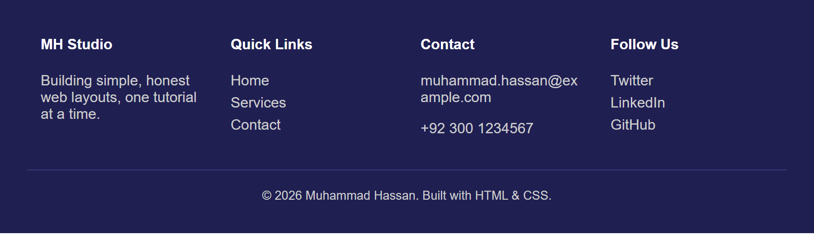

# Combining Float and Positioning: A Complete Page Layout

The [Layout Designing](layout-designing.md) tutorial taught you `float` for building
side-by-side columns. The [CSS Positioning](css-positioning.md) tutorial taught you
`position` for placing things precisely and keeping elements pinned in place. Real pages
almost always need both at once. This tutorial builds one complete, realistic page —
a sticky toolbar with a logo and a horizontal menu (with a notification badge), a
vertical sidebar menu, a floated three-column body, a floated four-column footer, and a
"back to top" button — combining every technique from both tutorials into one project.

**Prerequisites:** [Layout Designing](layout-designing.md) and
[CSS Positioning](css-positioning.md).

## In This Tutorial

- Build a sticky toolbar combining `position: sticky` with a floated logo and a floated
  horizontal menu
- Add a small notification badge to a menu item using `position: relative` on the parent
  and `position: absolute` on the badge
- Build a three-column body containing a **vertical** sidebar menu, using `float` for the
  columns themselves
- Understand exactly why a vertical menu needs no float, while a horizontal one does
- Build a four-column footer using `float`, and fix a real text-overflow bug along the
  way
- Add a `position: fixed` "back to top" button that stays anchored to the browser window
  regardless of scrolling
- See the complete, combined page and a summary of which technique does what

---

## Part 1: The Toolbar — Float for Layout, Position for Behavior

Start with the header. The logo and the menu sit side by side — that's a job for
`float`, exactly like the navigation menu in Layout Designing:

```html
<header id="toolbar">
    <div id="logo">MH<span>Studio</span></div>
    <ul id="main-menu">
        <li><a href="#">Home</a></li>
        <li><a href="#">Services</a></li>
        <li class="has-badge"><a href="#">Messages</a><span class="badge">3</span></li>
        <li><a href="#">Contact</a></li>
    </ul>
</header>
```

```css
#toolbar {
  position: sticky;
  top: 0;
  z-index: 100;
  background-color: #2b2b7a;
  color: white;
  padding: 12px 30px;
  overflow: hidden; /* clearfix: contains the floated logo and menu */
}

#logo {
  float: left;
  font-size: 1.4rem;
  font-weight: bold;
  line-height: 32px;
}
#logo span { font-weight: normal; opacity: 0.8; margin-left: 4px; }

#main-menu {
  float: right;
  list-style: none;
  margin: 0;
  padding: 0;
}
#main-menu li {
  float: left;
  margin-left: 24px;
  position: relative; /* positioning context for the badge below */
}
#main-menu a { color: white; text-decoration: none; font-weight: bold; line-height: 32px; }
#main-menu a:hover { text-decoration: underline; }

.badge {
  position: absolute;
  top: -8px;
  right: -14px;
  background-color: #ff8a3d;
  color: white;
  font-size: 0.7rem;
  font-weight: bold;
  padding: 2px 6px;
  border-radius: 999px;
}
```


Three separate things are happening here, and it's worth naming each one:

- **`float: left` / `float: right`** on `#logo` and `#main-menu` places them side by
  side — this is pure layout, exactly like Layout Designing's navigation example.
- **`position: sticky`** on `#toolbar` itself keeps the *whole header* pinned to the top
  of the browser window once you scroll past it, instead of scrolling away with the rest
  of the page. (As always with `sticky`, a still screenshot can only show it at rest —
  you need to scroll a real page to see it stick.)
- **`position: relative`** on each `#main-menu li`, combined with **`position:
  absolute`** on `.badge`, is the classic "badge in the corner" pattern: the `li`
  becomes the positioning anchor, and the badge places itself relative to *that specific
  list item* — not the whole page — using small negative offsets to hang slightly off
  its top-right corner.

!!! tip "Why the `li` needs `position: relative`"
    An absolutely positioned element always positions itself relative to its *nearest
    positioned ancestor* — the closest parent that has any `position` value other than
    the default `static`. Without `position: relative` on the `li`, the badge would jump
    all the way up to position itself relative to `#toolbar` (the next positioned
    ancestor up the tree) instead of sitting neatly on its own menu item.

## Part 2: A Vertical Menu — Why It Needs No Float

The dashboard sidebar needs a **vertical** list of links, stacked one under another:

```html
<ul class="vertical-menu">
    <li><a href="#">Overview</a></li>
    <li><a href="#">Projects</a></li>
    <li><a href="#">Messages</a></li>
    <li><a href="#">Settings</a></li>
    <li><a href="#">Billing</a></li>
</ul>
```

```css
.vertical-menu { list-style: none; margin: 0; padding: 0; }
.vertical-menu li { margin-bottom: 4px; }
.vertical-menu a {
  display: block;
  padding: 8px 10px;
  color: #2b2b7a;
  text-decoration: none;
  border-radius: 4px;
}
.vertical-menu a:hover { background-color: #e2e2f0; }
```

Notice there is **no `float` anywhere in this CSS**. That's the whole point: `<li>` is a
block-level element, and block-level elements *already* stack vertically by default —
that's just normal document flow. The horizontal menu in Part 1 needed `float` precisely
*because* it had to fight against that default stacking behavior; a vertical menu is
simply what happens if you do nothing extra at all. `display: block` on the `<a>` here
isn't for stacking — it's so each link's clickable/hoverable area fills the full width
of its `<li>`, not just the width of the link text.

## Part 3: The Three-Column Body

Now place that vertical menu inside the left column of a three-column layout — a
sidebar, a main content area, and a secondary widgets column — using the same
float-and-width technique from Layout Designing:

```html
<div id="page-body">
    <nav id="sidebar-menu" class="column">
        <h2>Dashboard</h2>
        <ul class="vertical-menu">
            <li><a href="#">Overview</a></li>
            <li><a href="#">Projects</a></li>
            <li><a href="#">Messages</a></li>
            <li><a href="#">Settings</a></li>
            <li><a href="#">Billing</a></li>
        </ul>
    </nav>

    <main id="main-content" class="column">
        <h1>Welcome Back, Muhammad</h1>
        <p>This layout combines the Layout Designing and CSS Positioning tutorials into
           one real page: a sticky toolbar, a horizontal menu, a vertical sidebar menu, a
           floated three-column body, and a four-column footer.</p>
        <p>Scroll down in a real browser to see the toolbar stay pinned to the top of the
           page - that is <code>position: sticky</code> at work.</p>
    </main>

    <aside id="widgets" class="column">
        <div class="widget">
            <h3>Quick Stats</h3>
            <p>12 new messages</p>
        </div>
        <div class="widget">
            <h3>About</h3>
            <p>A demo project combining float-based columns with CSS positioning.</p>
        </div>
    </aside>
</div>
```

```css
#page-body {
  overflow: hidden; /* clearfix: contains the three floated columns */
  max-width: 1100px;
  margin: 0 auto;
}
.column { float: left; padding: 24px; }
#sidebar-menu { width: 22%; background-color: #f4f4f8; }
#main-content { width: 56%; }
#widgets { width: 22%; background-color: #f4f4f8; }

.widget {
  background: white;
  border: 1px solid #ddd;
  padding: 12px;
  margin-bottom: 16px;
  border-radius: 6px;
}
```


This is the same `overflow: hidden` clearfix from Layout Designing, applied for exactly
the same reason: `#sidebar-menu`, `#main-content`, and `#widgets` are all floated, so
without it `#page-body` would collapse to zero height.

## Part 4: The Four-Column Footer

The footer uses the identical technique as the three-column body — four `float: left`
columns, each `25%` wide, inside a container with `overflow: hidden`:

```html
<footer id="site-footer">
    <div class="footer-columns">
        <div class="footer-col">
            <h4>MH Studio</h4>
            <p>Building simple, honest web layouts, one tutorial at a time.</p>
        </div>
        <div class="footer-col">
            <h4>Quick Links</h4>
            <ul>
                <li><a href="#">Home</a></li>
                <li><a href="#">Services</a></li>
                <li><a href="#">Contact</a></li>
            </ul>
        </div>
        <div class="footer-col">
            <h4>Contact</h4>
            <p>muhammad.hassan@example.com</p>
            <p>+92 300 1234567</p>
        </div>
        <div class="footer-col">
            <h4>Follow Us</h4>
            <ul>
                <li><a href="#">Twitter</a></li>
                <li><a href="#">LinkedIn</a></li>
                <li><a href="#">GitHub</a></li>
            </ul>
        </div>
    </div>
    <p class="copyright">&copy; 2026 Muhammad Hassan. Built with HTML &amp; CSS.</p>
</footer>
```

```css
#site-footer { background-color: #1f1f52; color: #ccc; padding: 40px 30px 20px; }
.footer-columns { overflow: hidden; max-width: 1100px; margin: 0 auto; }
.footer-col {
  float: left;
  width: 25%;
  padding: 0 15px;
  overflow-wrap: break-word;
}
.footer-col h4 { color: white; margin-top: 0; }
.footer-col ul { list-style: none; margin: 0; padding: 0; }
.footer-col li { margin-bottom: 6px; }
.footer-col a { color: #ccc; text-decoration: none; }
.footer-col a:hover { text-decoration: underline; }

.copyright {
  clear: both;
  text-align: center;
  padding-top: 20px;
  margin-top: 20px;
  border-top: 1px solid #3a3a75;
  font-size: 0.85rem;
}
```



!!! warning "A real bug worth knowing about: `overflow-wrap: break-word`"
    Without it, a long unbreakable string like `muhammad.hassan@example.com` will not
    wrap inside its `25%`-wide column at all — it overflows straight into the *next*
    column and visually overlaps it, producing garbled-looking text. This is a genuinely
    common real-world bug with fixed-width columns and long words/URLs/emails.
    `overflow-wrap: break-word` tells the browser it's allowed to break a word mid-way,
    onto a new line, rather than let it overflow its container. Try removing that one
    line and reloading to see the overlap for yourself.

## Part 5: A Fixed "Back to Top" Button

Finally, add a button that always stays in the same corner of the browser window, no
matter how far down the page you've scrolled:

```html
<a href="#toolbar" id="back-to-top">Top</a>
```

```css
#back-to-top {
  position: fixed;
  bottom: 24px;
  right: 24px;
  background-color: #ff8a3d;
  color: white;
  padding: 10px 16px;
  border-radius: 999px;
  text-decoration: none;
  font-weight: bold;
  box-shadow: 0 4px 10px rgba(0,0,0,0.2);
}
```

`position: fixed` positions an element relative to the **browser window (viewport)**
itself, completely ignoring the page's normal document flow and completely unaffected by
scrolling — that's the key difference from `sticky`, which only stays put *within* its
own parent once a scroll threshold is reached. A "back to top" button, a chat bubble, or
a cookie-consent bar are all classic real-world uses of `position: fixed`. Here, the
`href="#toolbar"` also makes it a genuinely working link: clicking it jumps straight back
to the element with `id="toolbar"`, at the very top of the page.

## Part 6: Putting It All Together

Here is the complete page — every piece from Parts 1 through 5 combined into one
`index.html` and `style.css`:

```html
<!DOCTYPE html>
<html lang="en">
<head>
<meta charset="UTF-8">
<meta name="viewport" content="width=device-width, initial-scale=1.0">
<title>Muhammad Hassan's Web Studio</title>
<link rel="stylesheet" href="style.css">
</head>
<body>

<header id="toolbar">
    <div id="logo">MH<span>Studio</span></div>
    <ul id="main-menu">
        <li><a href="#">Home</a></li>
        <li><a href="#">Services</a></li>
        <li class="has-badge"><a href="#">Messages</a><span class="badge">3</span></li>
        <li><a href="#">Contact</a></li>
    </ul>
</header>

<div id="page-body">
    <nav id="sidebar-menu" class="column">
        <h2>Dashboard</h2>
        <ul class="vertical-menu">
            <li><a href="#">Overview</a></li>
            <li><a href="#">Projects</a></li>
            <li><a href="#">Messages</a></li>
            <li><a href="#">Settings</a></li>
            <li><a href="#">Billing</a></li>
        </ul>
    </nav>

    <main id="main-content" class="column">
        <h1>Welcome Back, Muhammad</h1>
        <p>This layout combines the Layout Designing and CSS Positioning tutorials into
           one real page: a sticky toolbar, a horizontal menu, a vertical sidebar menu, a
           floated three-column body, and a four-column footer.</p>
        <p>Scroll down in a real browser to see the toolbar stay pinned to the top of the
           page - that is <code>position: sticky</code> at work.</p>
    </main>

    <aside id="widgets" class="column">
        <div class="widget">
            <h3>Quick Stats</h3>
            <p>12 new messages</p>
        </div>
        <div class="widget">
            <h3>About</h3>
            <p>A demo project combining float-based columns with CSS positioning.</p>
        </div>
    </aside>
</div>

<footer id="site-footer">
    <div class="footer-columns">
        <div class="footer-col">
            <h4>MH Studio</h4>
            <p>Building simple, honest web layouts, one tutorial at a time.</p>
        </div>
        <div class="footer-col">
            <h4>Quick Links</h4>
            <ul>
                <li><a href="#">Home</a></li>
                <li><a href="#">Services</a></li>
                <li><a href="#">Contact</a></li>
            </ul>
        </div>
        <div class="footer-col">
            <h4>Contact</h4>
            <p>muhammad.hassan@example.com</p>
            <p>+92 300 1234567</p>
        </div>
        <div class="footer-col">
            <h4>Follow Us</h4>
            <ul>
                <li><a href="#">Twitter</a></li>
                <li><a href="#">LinkedIn</a></li>
                <li><a href="#">GitHub</a></li>
            </ul>
        </div>
    </div>
    <p class="copyright">&copy; 2026 Muhammad Hassan. Built with HTML &amp; CSS.</p>
</footer>

<a href="#toolbar" id="back-to-top">Top</a>

</body>
</html>
```

```css
* { box-sizing: border-box; }
body { margin: 0; font-family: Arial, Helvetica, sans-serif; color: #333; }

/* ---- Toolbar / Header ---- */
#toolbar {
  position: sticky;
  top: 0;
  z-index: 100;
  background-color: #2b2b7a;
  color: white;
  padding: 12px 30px;
  overflow: hidden;
}

#logo {
  float: left;
  font-size: 1.4rem;
  font-weight: bold;
  line-height: 32px;
}
#logo span { font-weight: normal; opacity: 0.8; margin-left: 4px; }

#main-menu {
  float: right;
  list-style: none;
  margin: 0;
  padding: 0;
}
#main-menu li {
  float: left;
  margin-left: 24px;
  position: relative;
}
#main-menu a { color: white; text-decoration: none; font-weight: bold; line-height: 32px; }
#main-menu a:hover { text-decoration: underline; }

.badge {
  position: absolute;
  top: -8px;
  right: -14px;
  background-color: #ff8a3d;
  color: white;
  font-size: 0.7rem;
  font-weight: bold;
  padding: 2px 6px;
  border-radius: 999px;
}

/* ---- 3-Column Body ---- */
#page-body {
  overflow: hidden;
  max-width: 1100px;
  margin: 0 auto;
}
.column { float: left; padding: 24px; }
#sidebar-menu { width: 22%; background-color: #f4f4f8; }
#main-content { width: 56%; }
#widgets { width: 22%; background-color: #f4f4f8; }

.vertical-menu { list-style: none; margin: 0; padding: 0; }
.vertical-menu li { margin-bottom: 4px; }
.vertical-menu a {
  display: block;
  padding: 8px 10px;
  color: #2b2b7a;
  text-decoration: none;
  border-radius: 4px;
}
.vertical-menu a:hover { background-color: #e2e2f0; }

.widget {
  background: white;
  border: 1px solid #ddd;
  padding: 12px;
  margin-bottom: 16px;
  border-radius: 6px;
}

/* ---- 4-Column Footer ---- */
#site-footer { background-color: #1f1f52; color: #ccc; padding: 40px 30px 20px; }
.footer-columns { overflow: hidden; max-width: 1100px; margin: 0 auto; }
.footer-col {
  float: left;
  width: 25%;
  padding: 0 15px;
  overflow-wrap: break-word;
}
.footer-col h4 { color: white; margin-top: 0; }
.footer-col ul { list-style: none; margin: 0; padding: 0; }
.footer-col li { margin-bottom: 6px; }
.footer-col a { color: #ccc; text-decoration: none; }
.footer-col a:hover { text-decoration: underline; }

.copyright {
  clear: both;
  text-align: center;
  padding-top: 20px;
  margin-top: 20px;
  border-top: 1px solid #3a3a75;
  font-size: 0.85rem;
}

/* ---- Back to Top (fixed position) ---- */
#back-to-top {
  position: fixed;
  bottom: 24px;
  right: 24px;
  background-color: #ff8a3d;
  color: white;
  padding: 10px 16px;
  border-radius: 999px;
  text-decoration: none;
  font-weight: bold;
  box-shadow: 0 4px 10px rgba(0,0,0,0.2);
}
```

Here is the finished page, as it looks when you first load it (before scrolling):


### Which Technique Does What

| Technique | Used where in this page | Why |
|---|---|---|
| `float: left` / `float: right` | Logo + menu in the toolbar; the three body columns; the four footer columns | Placing block-level elements side by side instead of stacking |
| `overflow: hidden` (clearfix) | `#toolbar`, `#page-body`, `.footer-columns` | Making a container properly enclose its floated children |
| *(no float at all)* | The vertical sidebar menu | Vertical stacking is simply the default behavior of block-level elements |
| `position: sticky` | `#toolbar` | Keeps the header pinned to the top once you scroll past it |
| `position: relative` + `position: absolute` | Each `#main-menu li` + `.badge` | Placing a small badge precisely on its own menu item |
| `position: fixed` | `#back-to-top` | Keeping a button anchored to the browser window, ignoring scroll and page flow entirely |

## Try It Yourself

1. Add a fifth column to the footer (for example, "Newsletter" with a short sentence),
   and adjust every `.footer-col` width so five columns still fit without wrapping.
2. Add a second badge — a green "New" badge on the "Services" menu item — reusing the
   `.badge` class.
3. Give the currently "active" sidebar link (for example, "Overview") a distinct
   background color using a new class, so a user can tell which page they're on.
4. Temporarily delete `overflow: hidden;` from `#page-body` and reload — watch the
   footer jump up and overlap the three columns, exactly like the collapsed-parent bug
   from Layout Designing, then put it back.
5. Move `#back-to-top` to the bottom-left instead of the bottom-right by changing `right:
   24px;` to `left: 24px;`.

## Key Takeaways

- Real pages combine `float` (for side-by-side layout) and `position` (for pinning,
  badges, and overlays) constantly — they solve different problems and are not
  alternatives to each other.
- A horizontal menu needs `float` (or Flexbox) to override the default vertical stacking
  of `<li>` elements; a vertical menu needs nothing extra, because vertical stacking is
  already the default.
- `position: sticky` keeps an element pinned within its own parent once scrolled to;
  `position: fixed` pins an element to the browser window itself, ignoring scroll and
  document flow completely.
- A `position: relative` parent combined with a `position: absolute` child is the
  standard way to place a small badge, icon, or label precisely on a specific element.
- `overflow-wrap: break-word` prevents long, unbreakable text (like an email address)
  from overflowing a fixed-width column into its neighbor — a genuinely common
  real-world bug.
