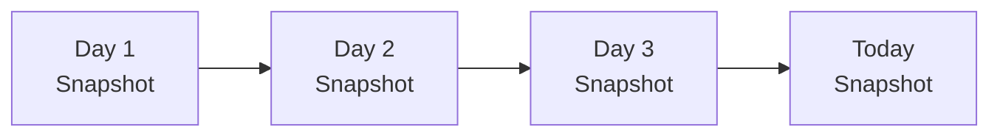
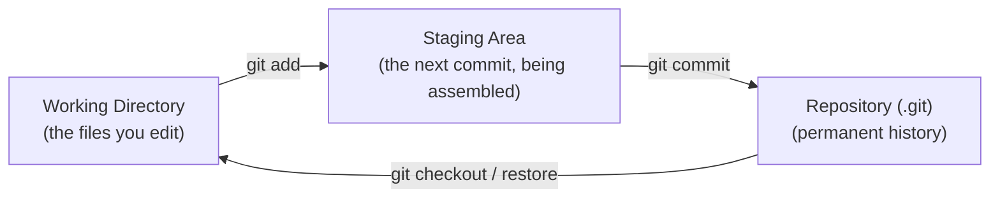
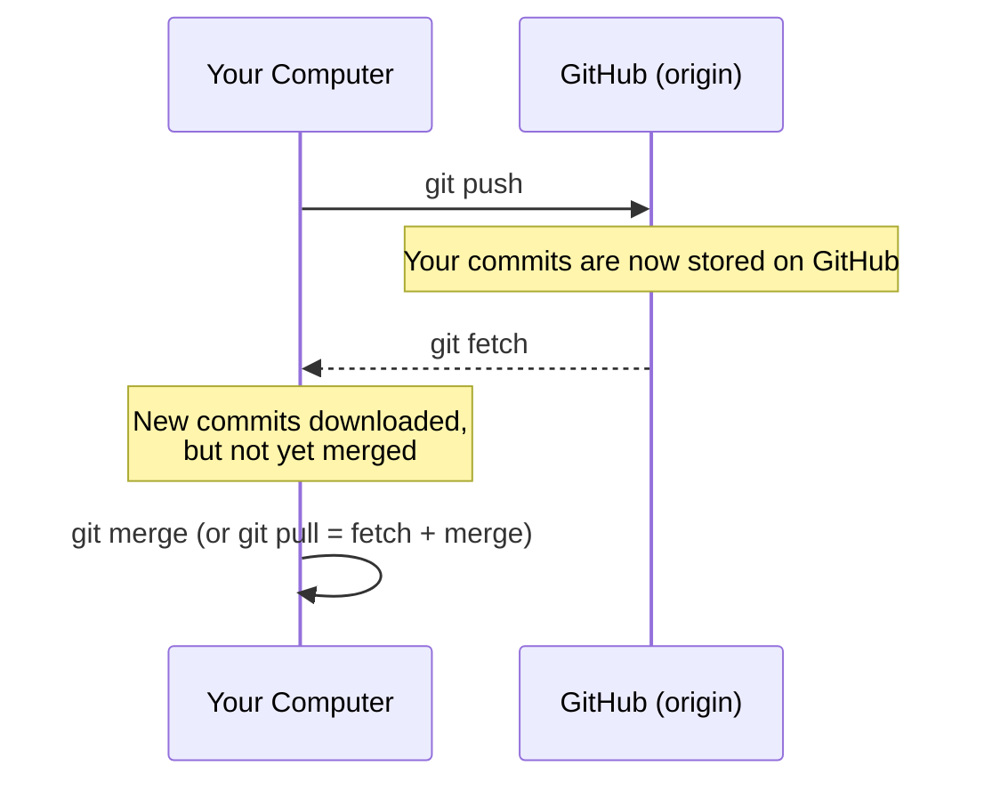
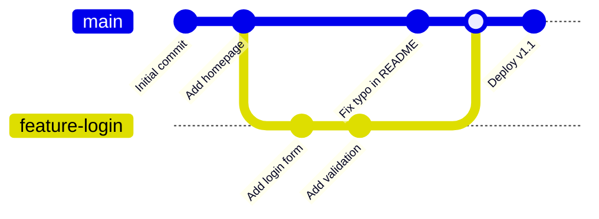
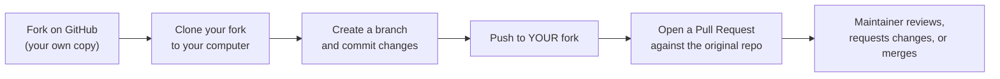

# Git and GitHub: From Beginner to Intermediate

Every project in this book — and every real software project you will ever work on —
needs a way to track changes, undo mistakes, and let more than one person work on the
same code without overwriting each other. That's what **Git** does. **GitHub** is a
website built around Git that adds a place to store your repositories online, plus tools
for reviewing and collaborating on changes. This tutorial takes you from installing Git
for the first time to comfortably branching, merging, undoing mistakes, and collaborating
through GitHub pull requests.

## In This Tutorial

- Understand what version control is and why Git specifically won
- Install and configure Git, and create your first repository
- Learn the everyday commands: `status`, `add`, `commit`, `log`, `diff`
- Connect a local repository to GitHub: `remote`, `push`, `pull`, `clone`
- Create and merge branches, and resolve merge conflicts
- Undo mistakes safely with `restore`, `reset`, `revert`, and `commit --amend`
- Collaborate using the fork-and-pull-request workflow
- Pick up good habits: commit messages, `.gitignore`, and `git stash`
- Get comfortable with GitHub Desktop and know what other GUI clients exist

---

## Part 1: Foundations

### What Is Version Control, and Why Git?

Before version control, developers (and writers, and designers) kept multiple copies of a
file to preserve history: `report.docx`, `report_v2.docx`, `report_v2_FINAL.docx`,
`report_v2_FINAL_actually_final.docx`. This breaks down fast — it's hard to know what
changed between versions, impossible to combine two people's edits automatically, and
one accidental overwrite can destroy hours of work.

A **version control system (VCS)** solves this by recording a history of changes to a set
of files over time, so you can:

- See exactly what changed, when, and who changed it
- Go back to any earlier point in history
- Let multiple people work on the same files at the same time, then combine their work
- Experiment safely (in a **branch**) without touching the working version

**Git** is a **distributed** version control system created by Linus Torvalds in 2005
(originally to manage the Linux kernel's source code). "Distributed" means every
developer's copy of the repository contains the *entire* history, not just the latest
files — there is no single point of failure, and you can commit, branch, and view history
completely offline.



Git doesn't store a list of file *differences* the way some older tools did — it stores a
**snapshot** of your entire project every time you commit. If a file hasn't changed
between two commits, Git just points to the identical file it already has, so this is
far more efficient than it sounds.

!!! note "Git vs. GitHub"
    **Git** is the version control tool itself — it runs entirely on your computer and
    knows nothing about the internet. **GitHub** is a separate company/website that hosts
    Git repositories online and adds collaboration features (pull requests, issues,
    project boards). You can use Git without GitHub, but you can't use GitHub without
    Git. Other GitHub alternatives include GitLab and Bitbucket — they all sit on top of
    the same underlying Git tool.

### Installing Git and First-Time Setup

Download Git from [git-scm.com](https://git-scm.com/) (Windows/macOS/Linux installers are
all there). Once installed, confirm it worked:

```bash
git --version
```

Git needs to know who you are before you can commit, since every commit is stamped with
an author name and email:

```bash
git config --global user.name "Your Name"
git config --global user.email "you@example.com"
```

A few other one-time settings that make life easier:

```bash
git config --global init.defaultBranch main   # new repos start on "main", not "master"
git config --global core.editor "code --wait" # use VS Code for commit messages, if installed
git config --list                             # see everything you've configured
```

### The Three Trees: Working Directory, Staging Area, Repository

Understanding these three areas is the single most useful mental model for everything
that follows:



- The **working directory** is the actual folder on disk where you edit files.
- The **staging area** (also called the "index") is a holding area where you build up
  exactly what you want your *next* commit to contain — you choose which changes to
  include, one file (or even one chunk of a file) at a time.
- The **repository** is the permanent, committed history, stored in a hidden `.git`
  folder inside your project.

This separation is what lets you edit five files but only commit two of them, or commit
your changes in several small, logical commits instead of one giant one.

---

## Part 2: Your First Repository

### Creating a Repository

Inside any project folder:

```bash
git init
```

This creates a hidden `.git` folder — that's it, your folder is now a Git repository.
Nothing is tracked yet; you have to tell Git what to track.

### Checking Status and Making Your First Commit

```bash
git status
```

`git status` is the command you will run more than any other — it tells you what's
changed, what's staged, and what Git doesn't know about yet. A typical first run on a new
project shows every file as "untracked."

```bash
echo "# My Project" > README.md
git status
# README.md shown as untracked

git add README.md
git status
# README.md shown as staged ("Changes to be committed")

git commit -m "Add project README"
git status
# nothing to commit, working tree clean
```

- `git add <file>` moves a file's current changes into the staging area.
- `git add .` stages *everything* changed in the current folder (use with care).
- `git commit -m "message"` takes everything in the staging area and permanently records
  it as a new snapshot in the repository's history.

!!! tip "Commit early, commit often"
    A commit is cheap and local — it costs nothing to make one. Small, focused commits
    ("Add login form validation" rather than "misc changes") make history far easier to
    read, and far easier to undo cleanly if something goes wrong later.

### Viewing History

```bash
git log                  # full history: author, date, message, commit hash
git log --oneline        # one line per commit — great for a quick overview
git log --oneline --graph --all   # visualize branches as ASCII art
git show <commit-hash>   # see exactly what one specific commit changed
git diff                 # see unstaged changes (working directory vs. staging area)
git diff --staged        # see staged changes (staging area vs. last commit)
```

### Ignoring Files

Some files should never be committed: build output, dependency folders, secrets, and
editor/OS clutter. A `.gitignore` file in the root of your repository tells Git to ignore
matching paths entirely:

```gitignore
# .gitignore
node_modules/
.env
dist/
*.log
.DS_Store
```

!!! warning
    `.gitignore` only stops Git from tracking *new* matching files — it will not
    un-track a file that's already been committed. If you accidentally committed
    `.env`, remove it with `git rm --cached .env` (this deletes it from Git's tracking
    but keeps the actual file on your disk) and then commit that removal.

---

## Part 3: GitHub — Working With a Remote

A **remote** is a version of your repository hosted somewhere else — almost always
GitHub, in this course. Your local repository and the GitHub copy are kept in sync by
explicitly pushing and pulling; Git never syncs automatically.

### Connecting a Local Repository to GitHub

After creating an empty repository on [github.com](https://github.com) (click **New
repository** — don't initialize it with a README if you already have local commits, to
avoid an unrelated-histories conflict):

```bash
git remote add origin https://github.com/your-username/your-repo.git
git branch -M main
git push -u origin main
```

- `origin` is just the conventional nickname for your main remote — you could call it
  anything, but almost everyone calls it `origin`.
- `-u` (`--set-upstream`) links your local `main` branch to `origin/main`, so future runs
  can just be `git push` with no extra arguments.

### Cloning an Existing Repository

To get a *copy* of a repository that already exists on GitHub (your own, or someone
else's public project):

```bash
git clone https://github.com/some-user/some-repo.git
cd some-repo
```

`clone` automatically sets up the `origin` remote for you — there's no need to run
`git remote add` after cloning.

### Pulling and Fetching

```bash
git fetch origin    # download new commits from GitHub, but don't touch your working files
git pull origin main # fetch AND immediately merge into your current branch
```



`git pull` is what most people use day to day, but understanding that it's really
"fetch, then merge" matters once you start resolving conflicts — you're always merging
*something*, even when `pull` does it for you automatically.

---

## Part 4: Branching and Merging

### Why Branches?

A **branch** is an independent line of development. The default branch (usually `main`)
represents your project's stable, working state; you create a new branch to build a
feature or fix a bug without risking `main` until the work is ready.



### Creating and Switching Branches

```bash
git branch                     # list local branches, * marks the current one
git branch feature-login       # create a new branch (doesn't switch to it)
git switch feature-login       # switch to it
git switch -c feature-signup   # create AND switch in one step (shorthand: -c)

# Older, equivalent syntax you will still see everywhere:
git checkout -b feature-signup
```

`git switch` is the newer, clearer command introduced specifically for changing branches
(`git checkout` used to do this *and* several other unrelated things, which confused
beginners — both work, but reach for `switch` when your goal is just to change branches).

### Merging Branches

Once your feature branch is ready, merge it back into `main`:

```bash
git switch main
git merge feature-login
```

Git handles this one of two ways:

- **Fast-forward merge**: if `main` hasn't changed since you branched off it, Git just
  moves the `main` pointer forward to include your commits — no new commit is created.
- **Three-way merge**: if `main` *has* changed in the meantime, Git creates a new "merge
  commit" that combines both histories.

### Resolving Merge Conflicts

A conflict happens when the same lines of the same file were changed differently on both
branches, and Git can't decide which version is correct — it needs you to decide. Git
marks the conflicting section directly in the file:

```text
<<<<<<< HEAD
const greeting = "Hello, world!";
=======
const greeting = "Hey there, world!";
>>>>>>> feature-login
```

To resolve it:

1. Open the file and edit it to what the code *should* actually say — delete the
   `<<<<<<<`, `=======`, and `>>>>>>>` marker lines along with whichever version you're
   discarding.
2. Stage the resolved file: `git add <file>`.
3. Complete the merge: `git commit` (Git will pre-fill a merge commit message for you).

!!! tip
    Run `git status` at any point during a conflict — it lists exactly which files still
    have unresolved conflicts, so you always know what's left to fix.

---

## Part 5: Undoing Things

Mistakes are normal; Git gives you several tools for undoing them, each suited to a
different situation.

| Situation | Command |
|---|---|
| Discard *unstaged* changes to a file, back to the last commit | `git restore <file>` |
| Unstage a file (keep the edits, just remove from staging) | `git restore --staged <file>` |
| Fix the message or add a forgotten file to the **last** commit | `git commit --amend` |
| Move the branch pointer, keeping the commits' changes in your working directory | `git reset --soft <commit>` |
| Move the branch pointer AND unstage everything (default mode) | `git reset --mixed <commit>` |
| Move the branch pointer AND discard all changes since then | `git reset --hard <commit>` |
| Create a *new* commit that undoes an earlier commit | `git revert <commit>` |

```bash
# Fix a typo in the commit message you JUST made, before pushing:
git commit --amend -m "Add login form validation"

# Undo the last commit but keep the changes staged, ready to re-commit differently:
git reset --soft HEAD~1
```

!!! danger "reset --hard deletes work"
    `git reset --hard` permanently discards any uncommitted changes and any commits after
    the target — there is no undo. Use `git reset --soft` or `--mixed` unless you are
    completely sure you want to throw work away.

!!! warning "Never reset or amend commits you've already pushed and shared"
    `reset` and `commit --amend` **rewrite history** — they change existing commits
    instead of adding new ones. That's fine for commits that only exist on your own
    machine. But if you've already pushed a commit and someone else might have pulled it,
    rewriting it will make their local history disagree with yours, causing a mess. For
    shared history, use `git revert` instead — it adds a brand-new commit that undoes the
    old one, so history only ever moves forward.

---

## Part 6: Collaborating on GitHub

### The Fork-and-Pull-Request Workflow

When you don't have write access to a repository (an open-source project, or a
classmate's assignment repo), the standard workflow is to **fork** it — create your own
copy under your GitHub account — make your changes there, and then propose merging them
back via a **pull request (PR)**.



```bash
# after forking on github.com, clone YOUR fork:
git clone https://github.com/your-username/the-project.git
cd the-project
git switch -c fix-typo-in-docs

# ... make your changes ...

git add .
git commit -m "Fix typo in installation docs"
git push -u origin fix-typo-in-docs
# then open a Pull Request on github.com from your branch into the original repo
```

Inside a single team repository where everyone *does* have write access (like a group
project for this course), you skip the "fork" step and just branch directly:
`git switch -c your-branch-name`, push it, and open a pull request from that branch into
`main` for a teammate to review before merging.

### Writing Good Commit Messages

```text
Add email validation to signup form

Rejects addresses without an @ symbol or domain before the form
submits, instead of only failing server-side.
```

- The first line is a short summary, written in the imperative mood ("Add," not "Added"
  or "Adds") — imagine finishing the sentence "If applied, this commit will ___."
- Leave a blank line, then explain *why* in more detail if it isn't obvious from the
  summary alone.
- Avoid vague messages like `"fix"`, `"update"`, or `"changes"` — six months from now,
  `git log` is the only context you'll have.

### Stashing Work in Progress

If you need to switch branches but aren't ready to commit your current changes:

```bash
git stash            # temporarily shelve uncommitted changes, restore a clean working directory
git stash list        # see everything you've stashed
git stash pop          # re-apply the most recent stash and remove it from the list
git stash apply         # re-apply without removing it from the list
```

### A Note on Rebase

`git rebase` rewrites a branch's commits to appear as if they were made on top of a
different starting point, producing a cleaner, linear history than a merge commit would.
It's a genuinely useful intermediate tool — but because it rewrites commits, the same
rule from Part 5 applies even more strongly: **never rebase a branch that other people
have already pulled**. For this course, prefer `git merge` for combining branches, and
treat `rebase` as something to learn deliberately later, on branches only you use.

---

## Part 7: Beyond the Command Line

Everything above works entirely from the terminal, and that's deliberate — the command
line is the one interface every tutorial, every CI/CD system, and every remote server
assumes you know. But for day-to-day local work, plenty of experienced developers still
reach for a visual client that shows diffs, history, and branches at a glance instead of
composing commands for them.

### GitHub Desktop

[GitHub Desktop](https://desktop.github.com/) is GitHub's own free, official GUI client
for Windows and macOS. After signing in with your GitHub account, it handles the same
everyday workflow from this tutorial, visually:

- Cloning a repository with one click instead of `git clone`
- Listing changed files with a line-by-line diff viewer instead of `git diff`
- Committing with a message box instead of `git commit -m`
- Creating and switching branches from a dropdown instead of `git switch -c`
- Pushing, pulling, and fetching with a single "Fetch origin" / "Push origin" button
- Opening a pull request directly from the app once you've pushed a branch

!!! tip
    GitHub Desktop is a great on-ramp if the terminal still feels unfamiliar, and a
    genuinely useful diff/history viewer even once it doesn't. But keep practicing the
    CLI commands from this tutorial alongside it — every action GitHub Desktop takes is
    just running one of the commands you already learned, and CLI fluency is what you'll
    need for scripting, CI/CD pipelines, and working on a remote server that has no GUI
    at all.

### Alternatives to GitHub Desktop

| Tool | Notes |
|---|---|
| [GitKraken](https://www.gitkraken.com/) | Cross-platform; a strong visual commit graph; works with any Git host, not just GitHub |
| [Sourcetree](https://www.sourcetree.com/) | Free, by Atlassian; popular alongside Bitbucket, but works with any Git remote |
| [Fork](https://git-fork.com/) | Fast, lightweight, cross-platform |
| [Tower](https://www.git-tower.com/) | Paid, polished, cross-platform |
| Your editor's built-in Git support | VS Code has Git built in, extendable with [GitLens](https://marketplace.visualstudio.com/items?itemName=eamodio.gitlens) for richer history/blame views; JetBrains IDEs (WebStorm, IntelliJ) ship full Git integration too |
| [GitHub CLI (`gh`)](https://cli.github.com/) | Not a GUI — a command-line companion to `git` for GitHub-specific actions (creating pull requests, issues, and releases without leaving the terminal) |

---

## Try It Yourself

1. Create a new folder, run `git init`, and make three separate commits (for example: add
   a README, add an `index.html`, add a `.gitignore`).
2. Create a GitHub repository and push your local repository to it using
   `git remote add` and `git push -u origin main`.
3. Create a branch called `experiment`, make a change, and commit it. Switch back to
   `main` — notice your change isn't there. Merge `experiment` into `main` and confirm it
   now is.
4. Deliberately create a merge conflict: on `main`, change line 1 of a file and commit;
   on another branch (branched off *before* that commit), change the same line
   differently and commit. Merge the branches and practice resolving the conflict by
   hand.
5. Make a commit, then practice each undo tool on it in turn (in a throwaway test repo):
   `git commit --amend`, `git reset --soft HEAD~1`, and `git revert HEAD`. Run `git log`
   after each to see exactly what changed.

## Key Takeaways

- Git tracks **snapshots** of your whole project, organized through three areas: the
  **working directory**, the **staging area**, and the **repository**.
- The everyday loop is `git status` → `git add` → `git commit`, and `git log` to review
  history.
- GitHub hosts a remote copy of your repository; `push`, `pull`, `fetch`, and `clone`
  keep local and remote in sync — nothing syncs automatically.
- **Branches** let you develop features in isolation; `git merge` combines them, and
  conflicts just mean Git needs your judgment to combine two competing edits.
- Prefer `git revert` over `git reset`/`commit --amend` once a commit has been pushed and
  shared — rewriting shared history causes real problems for collaborators.
- The **fork-and-pull-request** workflow is how most real-world and open-source
  collaboration happens: branch, commit, push, open a PR, get it reviewed, merge.
- **GitHub Desktop** (and tools like GitKraken, Sourcetree, or your editor's built-in Git
  support) can replace the CLI for everyday local work, but every command they run is one
  you've already learned here — keep the CLI skills sharp for scripting, CI/CD, and
  remote servers.
