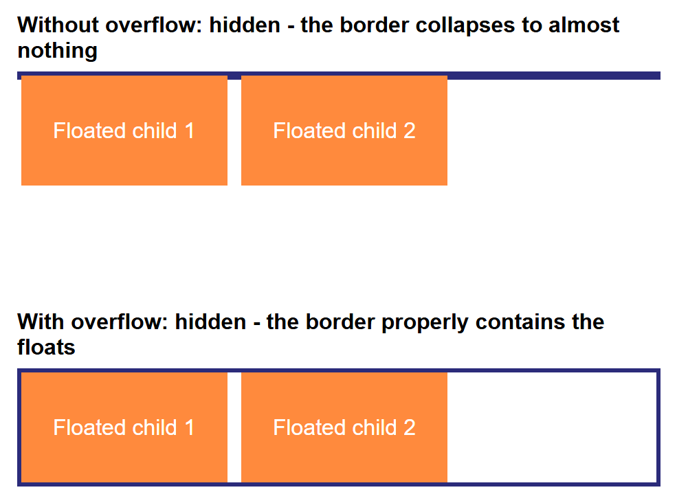

# Layout Designing: div, span, id, class, and Float

Before Flexbox and Grid existed (and still, in plenty of real, older codebases today),
web developers built entire page layouts using nothing but generic containers and the
CSS `float` property. This tutorial teaches that technique properly, from the ground up:
`<div>` and `<span>`, `id` and `class`, and finally `float` combined with `width` and
`overflow` to build one complete page — a header with a navigation menu, a three-column
layout, and a footer.

**Prerequisites:** [HTML and HTML5 Fundamentals](../web-technologies/lecture-03-html-html5-fundamentals.md),
[CSS Fundamentals](../web-technologies/lecture-05-css-fundamentals.md), and
[the CSS Box Model](../web-technologies/lecture-06-css-box-model-and-display.md).

## In This Tutorial

- What `<div>` and `<span>` actually are, and why they're deliberately "meaningless"
- The difference between `id` and `class`, and when to reach for each
- How `float` pulls an element out of normal document flow
- Why a floated element's parent collapses, and how `overflow` fixes it
- Building a simple horizontal navigation menu out of a `<ul>`
- Combining everything into one full page: header + nav, a three-column layout, footer

---

## Part 1: div and span — Generic Containers

Every HTML element you've met so far has a built-in meaning: `<p>` is a paragraph,
`<h1>` is a top-level heading, `<a>` is a link. Sometimes, though, you need to group a
few elements together purely so you can style or position them as a unit — with no
particular meaning of their own. HTML provides exactly two elements for this:

- **`<div>`** — a generic **block-level** container (starts on its own line, fills the
  available width).
- **`<span>`** — a generic **inline** container (flows inside a line of text, only as
  wide as its content).

```html
<div>
  <p>This paragraph is grouped inside a div, purely so it can be styled as a block.</p>
</div>

<p>The price is <span>$25</span> today only.</p>
```

On their own, a bare `<div>` or `<span>` changes nothing about how the page looks — they
only start to matter once you attach a `class` or an `id` to them, which is exactly what
Part 2 covers.

## Part 2: id vs. class

Both `id` and `class` are attributes you can add to *any* element, and both exist so CSS
(and later, JavaScript) can select and style specific elements. The difference is about
**how many** elements they're meant to apply to:

| | `id` | `class` |
|---|---|---|
| How many elements? | Exactly one per page | As many as you like |
| CSS selector | `#name { ... }` | `.name { ... }` |
| Typical use | A single, unique section (a page header, a specific widget) | Anything reused — buttons, cards, list items |

```html
<div id="site-header">This appears once on the page.</div>

<p class="highlight">This paragraph is highlighted.</p>
<p class="highlight">So is this one — the same class, reused.</p>
```

```css
#site-header {
  background-color: #2b2b7a;
}

.highlight {
  background-color: yellow;
}
```

!!! tip "Rule of thumb"
    Reach for `class` by default — most styling needs to apply to more than one
    element, or might need to later. Reach for `id` only for something that truly
    appears once, like a page's main header or footer.

## Part 3: The float Property

The `float` property tells the browser: "pull this element to the left or right edge of
its container, and let text and inline content wrap around it." It was originally
designed for exactly that — wrapping a paragraph's text around an image, the way a
magazine wraps text around a photo.

```html
<div class="box-a">Box A</div>
<div class="box-b">Box B</div>
```

```css
.box-a {
  float: left;
  width: 45%;
}

.box-b {
  float: left;
  width: 45%;
}
```

Once you give two floated elements a `width` that adds up to less than 100%, something
useful happens: instead of stacking on top of each other (the normal block-level
behavior), they sit **side by side** — and that's the entire trick behind building
multi-column layouts with `float`.

## Part 4: The Collapsing Parent Problem, and Fixing It with overflow

Floating an element removes it from **normal document flow** — its parent container no
longer "sees" it when calculating its own height. If every child inside a container is
floated, the parent's height collapses to almost nothing, because as far as the parent is
concerned, it has no content at all.



The fix is one line of CSS on the **parent**: `overflow: hidden`. This forces the parent
to properly enclose ("contain") its floated children, without changing how anything
inside actually looks. This technique is often called a **clearfix**.

```css
.parent-container {
  overflow: hidden; /* makes this container contain its floated children */
}
```

!!! note "Why this works"
    Setting `overflow` to anything other than its default (`visible`) creates what CSS
    calls a **block formatting context** for that element — and one side effect of that
    is the element correctly measures its floated children when calculating its own
    height. You don't need to memorize the term; just remember that `overflow: hidden`
    on a container is the standard fix whenever a floated layout's container collapses.

## Part 5: A Simple Navigation Menu with ul

A navigation menu is naturally a list of links, so it's built with a `<ul>` — and the
same float technique turns it from a vertical list into a horizontal menu bar:

```html
<ul id="nav-menu">
    <li><a href="#">Home</a></li>
    <li><a href="#">Articles</a></li>
    <li><a href="#">About</a></li>
    <li><a href="#">Contact</a></li>
</ul>
```

```css
#nav-menu {
  list-style: none;   /* remove the bullet points */
  margin: 0;
  padding: 0;
  overflow: hidden;   /* contain the floated <li> items, per Part 4 */
}

#nav-menu li {
  float: left;
  margin-right: 20px;
}

#nav-menu a {
  color: white;
  text-decoration: none;
  font-weight: bold;
}
```

Each `<li>` floats left, so instead of stacking vertically (a list's normal behavior),
the menu items line up in a row — and `overflow: hidden` on the `<ul>` itself keeps the
list properly sized around its floated items, exactly as in Part 4.

## Part 6: Putting It All Together — A Full Page Layout

Now combine everything into one real page: a header containing the nav menu from Part 5,
a three-column layout using the float-and-width technique from Part 3 (contained with
`overflow: hidden`, per Part 4), and a footer that sits cleanly below it all.

```html
<!DOCTYPE html>
<html lang="en">
<head>
    <meta charset="UTF-8">
    <meta name="viewport" content="width=device-width, initial-scale=1.0">
    <title>Muhammad Hassan's Blog</title>
    <link rel="stylesheet" href="style.css">
</head>
<body>
    <header id="site-header">
        <h1>Muhammad Hassan's Blog</h1>
        <ul id="nav-menu">
            <li><a href="#">Home</a></li>
            <li><a href="#">Articles</a></li>
            <li><a href="#">About</a></li>
            <li><a href="#">Contact</a></li>
        </ul>
    </header>

    <div id="page-content">
        <div class="column" id="sidebar-left">
            <h2>Categories</h2>
            <ul>
                <li>Web Development</li>
                <li>CSS Tricks</li>
                <li>JavaScript</li>
            </ul>
        </div>

        <div class="column" id="main-content">
            <h2>Understanding CSS Layouts</h2>
            <p>
                Before Flexbox and Grid existed, developers built entire page layouts
                using the <span class="highlight">float</span> property. This article
                walks through exactly how that works, one property at a time.
            </p>
            <p>
                A <code>div</code> is a block-level container with no meaning of its
                own; a <code>span</code> is the same idea, but inline. Both become
                genuinely useful the moment you give them an <code>id</code> or a
                <code>class</code> to style.
            </p>
        </div>

        <div class="column" id="sidebar-right">
            <h2>About the Author</h2>
            <p>Muhammad Hassan is a BSCS student learning full-stack web development, one lecture at a time.</p>
        </div>
    </div>

    <footer id="site-footer">
        <p>&copy; 2026 Muhammad Hassan. Built with HTML &amp; CSS.</p>
    </footer>
</body>
</html>
```

```css
* {
  box-sizing: border-box;
}

body {
  margin: 0;
  font-family: Arial, Helvetica, sans-serif;
  color: #333;
}

/* ---- Header and Nav Menu ---- */

#site-header {
  background-color: #2b2b7a;
  color: white;
  padding: 20px 30px;
}

#site-header h1 {
  margin: 0 0 10px;
  font-size: 1.6rem;
}

#nav-menu {
  list-style: none;
  margin: 0;
  padding: 0;
  overflow: hidden;
}

#nav-menu li {
  float: left;
  margin-right: 20px;
}

#nav-menu a {
  color: white;
  text-decoration: none;
  font-weight: bold;
}

#nav-menu a:hover {
  text-decoration: underline;
}

/* ---- Three-Column Layout with Float ---- */

#page-content {
  overflow: hidden;
}

.column {
  float: left;
  padding: 20px;
}

#sidebar-left {
  width: 20%;
  background-color: #f4f4f8;
}

#main-content {
  width: 60%;
}

#sidebar-right {
  width: 20%;
  background-color: #f4f4f8;
}

.highlight {
  background-color: yellow;
  padding: 0 4px;
}

/* ---- Footer ---- */

#site-footer {
  background-color: #2b2b7a;
  color: white;
  text-align: center;
  padding: 15px;
  font-size: 14px;
}
```

Here is the finished page:


Notice how each piece from earlier parts shows up here:

- `id="site-header"` and `id="site-footer"` — each appears exactly once, so `id` is the
  right choice (Part 2).
- `class="column"` is shared by all three columns, since they all need the same
  `float: left` and `padding` — a perfect use for `class` instead of `id` (Part 2).
- `#page-content { overflow: hidden; }` contains the three floated `.column` elements,
  exactly like Part 4's fix — without it, the footer would creep up and overlap the
  columns, since `#page-content` would collapse to zero height.
- `<span class="highlight">float</span>` is an inline element used purely to highlight
  one word inside a sentence — a `<div>` couldn't be used here without breaking onto its
  own line.

## Try It Yourself

1. Change `#sidebar-left` and `#sidebar-right` to `15%` each and `#main-content` to
   `70%`, and confirm the columns still add up sensibly and don't wrap.
2. Temporarily delete the `overflow: hidden;` line from `#page-content` and reload the
   page — watch the footer jump up and overlap the columns, then add the line back and
   watch it snap into place below them again.
3. Add a fourth navigation link, "Blog", to `#nav-menu` — confirm it lines up
   automatically with the others, no other CSS changes needed.
4. Add a second `<span class="highlight">` around a different word in the main content
   paragraph.

## Key Takeaways

- `<div>` and `<span>` are intentionally meaningless containers — block and inline,
  respectively — that only do something once you attach a `class` or `id` and CSS.
- Use `id` for something that appears exactly once on a page; use `class` for anything
  reused across several elements.
- `float: left` (or `right`) pulls an element to one side and lets other content flow
  around it — give two or more floated elements percentage widths that fit within 100%,
  and they sit side by side as columns.
- A container whose children are *all* floated collapses in height, because floated
  elements are removed from normal document flow — fix it with `overflow: hidden` on the
  container (a "clearfix").
- A horizontal navigation menu is just a `<ul>` with its `<li>` items floated and its own
  height contained the same way.
