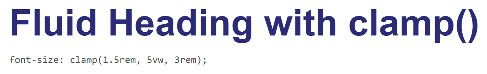
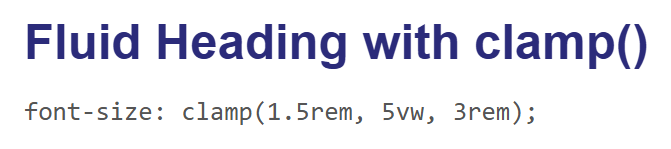
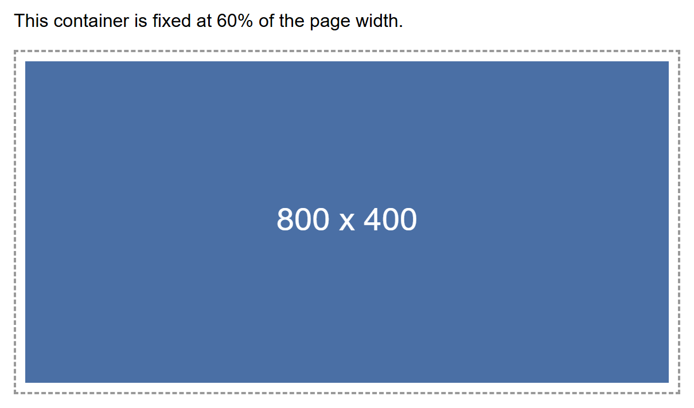
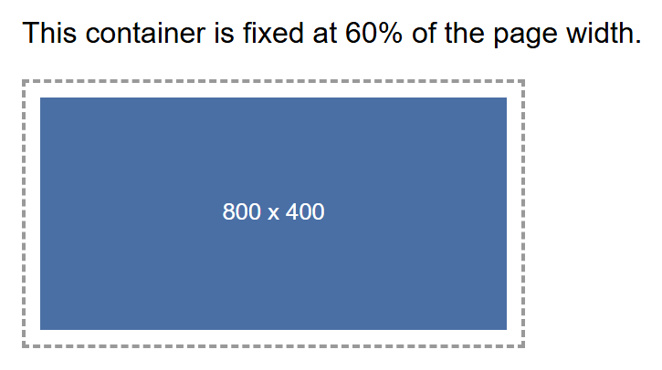
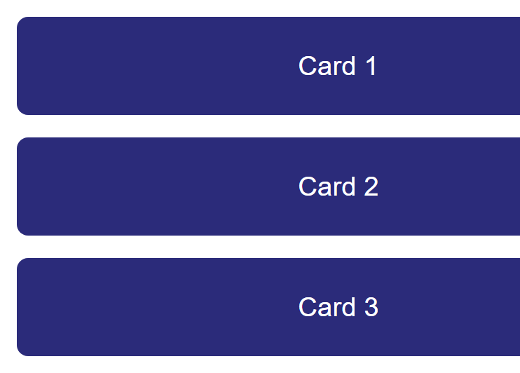

# Tutorial: Responsive Web Design

A single web page today might be opened on a phone barely 360 pixels wide, a tablet held
sideways, a laptop, or a giant desktop monitor — and you cannot control which one any
given visitor uses. **Responsive design** is the set of CSS techniques that let one
codebase adapt itself to all of these screens, instead of you building and maintaining a
separate "mobile site." This tutorial builds up every piece of that toolkit — the
viewport meta tag, mobile-first thinking, media queries, fluid units, `clamp()`, and
responsive images — and finishes by combining them into one complete, real example: a
row of cards that reflows from three columns down to one.

**Prerequisites:** [Flexbox Layouts](flexbox.md) and
[Lecture 10: Responsive Design and Framework Fundamentals](../web-technologies/lecture-10-responsive-design-and-frameworks.md).

## In This Tutorial

- Why one page has to work across phones, tablets, and desktops with no separate codebase
- The viewport meta tag, and why a page is unreadable on phones without it
- Mobile-first vs. desktop-first CSS, and why mobile-first is the modern default
- Media query syntax (`min-width` / `max-width`) and where breakpoints should come from
- Responsive units — `%`, `em`, `rem`, `vw`/`vh` — and when to reach for each
- Fluid sizing in a single declaration with `clamp()`
- Making images shrink to fit their container instead of overflowing it
- A complete practical example: a three-card row that becomes a single column on mobile
- Testing responsive layouts with your browser's device toolbar

---

## Part 1: Why Responsive Design Matters

Before smartphones, most web pages were built for one target: a desktop monitor, usually
around 1024 pixels wide. That single-target approach breaks down completely once you
consider the real spread of devices visiting a site today — a small phone, a large
phone, a tablet, a laptop, and an ultra-wide monitor might all load the exact same HTML
file within the same hour.

You have two ways to handle this:

1. Build and maintain **separate sites** for mobile and desktop (an older approach,
   often seen as an `m.example.com` subdomain) — doubling your work and your bugs.
2. Build **one responsive site** whose layout, text size, and images all adapt
   automatically to whatever screen loads it.

Every technique in this tutorial serves that second, now-standard approach: one HTML
file, one CSS file, and CSS rules that respond to the available screen space.

## Part 2: The Viewport Meta Tag

Here is a detail that surprises most beginners: a phone's browser does **not**, by
default, render a page at the phone's actual pixel width. Instead, it assumes the page
was built for a desktop, lays the whole thing out on a fake, wide **virtual viewport**
(commonly 980px), and then zooms the whole result out to fit the phone's screen. The
practical effect is a page where every bit of text is tiny and the visitor has to
pinch-zoom just to read a sentence — even if your CSS itself is perfectly reasonable.

The fix is one line in your HTML `<head>`, and it should be in every page you build from
this point forward:

```html
<meta name="viewport" content="width=device-width, initial-scale=1.0">
```

- **`width=device-width`** — tells the browser to use the device's actual screen width
  as the viewport width, instead of the fake desktop-width fallback.
- **`initial-scale=1.0`** — tells the browser to start at 100% zoom, so text renders at
  its real, intended size instead of already zoomed out.

!!! warning "Nothing else in this tutorial works without it"
    Media queries, `vw` units, and `clamp()` all measure themselves against the
    viewport's width. If the viewport meta tag is missing, a phone reports a fake,
    desktop-sized viewport, and every responsive rule you write will measure against the
    wrong number. This single `<meta>` tag is the foundation everything else in this
    tutorial depends on.

## Part 3: Mobile-First vs. Desktop-First

Once your viewport is reporting the real screen width, you need a strategy for *when* to
apply which styles. There are two opposite ways to organize this:

- **Desktop-first**: write your base CSS for a wide desktop screen, then use
  `max-width` media queries to strip styling away as the screen gets smaller.
- **Mobile-first**: write your base CSS for the smallest screen first (a single column,
  simple stacked layout), then use `min-width` media queries to *add* styling as more
  screen space becomes available.

```css
/* mobile-first: base styles apply to every screen, no media query needed */
.container {
  display: flex;
  flex-direction: column; /* stacked, single column by default */
}

/* add a row layout only once there's enough width for it */
@media (min-width: 768px) {
  .container {
    flex-direction: row;
  }
}
```

**Mobile-first is the modern default**, for two reasons:

1. **Simpler base styles.** Your un-decorated, no-media-query CSS only has to solve the
   easy problem — one narrow column — instead of a full multi-column desktop layout that
   then has to be dismantled piece by piece for small screens.
2. **Progressive enhancement.** You are always *adding* capability as space allows
   (more columns, larger images, a sidebar), rather than trying to *remove* complexity
   that was never designed to disappear cleanly.

!!! note "min-width vs. max-width, in plain terms"
    `min-width` media queries answer "once the screen is at least this wide, do this."
    `max-width` media queries answer "as long as the screen is no wider than this, do
    this." Mobile-first design is built almost entirely out of `min-width` queries.

## Part 4: Media Query Syntax and Breakpoints

A **media query** is a CSS block that only applies when a condition about the browser
or device is true — most commonly, its width. The syntax wraps ordinary CSS rules inside
an `@media` block:

```css
@media (min-width: 768px) {
  /* any CSS in here only applies once the viewport is 768px wide or more */
  .sidebar {
    display: block;
  }
}

@media (max-width: 767px) {
  /* this block applies only below 768px */
  .sidebar {
    display: none;
  }
}
```

A **breakpoint** is simply the width value you chose to put inside that media query —
768px in the example above. You will often see a rough, commonly-used set of
breakpoints, inherited from popular frameworks like Bootstrap:

| Approx. breakpoint | Rough device category |
|---|---|
| 576px | Large phones |
| 768px | Tablets |
| 992px | Laptops |
| 1200px | Desktops |

!!! tip "Breakpoints should come from your content, not a chart"
    Treat the table above as a starting reference, not a rule to memorize. The *right*
    breakpoint for your project is wherever **your own layout** starts to look cramped,
    or where lines of text start to look uncomfortably long or short — not a number
    copied from a table. Resize your own browser window slowly and watch for the exact
    point where things start to look wrong; that pixel width is your breakpoint.

## Part 5: Responsive Units — Choosing the Right One

CSS gives you several ways to size things, and mixing them up is one of the most common
sources of layouts that "sort of" respond but not quite correctly. The key distinction is
what each unit is measured **relative to**.

| Unit | Relative to | Best used for |
|---|---|---|
| `px` | Nothing — a fixed, absolute size | Things that genuinely should never scale, like a 1px border |
| `%` | The size of the parent element | Fluid widths that share space with siblings, e.g. `width: 50%;` |
| `em` | The current element's own font size | Spacing that should scale with a specific element's own text size |
| `rem` | The root (`<html>`) element's font size (usually `16px`) | Typography — font sizes that stay consistent and scale together sitewide |
| `vw` | 1% of the viewport's width | Fluid sizing tied directly to screen width, e.g. `width: 100vw;` |
| `vh` | 1% of the viewport's height | Full-height sections, e.g. `height: 100vh;` |

```css
html {
  font-size: 16px; /* 1rem now equals 16px, sitewide */
}

.hero {
  width: 100vw;    /* always exactly the full screen width */
  height: 50vh;    /* always exactly half the screen height */
}

.card {
  width: 90%;      /* always 90% of whatever its parent container is */
  padding: 1rem;    /* scales consistently with the root font size */
  border: 1px solid #ccc; /* a hairline border — this should NOT scale */
}
```

!!! tip "Why rem beats px for font sizes"
    Some visitors increase their browser's default font size for accessibility reasons —
    poor eyesight, for example. Text sized in `px` completely ignores that setting. Text
    sized in `rem` scales right along with it, which is why `rem` is the standard
    recommendation for font sizes in professional style guides.

## Part 6: Fluid Sizing in One Declaration with clamp()

Media queries are great for changing a handful of discrete layout states (one column vs.
three columns), but they are clumsy for something that should scale *continuously* — a
heading, for example, that should grow smoothly as the screen widens, rather than
jumping abruptly at a couple of fixed breakpoints. CSS's `clamp()` function solves this
in a single line.

```css
h1.fluid-heading {
  font-size: clamp(1.5rem, 5vw, 3rem);
}
```

`clamp()` takes exactly three values, in order:

1. **Minimum** (`1.5rem`) — the smallest the value is ever allowed to be, no matter how
   narrow the screen gets.
2. **Preferred** (`5vw`) — the value the browser actually tries to use, calculated live
   from the viewport. This is normally a `vw`-based value, so it scales with screen width.
3. **Maximum** (`3rem`) — the largest the value is ever allowed to be, no matter how wide
   the screen gets.

The browser continuously recalculates the preferred value as the window resizes, but
clips it to never go below the minimum or above the maximum — giving you one declaration
that replaces what would otherwise take two or three separate media queries.

Rendered at a desktop width, `5vw` comfortably exceeds the `3rem` maximum, so the
heading is clamped to its largest allowed size:



Rendered at a narrow mobile width, `5vw` now works out to less than `1.5rem`, so the same
heading clamps instead to its smallest allowed size — visibly smaller than the desktop
version, but never below `1.5rem`:



!!! note "clamp() works for more than font-size"
    Anywhere CSS accepts a length — `width`, `padding`, `margin`, `gap` — you can use
    `clamp()` the same way. It is most popular for typography, but it is not limited to
    it.

## Part 7: Responsive Images

An `` with no sizing rules keeps its natural pixel dimensions no matter how small
its container is — a 800px-wide photo dropped into a 300px-wide mobile layout will
simply overflow its container and force the whole page to scroll sideways. This is one
of the single most common mistakes in beginner responsive layouts, and the fix is one
short rule, usually applied globally near the top of a stylesheet:

```css
img {
  max-width: 100%;
  height: auto;
}
```

- **`max-width: 100%`** means the image can shrink to fit its container, but will never
  grow *wider* than that container.
- **`height: auto`** lets the browser recalculate the image's height automatically as
  its width changes, so its aspect ratio stays correct instead of stretching.

Here, an 800×400px placeholder image sits inside a container fixed at 60% of the page
width. Rendered at a desktop width, the container itself is wide, so the image displays
close to its natural size:



Rendered at a narrow mobile width, the same 60%-wide container is now much smaller in
absolute pixels — and thanks to `max-width: 100%; height: auto;`, the image has shrunk
right along with it instead of overflowing:



## Part 8: Complete Example — A Responsive Three-Card Row

Now combine everything so far into one real, practical layout: three cards that sit
**side by side on a wide screen** and **stack into a single column on a narrow screen**
— one of the most common patterns on the web (feature lists, product grids, team member
listings).

The technique combines two things you already know: Flexbox for the container, and a
`min-width` media query, mobile-first, to switch each card's width once there is enough
room.

```html
<div class="card-row">
  <div class="card">Card 1</div>
  <div class="card">Card 2</div>
  <div class="card">Card 3</div>
</div>
```

```css
.card-row {
  display: flex;
  flex-wrap: wrap; /* allow cards to wrap onto a new line when they don't fit */
  gap: 16px;
}

.card {
  background-color: #2b2b7a;
  color: white;
  border-radius: 8px;
  padding: 24px;
  box-sizing: border-box;
  text-align: center;
  flex: 1 1 100%; /* mobile-first base: each card takes the full row width */
}

/* desktop breakpoint: switch each card to roughly one third of the row */
@media (min-width: 768px) {
  .card {
    flex: 1 1 calc(33.333% - 16px);
  }
}
```

Walking through the CSS:

- `display: flex; flex-wrap: wrap;` on `.card-row` turns it into a flex container that is
  allowed to wrap its children onto new lines instead of squeezing them into one row no
  matter what.
- The **mobile-first base rule**, `flex: 1 1 100%`, applies at every screen size unless
  overridden — each card claims the full width of the row, so three cards naturally
  stack into three separate lines.
- The `@media (min-width: 768px)` block only adds its rule once the screen reaches 768px
  — at that point, `flex: 1 1 calc(33.333% - 16px)` shrinks each card to roughly a third
  of the row (the `- 16px` subtraction keeps room for the `gap` between cards), so all
  three now fit side by side.

Rendered at a desktop width, above the 768px breakpoint, the three cards sit side by
side in a single row:


Rendered at a narrow mobile width, below the 768px breakpoint, the mobile-first base rule
is all that applies — the same three cards stack into a single column, each one filling
the full row width:



No JavaScript, and no separate mobile stylesheet, is involved anywhere in this example —
the same handful of CSS rules produce both layouts, purely because of the media query's
condition.

## Part 9: Testing Responsive Design

You do not need a drawer full of real phones and tablets to test a responsive layout.
Every modern browser's developer tools include a **device toolbar** (sometimes called
"responsive design mode") that simulates a range of specific real device screen sizes
directly inside your desktop browser.

To open it in Chrome or Edge:

1. Open DevTools (`F12`, or right-click the page and choose **Inspect**).
2. Click the small device/toolbar icon at the top-left of the DevTools panel (or press
   `Ctrl+Shift+M`).
3. Choose a specific device from the dropdown (for example, "iPhone SE" or
   "iPad Air"), or drag the edges of the simulated screen to any custom width.

This is a meaningfully better test than simply shrinking your desktop browser window
manually, for two reasons:

- It simulates the **exact reported screen width** of real, named devices, rather than
  whatever arbitrary width your window happens to be at.
- It simulates **touch input** (taps instead of mouse clicks), which can reveal
  interaction problems — a menu that only opens on hover, for example — that a resized
  desktop window would never catch.

That said, manually dragging your browser window narrower is still a fast, valid first
check while you are actively writing CSS — it is just not a substitute for a final pass
in the device toolbar (or, ideally, a real device) before calling a layout finished.

## Try It Yourself

1. Take the three-card example from Part 8 and change the breakpoint from `768px` to
   `992px`. Reload at a width of 800px and confirm the cards now stack instead of
   sitting in a row, since 800px no longer satisfies the new breakpoint.
2. Add a fourth card to the same example with no other changes, and observe what
   `flex-wrap: wrap` does with an item count that doesn't divide evenly into full rows
   at the desktop breakpoint.
3. Take the `clamp()` heading from Part 6 and change it to
   `clamp(1rem, 8vw, 4rem)`. Predict, then confirm, at what approximate screen width the
   heading stops growing and hits its new maximum.
4. Find any `` in a page you've built for this course that does not yet have
   `max-width: 100%; height: auto;` applied, add the rule, and confirm — using the
   device toolbar from Part 9 — that it no longer causes horizontal scrolling at a
   mobile width.
5. Open any real site in your browser's device toolbar, switch between two or three
   different simulated devices, and write down every layout change you can spot (column
   count, font size, whether a navigation menu collapses into a hamburger icon).

## Key Takeaways

- The viewport meta tag
  (`<meta name="viewport" content="width=device-width, initial-scale=1.0">`) is required
  in every page's `<head>` — without it, mobile browsers render at a fake desktop width
  and zoom out, and no media query will behave correctly.
- **Mobile-first** design writes base CSS for the smallest screen first, then layers on
  complexity for larger screens with `min-width` media queries — simpler base styles,
  and progressive enhancement instead of stripping things away.
- A **media query** (`@media (min-width: ...) { ... }`) applies a block of CSS only when
  its condition is true; a **breakpoint** is the width value inside it, and should come
  from where your own content actually breaks, not a memorized chart of numbers.
- Choose units by what they should scale with: fixed `px` for things that must never
  scale (a hairline border), `rem` for consistent, accessible typography, and `%`/`vw`
  for fluid widths tied to a parent or the viewport.
- `clamp(minimum, preferred, maximum)` gives you continuous, fluid scaling — a heading
  size that grows smoothly with the viewport but never drops below or exceeds sensible
  limits — in a single declaration.
- `img { max-width: 100%; height: auto; }` keeps images from overflowing their
  container on small screens while preserving their aspect ratio.
- Combining Flexbox (`display: flex; flex-wrap: wrap;`) with a `min-width` media query
  that adjusts each child's `flex-basis` is the standard pattern behind most
  multi-column-to-single-column responsive layouts, including the three-card example in
  this tutorial.
- Use your browser's device toolbar (DevTools' responsive design mode) to test against
  real device widths and touch input, rather than relying only on manually resizing your
  desktop window.
