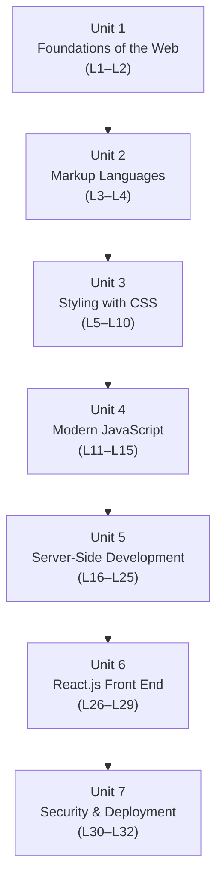

# Web Technologies (CSC336)

**Credit hours:** 3 (2 lecture + 1 lab) · **Pre-requisite:** CSC241 — Object Oriented Programming
**Audience:** BS Computer Science, 5th semester

Web Technologies is your first real dive into how the web actually works and how modern
websites and web applications are built — from a single static HTML page all the way to a
full-stack application with a database, a REST API, and a React front end.

This book assumes you already know how to program (variables, loops, functions, classes)
from your earlier programming courses. Nothing about the web itself is assumed — every new
term is explained the first time it shows up.

## Course objectives

- Explain the fundamental concepts of web architectures and their applications.
- Understand how to plan, design and publish a multi-page website.
- Get hands-on experience with client-side technologies: HTML, CSS, JavaScript and React.js.
- Get practical experience building dynamic web applications with modern full-stack technologies.

## What you will be able to do (Course Learning Outcomes)

| CLO | You will be able to... | Bloom's level |
|---|---|---|
| CLO-1 | Explain fundamental concepts, principles, architectures and technologies of web development | Understanding |
| CLO-2 | Apply web development principles to design responsive, interactive web interfaces | Applying |
| CLO-3 | Analyze approaches for building functional client-side and server-side web applications | Analyzing |
| CLO-4 | Implement functional web applications using appropriate front-end and back-end technologies | Applying |
| CLO-5 | Develop functional web applications using appropriate development technologies | Creating |

## How the book is organized

The 32 lectures are grouped into 7 units, matching the official course description form.
Click a unit to jump straight to its first lecture.

| Unit | Topic | Lectures |
|---|---|---|
| 1 | [Foundations of the Web](lecture-01-introduction-to-web-development.md) | 1–2 |
| 2 | [Markup Languages (HTML)](lecture-03-html-html5-fundamentals.md) | 3–4 |
| 3 | [Styling with CSS](lecture-05-css-fundamentals.md) | 5–10 |
| 4 | [Modern JavaScript (ES6+)](lecture-11-core-javascript-es6.md) | 11–15 |
| 5 | [Server-Side Development](lecture-16-introduction-to-server-side-programming.md) | 16–25 |
| 6 | [Front-End Development with React](lecture-26-introduction-to-react.md) | 26–29 |
| 7 | [Security and Deployment](lecture-30-application-security-basics.md) | 30–32 |

## Assessment

Quizzes, assignments and midterm each carry weight toward the theory component, with a
comprehensive final exam worth 50%. Lecture 17 is the midterm; lecture 32 wraps up with
domain setup and deployment.

## Recommended books

- *Web Design Playground: HTML & CSS the Interactive Way* — Paul McFedries (Manning, 2019)
- *Eloquent JavaScript*, 4th ed. — Marijn Haverbeke (2024)
- *Learning React: Modern Patterns for Developing React Apps*, 2nd ed. — Alex Banks & Eve Porcello (2020)
- *Learn React Hooks* — Daniel Bugl (2019)
- *Web Programming with HTML5, CSS, and JavaScript* — John Dean (Jones & Bartlett Learning, 2018)
- *Murach's Modern JavaScript* — Mary Delamater (2024)

---

Ready? Start with **[Lecture 1 — Introduction to Web Development](lecture-01-introduction-to-web-development.md)**.
