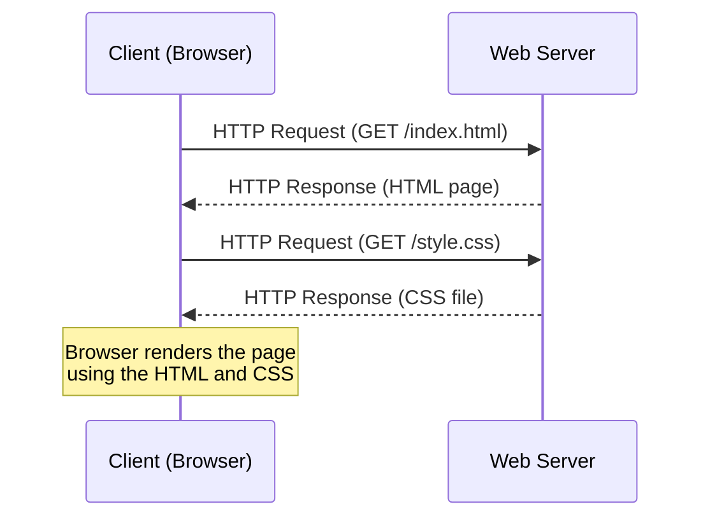
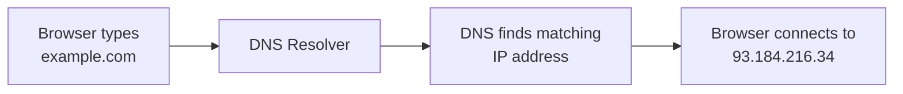
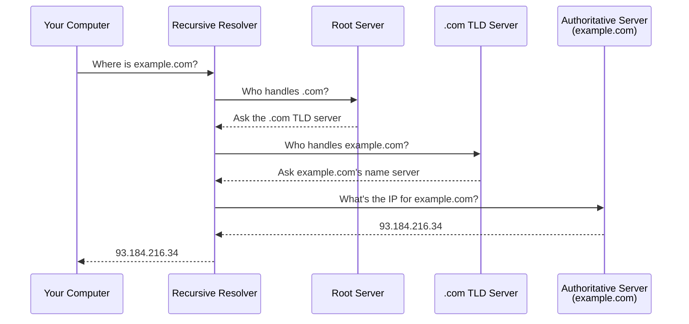
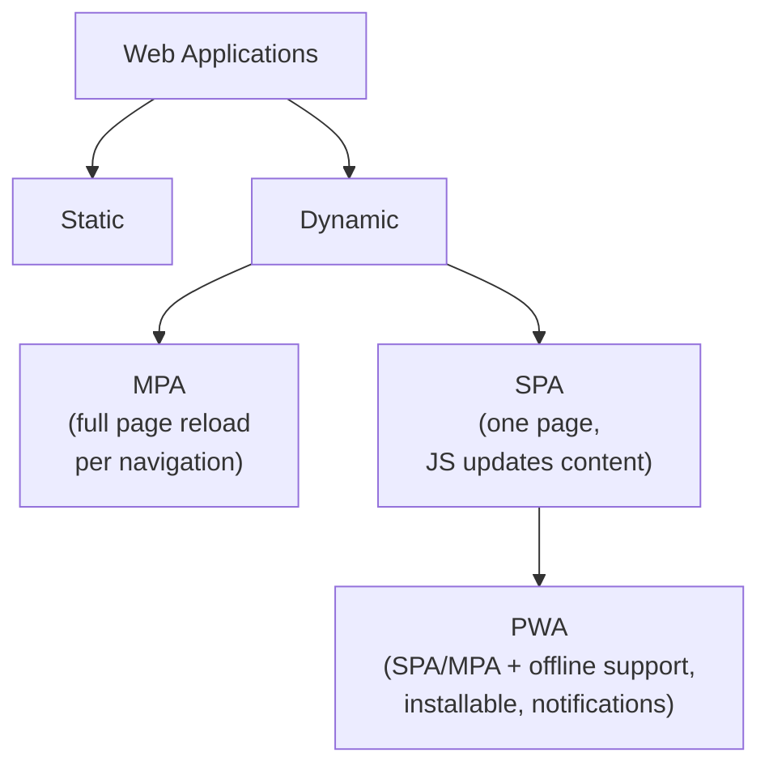
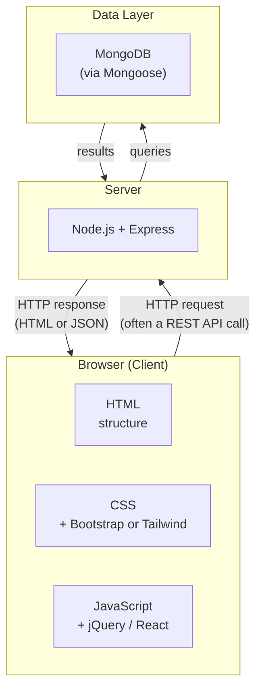

# Lecture 1: Introduction to Web Development

Welcome to Web Technologies! You already know how to program — you can write functions,
use loops, and think in objects. This course takes that skill and points it at the web:
by the end, you will be able to build and publish full applications that anyone can open
in a browser. This first lecture lays the groundwork by explaining what the web actually
is, how a browser talks to a server, and the vocabulary you will see in every lecture
that follows.

## In This Lecture

- Understand the difference between the Internet and the Web
- Learn the client-server request-response model that powers every website
- Define core terms: URL/URI, HTTP/HTTPS, DNS, hosting, web server, browser
- Identify the organizations that create and maintain web standards
- Compare static, dynamic, MPA, SPA, and PWA application types
- See the full technology landscape — where HTML, CSS, Bootstrap/Tailwind, JavaScript,
  jQuery, React, Node/Express, and MongoDB/Mongoose each fit, and what alternatives exist
  at every layer

## The Internet vs. the Web

People often use "the Internet" and "the Web" as if they mean the same thing. They don't.

The **Internet** is a giant network of interconnected computers that can send data to each
other. It has existed since the late 1960s (originally as a research project called
ARPANET) and it carries far more than websites — email, file transfers, online games,
video calls, and more all travel over the Internet. Think of the Internet as the roads,
cables, and traffic rules that let any two computers on Earth exchange data.

The **Web** (short for World Wide Web, or "WWW") is one specific *service* that runs on
top of the Internet. It was invented in 1989 by Tim Berners-Lee, and it is made of three
simple ideas working together:

1. **Documents** written in HTML (HyperText Markup Language) that can link to each other.
2. **Addresses** (URLs) that identify where each document lives.
3. **A protocol** (HTTP) that describes how to request and receive those documents.

!!! note "Analogy"
    The Internet is like the postal system — trucks, roads, and sorting centers that can
    deliver any package anywhere. The Web is like one specific kind of mail sent through
    that system, with its own envelope format and delivery rules. Email, file-sharing
    apps, and video streaming are other kinds of "mail" that use the same postal system
    but follow different rules.

Because the Web is just one application among many that use the Internet, you could lose
access to the Web (say, a browser problem) while still being connected to the Internet
through other apps.

## The Client-Server Request-Response Model

Almost everything in web development is built around one simple pattern: a **client**
asks for something, and a **server** answers.

- The **client** is the program that makes the request. In web development this is
  usually a web **browser** (Chrome, Firefox, Safari, Edge) running on a user's device.
- The **server** is a program (running on a powerful computer, usually far away) that
  listens for requests and sends back responses.

This is called a **request-response model**: the client sends a **request** ("please
send me this page"), and the server sends back a **response** (the page itself, or an
error if something went wrong). The server does nothing until a client asks it to —
it just waits and listens.



Notice that loading one web page can involve several request-response exchanges: one for
the HTML file, another for a stylesheet, another for an image, and so on. The browser
gathers everything and assembles it into the page you see.

!!! tip
    This client-server pattern is not limited to web pages. Later in this course, when
    you build a REST API, your React front end will be the "client" and your Node.js
    application will be the "server" — the same request-response idea, just carrying
    data (like JSON) instead of full HTML pages.

## Core Terminology

Before going further, let's define the terms you will see constantly throughout this
course.

### URL and URI

A **URI** (Uniform Resource Identifier) is any string that identifies a resource. A
**URL** (Uniform Resource Locator) is the most common kind of URI — one that also tells
you *where* to find the resource and *how* to fetch it. In everyday use, "URL" is what
people mean when they say "web address."

```text
https://www.example.com:443/courses/web-tech?semester=fall#lecture1
\___/   \_______________/ \_/\_______________/\_____________/\_______/
scheme      host          port      path          query        fragment
```

| Part | Meaning |
|---|---|
| `https://` | The **scheme** (protocol) to use — here, secure HTTP |
| `www.example.com` | The **host** — which server to contact |
| `:443` | The **port** — often left out because 443 is the default for HTTPS |
| `/courses/web-tech` | The **path** — which resource on that server |
| `?semester=fall` | The **query string** — extra parameters, as key=value pairs |
| `#lecture1` | The **fragment** — a specific spot within the page |

### HTTP and HTTPS

**HTTP** (HyperText Transfer Protocol) is the set of rules that defines how a browser and
a server exchange requests and responses. It defines things like: what a request looks
like, what methods exist (`GET` to fetch data, `POST` to send data, and others you will
meet later), and what status codes mean (like the famous `404 Not Found`).

```http
GET /index.html HTTP/1.1
Host: www.example.com
Accept: text/html

HTTP/1.1 200 OK
Content-Type: text/html
Content-Length: 1256

<html>...</html>
```

#### Anatomy of an HTTP Request

Every HTTP request — whether your browser sends it by loading a page, or your own
JavaScript sends it with `fetch()` — has the same three-part shape:

1. **Request line** — `METHOD /path HTTP/version`. The method says what you want to do,
   the path says which resource, and the version says which HTTP dialect you're speaking.
2. **Headers** — key-value pairs of metadata: which host you're asking for, what response
   formats you'll accept, who you are (`User-Agent`), whether you're carrying cookies, and
   more. A blank line marks the end of the headers.
3. **Body** (optional) — the actual data being sent. A `GET` request has no body, since
   everything it needs is already in the URL; methods like `POST` and `PUT` use the body
   to carry the data being created or updated.

| Method | Purpose |
|---|---|
| `GET` | Fetch a resource; should have no side effects |
| `POST` | Create a new resource, or submit data |
| `PUT` | Replace a resource entirely |
| `PATCH` | Update part of a resource |
| `DELETE` | Remove a resource |

You'll use all five constantly once you start building REST APIs (Lecture 25).

The response mirrors this same shape: a **status line** (`HTTP/1.1 200 OK`), headers, and
an optional body. The first digit of the status code tells you the category of the
outcome:

| Status range | Meaning | Example |
|---|---|---|
| `1xx` | Informational — request received, still processing | `100 Continue` |
| `2xx` | Success | `200 OK`, `201 Created` |
| `3xx` | Redirection — the resource moved | `301 Moved Permanently` |
| `4xx` | Client error — something about *your* request was wrong | `404 Not Found`, `403 Forbidden` |
| `5xx` | Server error — the server failed while handling a valid request | `500 Internal Server Error` |

**HTTPS** is HTTP with an added layer of encryption (called TLS/SSL). It scrambles the
data traveling between client and server so that nobody eavesdropping on the network can
read it. Today almost every site uses HTTPS, and browsers warn users when a site does
not.

!!! warning
    Never treat plain HTTP as safe for anything sensitive — passwords, credit card
    numbers, or personal data sent over HTTP can be intercepted. Always use HTTPS for
    real applications.

### DNS

Computers identify each other using numeric **IP addresses** (like `93.184.216.34`), not
names like `example.com`. Remembering numbers for every website would be painful, so we
use the **Domain Name System (DNS)** — essentially the phone book of the Internet. When
you type `example.com` into your browser, DNS translates ("resolves") that human-readable
name into the IP address of the server that hosts it.



DNS is not one giant database — it's organized as a hierarchy, and looking up a name means
walking down that hierarchy one level at a time:

- **Root servers** don't know any actual websites — they only know which servers handle
  each top-level domain (`.com`, `.org`, `.pk`, and so on).
- **TLD (top-level domain) servers** don't know your website either — they know which
  authoritative server is responsible for each domain registered under that TLD.
- **Authoritative name servers** hold the real records for one specific domain (for
  `example.com`, this is usually a DNS service run by its registrar or host).

You don't walk this hierarchy yourself on every request. Your computer asks a **recursive
resolver** (often run by your ISP, or a public service like Google's `8.8.8.8` or
Cloudflare's `1.1.1.1`) to do the walking and hand back just the final IP address:



#### Common DNS Record Types

A domain's authoritative server doesn't just store one address — it stores several kinds
of records, each answering a different question:

| Record | Purpose |
|---|---|
| `A` | Maps a domain name to an IPv4 address |
| `AAAA` | Maps a domain name to an IPv6 address |
| `CNAME` | Aliases one domain name to another (e.g., pointing `www.example.com` at `example.com`) |
| `MX` | Points to the mail servers responsible for a domain's email |
| `TXT` | Arbitrary text, often used to prove domain ownership or configure email security (SPF/DKIM) |
| `NS` | Lists the authoritative name servers for a domain |

!!! note "Caching and TTL"
    Resolved DNS answers are cached — by your browser, your operating system, and the
    recursive resolver — for a period set by the record's **TTL (Time To Live)**. Most
    lookups are therefore answered from a nearby cache in milliseconds rather than walking
    the full hierarchy. This caching is also why a DNS change (like pointing a domain at a
    new host) can take anywhere from minutes to a day to "propagate" everywhere — old,
    cached answers keep being served until their TTL expires.

### Hosting and Web Servers

**Hosting** means storing your website's files (and running the software that serves
them) on a computer that is connected to the Internet 24/7, so anyone can reach it at any
time. Companies that provide this service are called **web hosting providers** (examples
include Vercel, Netlify, AWS, and DigitalOcean).

A **web server** is the software (not the physical machine, though people use the word
both ways) that listens for HTTP requests and sends back responses. Common web server
software includes Apache, Nginx, and — as you will use later in this course — Node.js
with Express.

#### Types of Hosting

"Hosting" is not one product — it's a spectrum of options that trade off cost, control,
and how much server administration you have to do yourself:

| Hosting type | What it is | Best for |
|---|---|---|
| **Static hosting** | Serves pre-built HTML/CSS/JS files directly; no server-side code runs | Portfolios, documentation, marketing sites, and SPAs after they're built (Vercel, Netlify, GitHub Pages) |
| **Shared hosting** | Many websites share one physical server and its resources | Low-traffic personal sites and small businesses on a tight budget — cheap, but limited control and performance |
| **VPS (Virtual Private Server)** | A slice of a physical server reserved just for you, with full control over the OS | Developers who need more control than shared hosting but not a whole physical machine (DigitalOcean Droplets, Linode) |
| **Dedicated server** | An entire physical machine reserved for one customer | High-traffic sites with large, predictable, sustained resource needs |
| **Platform as a Service (PaaS)** | You push your code; the platform handles the server, scaling, and deployment for you | Full-stack apps where you'd rather focus on code than infrastructure (Render, Railway, Heroku) |
| **Serverless / Functions** | Your code runs only in response to a request, in short-lived functions the platform manages | APIs with unpredictable or spiky traffic, where you don't want to pay for an idle server (Vercel/Netlify Functions, AWS Lambda) |
| **Cloud infrastructure (IaaS)** | Rent raw compute, storage, and networking building blocks and assemble them yourself | Large-scale or enterprise applications that need fine-grained control over every layer (AWS, Google Cloud, Azure) |

!!! tip "Choosing for a course project"
    For projects in this course, static hosting (Vercel/Netlify) is normally enough for
    your React front end, and a PaaS (Render/Railway) is the easiest way to host a Node +
    Express + MongoDB backend without administering a server yourself. Save VPS,
    dedicated, and IaaS options for when you specifically want to practice server
    administration — they hand you the most control, but also the most setup work.

### Browser

A **browser** is the client application end-users interact with. It sends HTTP requests,
receives HTML/CSS/JavaScript in response, and renders that into the visual page you see
and interact with. Popular browsers include Chrome, Firefox, Safari, and Edge — each one
is built by a different company but they all aim to follow the same web standards, which
brings us to the next topic.

#### Cross-Browser Compatibility

Browsers "aim to follow the same standards," but they don't run identical code. Each is
built on a different **rendering engine** — Chrome and Edge use **Blink**, Firefox uses
**Gecko**, and Safari uses **WebKit** — and each engine can ship a new feature early, lag
behind on another, or interpret an ambiguous part of a spec slightly differently. The
practical result: the same HTML, CSS, or JavaScript can look or behave a little differently
depending on which browser opens it. Common examples you'll run into:

- A newer CSS feature (like `:has()` or container queries) works in some browsers before
  others.
- Default styling of form elements — buttons, checkboxes, `<select>` — differs noticeably
  between browsers unless you reset it yourself.
- Older browser versions (historically Internet Explorer, and older Safari releases) tend
  to lag furthest behind on new JavaScript and CSS features.

**How developers handle this in practice:**

| Technique | What it does |
|---|---|
| [caniuse.com](https://caniuse.com/) | Check real-world browser support for a feature before relying on it |
| Vendor prefixes (`-webkit-`, `-moz-`) | Opt into an engine's experimental implementation of a CSS property before it's standardized |
| Feature detection | Check whether a feature actually exists at runtime before using it, instead of assuming every browser has it |
| Progressive enhancement | Build a baseline experience that works everywhere, then layer on enhancements for browsers that support them |
| Autoprefixer / Babel | Build tools that automatically add vendor prefixes or transpile modern JS down to a version older browsers understand |
| [BrowserStack](https://www.browserstack.com/) and similar tools | Test your site on real browsers and devices you don't personally own |

!!! tip
    You don't need to memorize every browser quirk. The habit that matters is: check
    caniuse.com before relying on a newer feature, and test your project in at least two
    different browser engines (for example, Chrome and Firefox) before calling it done.

## Web Standards Bodies

If every browser interpreted HTML or JavaScript differently, the web would be chaos —
a page that works in one browser might break in another. **Web standards** are documents
that define exactly how web technologies should behave, so that browser makers,
developers, and tool builders are all working from the same rulebook. Several
organizations maintain these standards:

| Organization | Full Name | What It Governs |
|---|---|---|
| **W3C** | World Wide Web Consortium | Founded by Tim Berners-Lee; publishes standards for HTML, CSS, accessibility (WCAG), and more. Works through member companies and public working groups. |
| **WHATWG** | Web Hypertext Application Technology Working Group | Formed by browser vendors (Apple, Mozilla, Google, Microsoft) to maintain the "HTML Living Standard" — HTML as it actually evolves in real browsers, updated continuously rather than in fixed versions. |
| **ECMA** (Ecma International) | — | Standardizes **ECMAScript**, the official specification that JavaScript implements. Each yearly release (ES2015, ES2020, etc.) is called an "ECMAScript edition." |
| **IETF** | Internet Engineering Task Force | Standardizes core Internet protocols, including HTTP itself, TLS (the encryption behind HTTPS), and DNS. Publishes specifications called **RFCs** (Request for Comments). |

!!! note
    You don't need to memorize every detail of these organizations, but you should
    recognize their names — you will encounter them again when reading official
    documentation (for example, MDN Web Docs references W3C and WHATWG specifications
    directly).

## Types of Web Applications

Not all websites work the same way. As you build projects in this course, you will
choose (or be told to build) one of these types, so it helps to understand them now.

### Static Websites

A **static** website serves the exact same HTML file to every visitor. Nothing changes
based on who is asking or what they do — the server just hands over a file it already
has, unchanged. A simple portfolio page with fixed text and images is a classic example.

### Dynamic Websites

A **dynamic** website generates (or modifies) content based on data, user input, or
context before sending a response. For example, a social media feed shows different
posts to different users, and the content is built on the fly using data from a
database. Most real-world applications are dynamic.

### Multi-Page Applications (MPA)

An **MPA** is the traditional web model: every time you navigate to a new section, the
browser requests a brand-new HTML page from the server and reloads the entire page.
Online newspapers and most e-commerce sites (like early Amazon) work this way.

### Single-Page Applications (SPA)

An **SPA** loads one HTML page initially, then uses JavaScript to update the content
in place — fetching only the data it needs (often as JSON) and redrawing parts of the
page without a full reload. This feels faster and smoother once loaded. You will build
SPAs later in this course using React.

### Progressive Web Apps (PWA)

A **PWA** is a web application built to behave like a native mobile/desktop app: it can
work offline (or on a poor connection), be "installed" to a device's home screen, and
send push notifications — while still being built with standard web technologies (HTML,
CSS, JavaScript).

### Comparing the Types



| Type | Content changes per user? | Full page reloads? | Typical use case |
|---|---|---|---|
| Static | No | Yes (but content never changes) | Portfolio, documentation |
| Dynamic (MPA) | Yes | Yes, on every navigation | News sites, traditional e-commerce |
| SPA | Yes | No, after initial load | Dashboards, social apps, admin panels |
| PWA | Yes | No | Apps that need offline access or installability |

!!! tip
    These categories are not mutually exclusive. An SPA is almost always dynamic, and a
    PWA is usually built as an SPA with extra capabilities layered on top.

## The Technology Landscape: Where Everything Fits

Over this course and its sequel (Advanced Web Technologies, CSC337), you will learn one
specific, complete stack: **HTML, CSS, Bootstrap or Tailwind, JavaScript, jQuery, React,
Node.js with Express, and MongoDB with Mongoose** — commonly nicknamed the **MERN stack**
(**M**ongoDB, **E**xpress, **R**eact, **N**ode). Before you learn any one piece in depth,
it helps to see the whole map: which layer of a web application each technology belongs
to, and what else exists at that same layer. Every layer below has multiple valid
options — this course picks one path through the map, but you will meet people, job
listings, and codebases that picked different ones, and you should be able to recognize
them.



### Markup: Structuring Content

| This course | What it does |
|---|---|
| **HTML** | The only markup language browsers understand — there is no real alternative *in the browser itself*. |

You will, however, see HTML *generated* by other tools rather than written by hand once
you reach server-side templates (Lecture 24) and React's JSX (Lecture 26) — those are
different ways of producing HTML, not different markup languages.

### Styling: Making It Look Good

| Category | This course | Alternatives |
|---|---|---|
| Plain CSS | CSS3 | — (CSS itself has no real substitute; you must know it regardless of what else you use) |
| CSS preprocessors | — | [Sass/SCSS](https://sass-lang.com/), [Less](https://lesscss.org/) — add variables, nesting, and functions on top of CSS, compiled down to plain CSS |
| Component-based CSS frameworks | [Bootstrap](https://getbootstrap.com/) | [Bulma](https://bulma.io/), [Foundation](https://get.foundation/) |
| Utility-first CSS frameworks | [Tailwind CSS](https://tailwindcss.com/) | [UnoCSS](https://unocss.dev/) |
| Pre-built component libraries | — | [MUI](https://mui.com/), [Chakra UI](https://www.chakra-ui.com/), [shadcn/ui](https://ui.shadcn.com/) — usually built on top of React + a styling approach above |

### Client-Side Scripting

| Category | This course | Alternatives |
|---|---|---|
| The language itself | JavaScript (ES6+) | [TypeScript](https://www.typescriptlang.org/) — a typed superset of JavaScript that compiles to plain JS; increasingly common in real projects |
| DOM/AJAX helper library | [jQuery](https://jquery.com/) | Modern vanilla JS (`querySelector`, `fetch`) now covers most of what jQuery was for — jQuery is still common in older/legacy codebases, which is why this course covers it |

### Front-End Frameworks (Building Full UIs)

| This course | Alternatives |
|---|---|
| [React](https://react.dev/) | [Vue](https://vuejs.org/), [Angular](https://angular.dev/), [Svelte](https://svelte.dev/), [SolidJS](https://www.solidjs.com/) |

All of these solve the same core problem (building UI out of reusable, data-driven
components) with different trade-offs in syntax and philosophy. Once you understand React
well, picking up any of the others is mostly a matter of new syntax around familiar ideas.

### Server-Side Runtime and Frameworks

| This course | Alternatives |
|---|---|
| [Node.js](https://nodejs.org/) + [Express](https://expressjs.com/) | Python: [Django](https://www.djangoproject.com/), [FastAPI](https://fastapi.tiangolo.com/), [Flask](https://flask.palletsprojects.com/) |
| | Ruby: [Ruby on Rails](https://rubyonrails.org/) |
| | PHP: [Laravel](https://laravel.com/) |
| | Java/Kotlin: [Spring Boot](https://spring.io/projects/spring-boot) |
| | C#: [ASP.NET Core](https://dotnet.microsoft.com/en-us/apps/aspnet) |
| | Full-stack JS frameworks: [Next.js](https://nextjs.org/) (covered in CSC337) |

### Databases

| This course | Alternatives |
|---|---|
| [MongoDB](https://www.mongodb.com/) (via [Mongoose](https://mongoosejs.com/)) — a **NoSQL** document database | Relational (**SQL**): [PostgreSQL](https://www.postgresql.org/), [MySQL](https://www.mysql.com/), [SQLite](https://www.sqlite.org/) |
| | SQL ORMs: [Prisma](https://www.prisma.io/), [Sequelize](https://sequelize.org/), [TypeORM](https://typeorm.io/) |
| | Other NoSQL/managed options: [Firebase/Firestore](https://firebase.google.com/), [Redis](https://redis.io/) (mainly caching and sessions) |

!!! note "SQL vs. NoSQL, in one sentence"
    Reach for a relational database (PostgreSQL, MySQL) when your data is highly
    structured and relationships between records matter a lot (orders, payments,
    accounting); reach for MongoDB when your data is naturally document-shaped and the
    schema needs to flex as your application grows. This course uses MongoDB because it
    pairs naturally with JSON, which is also what your React front end and Express API
    will be passing back and forth.

### Deployment and Hosting

| Category | Options |
|---|---|
| Frontend / static / serverless | [Vercel](https://vercel.com/), [Netlify](https://www.netlify.com/) |
| Full-stack apps + managed databases | [Render](https://render.com/), [Railway](https://railway.app/) |
| Full control, enterprise-scale | [AWS](https://aws.amazon.com/), [Google Cloud](https://cloud.google.com/), [Azure](https://azure.microsoft.com/) |

### Tooling You'll Use Regardless of the Stack

| Tool | Purpose |
|---|---|
| [Git](https://git-scm.com/) + [GitHub](https://github.com/) | Version control and collaboration — required for every project in this course |
| [npm](https://www.npmjs.com/) (or [pnpm](https://pnpm.io/), [Yarn](https://yarnpkg.com/)) | Installing and managing JavaScript packages |
| [Vite](https://vitejs.dev/) | The build tool you'll use to set up your React project (Lecture 26) |

### What You Actually Need to Know as a MERN Stack Developer

The table above lists a lot of technology — you are **not** expected to learn all of it.
The goal is to know this course's stack deeply, and recognize the alternatives well
enough that they don't confuse you in a job posting, a tutorial, or someone else's
codebase.

| Skill | How well you need to know it |
|---|---|
| HTML | Solid — non-negotiable, everything ends up as this |
| CSS | Solid — non-negotiable |
| A CSS framework | **At least one** of Bootstrap or Tailwind, deeply — not both. Once you know one well, learning the other later takes a day, not a semester |
| JavaScript (ES6+) | Strong — the single most important skill in this entire stack |
| jQuery | Awareness, not mastery — enough to read and maintain an older codebase that uses it |
| React | Solid — the "R" in MERN |
| Node.js + Express | Solid — the "N" and "E" in MERN |
| MongoDB + Mongoose | Solid — the "M" in MERN. Basic SQL/PostgreSQL awareness is a valuable bonus, not a requirement |
| Git and GitHub | Solid — required for any real project, solo or team |
| REST API design | Solid — you will design and consume APIs constantly from Lecture 18 onward |
| Deployment | Working knowledge of **at least one** platform (e.g., Vercel for the frontend, Render for the backend) |
| TypeScript | Nice to have — increasingly expected in job listings, not required to start this course |
| A second front-end framework (Vue, Svelte, ...) | Not required — the underlying concepts transfer once you know React |

!!! tip "The pick-one pattern"
    Notice the pattern: for CSS frameworks, front-end frameworks, backend frameworks, and
    databases, there is a *category* of tools that solve the same problem, and this course
    commits to one option per category (Bootstrap/Tailwind, React, Express, MongoDB) so
    you can go deep instead of shallow. Depth in one option per category, plus awareness
    of what else exists, is exactly what makes a developer employable — not having
    surface-level exposure to every tool on this page.

## Try It Yourself

1. Open your browser's developer tools (press `F12` or right-click → "Inspect"), go to
   the **Network** tab, and visit any website. Reload the page and observe the list of
   requests — find the very first HTML request and note its status code and response
   headers.
2. Pick any URL you use often (for example, your university's website). Break it down
   into its scheme, host, path, and query string parts, the way we did in the URL
   diagram above. Is it served over HTTP or HTTPS?

## Key Takeaways

- The **Internet** is the underlying global network; the **Web** is one service (pages,
  links, HTTP) that runs on top of it.
- The web works through a **client-server, request-response model**: browsers request,
  servers respond.
- **URL/URI** identify resources, **HTTP/HTTPS** define how they're transferred, **DNS**
  translates domain names to IP addresses, and **hosting** keeps a **web server**
  reachable at all times.
- Web standards bodies — **W3C**, **WHATWG**, **ECMA**, and **IETF** — keep browsers and
  developers speaking the same language.
- Applications range from simple **static** sites to **dynamic** ones, and can be built
  as traditional **MPAs**, faster-feeling **SPAs**, or installable, offline-capable
  **PWAs**.
- This course teaches the **MERN stack** (MongoDB, Express, React, Node) plus Bootstrap/
  Tailwind and jQuery — one valid path through a landscape where every layer (styling,
  front end, back end, database) has real alternatives; the goal is depth in this stack,
  not shallow exposure to all of them.
