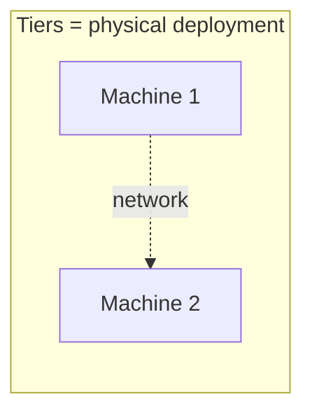
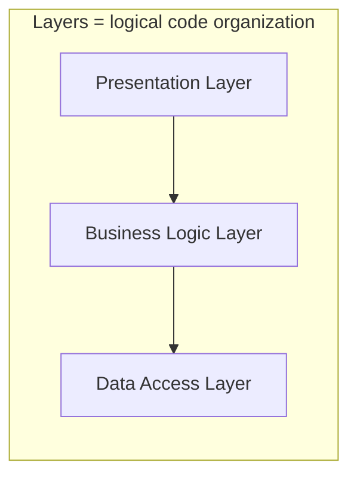
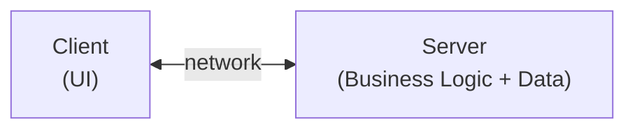
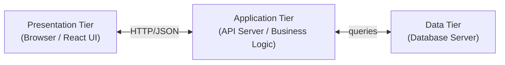
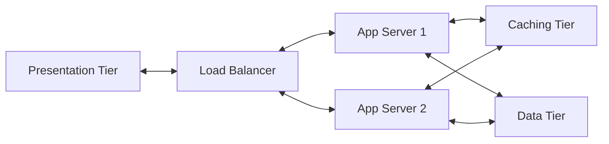
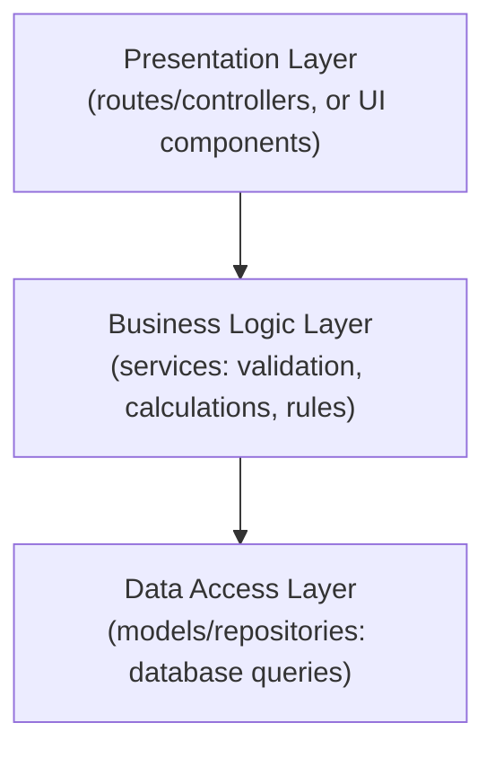
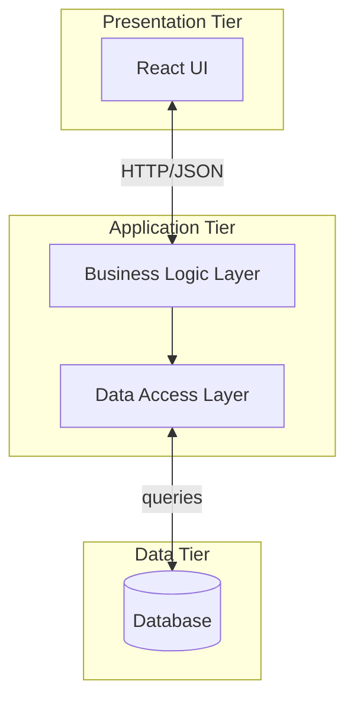

# Lecture 2: Tiered Web Architecture

Every web application has to organize its code and computers somehow. In this lecture
you will learn the standard ways of organizing a web application into "tiers" — from the
simplest single-computer program to the multi-computer systems that power large
websites — and how to reason about which one to pick.

## In This Lecture

- Distinguish between tiers (physical deployment) and layers (logical code organization)
- Learn the common layers inside a typical application, and how they combine with tiers
- Understand one-tier (standalone) architecture and when it's used
- Understand two-tier (client-server) architecture, its advantages and limitations
- Understand three-tier and N-tier architecture
- Learn how to choose an architecture based on scalability, maintainability, and cost

## Tiers vs. Layers: Two Different Ideas

The words "tier" and "layer" are often used loosely, but in software architecture they
mean two different things, and it's important to keep them separate.

- A **tier** is a **physical (deployment) boundary**. It describes *where* a piece of
  the application actually runs — which machine, process, or container it's deployed on.
  If two pieces of an application run on different computers, they are in different
  tiers.
- A **layer** is a **logical boundary** inside your code. It describes *how you organize
  responsibilities* within a program — for example, separating the code that talks to
  the database from the code that handles business rules from the code that renders the
  user interface. Layers can all live on the very same machine, in the very same
  process.

Both ideas serve the same underlying goal: **separation of concerns** — keeping
different responsibilities in different, well-defined parts of the system so that each
part is easier to understand, change, and test independently. But tiers separate
*physically* (across machines/processes), while layers separate *logically* (across
code modules), and one does not require the other.

!!! note "A layered app can still be one tier"
    You could write a program with clean layers — a data layer, a business-logic layer,
    a presentation layer — and still run the entire thing on a single laptop as one
    process. That would be **one tier** (everything deployed together) but **multiple
    layers** (well-organized code). Tiers and layers are independent design decisions.





With that distinction clear, let's look at the main tiered architectures used in web
development, from simplest to most complex.

## One-Tier (Standalone) Architecture

In a **one-tier** (also called **standalone** or **single-tier**) architecture, the
entire application — user interface, business logic, and data storage — runs on a
single machine, in a single process. There is no network communication between separate
tiers because there's only one tier to begin with.

**Example:** A desktop calculator app, or a simple Python script that reads data from a
local file, processes it, and prints a result to the console. Even a basic static HTML
file opened directly in your browser via `file:///` (with no web server at all) is
effectively one-tier — the browser reads the file straight from disk and there's no
client-server exchange happening.

```text
[ Your Computer ]
   ├── User Interface
   ├── Application Logic
   └── Data (local file / in-memory)
```

!!! tip
    One-tier applications are the easiest to build and deploy — there's no network, no
    server to configure, no database connection to manage. But they only work for a
    single user on a single machine; they cannot be shared over the Internet as-is.

## Two-Tier (Client-Server) Architecture

A **two-tier** architecture splits the application across two separate physical
locations: a **client** (runs on the user's device, e.g., a browser or a desktop app)
and a **server** (runs elsewhere, typically hosting both the business logic and the
data). The client and server communicate over a network — this is the client-server
model you learned about in Lecture 1, now viewed as an architecture pattern.



A classic real-world example is an early desktop database application: a Windows program
installed on each employee's PC (the client) that connects directly to a shared database
server over the company network to read and write records.

On the web, a simple example is a small web app where the server both renders HTML pages
*and* directly queries the database to fill them in — the browser is the client, and
everything else (logic + database) sits together on one server machine.

### Advantages of Two-Tier

- **Simple to build and reason about** — only two moving parts.
- **Centralized data** — all clients see the same up-to-date data, since it lives in one
  place.
- **Lower initial cost** — fewer servers to set up, configure, and pay for compared to
  more complex architectures.

### Limitations of Two-Tier

- **Scalability bottleneck** — as more clients connect, the single server must handle UI
  logic, business rules, *and* database queries all at once, which can overwhelm it.
- **Tight coupling** — because business logic and data access are bundled together on
  the server, changing one often risks breaking the other, and it's harder to reuse the
  logic elsewhere (e.g., for a mobile app that wants the same data).
- **Harder to maintain at scale** — a single large server component handling everything
  becomes complex and risky to update, since one change can have wide-reaching effects.
- **Single point of failure** — if that one server goes down, the whole application
  becomes unavailable.

## Three-Tier / N-Tier Architecture

A **three-tier** architecture splits the server side itself into two further tiers,
giving three tiers total:

1. **Presentation Tier** — the client-facing UI (e.g., a browser rendering HTML/CSS/JS,
   or a React front end).
2. **Application (Logic) Tier** — a server dedicated to business rules and processing
   (e.g., a Node.js/Express API server). This tier is often called the "middle tier."
3. **Data Tier** — a separate server dedicated to storing and managing data (e.g., a
   MongoDB or PostgreSQL database server).



This is exactly the shape of the MERN-style stack you will build later in this course:
a React front end (presentation), an Express/Node.js API (application), and MongoDB
(data) — each capable of running on its own machine.

**N-tier** is simply the generalization of this idea: an application can be split into
*any* number of tiers, not just three, when it's useful to do so. For example, a large
system might add:

- A **caching tier** (e.g., Redis) between the application and data tiers to speed up
  repeated requests.
- A **load balancer tier** in front of multiple application servers to distribute
  traffic.
- A separate **authentication tier** dedicated to verifying user identity.



### Advantages of Three-Tier / N-Tier

- **Independent scaling** — you can add more application servers without touching the
  database, or scale the database separately from the UI.
- **Separation of concerns across machines** — each tier can be developed, updated, and
  deployed by different teams without stepping on each other.
- **Reusability** — the same application/API tier can serve multiple clients (a web
  front end, a mobile app, a third-party integration) since it doesn't bundle UI code.
- **Better fault isolation** — a problem in one tier is less likely to bring down the
  entire system.

### Limitations of Three-Tier / N-Tier

- **More complexity** — more moving parts means more configuration, more network calls,
  and more potential points of failure to monitor.
- **Higher cost** — more servers (or cloud services) generally means a bigger hosting
  bill.
- **Network latency** — communication between tiers happens over a network, which is
  slower than function calls within a single process.

## Layered Architecture

Every example so far has focused on **tiers** — where code physically runs. Now let's
look at **layers** — how code is logically organized *within* any one of those tiers.
Layers matter just as much as tiers: even a simple one-tier script benefits from being
organized into layers, and understanding layers now will make the Express applications
you build starting in Unit 5 far easier to follow.

### The Three Common Layers

Most web applications — no matter how many tiers they're deployed across — organize
their code into three logical layers:

1. **Presentation Layer** — the part responsible for showing information to the user
   and capturing their input. In a browser, this is your HTML/CSS/JS or React
   components; on a server that returns JSON, it's the code that shapes the response
   sent back to whatever is calling it. Its job is *only* to display and collect data —
   it should not contain business rules.
2. **Business Logic Layer** (also called the **Application Layer** or **Service
   Layer**) — the actual rules of your application: validating a discount code,
   calculating an order total, deciding whether a user is allowed to delete a post. This
   layer doesn't know or care *how* its results will be displayed, or *where* its data
   comes from — it just applies the rules.
3. **Data Access Layer** (also called the **Persistence Layer** or **Repository
   Layer**) — the code that actually talks to the database: running queries, and
   reading or writing records. This layer doesn't know or care about business rules or
   how the UI looks — it just stores and retrieves data.



A request flows *down* through the layers, and the response flows back *up* — each
layer only ever talks to the layer directly next to it, never skipping ahead.

### Why Bother Separating Layers?

- **Swap technology in one layer without touching the others.** If you decide to
  migrate from MongoDB to PostgreSQL, only the data access layer needs to change — the
  business logic and presentation layers don't need to know or care.
- **Test business logic without a real database.** Because the business logic layer
  doesn't call the database directly, you can test it by substituting ("mocking") the
  data access layer with fake data, making tests fast and independent of a real
  database connection.
- **Reuse the same business logic from multiple presentation layers.** A web front end
  and a mobile app can both call the same business logic layer (through an API), so
  rules like "an order total must include tax" are written once, not duplicated.
- **Easier to reason about and debug.** If a page shows the wrong currency symbol,
  that's obviously a presentation-layer bug; if an order total is calculated wrong,
  that's a business-logic bug — the layer boundaries tell you where to look first.

### A Concrete Example: Layers Inside a Node.js/Express Application

Here is what these three layers typically look like as actual folders and files in a
Node.js/Express project — the same kind of structure you will build starting in Unit 5:

```text
project/
├── routes/            <- Presentation layer: defines URLs, reads the request,
│   └── orders.js         sends back a response. No business rules here.
├── services/          <- Business logic layer: validation, calculations, rules.
│   └── orderService.js   Knows nothing about HTTP or the database.
├── models/            <- Data access layer: talks to the database (e.g. via
│   └── Order.js          Mongoose). Knows nothing about business rules.
└── app.js
```

Tracing a single request through these layers, in plain pseudocode:

```text
POST /orders  arrives at  routes/orders.js
    -> routes/orders.js reads the request body, then calls
       orderService.createOrder(data)

services/orderService.js  (business logic)
    -> checks that requested items are in stock
    -> calculates the total price, including tax
    -> calls Order.save(orderData)   [data access layer]

models/Order.js  (data access)
    -> runs the actual database insert
    -> returns the saved record back up to the service

services/orderService.js
    -> returns the result back up to the route

routes/orders.js
    -> formats and sends the JSON response back to the client
```

Notice that `routes/orders.js` never talks to the database directly, and
`models/Order.js` never makes a business decision — each layer sticks to its own job.

### Layers Combine With Tiers

Tiers and layers are independent, but real applications use both together:

- In a **one-tier** script, all three layers can still exist as separate functions or
  files — they're just all loaded into the same process on the same machine.
- In the **two-tier** example from earlier (a server that renders HTML *and* queries
  the database directly), the presentation and business logic layers typically live
  together on the server tier, while the data itself sits in a separate database — the
  data access layer is the thin bridge between them.
- In a **three-tier** MERN-style setup, the presentation layer maps naturally onto the
  Presentation Tier (the React app), while the Application Tier internally contains
  *both* the business logic layer and the data access layer, which then makes network
  calls to the separate Data Tier.



!!! note "A naming trap: 'N-layer' vs. 'N-tier'"
    You will sometimes see "layered architecture" called **N-layer architecture** —
    which sounds almost identical to **N-tier architecture** from earlier in this
    lecture, and is a common source of confusion. Keep the distinction from the start
    of this lecture in mind: **N-tier is about how many machines/processes** your
    application is physically split across; **N-layer is about how many logical
    groupings** your code is organized into on any one of those machines. A single
    physical tier can (and usually should) still be internally organized into several
    layers.

## Choosing an Architecture

There is no single "best" architecture — the right choice depends on trade-offs between
three main factors:

| Factor | Question to ask |
|---|---|
| **Scalability** | Will the number of users grow significantly? Do different parts of the system need to grow at different rates (e.g., more app servers but the same database)? |
| **Maintainability** | Will multiple developers or teams work on this? Do you need to update one part without risking breaking another? |
| **Cost** | What is your budget for servers/hosting? Can you afford the added operational complexity (monitoring, deployment, networking) that more tiers bring? |

A simple guideline:

- Choose **one-tier** for personal tools, scripts, or prototypes that only you will ever
  run, with no need to share data over a network.
- Choose **two-tier** for small applications with a modest, fairly stable number of
  users, where simplicity and low cost matter more than independent scaling.
- Choose **three-tier / N-tier** for applications expected to grow, serve many
  simultaneous users, or be built and maintained by a team over a long period of time —
  the added complexity pays for itself through flexibility and resilience.

!!! warning
    Adding more tiers is not automatically "better." A three-tier setup for a small
    class project adds deployment overhead (multiple servers, network configuration)
    that isn't justified if the project will never need to scale. Match the
    architecture to the actual requirements, not to what sounds most impressive.

## Try It Yourself

1. Think of a web or mobile application you use daily (e.g., a chat app, an online
   store). Sketch (on paper or using a mermaid `flowchart`) what you think its tiers
   might look like, and label what you believe runs in each tier.
2. Take the two-tier example from this lecture (a server that both serves HTML and
   queries the database directly) and describe, in a few sentences, how you would split
   it into three tiers. What new component would you introduce, and what would move
   into it?
3. Pick any app on your phone. Without knowing its actual code, guess at three pieces
   of logic it probably has and sort each one into a presentation, business logic, or
   data access layer (for example: "shows a red badge on the icon when you have unread
   messages" is presentation; "decides you've qualified for free shipping over a
   certain amount" is business logic).

## Key Takeaways

- **Tiers** are physical/deployment boundaries (different machines or processes);
  **layers** are logical boundaries within code. Both aim at **separation of concerns**,
  but independently of each other.
- **One-tier (standalone)** architecture runs everything on a single machine — simplest
  to build, but not shareable over a network.
- **Two-tier (client-server)** architecture splits UI from server logic + data — simple
  and centralized, but harder to scale and maintain as it grows, and has a single point
  of failure.
- **Three-tier** architecture separates presentation, application logic, and data onto
  three independent tiers, enabling independent scaling and reuse — at the cost of added
  complexity.
- **N-tier** generalizes this further, adding tiers like caching or load balancing as
  needed.
- Most applications also organize their code into three **layers**: a **presentation
  layer** (display/input), a **business logic layer** (rules and calculations), and a
  **data access layer** (talking to the database) — each layer only talks to its
  neighbor, never skipping ahead.
- Layers make it possible to swap technology, test business logic without a real
  database, and reuse the same logic behind multiple presentation layers.
- Tiers and layers combine: a single tier is usually still organized into multiple
  layers internally, and "N-layer" (logical) should not be confused with "N-tier"
  (physical).
- Choosing an architecture is a trade-off between **scalability**, **maintainability**,
  and **cost** — match the architecture to your application's actual needs, not to
  complexity for its own sake.
