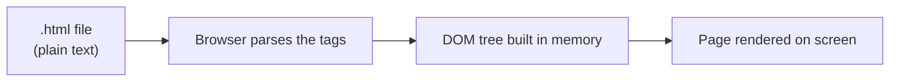
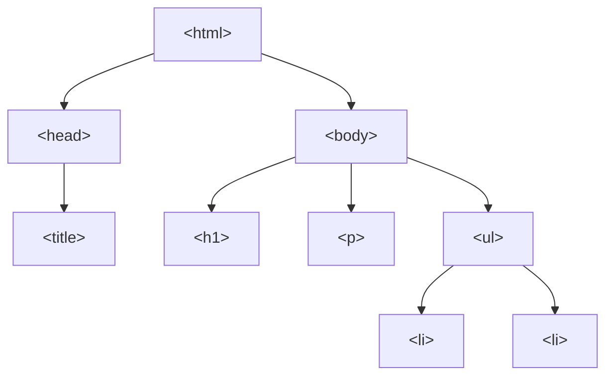

# Lecture 3: HTML and HTML5 Fundamentals

Every web page you have ever visited is built out of HTML. In this lecture you will learn
what HTML actually is, how a page is structured, and how to write the tags that display
text, links, images, media, tables, and lists — the raw ingredients of every website.

## In This Lecture

- Understand the role of markup languages and why HTML is one
- Learn the standard structure of an HTML document
- Understand elements, tags, attributes, nesting rules, and validation
- Write headings, paragraphs, formatted text, and hyperlinks (absolute vs. relative)
- Add images, audio, and video to a page
- Build tables and the three types of lists
- Learn what HTML5 added to the language, and why browser support matters

## What Is a Markup Language?

A **markup language** is a system for adding labels — called **tags** — to plain text so
that a computer program knows how to display or process it. The tags themselves are not
part of the content the reader sees; they describe the *role* of the content around them.

HTML stands for **HyperText Markup Language**. Let's unpack that name:

- **HyperText** means text that contains links to other text (or other pages). This is the
  idea that lets you click a word and jump to a different page — the foundation of the
  entire web.
- **Markup** means the text is annotated with tags that describe its structure: "this is a
  heading," "this is a paragraph," "this is a list."
- **Language** means there are rules (a grammar) that every browser agrees to follow when
  reading the tags.

!!! note "HTML is not a programming language"
    HTML has no variables, loops, or conditions. It cannot *compute* anything. It only
    describes the **structure and content** of a page — what is a heading, what is a
    paragraph, what is a link. Later lectures introduce CSS (for appearance) and
    JavaScript (for behavior and logic).

Every browser (Chrome, Firefox, Edge, Safari) reads your HTML file and builds an internal
tree-like representation of it called the **DOM** (Document Object Model), then draws
("renders") that tree on the screen.



## HTML Document Structure

Every valid HTML file follows the same basic skeleton. Save the following as `index.html`
and open it in any browser to see it work:

```html
<!DOCTYPE html>
<html lang="en">
<head>
    <meta charset="UTF-8">
    <title>My First Page</title>
</head>
<body>
    <h1>Hello, Web!</h1>
    <p>This is my first HTML page.</p>
</body>
</html>
```

Let's go through each part:

- **`<!DOCTYPE html>`** — This must be the very first line. It is not a tag in the usual
  sense; it is a special instruction telling the browser "treat this file as modern HTML5."
  Without it, older browsers may switch into a compatibility mode called "quirks mode" that
  renders pages inconsistently.
- **`<html>`** — The **root element**. Every other tag in the page lives inside this one.
  The `lang="en"` part tells screen readers and search engines the page is written in
  English.
- **`<head>`** — Contains information *about* the page that is not displayed directly on
  the page itself: the page title (shown in the browser tab), character encoding, links to
  CSS files, and metadata for search engines.
- **`<meta charset="UTF-8">`** — Tells the browser which character encoding to use so that
  text (including non-English characters) displays correctly.
- **`<title>`** — The text shown in the browser's tab and in search-engine results.
- **`<body>`** — Contains everything the visitor actually sees: headings, paragraphs,
  images, links, and so on.

!!! tip "Try it now"
    Copy the example above into a text editor, save it with a `.html` extension, and
    double-click the file. It should open directly in your default browser. This is the
    entire "run" process for plain HTML — no installation, no compiler.

## Elements, Tags, and Attributes

An **element** is a complete unit of content, made up of an **opening tag**, the content,
and a **closing tag**:

```html
<p>This is a paragraph element.</p>
```

- `<p>` is the opening tag.
- `This is a paragraph element.` is the content.
- `</p>` is the closing tag (notice the forward slash).

Some elements have no content and no closing tag. These are called **void elements** or
**self-closing elements**:

```html
<br>

<input type="text">
```

### Attributes

An **attribute** provides extra information about an element. Attributes are written
inside the opening tag as `name="value"` pairs:

```html
<a href="https://www.comsats.edu.pk" target="_blank">Visit COMSATS</a>
```

Here, `<a>` is the element (a hyperlink), `href` is an attribute specifying the destination
URL, and `target="_blank"` is an attribute telling the browser to open the link in a new
tab. An element can have multiple attributes, separated by spaces, and attribute values
should always be wrapped in quotes.

### Nesting Rules

Elements can be placed inside other elements — this is called **nesting**. When you nest
elements, the inner element must close *before* the outer one closes, like nested boxes:

```html
<!-- Correct nesting -->
<p>This is <strong>very important</strong> text.</p>

<!-- WRONG: tags overlap incorrectly -->
<p>This is <strong>very important</p></strong>
```

!!! warning "Overlapping tags break the page"
    Browsers try their best to recover from broken HTML, but the result is unpredictable.
    Always close tags in the reverse order you opened them: last opened, first closed.

### Document Validation

Because browsers are forgiving, it is easy to write HTML with small mistakes (a missing
closing tag, a misspelled attribute) and still see something on screen — but the result
might look wrong in a different browser. **Validating** your HTML means checking it against
the official HTML rules using a tool such as the
[W3C Markup Validation Service](https://validator.w3.org/). Validating your pages, especially
early on, helps you catch mistakes before they cause confusing bugs.

## Headings, Paragraphs, and Text Formatting

HTML provides six levels of headings, `<h1>` through `<h6>`, from most to least important:

```html
<h1>Chapter Title</h1>
<h2>Section Heading</h2>
<h3>Sub-section Heading</h3>
```

!!! note "Only one `<h1>` per page"
    Use `<h1>` for the main title of the page, and step down through `<h2>`, `<h3>`, and so
    on for sub-headings. Skipping levels (going from `<h1>` straight to `<h4>`) or using
    multiple `<h1>` tags confuses screen readers and hurts search-engine ranking.

Regular text goes inside a paragraph element:

```html
<p>The web is made up of billions of pages linked together by hyperlinks.</p>
```

Common text-formatting elements:

| Tag | Meaning | Example |
|---|---|---|
| `<strong>` | Important text (bold) | `<strong>Warning</strong>` |
| `<em>` | Emphasized text (italic) | `<em>really</em>` |
| `<b>` | Bold, no extra importance | `<b>Bold text</b>` |
| `<i>` | Italic, no extra importance | `<i>Italic text</i>` |
| `<mark>` | Highlighted text | `<mark>highlighted</mark>` |
| `<small>` | Smaller/fine print | `<small>terms apply</small>` |
| `<sub>` / `<sup>` | Subscript / superscript | `H<sub>2</sub>O`, `x<sup>2</sup>` |
| `<br>` | Line break | `Line one<br>Line two` |
| `<hr>` | Horizontal rule (divider line) | `<hr>` |

## Hyperlinks: Absolute vs. Relative URLs

A **hyperlink** (or just "link") lets a user click text or an image to navigate to another
page. Links are created with the `<a>` (anchor) element and its `href` (hypertext
reference) attribute:

```html
<a href="https://www.google.com">Go to Google</a>
```

There are two kinds of URLs you can put in `href`:

- **Absolute URL** — the *complete* address, including the protocol (`https://`) and
  domain name. Use this to link to a page on a *different* website.

  ```html
  <a href="https://en.wikipedia.org/wiki/HTML">HTML on Wikipedia</a>
  ```

- **Relative URL** — a path relative to the *current* page's location, used to link to
  another page within your own site. It does not include the domain name.

  ```html
  <a href="about.html">About Us</a>
  <a href="pages/contact.html">Contact (in a subfolder)</a>
  <a href="../index.html">Back to home (one folder up)</a>
  ```

!!! tip "When to use which"
    Use absolute URLs for links leaving your site, and relative URLs for links that stay
    within your own site. Relative URLs have a big advantage: if you move your entire
    website to a new domain, none of your internal links break.

You can also link to a specific spot on the *same* page using an `id` and a `#` fragment:

```html
<a href="#contact">Jump to Contact section</a>
...
<h2 id="contact">Contact</h2>
```

## Images

The `` element embeds an image. It is a void element (no closing tag) and requires two
key attributes:

```html

```

- `src` (source) — the path to the image file, which can be relative or absolute, just like
  a link's `href`.
- `alt` (alternative text) — a text description of the image, shown if the image fails to
  load and read aloud by screen readers for visually impaired users. **Never skip `alt`.**
- `width` and `height` — optional, but recommended, so the browser can reserve space for
  the image before it finishes loading (this prevents the page from jumping around).

## Audio and Video

HTML5 introduced native elements for playing media, without needing any external plugin
(older sites relied on Flash for this, which no longer works in modern browsers):

```html
<audio controls>
    <source src="song.mp3" type="audio/mpeg">
    Your browser does not support the audio element.
</audio>

<video width="480" controls>
    <source src="movie.mp4" type="video/mp4">
    Your browser does not support the video element.
</video>
```

- The `controls` attribute makes the browser show a built-in play/pause/volume bar.
- The `<source>` child element specifies the actual file; you can list several `<source>`
  tags with different formats so the browser picks the one it supports.
- The plain text inside the tags ("Your browser does not support...") is a **fallback**,
  shown only in very old browsers that don't recognize `<audio>`/`<video>` at all.

## Tables

A table is built out of rows and cells using `<table>`, `<tr>` (table row), `<th>` (table
header cell), and `<td>` (table data cell):

```html
<table>
    <thead>
        <tr>
            <th>Name</th>
            <th>Course</th>
            <th>Grade</th>
        </tr>
    </thead>
    <tbody>
        <tr>
            <td>Ali</td>
            <td>CSC336</td>
            <td>A</td>
        </tr>
        <tr>
            <td>Sara</td>
            <td>CSC336</td>
            <td>A+</td>
        </tr>
    </tbody>
</table>
```

- `<thead>` groups the header row(s); `<tbody>` groups the actual data rows. Both are
  optional but recommended for clarity and styling.
- `<th>` cells are for column/row labels and are bold and centered by default.
- `<td>` cells hold the actual data.

!!! warning "Tables are for tabular data, not page layout"
    In the early days of the web, designers used tables to arrange entire page layouts
    (menus, sidebars, columns). This is now considered bad practice because it confuses
    screen readers and mixes structure with appearance. Use tables only for genuinely
    tabular data (spreadsheet-like information); use CSS for page layout, as you'll learn
    in later lectures.

## Lists

HTML has three kinds of lists:

**Unordered list** — a bulleted list, for items with no particular sequence:

```html
<ul>
    <li>HTML</li>
    <li>CSS</li>
    <li>JavaScript</li>
</ul>
```

**Ordered list** — a numbered list, for items where order matters:

```html
<ol>
    <li>Write the HTML</li>
    <li>Add CSS styling</li>
    <li>Add JavaScript behavior</li>
</ol>
```

**Description list** — pairs of terms and their descriptions (useful for glossaries or
key-value data):

```html
<dl>
    <dt>HTML</dt>
    <dd>The markup language used to structure web pages.</dd>
    <dt>CSS</dt>
    <dd>The language used to style web pages.</dd>
</dl>
```

- `<dl>` — description list (the container)
- `<dt>` — description term (the word being defined)
- `<dd>` — description details (the definition itself)

Lists can also be **nested**: put a whole `<ul>` or `<ol>` inside an `<li>` to create
sub-lists.

## HTML5: What Changed and Why It Matters

HTML5 is the current version of the HTML standard, published in 2014 and continuously
updated since. Before HTML5, developers often relied on generic `<div>` tags with class
names like `class="header"` or `class="footer"` to organize pages, and browser plugins
(like Flash) to play audio and video. HTML5 fixed both problems.

**New elements introduced in HTML5** include:

- Semantic layout elements: `<header>`, `<nav>`, `<main>`, `<section>`, `<article>`,
  `<aside>`, `<footer>` (covered in detail in the next lecture)
- Media elements: `<audio>`, `<video>`, `<source>`, `<track>`
- Graphics: `<canvas>` (for drawing with JavaScript) and native `<svg>` support
- Form improvements: `<datalist>`, `<output>`, and many new `<input>` types (covered in
  Lecture 4)
- `<figure>` and `<figcaption>` for images with captions

**New attributes introduced in HTML5** include:

- `placeholder`, `required`, `pattern`, `autofocus` on form inputs
- `data-*` — custom "data attributes" that let you attach your own data to any element,
  which JavaScript can later read:

  ```html
  <li data-user-id="42">Ali Khan</li>
  ```

- `contenteditable` — makes any element directly editable by the user in the browser
- `draggable` — makes an element draggable with the mouse

### Browser Support Considerations

Not every browser (and not every version of a browser) supports every HTML5 feature. Before
you rely on a newer feature in a real project, it is good practice to check
[caniuse.com](https://caniuse.com), a free website that shows exactly which browsers and
versions support a given feature.

!!! tip "Progressive enhancement"
    A common strategy is to design your page so it still works reasonably well in older
    browsers, and only *enhances* the experience for browsers that support the newer
    feature — for example, the fallback text inside `<video>` you saw earlier. This
    strategy is called **progressive enhancement**.

## The Document Tree

Because HTML elements nest inside each other, an HTML document naturally forms a tree
structure. This is exactly what the browser's DOM represents:



## Try It Yourself

1. Create a file called `profile.html`. Give it a proper `<!DOCTYPE html>`, `<html>`,
   `<head>` (with a `<title>`), and `<body>`. Inside the body, add an `<h1>` with your
   name, a paragraph describing yourself, an image of anything (with a proper `alt`
   attribute), and an unordered list of three of your hobbies.
2. Add a small table listing three courses you are taking this semester, their course
   codes, and your expected grade. Then add a relative link at the bottom of the page that
   points to a second file called `contact.html` (it doesn't need to exist yet — just write
   the link).

## Key Takeaways

- HTML is a markup language: it describes structure and content, not appearance or logic.
- Every HTML document starts with `<!DOCTYPE html>` and has `<html>`, `<head>`, and `<body>`.
- Elements are made of opening/closing tags; attributes add extra information inside the
  opening tag; tags must be nested (closed) in the correct order.
- Absolute URLs point to other websites; relative URLs point within your own site and
  survive a domain move.
- ``, `<audio>`, and `<video>` embed media directly, without needing plugins.
- Tables (`<table>`, `<tr>`, `<th>`, `<td>`) are for tabular data only, not page layout.
- HTML has three list types: unordered (`<ul>`), ordered (`<ol>`), and description (`<dl>`).
- HTML5 added semantic elements, native media support, and new attributes like `data-*`;
  always check browser support for newer features before relying on them.
