# Lecture 3: HTML and HTML5 Fundamentals

Every web page you have ever visited is built out of HTML. In this lecture you will learn
what HTML actually is, how a page is structured, and how to write the tags that display
text, links, images, media, tables, and lists — the raw ingredients of every website.

## In This Lecture

- Understand the role of markup languages and why HTML is one
- Learn the standard structure of an HTML document
- Understand elements, tags, attributes, nesting rules, and validation
- Recognize void (self-closing) elements like `<br>` and `<hr>`
- Tell block-level elements and inline elements apart, and know why it matters
- Use common HTML attributes, including global and boolean attributes, with real examples
- Write headings, paragraphs, formatted text, and hyperlinks (internal vs. external)
- Understand why the old `<font>` tag is obsolete, and use `<pre>`/`<code>` and HTML
  entities correctly
- Add images (including image links), audio, and video to a page
- Build tables and the three types of lists, including nested lists
- Learn what HTML5 added to the language, and why browser support matters

## What Is a Markup Language?

A **markup language** is a system for adding labels — called **tags** — to plain text so
that a computer program knows how to display or process it. The tags themselves are not
part of the content the reader sees; they describe the *role* of the content around them.

HTML stands for **HyperText Markup Language**. Let's unpack that name:

- **HyperText** means text that contains links to other text (or other pages). This is the
  idea that lets you click a word and jump to a different page — the foundation of the
  entire web.
- **Markup** means the text is annotated with tags that describe its structure: "this is a
  heading," "this is a paragraph," "this is a list."
- **Language** means there are rules (a grammar) that every browser agrees to follow when
  reading the tags.

!!! note "HTML is not a programming language"
    HTML has no variables, loops, or conditions. It cannot *compute* anything. It only
    describes the **structure and content** of a page — what is a heading, what is a
    paragraph, what is a link. Later lectures introduce CSS (for appearance) and
    JavaScript (for behavior and logic).

Every browser (Chrome, Firefox, Edge, Safari) reads your HTML file and builds an internal
tree-like representation of it called the **DOM** (Document Object Model), then draws
("renders") that tree on the screen.

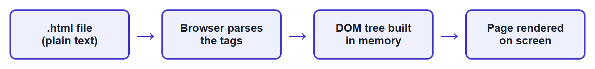

## HTML Document Structure

Every valid HTML file follows the same basic skeleton. Save the following as `index.html`
and open it in any browser to see it work:

```html
<!DOCTYPE html>
<html lang="en">
<head>
    <meta charset="UTF-8">
    <title>My First Page</title>
</head>
<body>
    <h1>Hello, Web!</h1>
    <p>This is my first HTML page.</p>
</body>
</html>
```

Rendered in a browser, the `<head>` content is invisible and only the `<body>` shows:

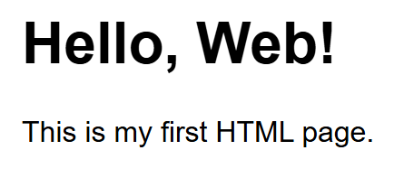

Let's go through each part:

- **`<!DOCTYPE html>`** — This must be the very first line. It is not a tag in the usual
  sense; it is a special instruction telling the browser "treat this file as modern HTML5."
  Without it, older browsers may switch into a compatibility mode called "quirks mode" that
  renders pages inconsistently.
- **`<html>`** — The **root element**. Every other tag in the page lives inside this one.
  The `lang="en"` part tells screen readers and search engines the page is written in
  English.
- **`<head>`** — Contains information *about* the page that is not displayed directly on
  the page itself: the page title (shown in the browser tab), character encoding, links to
  CSS files, and metadata for search engines.
- **`<meta charset="UTF-8">`** — Tells the browser which character encoding to use so that
  text (including non-English characters) displays correctly.
- **`<title>`** — The text shown in the browser's tab and in search-engine results.
- **`<body>`** — Contains everything the visitor actually sees: headings, paragraphs,
  images, links, and so on.

!!! tip "Try it now"
    Copy the example above into a text editor, save it with a `.html` extension, and
    double-click the file. It should open directly in your default browser. This is the
    entire "run" process for plain HTML — no installation, no compiler.

## Elements, Tags, and Attributes

An **element** is a complete unit of content, made up of an **opening tag**, the content,
and a **closing tag**:

```html
<p>This is a paragraph element.</p>
```

- `<p>` is the opening tag.
- `This is a paragraph element.` is the content.
- `</p>` is the closing tag (notice the forward slash).

### Void (Self-Closing) Elements

Some elements have no content and therefore no closing tag at all — you cannot write
`<br></br>`, because there is nothing to put between an opening and closing `<br>`. These
are called **void elements** (also commonly called "self-closing" elements):

```html
<br>
<hr>

<input type="text">
```

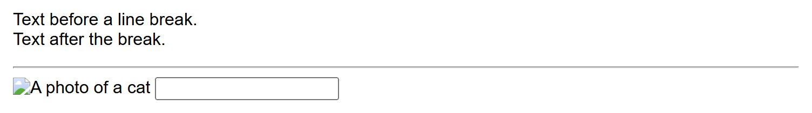

Notice the broken-image icon: `cat.jpg` doesn't actually exist in this example, so the
browser falls back to showing the `alt` text right where the image would have been — a
preview of why `alt` matters, covered properly in the Images section below.

| Element | What it does |
|---|---|
| `<br>` | A single line break within text — forces the following content onto a new line |
| `<hr>` | A "horizontal rule": a thematic divider line, used to separate sections of content |
| `` | Embeds an image (covered in detail later in this lecture) |
| `<input>` | A form control (covered in Lecture 4) |
| `<meta>` | Document metadata, used inside `<head>` |
| `<link>` | Links an external resource such as a CSS file, used inside `<head>` |
| `<area>`, `<base>`, `<col>`, `<embed>`, `<source>`, `<track>`, `<wbr>` | Less common void elements you will meet as needed |

!!! note "`<br>` vs. `<br />`"
    You will see void elements written two ways: `<br>` (plain HTML5 style) and `<br />`
    (with a trailing slash, inherited from the stricter XHTML standard). Both are valid
    HTML5 and render identically — the trailing slash is optional, purely a style choice.
    This book uses the plain `<br>` form.

!!! warning "Don't confuse void elements with elements that are just often empty"
    `<div></div>` is *not* a void element — it is a completely normal element that simply
    has no content in this example, and it absolutely does need its closing tag. Void
    elements are a fixed, specific list (the ones in the table above); everything else
    follows the normal opening-tag/content/closing-tag pattern.

### Block-Level vs. Inline Elements

Every HTML element falls into one of two layout categories, which controls how it behaves
next to other elements *before any CSS is applied at all*:

- A **block-level element** always starts on a new line and stretches to fill the full
  width available to it, pushing whatever comes after it down to the next line. Think of
  it as a box stacked on top of other boxes.
- An **inline element** does not start on a new line — it flows *within* the surrounding
  text, taking up only as much width as its content needs, like a word in the middle of a
  sentence.

```html
<!-- p and h1 are block-level: each starts on its own line -->
<h1>Page Title</h1>
<p>This is a paragraph.</p>
<p>This is another paragraph, on its own line below.</p>

<!-- strong and a are inline: they sit inside the flow of the sentence -->
<p>This word is <strong>important</strong>, and this is a <a href="#">link</a> in the middle of a sentence.</p>
```

Here's the same code, rendered in a browser — notice the heading and both paragraphs each
claim a full line, while `<strong>` and `<a>` sit *inside* the last paragraph's line:

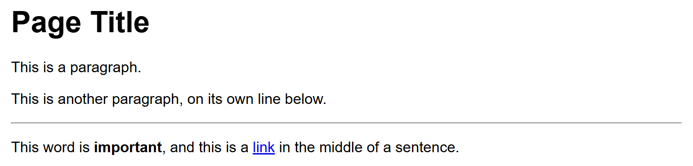

| | Block-level | Inline |
|---|---|---|
| Starts on a new line? | Yes | No — flows with surrounding content |
| Takes full available width? | Yes, by default | No — only as wide as its content |
| Can contain other block elements? | Usually yes | No — only other inline elements or text |
| Examples | `<h1>`-`<h6>`, `<p>`, `<div>`, `<ul>`, `<ol>`, `<li>`, `<table>`, `<form>`, `<section>` | `<a>`, `<strong>`, `<em>`, `<span>`, ``, `<br>`, `<input>`, `<label>` |

!!! tip "You already know several of each"
    Every heading and paragraph tag you've used so far in this lecture is block-level;
    `<a>`, `<strong>`, and `<em>` from the formatting table below are inline. `<div>`
    (a generic block container) and `<span>` (a generic inline container) — the two most
    common "no inherent meaning, just a box" elements — are covered in the next lecture
    alongside semantic HTML. CSS can override this default behavior (with the `display`
    property, in Lecture 6), but the default block/inline behavior is what you get with no
    CSS at all.

### Attributes

An **attribute** provides extra information about an element, without being part of the
content the reader sees. Attributes are written inside the *opening* tag only, as
`name="value"` pairs, separated by spaces:

```html
<a href="https://www.comsats.edu.pk" target="_blank">Visit COMSATS</a>
```

Here, `<a>` is the element (a hyperlink), `href` is an attribute specifying the destination
URL, and `target="_blank"` is an attribute telling the browser to open the link in a new
tab. Attribute values should always be wrapped in quotes (double quotes are the
convention this book uses).

Some frequently used attributes work the same way on almost *any* element — these are
called **global attributes**:

| Attribute | Purpose | Example |
|---|---|---|
| `id` | A unique identifier for one specific element on the page (no two elements should share an `id`) | `<h2 id="contact">Contact</h2>` |
| `class` | One or more category names, shared by many elements, used by CSS and JavaScript to target them as a group | `<p class="warning-text">Careful!</p>` |
| `title` | Extra information shown as a tooltip on hover | `<abbr title="World Wide Web Consortium">W3C</abbr>` |
| `style` | Inline CSS applied to just this one element (covered properly in the CSS lectures) | `<p style="color: red;">Urgent</p>` |
| `lang` | The (human) language of this element's content | `<p lang="fr">Bonjour</p>` |
| `data-*` | A custom attribute for attaching your own data, read later by JavaScript (an HTML5 addition — see later in this lecture) | `<li data-user-id="42">Ali Khan</li>` |

Other attributes are specific to one element — `href` and `target` only make sense on
`<a>`; `src` and `alt` only make sense on ``; you'll meet each as you meet the
element it belongs to.

Not every attribute takes a value. A **boolean attribute** is either present (meaning
"true") or absent (meaning "false") — it does not need `="value"` at all:

```html
<input type="text" required>
<input type="checkbox" checked>
<button disabled>Can't click me</button>
```

Here is everything from this section rendered together — the link, an `<abbr>` using
`title` (hover it in a real browser to see the tooltip), a `style`-colored paragraph, and
the three boolean-attribute form controls (notice the pre-checked checkbox and the
grayed-out disabled button):


Writing `required="required"` is also valid HTML5 (some developers do this for clarity in
JSX/React code, which you'll meet later in this course), but the bare `required` form
shown above is what you'll see most often in plain HTML.

An element can have as many attributes as it needs, in any order, separated by spaces:

```html

```

### Nesting Rules

Elements can be placed inside other elements — this is called **nesting**. When you nest
elements, the inner element must close *before* the outer one closes, like nested boxes:

```html
<!-- Correct nesting -->
<p>This is <strong>very important</strong> text.</p>

<!-- WRONG: tags overlap incorrectly -->
<p>This is <strong>very important</p></strong>
```

!!! warning "Overlapping tags break the page"
    Browsers try their best to recover from broken HTML, but the result is unpredictable.
    Always close tags in the reverse order you opened them: last opened, first closed.

### Document Validation

Because browsers are forgiving, it is easy to write HTML with small mistakes (a missing
closing tag, a misspelled attribute) and still see something on screen — but the result
might look wrong in a different browser. **Validating** your HTML means checking it against
the official HTML rules using a tool such as the
[W3C Markup Validation Service](https://validator.w3.org/). Validating your pages, especially
early on, helps you catch mistakes before they cause confusing bugs.

## Headings, Paragraphs, and Text Formatting

HTML provides six levels of headings, `<h1>` through `<h6>`, from most to least important:

```html
<h1>Chapter Title</h1>
<h2>Section Heading</h2>
<h3>Sub-section Heading</h3>
```

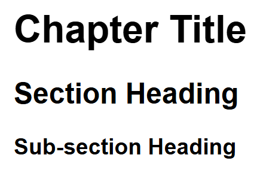

!!! note "Only one `<h1>` per page"
    Use `<h1>` for the main title of the page, and step down through `<h2>`, `<h3>`, and so
    on for sub-headings. Skipping levels (going from `<h1>` straight to `<h4>`) or using
    multiple `<h1>` tags confuses screen readers and hurts search-engine ranking.

Regular text goes inside a paragraph element:

```html
<p>The web is made up of billions of pages linked together by hyperlinks.</p>
```

Common text-formatting elements:

| Tag | Meaning | Example |
|---|---|---|
| `<strong>` | Important text (bold) | `<strong>Warning</strong>` |
| `<em>` | Emphasized text (italic) | `<em>really</em>` |
| `<b>` | Bold, no extra importance | `<b>Bold text</b>` |
| `<i>` | Italic, no extra importance | `<i>Italic text</i>` |
| `<mark>` | Highlighted text | `<mark>highlighted</mark>` |
| `<small>` | Smaller/fine print | `<small>terms apply</small>` |
| `<sub>` / `<sup>` | Subscript / superscript | `H<sub>2</sub>O`, `x<sup>2</sup>` |
| `<br>` | Line break | `Line one<br>Line two` |
| `<hr>` | Horizontal rule (divider line) | `<hr>` |

All of these rendered together:


## The `<font>` Tag (and Why We Don't Use It for Styling)

Before CSS existed, HTML had its own built-in way to change a piece of text's color, size,
and typeface: the `<font>` element.

```html
<font color="red" size="5" face="Arial">This text is red, size 5, Arial font.</font>
```

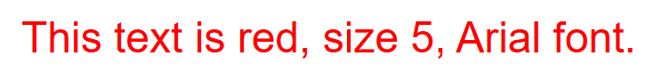

- `color` — the text color, as a name (`red`) or a hex code (`#FF0000`).
- `size` — a number from `1` (smallest) to `7` (largest) — not a pixel or point value, just
  a relative scale defined by the browser.
- `face` — the font family to use, if the visitor's device has it installed.

!!! warning "Do not use `<font>` — it is obsolete"
    The `<font>` tag still renders in every modern browser (browsers keep old features
    working so old pages don't break), but it was **removed from the HTML5 specification**
    and should never be used in new code. There are several real reasons why, not just
    "it's old":

    - **It mixes structure with appearance.** HTML is supposed to describe *what* something
      is (a heading, a warning, a quote); `<font>` describes *how it looks*, which is CSS's
      job. Mixing the two makes pages harder to maintain.
    - **It does not scale.** Changing the color of every warning message on a 50-page site
      built with `<font color="red">` means editing all 50 pages by hand. The same change
      with CSS means editing one rule in one stylesheet.
    - **It has no responsive or interactive ability.** `<font>` cannot change on hover, on a
      smaller screen, or in dark mode — CSS can do all of this.
    - **It fails accessibility and validation.** `<font>` is flagged as an error by the
      [W3C Markup Validator](https://validator.w3.org/), and screen readers get no useful
      information from it beyond the raw text.

    The modern equivalent of the example above is a single line of CSS (which you'll learn
    starting in the next unit):

    ```html
    <p style="color: red; font-size: 24px; font-family: Arial;">This text is red, size 24px, Arial font.</p>
    ```

    Or, better still, a reusable class defined once in a stylesheet and applied to as many
    elements as needed.

## `<pre>`, `<code>`, and Other Technical Text Tags

HTML has a small family of elements specifically for showing technical content — code,
commands, and quotations — instead of ordinary prose.

```html
<pre>
function greet() {
    console.log("Hello!");
}
</pre>

<p>Use the <code>console.log()</code> function to print output.</p>

<p>Press <kbd>Ctrl</kbd> + <kbd>C</kbd> to copy.</p>

<p>The command printed: <samp>Build succeeded</samp></p>

<p>Replace <var>filename</var> with your own file's name.</p>

<blockquote>
    The Web does not just connect machines, it connects people.
</blockquote>
```

| Tag | Meaning |
|---|---|
| `<pre>` | **Preformatted text** — preserves every space, tab, and line break exactly as written, and renders in a monospace font. Without it, HTML collapses multiple spaces and line breaks into a single space. |
| `<code>` | An inline snippet of computer code, rendered in a monospace font. |
| `<kbd>` | Keyboard input — a key or key combination the user should press. |
| `<samp>` | Sample output from a program or command. |
| `<var>` | A variable name or placeholder value the reader should substitute. |
| `<blockquote>` | A longer, block-level quotation from another source. |

!!! tip "`<pre>` and `<code>` together"
    For a multi-line code block (like the ones throughout this book), `<pre>` and `<code>`
    are normally used *together* — `<pre><code>...</code></pre>` — `<pre>` preserves the
    formatting, and `<code>` labels the content as code. Using `<code>` alone is for a short
    snippet sitting *inside* a sentence, like `console.log()` above.

## HTML Entities

Some characters cannot be typed directly into HTML, either because the browser would
misread them as markup, or because they don't exist on a standard keyboard. **HTML
entities** are special codes, always starting with `&` and ending with `;`, that stand in
for these characters.

```html
<p>5 &lt; 10 and 10 &gt; 5</p>
<p>Copyright &copy; 2025 &mdash; All rights reserved</p>
<p>Click&nbsp;Here&nbsp;Now (no line break allowed between these words)</p>
```

| Entity | Renders as | Why you need it |
|---|---|---|
| `&lt;` | `<` | A literal `<` would be read as the start of a tag |
| `&gt;` | `>` | A literal `>` would be read as the end of a tag |
| `&amp;` | `&` | A literal `&` would be read as the start of another entity |
| `&nbsp;` | (a space) | A **non-breaking space** — a space that browsers will never break a line on, useful for keeping two words glued together |
| `&copy;` | © | Copyright symbol — not on most keyboards |
| `&mdash;` | — | An em dash, longer than a regular hyphen |
| `&quot;` | `"` | A literal double quote, occasionally needed inside an attribute value |

!!! note "Why HTML collapses whitespace matters here"
    Remember that HTML normally collapses multiple spaces into one. Typing two spaces
    between words in your source code has no visible effect — but `&nbsp;` is not collapsed,
    because the browser treats it as a real, protected character rather than ordinary
    whitespace.

## Hyperlinks: Internal and External Links

A **hyperlink** (or just "link") lets a user click text or an image to navigate to another
page. Links are created with the `<a>` (anchor) element and its `href` (hypertext
reference) attribute:

```html
<a href="https://www.google.com">Go to Google</a>
```

Links fall into two categories, based on where they use an **absolute** or a **relative**
URL:

### External Links (Absolute URLs)

An **external link** points to a page on a *different* website. It always uses an
**absolute URL** — the *complete* address, including the protocol (`https://`) and domain
name:

```html
<a href="https://en.wikipedia.org/wiki/HTML">HTML on Wikipedia</a>
<a href="https://www.comsats.edu.pk" target="_blank" rel="noopener noreferrer">Visit COMSATS (new tab)</a>
```

`target="_blank"` opens the link in a new browser tab, which is common for external links so
the visitor doesn't lose your page. When you use `target="_blank"`, always add
`rel="noopener noreferrer"` too — it's a security measure that stops the new tab from being
able to control the page that opened it.

### Internal Links (Relative URLs)

An **internal link** points to another page *within your own site*. It uses a **relative
URL** — a path relative to the *current* page's location — and does not include the domain
name at all:

```html
<a href="about.html">About Us</a>
<a href="pages/contact.html">Contact (in a subfolder)</a>
<a href="../index.html">Back to home (one folder up)</a>
```

All the links above, rendered together (external links first, then internal ones):

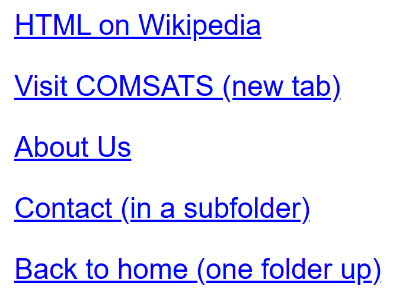

!!! tip "When to use which"
    Use external (absolute) links for anything leaving your site, and internal (relative)
    links for anything that stays within it. Internal links have a big advantage: if you
    move your entire website to a new domain, none of them break, because they never
    contained the domain name in the first place.

You can also link to a specific spot on the *same* page using an `id` and a `#` fragment —
this is technically still an internal link, just to a location instead of a whole new page:

```html
<a href="#contact">Jump to Contact section</a>
...
<h2 id="contact">Contact</h2>
```

### Other Link Types

Two special-purpose `href` values don't point to a web page at all:

```html
<a href="mailto:info@comsats.edu.pk">Email Us</a>
<a href="tel:+923001234567">Call Us</a>
```

`mailto:` opens the visitor's default email application with a new message addressed to
that address; `tel:` opens their phone/dialer app on a mobile device — genuinely useful on
a contact page.

## Images

The `` element embeds an image. It is a void element (no closing tag) and requires two
key attributes:

```html

```


- `src` (source) — the path to the image file, which can be relative or absolute, just like
  a link's `href`.
- `alt` (alternative text) — a text description of the image, shown if the image fails to
  load and read aloud by screen readers for visually impaired users. **Never skip `alt`.**
- `width` and `height` — optional, but recommended, so the browser can reserve space for
  the image before it finishes loading (this prevents the page from jumping around).

### Making an Image a Link

Just like text, an image can be a clickable link — simply wrap the `` element inside
an `<a>` element:

```html
<a href="https://www.comsats.edu.pk">
    
</a>
```

The whole image becomes clickable, navigating to whatever `href` points to (an internal
page, an external site, or even a `mailto:`/`tel:` link, exactly as with a text link).

!!! tip "Write `alt` text for what the link does, not just what the image shows"
    When an image is also a link, its `alt` text is what a screen-reader user hears in
    place of *both* the image and the link's purpose — so "COMSATS logo — click to visit
    the COMSATS website" is more useful than just "COMSATS logo."

!!! note "That blue border around old linked images"
    Older browsers used to draw a blue outline around any image wrapped in a link (the same
    highlight color used for text links). Every modern browser has removed this by default,
    but if you ever see it, it's removed with one line of CSS: `img { border: none; }`.

## Audio and Video

HTML5 introduced native elements for playing media, without needing any external plugin
(older sites relied on Flash for this, which no longer works in modern browsers):

```html
<audio controls>
    <source src="song.mp3" type="audio/mpeg">
    Your browser does not support the audio element.
</audio>

<video width="480" controls>
    <source src="movie.mp4" type="video/mp4">
    Your browser does not support the video element.
</video>
```

Even without a real, playable file behind `song.mp3`/`movie.mp4`, the browser still draws
its native player controls, because `controls` is a boolean attribute that only depends on
being present — not on whether a file actually loads:

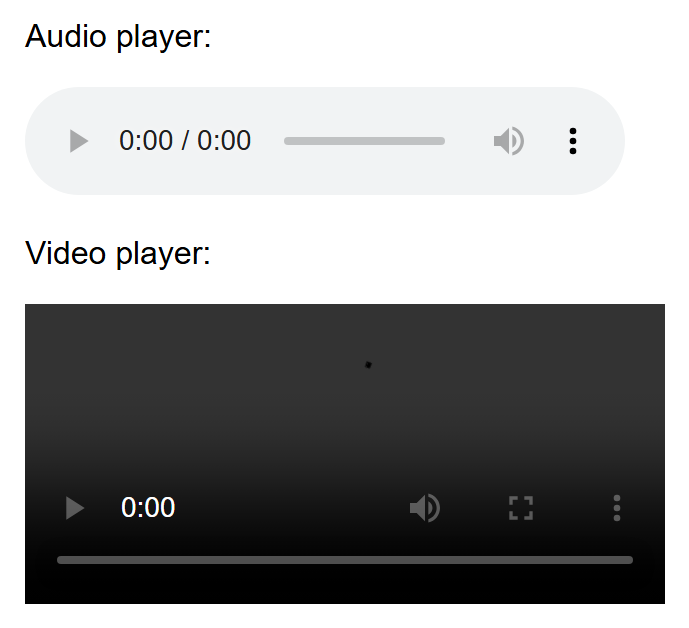

- The `controls` attribute makes the browser show a built-in play/pause/volume bar.
- The `<source>` child element specifies the actual file; you can list several `<source>`
  tags with different formats so the browser picks the one it supports.
- The plain text inside the tags ("Your browser does not support...") is a **fallback**,
  shown only in very old browsers that don't recognize `<audio>`/`<video>` at all.

## Tables

A table is built out of rows and cells using `<table>`, `<tr>` (table row), `<th>` (table
header cell), and `<td>` (table data cell):

```html
<table>
    <thead>
        <tr>
            <th>Name</th>
            <th>Course</th>
            <th>Grade</th>
        </tr>
    </thead>
    <tbody>
        <tr>
            <td>Ali</td>
            <td>CSC336</td>
            <td>A</td>
        </tr>
        <tr>
            <td>Sara</td>
            <td>CSC336</td>
            <td>A+</td>
        </tr>
    </tbody>
</table>
```

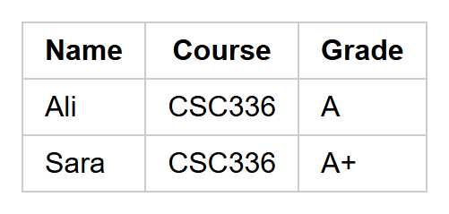

!!! note
    Plain HTML tables have no visible gridlines by default — the borders in the screenshot
    above were added with a little CSS purely so the structure is easy to see. You will
    learn to style tables (and everything else) with CSS starting in the next unit.

- `<thead>` groups the header row(s); `<tbody>` groups the actual data rows. Both are
  optional but recommended for clarity and styling.
- `<th>` cells are for column/row labels and are bold and centered by default.
- `<td>` cells hold the actual data.

!!! warning "Tables are for tabular data, not page layout"
    In the early days of the web, designers used tables to arrange entire page layouts
    (menus, sidebars, columns). This is now considered bad practice because it confuses
    screen readers and mixes structure with appearance. Use tables only for genuinely
    tabular data (spreadsheet-like information); use CSS for page layout, as you'll learn
    in later lectures.

## Lists

HTML has three kinds of lists:

**Unordered list** — a bulleted list, for items with no particular sequence:

```html
<ul>
    <li>HTML</li>
    <li>CSS</li>
    <li>JavaScript</li>
</ul>
```

**Ordered list** — a numbered list, for items where order matters:

```html
<ol>
    <li>Write the HTML</li>
    <li>Add CSS styling</li>
    <li>Add JavaScript behavior</li>
</ol>
```

**Description list** — pairs of terms and their descriptions (useful for glossaries or
key-value data):

```html
<dl>
    <dt>HTML</dt>
    <dd>The markup language used to structure web pages.</dd>
    <dt>CSS</dt>
    <dd>The language used to style web pages.</dd>
</dl>
```

All three list types rendered together — unordered, then ordered, then description:

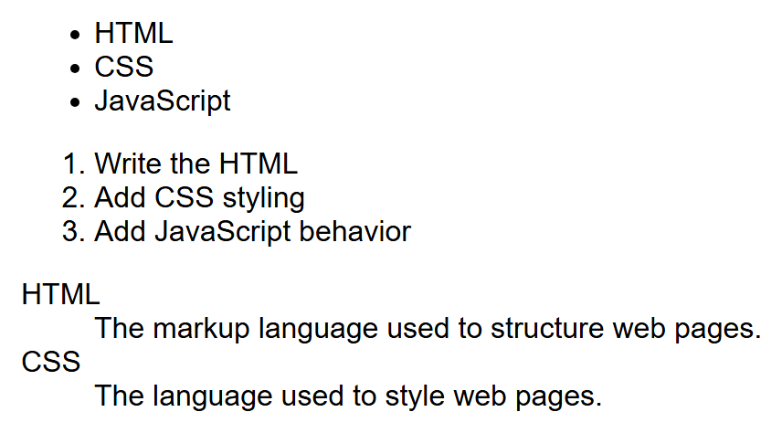

- `<dl>` — description list (the container)
- `<dt>` — description term (the word being defined)
- `<dd>` — description details (the definition itself)

### Nested Lists

Lists can also be **nested**: put a whole `<ul>` or `<ol>` *inside* an `<li>` to create a
sub-list. This is how you represent a hierarchy — categories with sub-items, an outline, a
multi-level menu (which you'll build with CSS in a later tutorial):

```html
<ul>
    <li>Front End
        <ul>
            <li>HTML</li>
            <li>CSS</li>
            <li>JavaScript</li>
        </ul>
    </li>
    <li>Back End
        <ul>
            <li>Node.js</li>
            <li>Express</li>
        </ul>
    </li>
</ul>
```

A few rules worth knowing:

- The nested `<ul>` (or `<ol>`) goes *inside* the `<li>` of the item it belongs under, after
  that item's own text.
- You can nest an `<ol>` inside a `<ul>`, or a `<ul>` inside an `<ol>` — the two types mix
  freely at different levels.
- A nested `<ol>` restarts its own numbering from `1` by default, independent of any
  numbering at the level above it.
- Browsers automatically change the bullet style (disc → circle → square) at each nesting
  depth in a `<ul>`, purely as a visual cue that you've gone one level deeper.

## HTML5: What Changed and Why It Matters

HTML5 is the current version of the HTML standard, published in 2014 and continuously
updated since. Before HTML5, developers often relied on generic `<div>` tags with class
names like `class="header"` or `class="footer"` to organize pages, and browser plugins
(like Flash) to play audio and video. HTML5 fixed both problems.

**New elements introduced in HTML5** include:

- Semantic layout elements: `<header>`, `<nav>`, `<main>`, `<section>`, `<article>`,
  `<aside>`, `<footer>` (covered in detail in the next lecture)
- Media elements: `<audio>`, `<video>`, `<source>`, `<track>`
- Graphics: `<canvas>` (for drawing with JavaScript) and native `<svg>` support
- Form improvements: `<datalist>`, `<output>`, and many new `<input>` types (covered in
  Lecture 4)
- `<figure>` and `<figcaption>` for images with captions

**New attributes introduced in HTML5** include:

- `placeholder`, `required`, `pattern`, `autofocus` on form inputs
- `data-*` — custom "data attributes" that let you attach your own data to any element,
  which JavaScript can later read:

  ```html
  <li data-user-id="42">Ali Khan</li>
  ```

- `contenteditable` — makes any element directly editable by the user in the browser
- `draggable` — makes an element draggable with the mouse

### Browser Support Considerations

Not every browser (and not every version of a browser) supports every HTML5 feature. Before
you rely on a newer feature in a real project, it is good practice to check
[caniuse.com](https://caniuse.com), a free website that shows exactly which browsers and
versions support a given feature.

!!! tip "Progressive enhancement"
    A common strategy is to design your page so it still works reasonably well in older
    browsers, and only *enhances* the experience for browsers that support the newer
    feature — for example, the fallback text inside `<video>` you saw earlier. This
    strategy is called **progressive enhancement**.

## The Document Tree

Because HTML elements nest inside each other, an HTML document naturally forms a tree
structure. This is exactly what the browser's DOM represents:

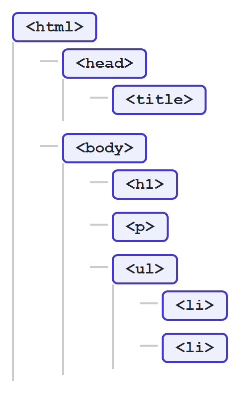

## Try It Yourself

1. Create a file called `profile.html`. Give it a proper `<!DOCTYPE html>`, `<html>`,
   `<head>` (with a `<title>`), and `<body>`. Inside the body, add an `<h1>` with your
   name, a paragraph describing yourself, an image of anything (with a proper `alt`
   attribute), and an unordered list of three of your hobbies.
2. Add a small table listing three courses you are taking this semester, their course
   codes, and your expected grade. Then add a relative link at the bottom of the page that
   points to a second file called `contact.html` (it doesn't need to exist yet — just write
   the link).

## Key Takeaways

- HTML is a markup language: it describes structure and content, not appearance or logic.
- Every HTML document starts with `<!DOCTYPE html>` and has `<html>`, `<head>`, and `<body>`.
- Elements are made of opening/closing tags; attributes add extra information inside the
  opening tag; tags must be nested (closed) in the correct order.
- **Void elements** (`<br>`, `<hr>`, ``, `<input>`, and a handful of others) have no
  closing tag because they have no content.
- **Block-level** elements stack on their own line and fill the available width by
  default; **inline** elements flow within surrounding text and take only the width they
  need.
- Attributes can be **global** (usable on almost any element, like `id`/`class`/`title`),
  element-specific (like `href` on `<a>`), or **boolean** (present or absent, like
  `required`, with no `="value"` needed).
- **External links** (absolute URLs) point to other websites; **internal links** (relative
  URLs) point within your own site and survive a domain move.
- The `<font>` tag is obsolete — it mixes appearance into HTML instead of using CSS, and
  doesn't scale across a real site; use CSS for all styling instead.
- `<pre>` preserves whitespace and line breaks exactly as written; `<code>` marks inline
  code snippets; entities like `&lt;`, `&amp;`, and `&nbsp;` represent characters HTML
  can't take literally.
- ``, `<audio>`, and `<video>` embed media directly, without needing plugins — and an
  `` wrapped in an `<a>` becomes a clickable image link.
- Tables (`<table>`, `<tr>`, `<th>`, `<td>`) are for tabular data only, not page layout.
- HTML has three list types: unordered (`<ul>`), ordered (`<ol>`), and description
  (`<dl>`) — and any list type can be **nested** inside an `<li>` to represent a hierarchy.
- HTML5 added semantic elements, native media support, and new attributes like `data-*`;
  always check browser support for newer features before relying on them.
