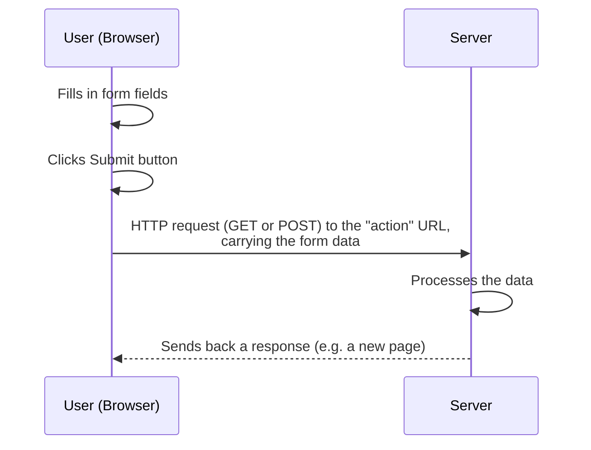

# Lecture 4: Semantic HTML and HTML Forms

Lecture 3 taught you the raw building blocks of HTML. Now you'll learn how to organize a
page in a way that is meaningful — not just to a human reader, but to browsers, search
engines, and assistive technology — and how to collect input from your users with HTML
forms.

## In This Lecture

- Understand the difference between block-level and inline elements
- Use the generic `<div>` and `<span>` elements correctly
- Learn HTML5's semantic elements and why they matter for accessibility and SEO
- Build forms with the `<form>` element, its `action` and `method` attributes
- Use `<input>` types, `<select>`, `<textarea>`, and `<button>`
- Add client-side validation with `required`, `pattern`, `min`, and `max`

## Block-Level vs. Inline Elements

Every HTML element behaves as one of two basic types when the browser lays it out on the
page.

**Block-level elements** always start on a new line and take up the full width available
to them, pushing everything after them down to the next line. Examples include `<h1>`–`<h6>`,
`<p>`, `<div>`, `<ul>`, `<table>`, and `<form>`.

**Inline elements** do not start on a new line. They only take up as much width as their
content needs, and sit *within* a line of text, flowing alongside other content. Examples
include `<a>`, `<span>`, `<strong>`, `<em>`, and ``.

```html
<p>This is a block-level paragraph.</p>
<p>This is another block — notice it starts on its own line.</p>

<p>This sentence has an <strong>inline bold word</strong> and an
<a href="#">inline link</a> sitting right in the flow of the text.</p>
```

!!! note "Why this distinction matters"
    Understanding block vs. inline is essential once you start styling pages with CSS
    (Lecture 5 onward), because it determines how elements size themselves and flow next
    to each other by default.

### The Generic `<div>` and `<span>`

Sometimes you need to group elements together purely for styling or scripting purposes,
without the grouping having any special meaning. HTML provides two generic, meaningless
containers for exactly this:

- **`<div>`** (division) — a generic **block-level** container.
- **`<span>`** — a generic **inline** container.

```html
<div class="card">
    <p>Some content wrapped in a div so it can be styled as a "card" with CSS.</p>
</div>

<p>The price is <span class="highlight-price">$25</span> today only.</p>
```

Neither `<div>` nor `<span>` tells the browser, a search engine, or a screen reader
anything about *what kind* of content is inside them — they are pure containers, useful
when no more specific (semantic) element fits. This is exactly the problem semantic
elements were designed to solve.

## Semantic HTML

A **semantic element** is one whose tag name clearly describes the *meaning* or *role* of
its content, not just its visual appearance. Compare these two ways of marking up the same
page:

=== "Without semantic elements (old style)"

    ```html
    <div class="header">...</div>
    <div class="nav">...</div>
    <div class="main-content">...</div>
    <div class="sidebar">...</div>
    <div class="footer">...</div>
    ```

=== "With semantic elements (HTML5 style)"

    ```html
    <header>...</header>
    <nav>...</nav>
    <main>...</main>
    <aside>...</aside>
    <footer>...</footer>
    ```

Both versions might look *identical* in the browser once styled with CSS — semantic
elements do not automatically look different. The difference is that the second version
tells everyone reading the raw HTML — humans, browsers, search engines, and screen
readers — exactly what role each section plays.

### The Main Semantic Elements

| Element | Represents |
|---|---|
| `<header>` | Introductory content for a page or a section (often a logo, title, nav) |
| `<nav>` | A block of navigation links |
| `<main>` | The primary, unique content of the page (only one per page) |
| `<section>` | A thematic grouping of content, usually with its own heading |
| `<article>` | Self-contained content that could stand alone (a blog post, news story) |
| `<aside>` | Content tangentially related to the main content (a sidebar, a pull quote) |
| `<footer>` | Closing content for a page or section (copyright, contact links) |

Here is a full, realistic page skeleton using them together:

```html
<body>
    <header>
        <h1>My Tech Blog</h1>
        <nav>
            <a href="/">Home</a>
            <a href="/about.html">About</a>
            <a href="/contact.html">Contact</a>
        </nav>
    </header>

    <main>
        <article>
            <h2>Why Semantic HTML Matters</h2>
            <p>Semantic tags make your page easier to understand for machines and humans alike.</p>
        </article>

        <aside>
            <h3>Related Posts</h3>
            <ul>
                <li><a href="#">Intro to CSS</a></li>
                <li><a href="#">JavaScript Basics</a></li>
            </ul>
        </aside>
    </main>

    <footer>
        <p>&copy; 2026 My Tech Blog. All rights reserved.</p>
    </footer>
</body>
```

Notice that `<section>` and `<article>` are similar. Use `<article>` when the content makes
sense entirely on its own, even if copied to a completely different site (a blog post, a
product listing). Use `<section>` for a grouping of related content that is *part of* the
larger page, usually introduced by its own heading, but not meant to stand alone.

### Why Semantics Matter: Accessibility and SEO

**Accessibility** means designing your site so that people with disabilities can use it
too — for example, someone who is blind and uses a **screen reader**, a program that reads
the page aloud. Screen readers use semantic tags to let users jump directly to the
navigation, skip straight to the main content, or list all the "landmarks" on a page. A
page built entirely out of `<div>` tags gives a screen reader nothing to work with; the
user has to listen to the entire page top to bottom to find anything.

**SEO** (Search Engine Optimization) is the practice of structuring your site so that
search engines like Google can understand it and rank it well in search results. Search
engines give more weight to content inside `<article>`, `<main>`, and proper headings than
to content buried inside anonymous `<div>` tags, because semantic tags help the search
engine understand what your page is actually about.

!!! tip "Rule of thumb"
    Reach for a semantic element first. Only fall back to `<div>` or `<span>` when no
    semantic element accurately describes what you're grouping.

## HTML Forms

A **form** lets your page collect input from the user — text, choices, files — and send it
somewhere for processing, typically to a server. Every form starts with the `<form>`
element.

```html
<form action="/submit-login" method="POST">
    <label for="username">Username:</label>
    <input type="text" id="username" name="username">

    <label for="password">Password:</label>
    <input type="password" id="password" name="password">

    <button type="submit">Log In</button>
</form>
```

### The `action` and `method` Attributes

- **`action`** — the URL that the form's data will be sent to when submitted. If omitted,
  the form submits to the current page's own URL.
- **`method`** — the **HTTP method** used to send the data. The two most common values are:
    - **`GET`** — appends the form data to the URL as a query string (e.g.
      `?username=ali`). Visible in the address bar, bookmarkable, and suitable for
      *searches* or anything that does not change data on the server.
    - **`POST`** — sends the form data in the body of the request, invisible in the URL.
      Suitable for anything that creates, changes, or deletes data (logging in, submitting
      a purchase, posting a comment) and for sensitive data like passwords.

!!! warning "Never use GET for passwords or sensitive data"
    Because `GET` puts form values directly into the URL, that data can end up saved in
    browser history, server logs, and shared if the link is copied. Always use `POST` for
    passwords and other sensitive information.

You will learn much more about HTTP methods and servers in later lectures (Unit 5). For
now, just remember: `GET` reads/retrieves, `POST` submits/changes.

Here is the journey a form's data takes when the user clicks submit:



### The `<label>` Element

Every input should be paired with a `<label>`. The `for` attribute on `<label>` must match
the `id` attribute on the input it describes:

```html
<label for="email">Email address:</label>
<input type="email" id="email" name="email">
```

This connection is not just cosmetic — clicking the label text also focuses/activates the
matching input, and screen readers announce the label when the user reaches the input.
Always give inputs a `name` attribute as well; it is the key used to identify that field's
value when the form data is sent to the server.

### Input Types

The `<input>` element is the most flexible form control. Its `type` attribute determines
what kind of control the browser displays and what kind of data it expects:

```html
<input type="text" name="fullname" placeholder="Full name">
<input type="email" name="email" placeholder="you@example.com">
<input type="password" name="password">
<input type="number" name="age" min="1" max="120">
<input type="date" name="birthday">
<input type="checkbox" name="subscribe" checked>
<input type="radio" name="gender" value="male"> Male
<input type="radio" name="gender" value="female"> Female
<input type="file" name="resume">
<input type="range" name="volume" min="0" max="100">
<input type="color" name="favcolor">
<input type="submit" value="Send">
<input type="hidden" name="formVersion" value="2">
```

| Type | Purpose |
|---|---|
| `text` | A single line of free text |
| `email` | Text that the browser checks looks like an email address |
| `password` | Text hidden as dots/asterisks while typing |
| `number` | Numeric input, often with up/down arrows |
| `date` | A date picker |
| `checkbox` | An on/off box; several with the same `name` can all be checked |
| `radio` | A choice among mutually exclusive options; give them the same `name` |
| `file` | Lets the user pick a file to upload |
| `range` | A slider between a min and max value |
| `color` | A color picker |
| `submit` | A button that submits the form |
| `hidden` | Not shown to the user, but sent along with the form data |

`placeholder` shows light gray hint text inside an empty input; it disappears once the user
starts typing, and it is not a substitute for a `<label>`.

### `<select>`, `<textarea>`, and `<button>`

**`<select>`** creates a dropdown list, built out of `<option>` children:

```html
<label for="course">Choose a course:</label>
<select id="course" name="course">
    <option value="csc336">Web Technologies</option>
    <option value="csc337" selected>Advanced Web Technologies</option>
    <option value="csc241">Object Oriented Programming</option>
</select>
```

The `selected` attribute pre-selects an option; the `value` attribute is what gets sent to
the server (which can differ from the visible text).

**`<textarea>`** creates a multi-line text box — unlike `<input type="text">`, which is
always one line:

```html
<label for="message">Message:</label>
<textarea id="message" name="message" rows="5" cols="40">Type here...</textarea>
```

Note that the default text goes *between* the opening and closing tags, not in a `value`
attribute.

**`<button>`** creates a clickable button and is more flexible than `<input type="submit">`
because it can contain other HTML (like an icon) inside it:

```html
<button type="submit">Submit</button>
<button type="reset">Clear Form</button>
<button type="button">Just a Button (does nothing by itself)</button>
```

- `type="submit"` (the default inside a form) submits the form.
- `type="reset"` clears all fields back to their default values.
- `type="button"` does nothing on its own — it's meant to be wired up with JavaScript
  later (Unit 4).

## HTML5 Client-Side Validation

**Validation** means checking that the data the user typed is acceptable *before* it gets
sent anywhere. **Client-side validation** happens right in the browser, instantly, without
needing to contact the server at all. HTML5 added several attributes that let the browser
do simple validation automatically, with zero JavaScript required.

```html
<form action="/register" method="POST">
    <label for="uname">Username (required):</label>
    <input type="text" id="uname" name="uname" required>

    <label for="cnic">CNIC (format 00000-0000000-0):</label>
    <input type="text" id="cnic" name="cnic"
           pattern="\d{5}-\d{7}-\d" title="Format: 00000-0000000-0">

    <label for="age">Age (18–60):</label>
    <input type="number" id="age" name="age" min="18" max="60">

    <button type="submit">Register</button>
</form>
```

- **`required`** — the field cannot be left empty. The browser blocks submission and shows
  a small warning bubble pointing at the missing field.
- **`pattern`** — a **regular expression** (a pattern for matching text) that the value
  must match. In the example above, `\d{5}-\d{7}-\d` requires exactly 5 digits, a dash, 7
  digits, a dash, and 1 digit — the format of a Pakistani CNIC number. Pairing `pattern`
  with a `title` attribute gives the user a readable hint about the expected format.
- **`min`** and **`max`** — set the lowest and highest acceptable values for numeric
  (`type="number"`) or date-based inputs. Combined with `step`, you can also control the
  allowed increment (e.g. `step="5"`).

!!! warning "Client-side validation is not enough on its own"
    A user can disable JavaScript, edit the HTML in their browser's developer tools, or
    send requests directly without ever loading your page at all. Client-side validation
    is a **convenience** that gives instant feedback and reduces unnecessary server
    requests — it is not security. Later, in Unit 5, you will learn to *also* validate
    every submission again on the server, which is the check that actually matters for
    protecting your application.

!!! tip "Other useful validation-related attributes"
    `maxlength` / `minlength` limit the number of characters in a text field, and
    `disabled` prevents a field from being edited or submitted at all. `readonly` shows the
    field but the user cannot change its value.

## Try It Yourself

1. Build a simple "Contact Us" page using semantic elements: a `<header>` with a page
   title and a `<nav>` with three links, a `<main>` containing a `<section>` that
   introduces the page, and a `<footer>` with a copyright line.
2. Inside the `<main>`, add a contact `<form>` with `method="POST"`. Include: a required
   text input for the sender's name, an `email` input, a `<select>` for "Reason for
   contact" (with at least 3 options), a `<textarea>` for the message, and a submit
   `<button>`. Add a `pattern` to a phone-number field so it only accepts digits, and set
   `min`/`max` on a numeric "how many people in your group?" field.

## Key Takeaways

- Block-level elements start a new line and fill the available width; inline elements flow
  within a line of text.
- `<div>` and `<span>` are generic, meaningless containers — use them only when no semantic
  element fits.
- Semantic elements (`<header>`, `<nav>`, `<main>`, `<section>`, `<article>`, `<aside>`,
  `<footer>`) describe the *role* of content, improving accessibility for screen readers
  and boosting SEO.
- The `<form>` element's `action` sets where data is sent, and `method` (`GET` or `POST`)
  sets how it's sent; use `POST` for anything sensitive or data-changing.
- `<input type="...">` covers most form controls; `<select>` gives a dropdown,
  `<textarea>` gives multi-line text, and `<button>` triggers submit/reset/custom actions.
- `required`, `pattern`, `min`, and `max` provide instant client-side validation, but must
  always be backed up by server-side validation for real security.
- Always pair form inputs with `<label>` elements connected via matching `for`/`id`
  attributes.
