# Lecture 5: Cascading Style Sheets (CSS) Fundamentals

HTML gives a web page its structure and content, but on its own it looks plain — black
text on a white background, default fonts, no colour. **CSS (Cascading Style Sheets)** is
the language that controls how HTML looks: colours, fonts, spacing, layout, and more. In
this lecture you will learn the core building blocks of CSS and how to attach it to your
HTML pages.

## In This Lecture

- How CSS syntax works, and the three ways to attach CSS to HTML
- Why external style sheets are the preferred approach
- The main kinds of selectors: element, class, id, attribute, grouping, and descendant
- Pseudo-classes and pseudo-elements
- How the cascade, specificity, and inheritance decide which styles "win," including every
  common conflict case (`!important`, equal specificity, inline styles)
- Which properties inherit from parent to child by default, and which do not
- The most common colour, font, text, and background properties

## What Is CSS?

**CSS** stands for **Cascading Style Sheets**. It is a *style sheet language* — a language
whose only job is to describe how HTML elements should be displayed. HTML says "this is a
heading" or "this is a paragraph"; CSS says "make headings blue and 32 pixels tall" or
"give paragraphs some space below them."

CSS was designed to separate **content** (HTML) from **presentation** (CSS). This
separation is useful because:

- You can change the entire look of a site by editing one CSS file, without touching any
  HTML.
- The same HTML can be restyled for print, for mobile screens, or for accessibility tools,
  just by swapping the CSS.
- Multiple pages can share one style sheet, so your site looks consistent everywhere.

## CSS Syntax

A CSS **rule** (also called a rule set) has two parts: a **selector**, which says *which*
HTML elements the rule applies to, and a **declaration block**, wrapped in curly braces
`{ }`, which says *what style* to apply.

```css
selector {
  property: value;
  property: value;
}
```

Each line inside the braces is a **declaration**, made of a **property** (the aspect of the
style you want to change, like `color` or `font-size`) and a **value** (what you want that
property to be). A declaration always ends with a semicolon `;`.

Here is a real example:

```css
p {
  color: darkslategray;
  font-size: 16px;
}
```

This rule selects every `<p>` element and sets its text colour to dark slate gray and its
font size to 16 pixels.

!!! note "Comments in CSS"
    You can write comments in CSS using `/* ... */`. Anything between the slash-star pair
    is ignored by the browser. Comments are useful for explaining *why* you wrote a rule a
    certain way.
    ```css
    /* Make the navigation bar sticky at the top */
    nav {
      position: sticky;
      top: 0;
    }
    ```

## Three Ways to Add CSS to HTML

There are three places CSS can live: directly on an element (**inline**), inside the HTML
page itself (**internal**), or in a separate file (**external**).

### 1. Inline Styles

An **inline style** is written directly inside an HTML tag, using the `style` attribute.
It applies only to that one element.

```html
<p style="color: red; font-weight: bold;">This paragraph is styled inline.</p>
```

Rendered in a browser:

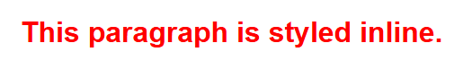

Inline styles are quick, but they mix content and presentation back together, and you would
have to repeat the same `style` attribute on every element you want styled the same way.
Because of this, inline styles are only recommended for quick tests or for styles generated
dynamically by JavaScript.

### 2. Internal Style Sheets

An **internal style sheet** is written inside a `<style>` element, placed in the `<head>`
of an HTML document. It applies to the whole page.

```html
<!DOCTYPE html>
<html lang="en">
<head>
  <meta charset="UTF-8">
  <title>My Page</title>
  <style>
    body {
      font-family: Arial, sans-serif;
    }
    h1 {
      color: navy;
    }
  </style>
</head>
<body>
  <h1>Welcome</h1>
</body>
</html>
```

Rendered in a browser, only the `<body>` content shows, styled by the rules in `<head>`:


Internal style sheets are better than inline styles because the rules are written once and
apply to every matching element on the page. But the CSS is still stuck inside that one
HTML file — if you have a five-page site, you would have to copy the `<style>` block into
every page and keep them all in sync by hand.

### 3. External Style Sheets

An **external style sheet** is a separate `.css` file, linked into an HTML page using a
`<link>` element inside `<head>`.

```html
<head>
  <link rel="stylesheet" href="styles.css">
</head>
```

```css title="styles.css"
body {
  font-family: Arial, sans-serif;
}

h1 {
  color: navy;
}
```

This produces the exact same rendered page as the internal style sheet example above —
the same navy "Welcome" heading in Arial — just loaded from a separate file instead of
being written inline in the HTML.

!!! tip "Why external style sheets are preferred"
    External style sheets are the recommended approach for real projects, for several
    reasons:

    - **One file, many pages.** Every page on your site can link to the same `styles.css`,
      so your whole site looks consistent, and you only edit one file to restyle it.
    - **Separation of concerns.** HTML files stay focused on content and structure; the CSS
      file stays focused on appearance. This makes both easier to read and maintain.
    - **Caching.** Browsers can download `styles.css` once and reuse it for every page on
      the site, which makes your site load faster after the first visit.
    - **Teamwork.** A designer can work on the CSS file while a developer works on the HTML,
      without stepping on each other's work.

## Selectors

A **selector** is the part of a CSS rule that chooses which HTML elements to style. CSS
offers many kinds of selectors; here are the ones you will use constantly.

### Element (Type) Selector

Selects every element of a given tag name.

```css
p {
  line-height: 1.5;
}
```

This applies to every `<p>` element on the page.

### Class Selector

An HTML element can have a `class` attribute, which is just a label you choose. The class
selector starts with a dot `.` followed by the class name.

```html
<p class="highlight">This text is important.</p>
```

```css
.highlight {
  background-color: yellow;
}
```

Rendered in a browser:

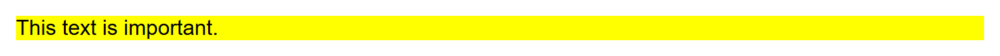

Classes are reusable — you can put `class="highlight"` on as many elements as you like, and
you can also give one element more than one class, separated by spaces:
`class="highlight bordered"`.

### ID Selector

An HTML element can have an `id` attribute, which must be **unique** — no two elements on
the same page should share an id. The id selector starts with a hash `#`.

```html
<div id="main-header">Site Title</div>
```

```css
#main-header {
  font-size: 2rem;
  text-align: center;
}
```

Rendered in a browser:

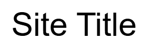

!!! warning "Class vs. id"
    Use a **class** when a style might apply to more than one element (most of the time).
    Use an **id** only for something that truly appears once on the page, such as a single
    page header or a unique widget. Overusing ids makes CSS harder to reuse.

### Attribute Selector

Selects elements based on the presence or value of an HTML attribute, written in square
brackets.

```css
/* Any input with a type attribute equal to "email" */
input[type="email"] {
  border: 1px solid gray;
}

/* Any element that has a "target" attribute, regardless of its value */
a[target] {
  color: purple;
}
```

Here is one of each, rendered together — an `email` input with the gray border, and a link
carrying a `target` attribute in purple:

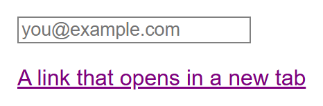

### Grouping Selector

If several selectors should get the *same* styles, separate them with commas instead of
repeating the declaration block.

```css
h1, h2, h3 {
  font-family: Georgia, serif;
  color: darkred;
}
```

This is equivalent to writing three separate rules with identical declarations, but much
shorter. Rendered against three real headings:

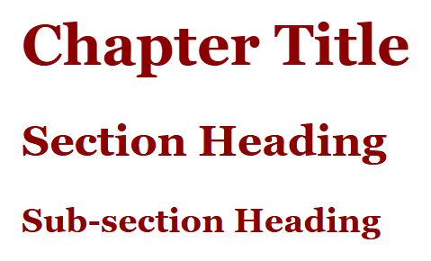

### Descendant Selector

Selects an element that is *nested inside* another element, no matter how deep. Write the
ancestor selector, then a space, then the descendant selector.

```css
article p {
  color: #333;
}
```

This selects every `<p>` that is anywhere inside an `<article>` element — but it will not
select a `<p>` that lives outside any `<article>`.

```html
<article>
  <p>This paragraph IS styled (it's inside article).</p>
</article>
<p>This paragraph is NOT styled (it's outside article).</p>
```

Rendered together, so the contrast is visible in one image — the first paragraph (inside
`<article>`) picks up the darker `#333` from the descendant rule, while the second
paragraph (outside `<article>`) is left at the browser's default black:

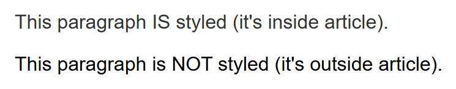

## Pseudo-Classes and Pseudo-Elements

### Pseudo-Classes

A **pseudo-class** selects an element based on a *state* or *condition*, rather than
something written in the HTML. Pseudo-classes start with a single colon `:`.

```css
a:hover {
  text-decoration: underline;
}

button:disabled {
  opacity: 0.5;
}

li:first-child {
  font-weight: bold;
}
```

`:hover` and `:active` need a live mouse to demonstrate and can't be captured in a static
screenshot, but `:first-child` and `:disabled` are states the browser can render up front.
Here is a list where the first `<li>` picks up the bold rule, next to a button styled with
`button:disabled { opacity: 0.5; }`:

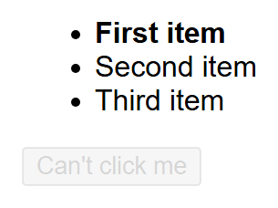

Common pseudo-classes include:

| Pseudo-class | Matches |
|---|---|
| `:hover` | When the mouse pointer is over the element |
| `:focus` | When the element (like a form field) is focused |
| `:active` | While the element is being clicked |
| `:first-child` | An element that is the first child of its parent |
| `:last-child` | An element that is the last child of its parent |
| `:nth-child(n)` | The *n*th child of its parent |
| `:not(selector)` | Elements that do **not** match the given selector |

### Pseudo-Elements

A **pseudo-element** lets you style a specific *part* of an element, such as its first
line, or lets you insert generated content before or after it. Pseudo-elements start with
a double colon `::` (older code sometimes uses a single colon for these too, which browsers
still accept for backward compatibility).

```css
p::first-line {
  font-weight: bold;
}

.quote::before {
  content: "“";
}

.quote::after {
  content: "”";
}
```

Rendered in a browser — a paragraph long enough to wrap, with only its first rendered
line bolded by `::first-line`, and a quote wrapped in curly quotation marks that were
never typed into the HTML, only generated by `::before`/`::after`:

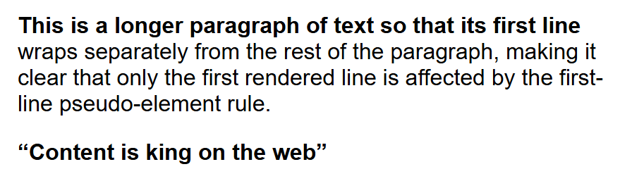

`::before` and `::after` are especially common: they insert content that is not in the
HTML at all, purely for decoration (like the quotation marks above).

## The Cascade, Specificity, and Inheritance

CSS stands for *Cascading* Style Sheets for a reason: when more than one rule could apply
to the same element, the browser needs a way to decide which one wins. This decision
process is called the **cascade**, and it depends on three things, in order:

1. **Importance** — a declaration marked `!important` beats a normal one (use this rarely).
2. **Specificity** — a more specific selector beats a less specific one.
3. **Source order** — if two rules are equally specific, the one that appears **later** in
   the CSS wins.

### Specificity

**Specificity** is a score CSS gives to every selector, based on what kind of selectors it
is made of. Roughly, from lowest to highest:

| Selector type | Example | Specificity weight |
|---|---|---|
| Element / pseudo-element | `p`, `::before` | Lowest |
| Class / attribute / pseudo-class | `.highlight`, `[type="text"]`, `:hover` | Medium |
| ID | `#main-header` | High |
| Inline style | `style="..."` | Higher than any selector |
| `!important` | `color: red !important;` | Overrides everything else |

When two rules target the same element, the browser adds up the specificity of each
selector and applies the winning rule's declarations.

```css
p { color: black; }          /* specificity: low  */
.intro { color: green; }     /* specificity: medium */
#lead-paragraph { color: blue; } /* specificity: high */
```

```html
<p id="lead-paragraph" class="intro">What colour am I?</p>
```

Rendered in a browser:


Here the paragraph will be **blue**, because the id selector has the highest specificity,
regardless of the order the rules were written in.

### Resolving Conflicting Declarations: Every Case

The example above is the simplest kind of conflict — different specificity. In a real
stylesheet, several other situations come up constantly. The browser always resolves a
conflict on the *same property* of the *same element* by checking, in this exact order:

1. **Importance** (`!important`)
2. **Specificity**
3. **Source order** (whichever rule was written later)

It stops at the first check that produces a clear winner. Let's walk through every case.

#### Case 1: Different specificity — the more specific rule always wins

This is the `#lead-paragraph` example above: no matter which rule was written first, the id
selector beats the class selector, which beats the element selector.

#### Case 2: Equal specificity — the last rule in source order wins

```css
p { color: black; }
p { color: green; }
```

Both selectors are plain elements — identical specificity. Because a browser reads a
stylesheet top to bottom, the second declaration overwrites the first, so paragraph text
ends up **green**. This is the literal meaning of "cascading": when nothing else breaks the
tie, later rules cascade over earlier ones. It's also why the order you `<link>` multiple
stylesheets (or place a `<style>` block relative to a linked one) matters — the one that
loads/appears later wins any tie.

#### Case 3: `!important` overrides specificity and order entirely

```css
p { color: black !important; }
#lead-paragraph { color: blue; }
```

Even though `#lead-paragraph` has far higher specificity, the `!important` declaration
wins — the paragraph is **black**. `!important` is a deliberate override switch, and it's
considered a last resort: it breaks the normal cascade, so anyone reading the CSS later
(including you, in six months) can no longer predict which rule applies just by comparing
selectors. Prefer a more specific selector, or restructuring your CSS, before reaching for
`!important`.

#### Case 4: Two `!important` declarations conflict

When more than one declaration for the same property is marked `!important`, the browser
applies the *same* rules again — specificity, then order — but only among the `!important`
declarations:

```css
p { color: black !important; }              /* important, low specificity */
#lead-paragraph { color: blue !important; }  /* important, high specificity */
```

Both are `!important`, so importance no longer breaks the tie — specificity does, and
`#lead-paragraph` wins. The paragraph is **blue**.

#### Case 5: Inline styles vs. stylesheet rules

An inline `style` attribute behaves as if it had a specificity higher than any selector
(id included), so it beats a stylesheet rule targeting the same element and property —
unless that stylesheet rule carries `!important`, which beats even an inline style:

```html
<p id="lead-paragraph" style="color: purple;">Which colour wins?</p>
```

```css
#lead-paragraph { color: blue; }              /* loses to the inline style */
#lead-paragraph { color: green !important; }  /* beats the inline style   */
```

With only the first rule, the paragraph is **purple** (the inline style wins). Add the
second, `!important` rule, and the paragraph becomes **green** — one of the few situations
where `!important` is genuinely the right tool: overriding an inline style you can't edit
directly (for example, one generated by a CMS or a third-party widget).

#### How specificity is actually calculated

The table above is enough for everyday use, but specificity is really a **4-part score**,
compared column by column, left to right — like comparing version numbers:

| Column | Counts | Example |
|---|---|---|
| Inline | `1` if the style is inline, else `0` | `style="..."` → `(1, 0, 0, 0)` |
| IDs | Number of ID selectors | `#nav` → `(0, 1, 0, 0)` |
| Classes / attributes / pseudo-classes | Number of these | `.item`, `[type="text"]`, `:hover` → `(0, 0, 1, 0)` |
| Elements / pseudo-elements | Number of these | `div`, `::before` → `(0, 0, 0, 1)` |

Add up every simple selector in a compound selector to get its total score, then compare
two scores by their **leftmost differing column** — one point in an earlier column always
beats any number of points in a later one:

```css
#nav .item a:hover { color: teal; }   /* 1 id, 2 classes/pseudo-classes, 1 element → (0,1,2,1) */
nav ul li a { color: orange; }        /* 0 ids, 0 classes, 4 elements            → (0,0,0,4) */
```

The second selector is *longer*, but it still loses — `(0,1,2,1)` beats `(0,0,0,4)` because
one ID in column two outweighs any number of elements in column four. "The longer selector
wins" is a common but incorrect shortcut; always compare column by column.

!!! note "Combinators and `*` add nothing"
    Combinators (the space, `>`, `+`, `~`) and the universal selector `*` contribute
    nothing to specificity. `div p` and `div > p` both score `(0,0,0,2)` — two elements,
    nothing more — and `*` alone scores `(0,0,0,0)`.

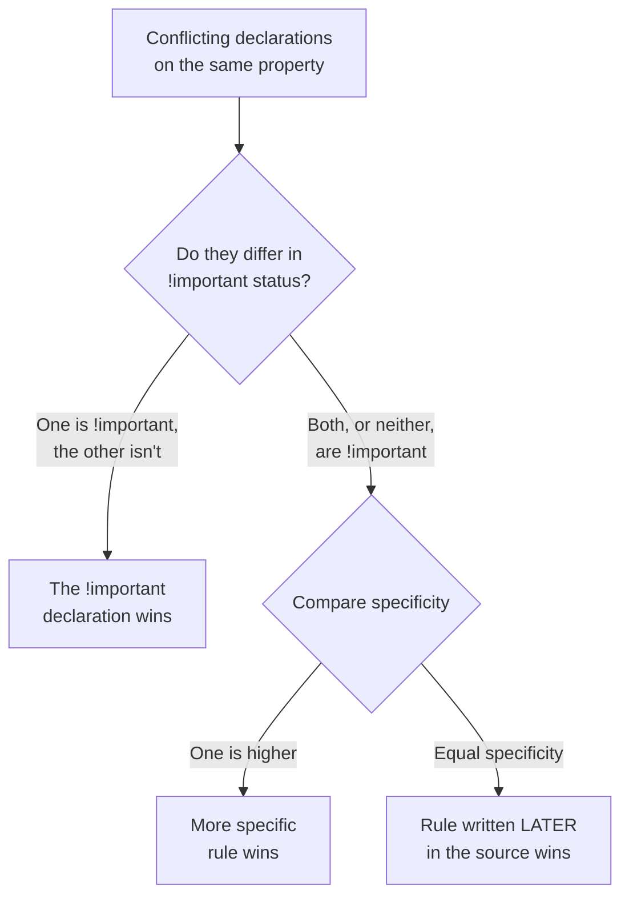

### Inheritance

Some CSS properties **inherit** — meaning a child element automatically takes on the
computed value from its parent, unless you override it. Text-related properties like
`color`, `font-family`, and `font-size` inherit by default. Layout-related properties like
`margin`, `padding`, `border`, and `width` do **not** inherit — each element gets its own
default for those instead of copying its parent's.

```css
body {
  color: #222;
  font-family: Arial, sans-serif;
}
```

Because `color` and `font-family` inherit, every element inside `<body>` — every paragraph,
heading, and list item — will use that same colour and font unless a more specific rule
overrides it.

#### An Example Where Inheritance Does *Not* Happen

```css
.parent {
  border: 4px solid crimson;
  padding: 20px;
  color: darkblue;
}
```

```html
<div class="parent">
  Parent text is dark blue.
  <p>This child paragraph is dark blue too (inherited), but has no border or padding of
     its own (not inherited).</p>
</div>
```

`color: darkblue` inherits, so the `<p>` renders in dark blue even though no rule targets
`<p>` directly. `border` and `padding`, however, are **not** inherited: only the `.parent`
`<div>` itself gets the crimson outline and the 20px of breathing room — the `<p>` nested
inside it has no border around it and no padding of its own, despite sitting inside an
element that has both. If you wanted the paragraph to look the same, you would have to
write a rule that targets it directly.

| Inherited by default | Not inherited by default |
|---|---|
| `color` | `margin` |
| `font-family`, `font-size`, `font-weight`, `font-style` | `padding` |
| `line-height` | `border` |
| `text-align` | `width`, `height` |
| `visibility` | `background` / `background-color` |
| `list-style` | `display` |

!!! tip "Forcing or blocking inheritance"
    Any property can be forced to inherit with the special value `inherit` — for example,
    `p { border: inherit; }` makes a paragraph copy its parent's border even though
    `border` doesn't inherit by default. Going the other way, `initial` resets any
    property (inherited or not) back to CSS's own default value. You won't need either
    often, but they exist for exactly this kind of override.

## Colour, Font, Text, and Background Properties

### Colour Values

CSS colours can be written in several formats:

```css
.a { color: red; }                 /* named colour */
.b { color: #ff0000; }             /* hex code */
.c { color: rgb(255, 0, 0); }      /* red, green, blue (0-255 each) */
.d { color: rgba(255, 0, 0, 0.5); }/* rgb + alpha (transparency, 0-1) */
.e { color: hsl(0, 100%, 50%); }   /* hue, saturation, lightness */
```

All five rendered together — the first three (named, hex, and `rgb`) all produce the exact
same solid red; the fourth is visibly lighter/pink because its `0.5` alpha blends the red
with the white page background; the fifth (`hsl`) is solid red again:

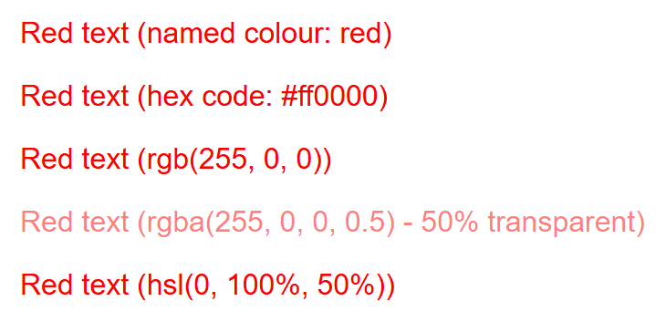

`color` sets the text colour. `background-color` sets the background colour of an element's
box.

### Font Properties

```css
p {
  font-family: "Helvetica Neue", Arial, sans-serif;
  font-size: 16px;
  font-weight: bold;   /* or a number like 400, 700 */
  font-style: italic;
}
```

Rendered in a browser:

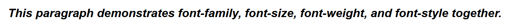

- `font-family` is a **fallback list**: the browser tries each font in order and uses the
  first one it has available. Always end the list with a generic family like `sans-serif`,
  `serif`, or `monospace`, so there is always something to fall back on.
- `font-size` can be in pixels (`px`), or relative units like `em` and `rem` (multiples of
  the parent's or root's font size).
- `font-weight` controls boldness (`normal`, `bold`, or a number from 100–900).
- `font-style` controls slanting (`normal`, `italic`).

There is also a shorthand property, `font`, that combines several of these into one line:

```css
p {
  font: italic bold 16px/1.5 Arial, sans-serif;
  /* style weight size/line-height family */
}
```

This shorthand produces the same bold-italic rendering as the four separate declarations
shown above, just written on one line.

### Text Properties

```css
p {
  text-align: center;       /* left, right, center, justify */
  text-decoration: underline; /* none, underline, line-through */
  text-transform: uppercase;  /* none, uppercase, lowercase, capitalize */
  line-height: 1.6;           /* space between lines of text */
  letter-spacing: 0.5px;      /* space between characters */
}
```

Rendered in a browser:

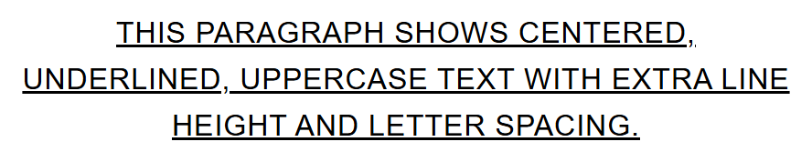

### Background Properties

```css
.card {
  background-color: #f5f5f5;
  background-image: url("pattern.png");
  background-repeat: no-repeat;
  background-position: center;
  background-size: cover;
}
```

- `background-color` fills the element's box with a solid colour.
- `background-image` places an image behind the element's content.
- `background-repeat` controls whether the image tiles (`repeat`, `no-repeat`, `repeat-x`,
  `repeat-y`).
- `background-position` controls where the image sits within the box.
- `background-size` controls how the image is scaled (`cover` fills the box, `contain`
  fits the whole image inside it).

Like `font`, there is a `background` shorthand that combines several of these properties
into one declaration.

## Try It Yourself

1. Create an HTML file with a heading, three paragraphs (one with `class="note"`), and a
   link. Create an external file called `styles.css` and link it from your HTML. In
   `styles.css`, style the heading's colour and font, give `.note` a light background
   colour, and make the link change colour on `:hover`.
2. In the same file, add a `<div id="banner">` above your heading. Write three competing
   rules for its text colour: one using the element selector `div`, one using a class you
   add to it, and one using its `#banner` id — each a different colour. Predict which
   colour will actually show, then check your answer in a browser and explain why, using
   what you learned about specificity.

## Key Takeaways

- CSS controls the *presentation* of HTML: colour, fonts, spacing, and more, while HTML
  stays focused on structure and content.
- CSS can be added inline, internally in a `<style>` tag, or externally in a linked `.css`
  file — external style sheets are preferred because they keep styling consistent, cacheable,
  and separate from content.
- Selectors decide *what* gets styled: element, class (`.name`), id (`#name`), attribute
  (`[attr=value]`), grouping (`a, b`), and descendant (`a b`) selectors are the essentials.
- Pseudo-classes (`:hover`, `:focus`) target element *states*; pseudo-elements (`::before`,
  `::after`) target *parts* of an element or insert generated content.
- When multiple rules could apply, the **cascade** resolves the conflict using importance
  (`!important`), then **specificity** (inline > id > class/attribute/pseudo-class >
  element), then source order (later wins ties) — in that exact order, every time.
- Specificity is really a 4-part score compared column by column; a single ID always beats
  any number of classes or elements, no matter how long the other selector looks.
- `!important` should be a last resort: it breaks normal specificity reasoning, and two
  conflicting `!important` declarations still fall back to specificity, then order.
- Some properties, mostly text-related ones like `color` and `font-family`, **inherit**
  from parent to child automatically; box-related properties like `border`, `margin`, and
  `padding` do not — a child sitting inside a bordered, padded parent gets neither unless
  styled directly.
