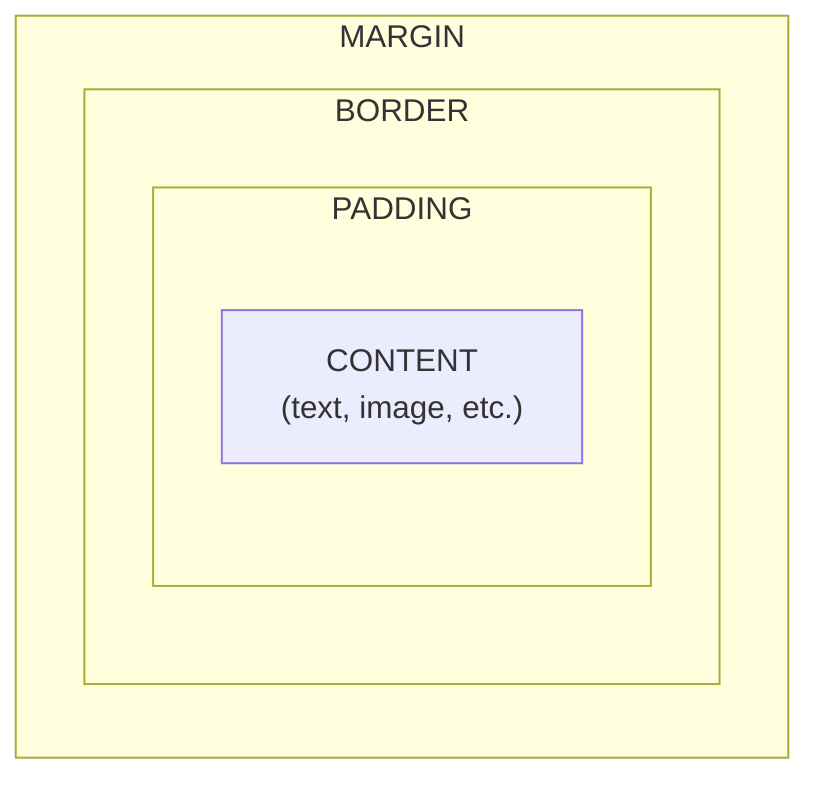
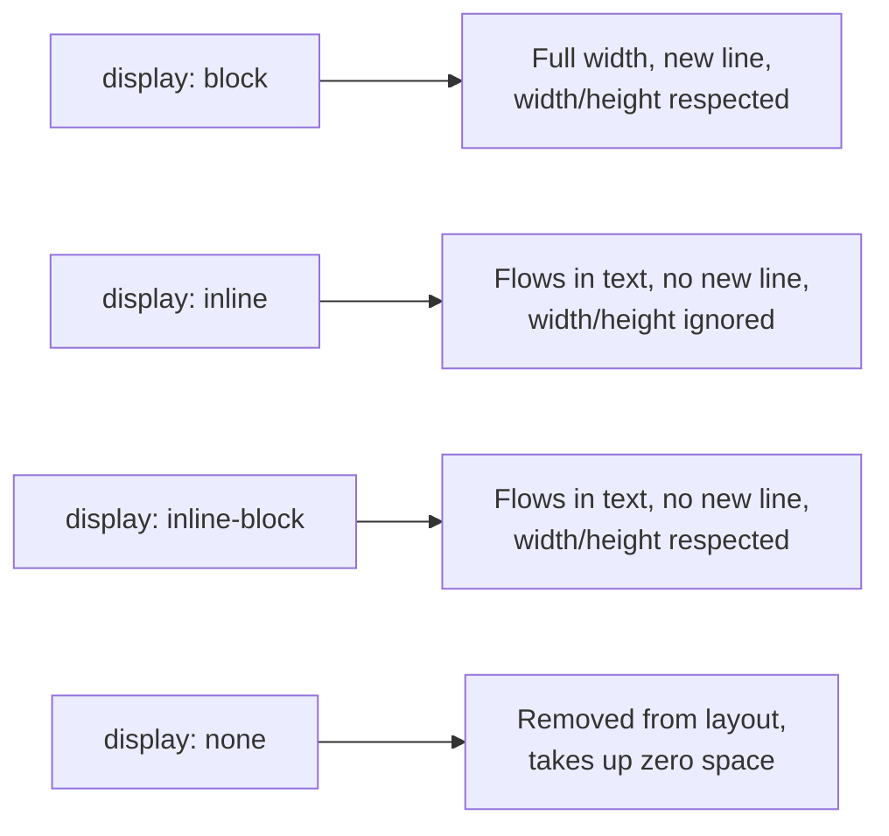

# Lecture 6: The CSS Box Model and Display

Every single element on a web page — a paragraph, a button, an image — is rendered by the
browser as a rectangular box. Understanding how the size of that box is calculated, and how
boxes behave next to each other, is the single most important skill for building layouts in
CSS. This lecture covers the **box model** and the **display** property, the two ideas
behind almost everything you will do in CSS layout.

## In This Lecture

- The four layers of the box model: content, padding, border, and margin
- Margin collapsing, and why it surprises beginners
- `box-sizing`: `content-box` vs. `border-box`
- Controlling size with `width`, `height`, `min-`/`max-` constraints, and `overflow`
- The `display` property: `block`, `inline`, `inline-block`, and `none`
- Borders, shadows, and techniques for consistent spacing

## The Box Model

Every HTML element, when rendered by the browser, is treated as a rectangular box made up
of four layers, nested inside each other like Russian dolls:

1. **Content** — the actual text, image, or other content of the element.
2. **Padding** — transparent space between the content and the border. Padding is *inside*
   the element; it takes on the element's background colour.
3. **Border** — a line (or nothing) drawn around the padding.
4. **Margin** — transparent space *outside* the border, separating this element from its
   neighbours. Margin is never filled with background colour — it's just empty space.



You control each layer with its own set of CSS properties:

```css
.box {
  /* content size */
  width: 300px;
  height: 150px;

  /* padding: inside space, all four sides */
  padding: 20px;

  /* border: line around the padding */
  border: 2px solid black;

  /* margin: outside space, all four sides */
  margin: 30px;
}
```

You can also target a single side of padding, border, or margin:

```css
.box {
  padding-top: 10px;
  padding-right: 15px;
  padding-bottom: 10px;
  padding-left: 15px;
}
```

Or use the shorthand, which accepts one to four values:

```css
/* one value: applies to all four sides */
padding: 10px;

/* two values: top-bottom, left-right */
padding: 10px 20px;

/* four values: top, right, bottom, left (clockwise) */
padding: 10px 20px 15px 5px;
```

### Margin Collapsing

**Margin collapsing** is a box-model behaviour that surprises many beginners: when two
elements are stacked *vertically* and both have a margin between them, the browser does
**not** add the two margins together. Instead, it uses the **larger** of the two margins as
the actual gap.

```css
.box-one {
  margin-bottom: 30px;
}

.box-two {
  margin-top: 20px;
}
```

```html
<div class="box-one">First box</div>
<div class="box-two">Second box</div>
```

You might expect a 50px gap (30px + 20px) between these two boxes, but because of margin
collapsing, the actual gap is only **30px** — the larger of the two.

!!! warning "Margin collapsing only happens vertically"
    Margin collapsing applies only to the **top and bottom** margins of block-level
    elements in normal document flow. It does **not** happen with left/right margins, and
    it does not happen if the elements use `display: flex`, `display: grid`, floats, or
    absolute positioning. This is a common source of confusion when debugging spacing.

## `box-sizing`: content-box vs. border-box

Here is a question: if you set `width: 300px` on an element, and *also* give it
`padding: 20px` and `border: 2px solid black`, how wide is the element actually rendered on
the screen?

The answer depends on the `box-sizing` property.

### `content-box` (the default)

With the default value, `content-box`, the `width` and `height` you set apply **only to the
content area**. Padding and border are then added *on top of* that width.

```css
.box {
  box-sizing: content-box; /* default */
  width: 300px;
  padding: 20px;
  border: 2px solid black;
}
/* actual rendered width = 300 + 20 + 20 + 2 + 2 = 344px */
```

This means adding padding or a border makes the box grow *bigger* than the width you
specified, which is often not what beginners expect.

### `border-box`

With `box-sizing: border-box`, the `width` and `height` you set include the padding and
border. The content area shrinks to make room for them, but the total box stays at exactly
the width you specified.

```css
.box {
  box-sizing: border-box;
  width: 300px;
  padding: 20px;
  border: 2px solid black;
}
/* actual rendered width = exactly 300px */
```

!!! tip "border-box is the practical default for real projects"
    Because `border-box` makes sizing much more predictable, most real-world style sheets
    start with this reset, which applies `border-box` to every element on the page:
    ```css
    *,
    *::before,
    *::after {
      box-sizing: border-box;
    }
    ```

### width, height, and min/max constraints

Besides fixed `width` and `height`, CSS lets you set flexible **minimum** and **maximum**
constraints:

```css
.container {
  width: 90%;
  max-width: 1000px;   /* never grow wider than 1000px, even on huge screens */
  min-width: 300px;    /* never shrink narrower than 300px */
  min-height: 200px;   /* always at least 200px tall, but can grow if content needs more */
}
```

`max-width` is especially common for making a page look good on both small and large
screens: the box scales down with the screen on narrow devices, but stops growing past a
sensible limit on wide monitors.

### Overflow

**Overflow** happens when an element's content is too big to fit inside its box. The
`overflow` property tells the browser what to do about it.

```css
.box {
  width: 200px;
  height: 100px;
  overflow: hidden;   /* clips content that doesn't fit — extra content is not shown */
}
```

Common values:

| Value | Behaviour |
|---|---|
| `visible` (default) | Content spills outside the box, still visible |
| `hidden` | Content that doesn't fit is clipped and hidden |
| `scroll` | Always shows scrollbars, letting the user scroll to see overflow |
| `auto` | Adds scrollbars only if the content actually overflows |

## The `display` Property

The `display` property controls how an element behaves in the page layout: whether it
starts on a new line, how much horizontal space it takes up, and whether it participates in
layout at all.

### `block`

A **block-level** element always starts on a new line and stretches to fill the full width
of its parent container by default. `width` and `height` are fully respected. Examples of
elements that are `block` by default: `<div>`, `<p>`, `<h1>`–`<h6>`, `<ul>`, `<li>`.

```css
.section {
  display: block;
}
```

### `inline`

An **inline** element does *not* start on a new line — it flows within the surrounding
text, taking up only as much width as its content needs. `width` and `height` are
**ignored** on inline elements, and vertical `margin`/`padding` do not push other content
away (though horizontal margin/padding still work visually). Examples that are `inline` by
default: `<span>`, `<a>`, `<strong>`, `<em>`.

```css
.tag {
  display: inline;
}
```

### `inline-block`

`inline-block` is a hybrid: the element flows inline with surrounding content like an
inline element (no forced line break), but it **respects `width`, `height`, and vertical
`margin`/`padding`** like a block element. This makes it useful for things like navigation
links or buttons that sit next to each other but still need a defined size.

```css
.button {
  display: inline-block;
  width: 120px;
  height: 40px;
  padding: 10px;
}
```

### `none`

`display: none` removes the element from the page entirely — it takes up **no space at
all**, as if it were never in the HTML. This is different from making something invisible
with `visibility: hidden`, which hides the element but still reserves its space in the
layout.

```css
.hidden-panel {
  display: none;
}
```



## Borders, Shadows, and Consistent Spacing

### Borders

A border needs three pieces of information: width, style, and colour.

```css
.box {
  border-width: 2px;
  border-style: solid;   /* also: dashed, dotted, double, none */
  border-color: #333;
}

/* shorthand, same result */
.box {
  border: 2px solid #333;
}
```

You can round the corners of a box with `border-radius`:

```css
.card {
  border-radius: 8px;
}

.avatar {
  border-radius: 50%;   /* makes a square box into a perfect circle */
}
```

### Box Shadow

`box-shadow` draws a shadow behind an element's box, useful for making cards or buttons feel
"raised" off the page.

```css
.card {
  box-shadow: 0 4px 8px rgba(0, 0, 0, 0.2);
  /* offset-x  offset-y  blur-radius  colour */
}
```

You can also add an inset shadow, drawn *inside* the box:

```css
.pressed-button {
  box-shadow: inset 0 2px 4px rgba(0, 0, 0, 0.3);
}
```

### Consistent Spacing Techniques

Real projects usually avoid picking spacing values randomly for every element. Two common
techniques help keep spacing consistent across a whole site:

- **A spacing scale.** Pick a small set of values (e.g., 4px, 8px, 16px, 24px, 32px) and
  only ever use those for padding and margin, instead of arbitrary numbers like 13px or
  27px.
- **CSS custom properties (variables).** Define your spacing scale once, at the top of your
  style sheet, and reuse it everywhere:

```css
:root {
  --space-sm: 8px;
  --space-md: 16px;
  --space-lg: 32px;
}

.card {
  padding: var(--space-md);
  margin-bottom: var(--space-lg);
}
```

If you ever need to adjust your whole site's spacing rhythm, you only need to change the
values in `:root`, and every element using `var(--space-md)` updates automatically.

## Try It Yourself

1. Build three boxes side by side, each with `width: 150px`, `padding: 20px`, and
   `border: 5px solid black`, but give the first box `box-sizing: content-box` and the
   other two `box-sizing: border-box`. Measure (or estimate) each box's actual rendered
   width and explain the difference you see.
2. Create a small "card" component (a `<div>` with a heading and a paragraph inside). Give
   it padding, a border-radius, and a box-shadow. Then create two cards stacked vertically,
   each with `margin: 20px 0`, and observe the gap between them — does it look like 40px or
   20px? Explain why, using what you learned about margin collapsing.

## Key Takeaways

- Every element is a box made of four layers, from the inside out: content, padding,
  border, and margin.
- Vertically adjacent margins can **collapse**, so the gap between two elements is the
  larger of their two margins, not the sum.
- `box-sizing: content-box` (default) adds padding and border *on top of* your set width;
  `box-sizing: border-box` makes padding and border count *inside* your set width, which
  is far more predictable and commonly used as a site-wide reset.
- `min-`/`max-width`/`height` add flexible constraints on top of a base size, and
  `overflow` controls what happens when content doesn't fit its box.
- `display: block` starts a new line and fills available width; `inline` flows within text
  and ignores width/height; `inline-block` combines both behaviours; `display: none`
  removes an element from the layout entirely.
- Borders, `border-radius`, and `box-shadow` are the main tools for visually finishing a
  box; CSS custom properties (`--variable-name`) help keep spacing consistent across a
  whole site.
