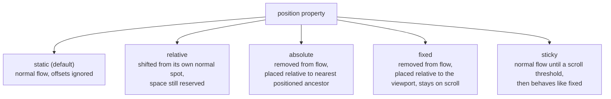

# Lecture 7: CSS Positioning and Stacking

So far you have styled elements and controlled their box size, but every element has still
been sitting exactly where the HTML put it. This lecture is about taking elements out of
that default arrangement — moving them, pinning them, layering them on top of each other —
using CSS **positioning**. You will also learn about **floats**, an older layout tool that
you will still encounter in real code.

## In This Lecture

- Normal document flow and static positioning
- The four positioning schemes: `relative`, `absolute`, `fixed`, and `sticky`
- Offset properties (`top`, `right`, `bottom`, `left`) and the containing block
- `z-index` and stacking contexts
- Floats, clearing, and common layout pitfalls

## Normal Document Flow and Static Positioning

**Normal document flow** is the default way browsers lay out HTML: elements are placed one
after another, in the order they appear in the HTML, from top to bottom (for block-level
elements) or left to right (for inline elements). This is what you have been seeing in
every example so far — nothing special is happening, the browser is just placing boxes in
source order.

Every element has a `position` property, and its default value is `static`. **Static
positioning** simply means "follow normal document flow — don't do anything special."

```css
.box {
  position: static; /* this is the default, rarely written explicitly */
}
```

An important rule: **offset properties (`top`, `right`, `bottom`, `left`) have no effect on
a statically positioned element.** They only start to matter once you switch to one of the
other positioning schemes.

## The Positioning Schemes

CSS offers four ways to move an element out of normal flow: `relative`, `absolute`,
`fixed`, and `sticky`.



### `relative`

`position: relative` keeps the element in normal document flow — its original space is
still reserved, as if it hadn't moved — but then shifts it visually using the offset
properties, *relative to where it would normally have been*.

```css
.box {
  position: relative;
  top: 10px;   /* moves it 10px down from its normal position */
  left: 20px;  /* moves it 20px right from its normal position */
}
```

Other elements on the page behave as though `.box` never moved — the gap it left behind in
normal flow is not filled in.

### `absolute`

`position: absolute` removes the element from normal flow entirely — other elements now
behave as if it doesn't exist, and can slide into the space it used to occupy. The element
is then positioned using the offset properties, but *relative to its containing block*
(explained below), not relative to where it used to sit.

```css
.box {
  position: absolute;
  top: 0;
  right: 0;
}
```

### `fixed`

`position: fixed` also removes the element from normal flow, but positions it relative to
the **browser viewport** (the visible window), not any particular ancestor. A fixed element
stays in the same place on screen even when the page is scrolled — commonly used for sticky
headers, "back to top" buttons, or chat widgets.

```css
.floating-button {
  position: fixed;
  bottom: 20px;
  right: 20px;
}
```

### `sticky`

`position: sticky` is a hybrid: the element behaves like `relative` (normal flow) until the
page is scrolled to a certain point, at which point it "sticks" and behaves like `fixed`
within its parent's boundaries. It is commonly used for section headings that stay visible
while their section scrolls past.

```css
.section-heading {
  position: sticky;
  top: 0; /* sticks to the top of the viewport once reached */
}
```

!!! note "sticky needs a threshold"
    `position: sticky` requires at least one offset property (usually `top`) to define the
    threshold at which it should start sticking. Without an offset, it behaves just like
    `relative`.

## Offset Properties and the Containing Block

The **offset properties** — `top`, `right`, `bottom`, `left` — tell a positioned element how
far to shift from an edge. They only apply to elements whose `position` is `relative`,
`absolute`, `fixed`, or `sticky`.

For `absolute` and `fixed` elements, offsets are measured against the element's
**containing block** — the ancestor box that positioning is calculated relative to.

- For `position: fixed`, the containing block is the **viewport** (or a transformed
  ancestor, an advanced edge case you don't need to worry about yet).
- For `position: absolute`, the containing block is the **nearest ancestor whose `position`
  is anything other than `static`** — that is, the nearest ancestor that is `relative`,
  `absolute`, `fixed`, or `sticky`. If no ancestor is positioned, it falls back to the
  initial containing block, which is essentially the whole page.

This is why you will very often see a pattern like this:

```css
.card {
  position: relative; /* establishes a containing block for children */
}

.card .badge {
  position: absolute;
  top: 8px;
  right: 8px; /* positioned relative to .card, not the whole page */
}
```

```html
<div class="card">
  <span class="badge">New</span>
  <p>Card content goes here.</p>
</div>
```

Here, `.card` is given `position: relative` for the sole purpose of becoming the containing
block for `.badge`, so the badge sits in the corner of the card instead of the corner of
the entire browser window.

!!! tip "The relative-parent, absolute-child pattern"
    "Set the parent to `relative`, set the child to `absolute`" is one of the most common
    patterns in CSS. Get comfortable with it — you will use it for badges, tooltips, dropdown
    menus, modal close buttons, and much more.

## `z-index` and Stacking Contexts

When positioned elements overlap, which one appears on top? This is controlled by
**stacking order**, and you can influence it with the `z-index` property.

`z-index` accepts a number (positive, negative, or zero). Among elements that overlap, the
one with the **higher `z-index`** is drawn on top.

```css
.back {
  position: absolute;
  z-index: 1;
}

.front {
  position: absolute;
  z-index: 2; /* drawn on top of .back */
}
```

!!! warning "z-index only works on positioned elements"
    `z-index` has no effect on elements whose `position` is `static` (the default). The
    element must be `relative`, `absolute`, `fixed`, or `sticky` for `z-index` to do
    anything.

### Stacking Contexts

A **stacking context** is a self-contained layer for z-index comparisons. Certain CSS
properties cause an element to create a new stacking context for itself and all its
children — for example, setting a `position` other than `static` together with a `z-index`,
or using `opacity` less than 1, or `transform`.

The important consequence: `z-index` values are only compared **within the same stacking
context**. An element with `z-index: 9999` inside one stacking context can still end up
*behind* an element with `z-index: 1` in a different, higher-level stacking context — because
the whole first stacking context is treated as a single unit when compared to elements
outside it.

!!! note "Debugging stacking issues"
    If you set a huge `z-index` and an element *still* won't come to the front, the most
    likely cause is that it is trapped inside a stacking context created by one of its
    ancestors. The fix is usually to adjust the `z-index` (or `position`) of that ancestor,
    not the element itself.

## Floats, Clearing, and Common Layout Pitfalls

### Floats

The `float` property was originally designed to let text wrap around an image, like in a
newspaper layout. Before flexbox and grid existed (covered in a later lecture), developers
also (mis)used floats to build entire multi-column page layouts.

```css
.image {
  float: left;
  margin-right: 15px;
}
```

```html
<div>
  
  <p>This paragraph text will wrap around the floated image, flowing along its right side
  instead of starting below it.</p>
</div>
```

A floated element is taken out of normal flow horizontally: it shifts to the left or right
edge of its container, and other inline content flows around it.

### Clearing Floats

A well-known pitfall: if **every** child inside a container is floated, the container often
collapses to zero height, because floated elements no longer "count" toward their parent's
height in normal flow. This is sometimes called the **collapsing parent problem**.

```css
.clearfix::after {
  content: "";
  display: block;
  clear: both;
}
```

Applying a class like `.clearfix` (using the `clear` property) to the parent forces it to
account for the height of its floated children again. The `clear` property tells an element
"do not sit beside a floated element on this side — move below it instead," which is what
makes this trick work.

!!! warning "Floats vs. modern layout"
    Floats are still found in a lot of existing code, and it's worth understanding them for
    that reason. But for new layouts, flexbox and grid (covered in Lecture 9) are far more
    powerful and predictable — you generally should not reach for floats for page layout
    today.

### Common Layout Pitfalls

- **Forgetting a containing block.** Setting `position: absolute` without a `relative`
  ancestor makes the element jump to a position relative to the entire page, which is
  rarely what beginners intend.
- **Overlapping content unexpectedly.** Removing an element from flow with `absolute` or
  `fixed` means it no longer pushes other content out of the way — it can end up
  overlapping other elements if you are not careful with offsets and sizing.
- **z-index "not working."** As covered above, this is almost always a stacking context
  issue on an ancestor, not a wrong z-index value.
- **Collapsed containers from floats.** As covered above, a container with only floated
  children collapses in height unless it is cleared.
- **Confusing `fixed` inside a scroll container.** A `position: fixed` element is fixed to
  the viewport, not to a scrolling `<div>` — if you wanted it to stay pinned within just
  that div while it scrolls, you likely want `sticky` instead.

## Try It Yourself

1. Build a "profile card": a `<div class="card">` with `position: relative`, containing a
   name, a short bio, and a small `<span class="status">Online</span>` badge. Style
   `.status` with `position: absolute; top: 10px; right: 10px;` and give it a green
   background. Confirm the badge sits inside the card's corner rather than the page's
   corner.
2. Create two overlapping boxes using `position: absolute`, each about 100px by 100px,
   with different background colours, positioned so they overlap by 30px. Give them
   `z-index: 1` and `z-index: 2` respectively and confirm the one with the higher value
   renders on top. Then wrap the *first* box (the one with `z-index: 2`) in a parent `<div>`
   with `position: relative; z-index: 1;`, and observe how it now renders *behind* the
   second box — this demonstrates a stacking context trapping its child's z-index.

## Key Takeaways

- **Normal document flow** places elements top-to-bottom / left-to-right in source order;
  `position: static` (the default) means "stay in normal flow," and offset properties do
  nothing on static elements.
- `relative` shifts an element from its own normal spot while still reserving its original
  space; `absolute` and `fixed` remove the element from flow entirely and position it
  against a containing block; `sticky` behaves like `relative` until a scroll threshold,
  then like `fixed`.
- The **containing block** for an absolutely positioned element is its nearest ancestor
  with a non-static `position` — the "relative parent, absolute child" pattern relies on
  this.
- `z-index` only compares elements within the same **stacking context**; a high z-index can
  still lose to a lower one if it's trapped inside a different stacking context.
- **Floats** pull an element to one side and let inline content wrap around it; a container
  with only floated children can collapse in height unless it is cleared.
- Prefer flexbox and grid for modern page layout; understand floats mainly to read and
  maintain older code.
