# Lecture 8: CSS3 Features

CSS3 is the version of CSS that added all the visual polish modern websites rely on —
rounded corners, shadows, smooth animations, and custom fonts — without needing a single
image file or line of JavaScript. In this lecture you will learn how to use these features
to turn a plain, flat-looking page into something that feels modern and alive.

## In This Lecture

- Draw rounded corners, gradients, shadows, and control opacity with pure CSS
- Move, rotate, and scale elements in 2D and 3D using transforms
- Animate changes smoothly with transitions and keyframe animations
- Use web fonts and icon fonts, and store reusable values in CSS custom properties (variables)
- Adapt styles to different screens with media and feature queries
- Understand vendor prefixes and why cross-browser compatibility still matters

## Rounded Corners, Gradients, Shadows, and Opacity

Before CSS3, giving a box rounded corners meant slicing up a background image in Photoshop
and stitching the pieces together with HTML. CSS3 replaced that entire workflow with a
handful of properties.

### Rounded corners: `border-radius`

The `border-radius` property rounds the corners of any element — a `<div>`, a button, an
image, anything with a box around it.

```css
.card {
  border-radius: 12px; /* all four corners */
}

.avatar {
  border-radius: 50%; /* a perfect circle, if width == height */
}

.speech-bubble {
  border-radius: 20px 20px 20px 0; /* top-left top-right bottom-right bottom-left */
}
```

Rendered in a browser, the three shapes side by side:

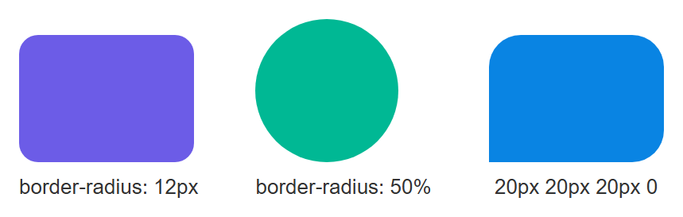

!!! note "Percentages vs. pixels"
    A pixel value (`12px`) rounds by a fixed amount. A percentage (`50%`) rounds relative to
    the element's own size — that is the trick used to turn a square image into a circle.

### Gradients

A **gradient** is a smooth transition between two or more colors, generated entirely by the
browser — no image needed. The two most common kinds are linear (a straight line) and
radial (spreading out from a center point).

```css
.banner {
  background: linear-gradient(to right, #4facfe, #00f2fe);
}

.spotlight {
  background: radial-gradient(circle, #fff, #333);
}

.diagonal {
  background: linear-gradient(45deg, orange, red);
}
```

All three gradients rendered together:

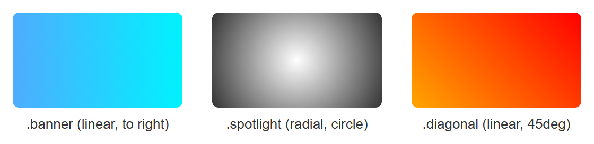

You can add as many color "stops" as you like, and even control where each color starts:

```css
.rainbow {
  background: linear-gradient(
    to right,
    red 0%,
    yellow 25%,
    green 50%,
    blue 75%,
    violet 100%
  );
}
```

Rendered, the five color stops blend smoothly from red through to violet:

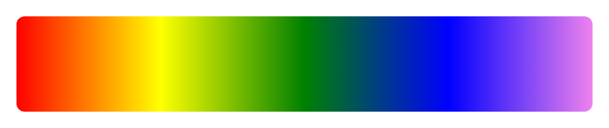

### Shadows

CSS gives you two shadow properties: `box-shadow` for boxes and `text-shadow` for text.

```css
.card {
  box-shadow: 0 4px 10px rgba(0, 0, 0, 0.2);
  /* offset-x | offset-y | blur-radius | color */
}

.card:hover {
  box-shadow: 0 8px 20px rgba(0, 0, 0, 0.35); /* a bigger shadow on hover */
}

h1 {
  text-shadow: 2px 2px 4px rgba(0, 0, 0, 0.5);
}
```

The `.card`'s default `box-shadow` next to its `:hover` end state (bigger, softer shadow), and the `text-shadow`'d heading:

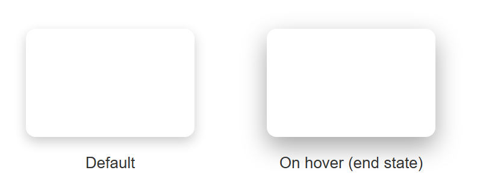

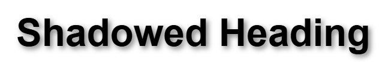

`rgba()` is a color function that adds a fourth value — **alpha**, or transparency — on top
of the usual red, green, and blue. `rgba(0, 0, 0, 0.2)` is black at 20% opacity, which is
why it reads as a soft gray shadow rather than a harsh black block.

!!! tip "Multiple shadows"
    You can stack shadows by separating them with commas: `box-shadow: 0 1px 2px #000, 0 0 20px gold;`
    draws a subtle drop shadow and a glow at the same time.

    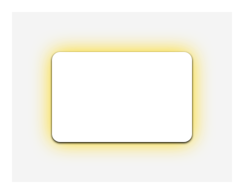

### Opacity

The `opacity` property controls how see-through an entire element is, from `0` (fully
invisible) to `1` (fully solid).

```css
.faded {
  opacity: 0.5; /* 50% transparent */
}
```

A full-opacity box next to the same box at `opacity: 0.5` — notice the text inside fades along with the background:

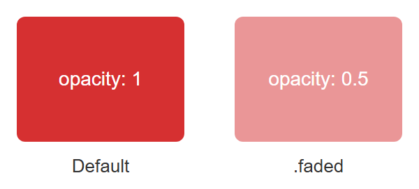

!!! warning "opacity affects children too"
    `opacity` makes *everything inside* the element transparent, including its text. If you
    only want a transparent background but fully solid text, use `rgba()` (or `hsla()`) on
    the `background-color` instead of `opacity` on the whole element.

## 2D/3D Transforms, Transitions, and Keyframe Animations

### Transforms

The `transform` property changes an element's shape or position **without affecting the
layout** of the elements around it. This makes it perfect for hover effects and animations,
since it does not cause other elements to jump around.

```css
.box {
  transform: rotate(15deg);
}

.box2 {
  transform: scale(1.2); /* 20% bigger */
}

.box3 {
  transform: translate(50px, 20px); /* move right 50px, down 20px */
}

.box4 {
  transform: skew(10deg, 0deg);
}

/* combine multiple transforms in one declaration */
.box5 {
  transform: translate(20px, 0) rotate(10deg) scale(1.1);
}
```

An untransformed original square next to each transformed version, for comparison:

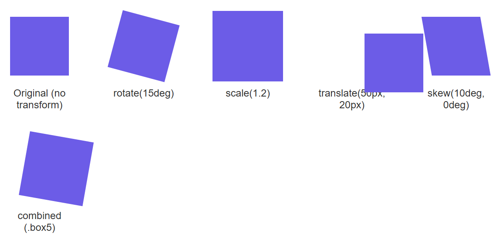

These are all **2D transforms** — they move an element around a flat, two-dimensional
surface (left/right, up/down, and rotating in that same flat plane).

**3D transforms** add a third axis (`Z`), giving the illusion of depth. To make 3D transforms
look correct, the parent element needs `perspective`, which tells the browser how far away
the "viewer" is from the 3D scene.

```css
.scene {
  perspective: 800px; /* set on the parent */
}

.card-3d {
  transform: rotateY(25deg); /* rotate around the vertical axis */
  transition: transform 0.4s ease;
}

.card-3d:hover {
  transform: rotateY(0deg);
}
```

The card at its default `rotateY(25deg)` angle next to its `:hover` end state (`rotateY(0deg)`, flat-on) — the `perspective: 800px` on the parent `.scene` is what makes the default state look tilted in 3D instead of just squashed:

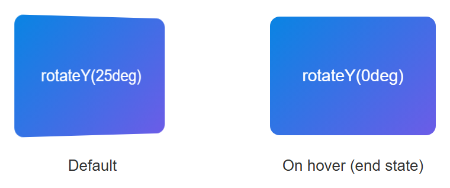

| Function | What it does |
|---|---|
| `translate(x, y)` / `translateZ(z)` | Moves an element |
| `rotate(deg)` / `rotateX/Y/Z(deg)` | Spins an element |
| `scale(n)` / `scaleX/Y/Z(n)` | Resizes an element |
| `skew(deg)` | Slants an element |

### Transitions

A **transition** smoothly animates a property from its old value to its new value over a
set duration, instead of the change happening instantly.

```css
button {
  background-color: royalblue;
  transition: background-color 0.3s ease, transform 0.3s ease;
}

button:hover {
  background-color: darkblue;
  transform: scale(1.05);
}
```

A static screenshot cannot show the smooth animated change itself — that part you have to see by actually hovering the button in a real browser — but it can show the two endpoints the transition moves between: the default button, and the `:hover` styles applied directly as the end state (darker blue, slightly scaled up):

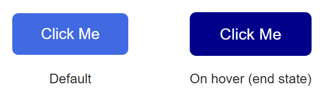

The `transition` shorthand takes: `property | duration | timing-function | delay`. Using
`all` instead of naming a property (`transition: all 0.3s;`) animates every property that
changes, which is convenient but can be slower to render on complex pages.

### Keyframe animations

Transitions only animate between two states (normal → hover). When you need a more complex
sequence — multiple steps, or an animation that plays automatically without a trigger like
`:hover` — you use `@keyframes`.

```css
@keyframes bounce {
  0%   { transform: translateY(0); }
  50%  { transform: translateY(-20px); }
  100% { transform: translateY(0); }
}

.ball {
  animation: bounce 1s ease-in-out infinite;
  /* name | duration | timing-function | iteration-count */
}
```

Like the transition above, the actual looping motion only shows up in a live browser. What a still image *can* show is the three keyframe positions the ball passes through on every cycle:

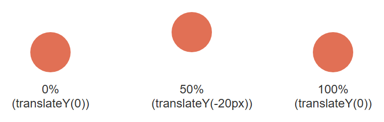

You define the `@keyframes` rule once, naming it (`bounce`), then attach it to any element
with the `animation` property. `infinite` means it loops forever; you could instead write
a number like `3` to play it three times.

!!! tip "transition vs. animation"
    Use a **transition** for simple state changes (hover, focus, a class being toggled by
    JavaScript). Use a **keyframe animation** for anything that plays on its own, loops, or
    needs more than a start and end state.

## Web Fonts, Icon Fonts, and CSS Custom Properties

### Web fonts

By default, a browser can only display fonts already installed on the visitor's computer.
**Web fonts** let you embed a font file directly in your site, so every visitor sees the
exact same typeface regardless of what they have installed.

The easiest way is Google Fonts, a free library of hosted fonts:

```html
<link rel="preconnect" href="https://fonts.googleapis.com">
<link href="https://fonts.googleapis.com/css2?family=Roboto:wght@400;700&display=swap" rel="stylesheet">
```

```css
body {
  font-family: "Roboto", sans-serif;
}
```

The `sans-serif` after `"Roboto"` is a **fallback font** — if the web font fails to load,
the browser falls back to any generic sans-serif font on the system.

You can also self-host a font file using `@font-face`:

```css
@font-face {
  font-family: "MyFont";
  src: url("/fonts/myfont.woff2") format("woff2");
  font-weight: 400;
}

h1 {
  font-family: "MyFont", sans-serif;
}
```

### Icon fonts

An **icon font** is a font where each character maps to a small picture (an icon) instead
of a letter. This lets you use icons like text — resizable with `font-size`, colorable with
`color`, and crisp at any zoom level, unlike a raster image.

```html
<link rel="stylesheet"
  href="https://cdnjs.cloudflare.com/ajax/libs/font-awesome/6.5.1/css/all.min.css">

<i class="fa-solid fa-heart"></i>
<i class="fa-solid fa-house" style="color: teal; font-size: 24px;"></i>
```

!!! note "Icon fonts vs. SVG icons"
    Icon fonts (like Font Awesome) were the standard approach for years. Many modern projects
    now prefer inline **SVG icons** instead, since SVGs support multi-color icons and are
    generally more accessible. Both approaches are still widely used — you will meet SVG
    icons again later in the course.

### CSS custom properties (variables)

A **CSS custom property** — commonly called a CSS variable — lets you store a value once and
reuse it throughout your stylesheet. If you ever need to change that value, you edit it in
one place instead of hunting through every rule.

Custom properties are declared with two leading dashes, `--like-this`, and are typically
defined on `:root` (the top-level element, `<html>`) so they are available everywhere on
the page:

```css
:root {
  --main-color: #6c5ce7;
  --spacing-unit: 8px;
  --border-radius: 6px;
}

.button {
  background-color: var(--main-color);
  padding: calc(var(--spacing-unit) * 2);
  border-radius: var(--border-radius);
}

.button:hover {
  background-color: var(--main-color-dark, #4834d4);
  /* the second value is a fallback if --main-color-dark isn't defined */
}
```

The same `.button` rule, rendered twice, with nothing changed except the value of `--main-color` in scope — proof that the variable, not a separate style rule, is what controls the rendered color:

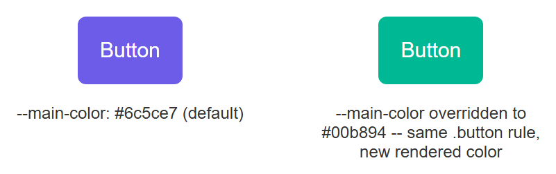

You read a custom property's value with the `var()` function. Unlike a preprocessor variable
(such as one in Sass), a CSS custom property is a **live, real value in the browser** — you
can even change it at runtime with JavaScript, and every element using `var(--main-color)`
updates instantly.

!!! tip "A practical use: theming"
    Custom properties are the standard way to build a light/dark theme toggle. You define one
    set of variables for light mode and swap in a different set of values (often scoped to a
    `[data-theme="dark"]` selector) for dark mode — no need to rewrite every color rule.

## Media Queries, Feature Queries, and Cross-Browser Compatibility

### Media queries

A **media query** applies CSS rules only when certain conditions about the screen are true —
most commonly, the width of the browser window. This is the foundation of **responsive
design**, which you will study in depth in Lecture 10.

```css
/* base styles, for all screens */
.container {
  width: 100%;
  padding: 16px;
}

/* only applies when the viewport is 768px wide or more */
@media (min-width: 768px) {
  .container {
    width: 750px;
    margin: 0 auto;
  }
}
```

A static screenshot cannot demonstrate a media query doing its job — the whole point is that the layout changes as the viewport width changes. This is one you need to see by actually resizing a real browser window (or dragging the responsive-mode device toolbar in DevTools) and watching `.container` snap between its narrow and wide styles as it crosses the `768px` threshold.

### Feature queries

A **feature query**, written with `@supports`, applies CSS only if the visitor's browser
actually supports a given property or value. This lets you safely use a newer CSS feature
while providing a fallback for older browsers.

```css
.layout {
  display: block; /* fallback for browsers without grid support */
}

@supports (display: grid) {
  .layout {
    display: grid;
    grid-template-columns: 1fr 1fr;
  }
}
```

Every modern browser used to view this book already supports `display: grid`, so a screenshot here would only ever show the `@supports` branch winning — it cannot honestly demonstrate the fallback path an older browser would take. Trust the mechanism: `@supports` checks real, current browser support before applying its block, the same way `@media` checks real, current viewport size.

### Vendor prefixes

Historically, browser makers added experimental support for new CSS features before those
features became an official standard, marking them with a **vendor prefix** so they would
not clash with the eventual standard property name.

| Prefix | Browser engine |
|---|---|
| `-webkit-` | Chrome, Safari, newer Edge |
| `-moz-` | Firefox |
| `-ms-` | old Internet Explorer / Edge |
| `-o-` | old Opera |

```css
.box {
  -webkit-transform: rotate(10deg); /* Safari/old Chrome */
  -moz-transform: rotate(10deg);    /* old Firefox */
  transform: rotate(10deg);         /* standard, always last */
}
```

!!! warning "Write the standard property last"
    Always list the unprefixed, standard property **after** the prefixed ones. If a browser
    understands both, it will apply whichever rule comes last — so putting the standard
    version last means modern browsers use the correct, final behavior.

Writing every prefix by hand is tedious and error-prone, so in real projects this is
automated by a build tool called **Autoprefixer**, which reads your plain CSS and adds
exactly the prefixes still needed based on which browsers you want to support. You will not
be expected to hand-write prefixes for most modern properties (like `border-radius` or
`box-shadow`) — they no longer need them in current browsers — but you should recognize them
when you see them in older code, and understand *why* cross-browser testing still matters:
not every visitor uses the newest version of Chrome.

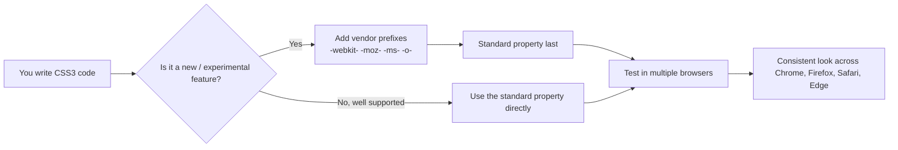

## Try It Yourself

1. Build a "profile card" component: a rounded box (`border-radius`) with a circular avatar
   image, a `box-shadow`, and a background `linear-gradient` header. Add a `transition` so
   the whole card lifts slightly (`transform: translateY(-5px)`) and its shadow grows when
   the user hovers over it.
2. Define three CSS custom properties on `:root` — `--main-color`, `--accent-color`, and
   `--font-heading`. Use them across at least four different rules in your stylesheet, then
   change only the variable values and confirm every usage updates at once. Finally, write a
   `@keyframes` animation that makes a button gently pulse (scale up and down) forever.

## Key Takeaways

- `border-radius`, gradients, `box-shadow`/`text-shadow`, and `opacity` let you build modern
  visual effects using pure CSS, with no images required.
- `transform` (2D and 3D) repositions, rotates, or resizes elements without disturbing page
  layout; 3D transforms need `perspective` on a parent to look correct.
- `transition` animates smoothly between two states (like normal and `:hover`); `@keyframes`
  plus `animation` defines multi-step animations that can run automatically and loop.
- Web fonts (via `@font-face` or services like Google Fonts) let every visitor see the same
  typeface; icon fonts let you use scalable icons the same way you use text.
- CSS custom properties (`--name`, read with `var(--name)`) store reusable values in one
  place and are the standard mechanism behind theming and dark mode.
- Media queries (`@media`) adapt styles to screen size; feature queries (`@supports`) adapt
  styles to what the browser can actually render.
- Vendor prefixes (`-webkit-`, `-moz-`, `-ms-`, `-o-`) exist for cross-browser compatibility
  with experimental features; always place the unprefixed standard property last.
