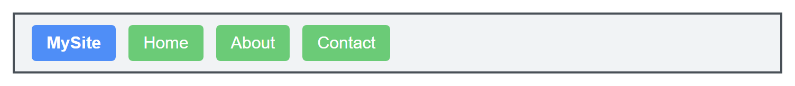
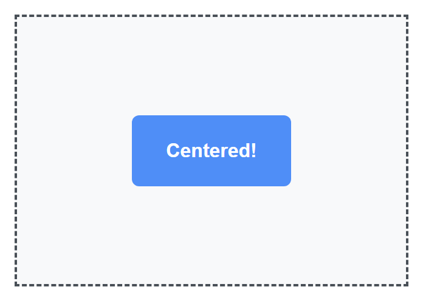
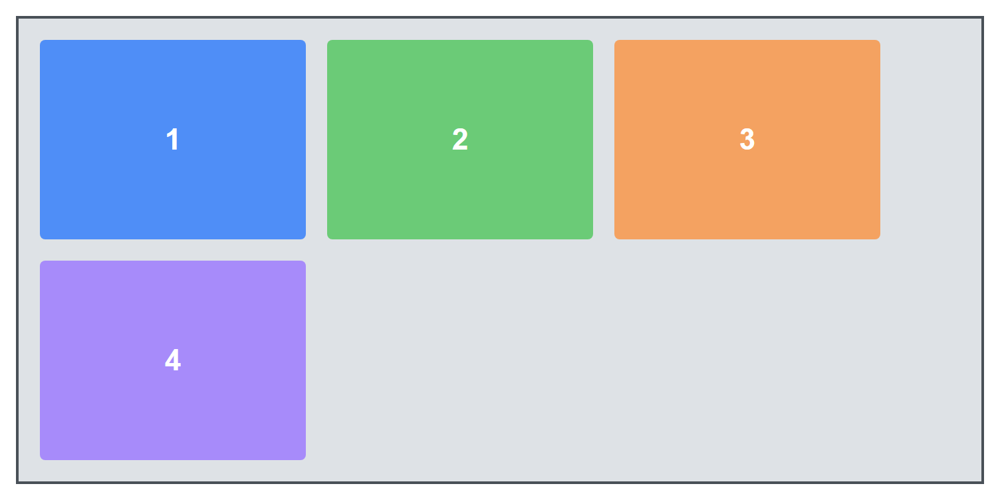
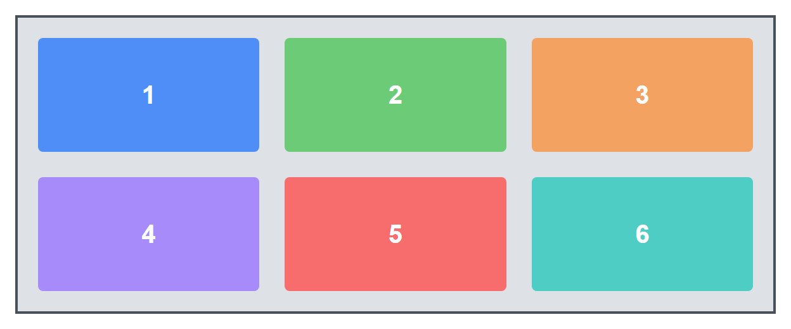
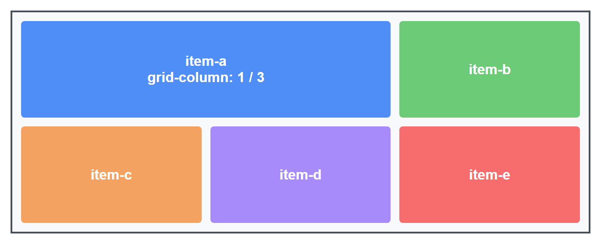
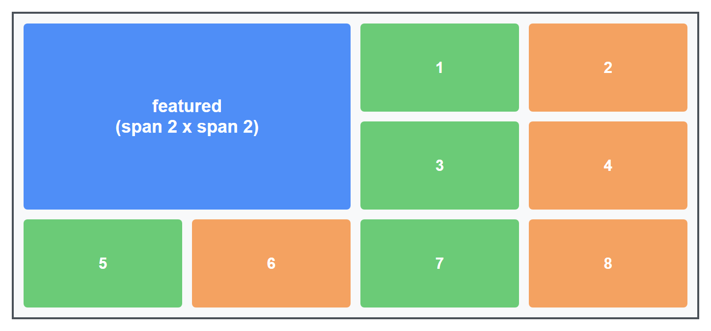
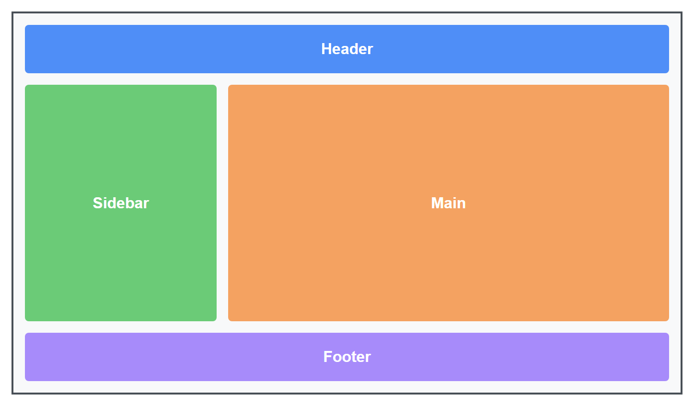
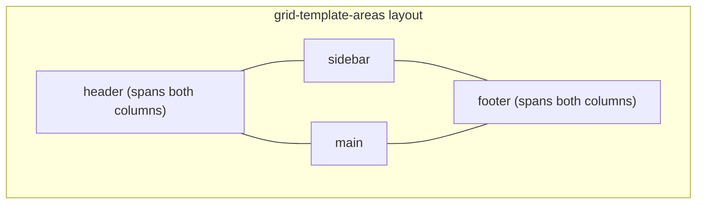

# Lecture 9: Layout Design using Flexbox and Grid

For a long time, arranging boxes on a web page — a navigation bar, a row of cards, a
three-column layout — required awkward workarounds like `float` and manual positioning
math. Flexbox and Grid are two modern CSS layout systems built specifically to solve this
problem. In this lecture you will learn what each one is for and how to use them together.

## In This Lecture

- Understand the flex container/flex item relationship, and the main axis vs. cross axis
- Control the direction, spacing, alignment, and wrapping of flex items
- Control how individual flex items grow, shrink, and size themselves
- Build layouts with CSS Grid: rows, columns, the `fr` unit, and gaps
- Place items on specific grid lines, make them span multiple cells, and name grid areas
- Decide when to reach for Flexbox versus Grid for a given layout problem

## Flexbox: Container, Items, and the Two Axes

**Flexbox** (the Flexible Box layout) is a CSS layout mode designed for arranging items in
a single row or a single column, and automatically handling spacing and alignment between
them.

Flexbox always involves two roles:

- The **flex container** — the parent element you turn on Flexbox for, using
  `display: flex`.
- The **flex items** — the direct children of that container. They automatically become
  flex items once their parent has `display: flex`; you do not style them individually to
  "become" a flex item.

```html
<div class="nav">
  <div class="logo">MySite</div>
  <div class="links">Home</div>
  <div class="links">About</div>
  <div class="links">Contact</div>
</div>
```

```css
.nav {
  display: flex; /* .nav is now a flex container */
  /* .logo and the three .links divs are now flex items */
}
```

Just adding `display: flex` already does something useful: the items line up in a row,
side by side, instead of stacking vertically the way plain `<div>`s normally do.



### The main axis and the cross axis

Flexbox thinks in terms of two axes, and this is the single most important idea to
understand before the individual properties make sense:

- The **main axis** is the primary direction items are laid out along. By default this is
  horizontal (left to right).
- The **cross axis** is perpendicular to the main axis. By default this is vertical.

Here is a real `display: flex` row with the two axes marked directly on it:


Every alignment property in Flexbox lines up along *one* of these two axes — which is why
`flex-direction` (which chooses the main axis) is usually the first property you set.

## Flexbox Properties

### `flex-direction`

Sets which way the main axis runs, which changes what "main" and "cross" mean for every
other property.

```css
.container {
  flex-direction: row;            /* default: left to right */
  /* flex-direction: row-reverse; right to left */
  /* flex-direction: column;      top to bottom — main axis becomes vertical */
  /* flex-direction: column-reverse; bottom to top */
}
```

All four values, rendered side by side with the same three items:


### `justify-content` — alignment along the main axis

```css
.container {
  display: flex;
  justify-content: flex-start;    /* default: items packed at the start */
  /* justify-content: flex-end;      packed at the end */
  /* justify-content: center;        packed in the center */
  /* justify-content: space-between; equal gaps *between* items, none at the edges */
  /* justify-content: space-around;  equal gaps around each item */
  /* justify-content: space-evenly;  perfectly equal gaps everywhere */
}
```

All six values, rendered with the same three items so the spacing differences are easy to
compare directly:


### `align-items` — alignment along the cross axis

```css
.container {
  display: flex;
  height: 200px;
  align-items: stretch;    /* default: items stretch to fill the cross axis */
  /* align-items: flex-start;  items align to the top */
  /* align-items: flex-end;    items align to the bottom */
  /* align-items: center;      items align to the vertical center */
}
```

Here the three items deliberately have different heights, so each value's effect on the
cross axis (vertical, since the main axis is still the default row) is unmistakable:


!!! tip "The famous centering trick"
    To perfectly center something both horizontally and vertically — historically one of the
    most annoying things to do in CSS — you only need three lines:
    ```css
    .container {
      display: flex;
      justify-content: center;
      align-items: center;
    }
    ```

    

### `flex-wrap`

By default, Flexbox tries to squeeze every item onto a single line, shrinking them if
necessary. `flex-wrap` lets items move onto new lines instead.

```css
.container {
  display: flex;
  flex-wrap: nowrap;  /* default: everything stays on one line */
  /* flex-wrap: wrap;     items move to a new line when they run out of room */
  /* flex-wrap: wrap-reverse; wraps, but new lines stack in reverse order */
}
```

The same five fixed-width items in the same narrow container, once with `nowrap` (the
default) and once with `wrap`:


### `flex-grow`, `flex-shrink`, and `flex-basis`

These three properties are set on the **flex items**, not the container, and control how
each individual item shares the available space.

- **`flex-basis`** — the item's starting size, before growing or shrinking is applied.
  Think of it as a preferred `width` (or `height`, if the main axis is vertical).
- **`flex-grow`** — a number that says how much of the *leftover* space this item should
  claim, relative to other items. `0` (the default) means "don't grow."
- **`flex-shrink`** — a number that says how much this item should shrink if the container
  is too small to fit everything. `1` (the default) means "shrink normally."

```css
.item {
  flex-basis: 200px;
  flex-grow: 1;
  flex-shrink: 1;
  /* shorthand: flex: 1 1 200px;  (grow | shrink | basis) */
}
```

A very common pattern is `flex: 1` on every item, which makes them all grow equally to fill
whatever space is left, resulting in equal-width columns:

```css
.column {
  flex: 1; /* short for flex-grow: 1; flex-shrink: 1; flex-basis: 0; */
}
```

If one item should be twice as wide as the others, give it `flex-grow: 2` while the rest
keep `flex-grow: 1` — Flexbox splits the leftover space in that 2:1:1 ratio.

Three rendered examples: items with different starting sizes (`flex-basis`) growing by the
same amount, the equal-column `flex: 1` pattern, and the 2:1:1 growth ratio:


## CSS Grid: Rows, Columns, and the `fr` Unit

**CSS Grid** is a layout system for arranging items into rows *and* columns at the same
time — a true two-dimensional grid, unlike Flexbox's single row-or-column model.

```html
<div class="gallery">
  <div>1</div>
  <div>2</div>
  <div>3</div>
  <div>4</div>
</div>
```

```css
.gallery {
  display: grid;
  grid-template-columns: 200px 200px 200px; /* 3 columns, each 200px wide */
  grid-template-rows: 150px 150px;          /* 2 rows, each 150px tall */
  gap: 16px; /* space between rows and columns */
}
```

Four items in a 3-column grid: the first three fill row one, and the fourth automatically
flows onto row two, leaving the rest of that row empty since there is no fifth or sixth item:



### The `fr` unit

Writing exact pixel widths for every column is inflexible. The **`fr`** unit (short for
"fraction") represents a fraction of the *remaining free space* in the grid container,
letting columns resize proportionally with the browser window.

```css
.layout {
  display: grid;
  grid-template-columns: 1fr 1fr 1fr; /* three equal-width columns */
}

.layout2 {
  display: grid;
  grid-template-columns: 2fr 1fr; /* first column is twice as wide as the second */
}

.layout3 {
  display: grid;
  grid-template-columns: 250px 1fr; /* a fixed sidebar + a flexible main area */
}
```

All three column patterns, rendered at the same overall width so the proportions are
directly comparable:


### `gap`

`gap` sets the spacing between grid cells in one declaration (you can also use
`row-gap` and `column-gap` separately if you want different spacing in each direction).

```css
.grid {
  display: grid;
  grid-template-columns: repeat(3, 1fr);
  gap: 20px;
}
```

`repeat(3, 1fr)` is shorthand for `1fr 1fr 1fr` — useful when you have many columns.



## Grid Line Placement, Spanning, and Named Areas

### Placing items on grid lines

A grid is made of numbered **grid lines** — the boundaries between rows and columns,
starting at `1`. You can place an item explicitly by telling it which lines to start and
end at.

```css
.item-a {
  grid-column: 1 / 3; /* start at column line 1, end at column line 3 (spans 2 columns) */
  grid-row: 1 / 2;
}
```

`item-a` explicitly spans the first two columns of row one; the remaining items are left
to auto-place themselves into whatever grid cells are left:



### Spanning multiple cells

The `span` keyword is a shorter way to say "cover this many tracks" without counting exact
line numbers.

```css
.featured {
  grid-column: span 2; /* this item takes up 2 columns' worth of width */
  grid-row: span 2;    /* and 2 rows' worth of height */
}
```

This is extremely common for "featured" cards in a photo gallery or dashboard, where one
item is meant to stand out by being visibly larger than the rest.



### Named grid areas

Instead of counting lines, you can give regions of the grid names and draw the layout
visually right inside your CSS using `grid-template-areas`.

```css
.page {
  display: grid;
  grid-template-columns: 200px 1fr;
  grid-template-rows: auto 1fr auto;
  grid-template-areas:
    "header header"
    "sidebar main"
    "footer footer";
  min-height: 100vh;
  gap: 12px;
}

.header  { grid-area: header; }
.sidebar { grid-area: sidebar; }
.main    { grid-area: main; }
.footer  { grid-area: footer; }
```

Each quoted string in `grid-template-areas` represents one row, and each word inside it
represents one column's content in that row. Repeating a name (like `header header`) makes
that area span both columns. This is one of the most readable ways to build a classic page
layout, because you can *see* the shape of the page directly in the CSS.





## Choosing Flexbox vs. Grid

Both systems can technically build simple layouts, but they were designed for different
jobs, and picking the right one makes your CSS much simpler.

| | Flexbox | Grid |
|---|---|---|
| Dimensions | One-dimensional (a row *or* a column) | Two-dimensional (rows *and* columns together) |
| Best for | Nav bars, button groups, aligning items within a component | Whole-page layouts, photo galleries, dashboards |
| Sizing driven by | Content size (items can grow/shrink to fit content) | The grid structure you define up front |
| Item placement | Items flow in order, one after another | Items can be placed at exact, specific grid cells |

!!! note "The simple rule of thumb"
    If you are arranging things in **one direction** (a row of buttons, a horizontal menu,
    vertically stacked form fields), reach for **Flexbox**. If you need to control **rows
    and columns at the same time** (an overall page layout, a gallery grid), reach for
    **Grid**.

In real projects, you will use both together constantly: Grid to lay out the overall page
skeleton (header, sidebar, main content, footer), and Flexbox *inside* individual
components — like centering the logo and links within that header — to align their
contents.

```css
/* Grid for the page skeleton */
.page {
  display: grid;
  grid-template-columns: 220px 1fr;
  grid-template-areas: "sidebar main";
}

/* Flexbox inside one component of that skeleton */
.header {
  display: flex;
  justify-content: space-between;
  align-items: center;
}
```

Both techniques rendered together: Grid lays out the sidebar and main columns, while
Flexbox spreads the logo, nav links, and button apart inside the header at the top of main:


## Try It Yourself

1. Build a horizontal navigation bar using Flexbox: a logo on the left, three links in the
   middle, and a "Sign In" button on the right, all vertically centered. Use
   `justify-content: space-between` to push the logo and button to opposite ends.
2. Build a simple blog page layout using CSS Grid and `grid-template-areas`: a full-width
   header, a sidebar on the left, a main content area on the right, and a full-width footer.
   Then add a photo gallery inside the main area using `grid-template-columns: repeat(3, 1fr)`
   where one photo uses `grid-column: span 2` to appear larger than the rest.

## Key Takeaways

- Flexbox arranges items along a single line: `display: flex` on a **flex container** turns
  its direct children into **flex items**.
- The **main axis** (set by `flex-direction`) and **cross axis** (perpendicular to it) are
  the foundation every Flexbox alignment property builds on.
- `justify-content` aligns along the main axis, `align-items` aligns along the cross axis,
  and `flex-wrap` controls whether items overflow onto new lines.
- `flex-grow`, `flex-shrink`, and `flex-basis` (often combined as the `flex` shorthand)
  control how individual items resize to share available space.
- CSS Grid arranges items in two dimensions at once, using `grid-template-columns`,
  `grid-template-rows`, and the flexible `fr` unit, with `gap` for spacing.
- Items can be placed by grid line numbers, made to `span` multiple cells, or placed into
  human-readable named regions with `grid-template-areas`.
- Choose Flexbox for one-dimensional component layout; choose Grid for two-dimensional
  page-level layout. Most real pages use both together.
