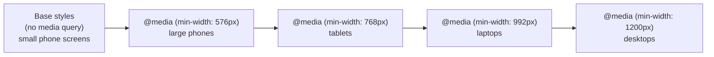

# Lecture 10: Responsive Design and Framework Fundamentals (Bootstrap or Tailwind)

Your site needs to look good on a giant desktop monitor, a laptop, a tablet held sideways,
and a phone screen barely 350 pixels wide — often all at once, since you cannot control what
device a visitor uses. This lecture covers **responsive design**, the set of techniques for
building one site that adapts to any screen, and introduces the two major styles of CSS
framework — Bootstrap and Tailwind CSS — that make responsive design faster in practice.

## In This Lecture

- Understand mobile-first design, the viewport meta tag, and fluid units (`%`, `rem`, `vw`/`vh`)
- Use media queries and breakpoints, and make images respond to screen size
- Compare component-based frameworks (Bootstrap) with utility-first frameworks (Tailwind)
- Learn Bootstrap's grid system, components, and utilities
- Learn Tailwind's utility-class structure
- Extend either framework with your own custom classes and components

## Mobile-First Design, the Viewport Meta Tag, and Fluid Units

### Mobile-first design

**Mobile-first design** means you write your base CSS for small screens first, then use
media queries to *add* styling for larger screens as space becomes available. This is the
opposite of the older approach — "desktop-first" — where you designed for a big screen and
then tried to cram everything onto a phone afterward.

Mobile-first is preferred today for two reasons: mobile traffic makes up the majority of web
visits worldwide, and it is far easier to progressively *add* complexity (extra columns,
a sidebar) as screen space grows than to strip complexity away.



### The viewport meta tag

By default, mobile browsers assume a web page was built for a desktop and try to fit that
full desktop-width page onto the small screen by zooming out — which makes everything tiny
and forces the user to pinch-zoom just to read text. The **viewport meta tag**, placed in
your HTML `<head>`, disables that behavior and tells the browser to render the page at the
device's actual width.

```html
<meta name="viewport" content="width=device-width, initial-scale=1.0">
```

- `width=device-width` — use the actual pixel width of the device, not a fake desktop width.
- `initial-scale=1.0` — start at 100% zoom (no zooming in or out by default).

!!! warning "Never forget this tag"
    Without the viewport meta tag, none of your media queries will work correctly on a real
    phone — the browser will still be pretending it has a much wider screen. This single
    line should be in every HTML page you build from here on.

### Fluid units

A **fluid unit** is a measurement that scales relative to something else, instead of being
a fixed, absolute size like pixels (`px`). Using fluid units is a big part of what makes a
layout genuinely responsive rather than just "resized."

| Unit | Relative to | Example use |
|---|---|---|
| `%` | The size of the parent element | `width: 50%;` — half of the parent's width |
| `rem` | The root (`<html>`) element's font size, usually `16px` by default | `font-size: 1.5rem;` — scales with the user's font-size preference |
| `em` | The current element's own font size | Rarely used for layout; more common inside typography |
| `vw` | 1% of the viewport's (browser window's) width | `width: 100vw;` — always exactly the full screen width |
| `vh` | 1% of the viewport's height | `height: 100vh;` — always exactly the full screen height |

```css
html {
  font-size: 16px; /* 1rem = 16px, by default */
}

.hero {
  width: 100vw;   /* always fills the full screen width */
  height: 60vh;   /* always 60% of the visible screen height */
  padding: 2rem;  /* scales if the user changes their base font size */
}

.card {
  width: 90%; /* always 90% of its parent's width, whatever that is */
}
```

!!! tip "Why rem instead of px for text?"
    Some users increase their browser's default font size for accessibility reasons (poor
    eyesight, for example). Text sized in `px` ignores that setting completely. Text sized in
    `rem` scales along with it, which is why most professional style guides recommend `rem`
    for font sizes.

## Media Queries, Breakpoints, and Responsive Images

### Media queries and breakpoints

You already met the `@media` rule in Lecture 8. A **breakpoint** is simply the specific
screen width at which your layout changes to accommodate more (or less) space — it is the
value you put inside a `min-width` or `max-width` media query.

```css
/* mobile-first base styles: apply to every screen size */
.container {
  display: flex;
  flex-direction: column;
}

/* tablet breakpoint and up */
@media (min-width: 768px) {
  .container {
    flex-direction: row;
  }
}

/* desktop breakpoint and up */
@media (min-width: 1200px) {
  .container {
    max-width: 1140px;
    margin: 0 auto;
  }
}
```

There is no single "correct" set of breakpoints — they should match your actual content,
not a fixed rulebook. That said, most frameworks (including Bootstrap, which you will see
below) converge on a similar rough set of common device widths: around 576px (large
phones), 768px (tablets), 992px (laptops), and 1200px+ (desktops).

### Responsive images

An image with a fixed `width` in pixels will overflow a small screen's container and force
horizontal scrolling — one of the most common beginner mistakes. The fix is simple:

```css
img {
  max-width: 100%;
  height: auto;
}
```

`max-width: 100%` means the image never grows wider than its parent container, while
`height: auto` keeps its aspect ratio correct as it shrinks. This one rule is often applied
globally near the top of a stylesheet.

For more advanced cases — like serving a smaller image file to phones so they are not
forced to download a huge desktop-sized photo — HTML provides the `srcset` attribute, which
lets the browser choose the best-fitting image file from a list you provide:

```html

```

The browser reads `sizes` to figure out roughly how large the image will display at the
current screen width, then downloads whichever file in `srcset` best matches — saving
bandwidth on smaller devices.

## Framework Philosophies: Component-Based vs. Utility-First

Writing every layout and every button style completely from scratch, on every project, is
slow. A **CSS framework** is a pre-written library of CSS (and sometimes JavaScript) that
gives you ready-made building blocks so you can move faster. The two dominant philosophies
today are represented by Bootstrap and Tailwind CSS.

- **Component-based frameworks** (Bootstrap is the classic example) ship pre-styled,
  ready-to-use *components* — a finished button, a finished navbar, a finished card — each
  identified by a class name like `.btn` or `.card`. You mostly assemble your page out of
  these ready-made pieces.
- **Utility-first frameworks** (Tailwind CSS is the classic example) ship hundreds of tiny,
  single-purpose *utility classes* — one class does one job, like `flex`, `p-4` (padding),
  or `text-center`. You compose these small classes directly in your HTML to build your own
  custom-looking components from scratch.

| | Bootstrap (component-based) | Tailwind (utility-first) |
|---|---|---|
| What you get out of the box | Fully-styled components (buttons, cards, navbars) | Small utility classes you combine yourself |
| Visual result by default | Sites can look similar unless customized | Nothing looks "designed" until you style it — no default look to fight against |
| How much custom CSS you write | Less, at first — but overriding built-in styles can fight the framework | Very little separate CSS — most styling lives in your HTML as classes |
| Learning curve | Fast to get a decent-looking page up quickly | Takes longer at first — you must learn many class names |
| Good for | Prototypes, admin panels, projects that need to ship fast with minimal design work | Projects wanting a highly custom, unique look without leaving CSS entirely behind |

!!! note "Neither one is objectively 'better'"
    Both are extremely popular in industry, and the CSC336 lab will let your instructor pick
    either. The important thing is understanding *why* they feel so different to use: one
    hands you finished components, the other hands you building blocks.

## Bootstrap: Grid System, Components, and Utilities

Bootstrap is a CSS (and optional JavaScript) framework you include via a `<link>` tag (or
install as a package). It gives you a responsive grid system, a large library of
pre-styled components, and a set of small utility classes for common tweaks.

```html
<link href="https://cdn.jsdelivr.net/npm/bootstrap@5.3.3/dist/css/bootstrap.min.css" rel="stylesheet">
```

### The Bootstrap grid system

Bootstrap's grid is built on Flexbox internally, organized into 12 columns. You wrap your
content in a `.container`, then a `.row`, then divide that row into `.col-*` classes whose
numbers add up to 12 for a full row.

```html
<div class="container">
  <div class="row">
    <div class="col-md-8">Main content (8 of 12 columns on medium screens+)</div>
    <div class="col-md-4">Sidebar (4 of 12 columns on medium screens+)</div>
  </div>
</div>
```

The `md` in `col-md-8` is a **breakpoint prefix** — it means "use 8 columns' width starting
at the medium breakpoint and up." Below that breakpoint, columns you don't size explicitly
stack full-width automatically, which is Bootstrap's built-in mobile-first behavior.

| Prefix | Approx. screen width |
|---|---|
| (none) | All sizes (mobile-first default) |
| `sm` | ≥576px |
| `md` | ≥768px |
| `lg` | ≥992px |
| `xl` | ≥1200px |

### Bootstrap components

Components are ready-made pieces of UI — you just add the right classes to your HTML.

```html
<button class="btn btn-primary">Save Changes</button>

<div class="card" style="width: 18rem;">
  <div class="card-body">
    <h5 class="card-title">Card Title</h5>
    <p class="card-text">Some quick example text for this card component.</p>
    <a href="#" class="btn btn-secondary">Read more</a>
  </div>
</div>

<nav class="navbar navbar-expand-lg navbar-light bg-light">
  <a class="navbar-brand" href="#">MySite</a>
</nav>
```

### Bootstrap utilities

Alongside full components, Bootstrap also includes small single-purpose utility classes for
common adjustments like spacing, text alignment, and color — similar in spirit to
Tailwind's approach, just with a smaller set of classes.

```html
<div class="d-flex justify-content-between p-3 mb-4 text-center">
  <!-- d-flex: display: flex
       justify-content-between: justify-content: space-between
       p-3: padding on all sides
       mb-4: margin-bottom
       text-center: centers text -->
</div>
```

## Tailwind CSS: Utility-Class Structure

Tailwind takes the opposite approach: instead of shipping finished components, it gives you
a very large set of small utility classes, and you build your own look by combining them
directly in your markup.

```html
<script src="https://cdn.tailwindcss.com"></script>
```

```html
<button class="bg-blue-600 hover:bg-blue-700 text-white font-semibold px-4 py-2 rounded-lg shadow">
  Save Changes
</button>
```

Reading that one class list top to bottom already tells you exactly what the button looks
like, without switching to a separate CSS file:

| Class | Meaning |
|---|---|
| `bg-blue-600` | Background color: a specific shade of blue |
| `hover:bg-blue-700` | On hover, switch to a darker shade of blue |
| `text-white` | White text color |
| `font-semibold` | Semi-bold font weight |
| `px-4 py-2` | Horizontal padding level 4, vertical padding level 2 |
| `rounded-lg` | Large `border-radius` |
| `shadow` | A preset `box-shadow` |

Tailwind is also responsive by default, using breakpoint *prefixes* on any utility class —
the exact same mobile-first idea as Bootstrap's `col-md-8`, just spelled differently:

```html
<div class="flex flex-col md:flex-row">
  <!-- flex-col by default (stacked, mobile-first)
       md:flex-row switches to a row once the screen is "md" width or larger -->
</div>

<div class="w-full lg:w-1/3">
  <!-- full width by default, one-third width from the "lg" breakpoint up -->
</div>
```

!!! tip "Reading Tailwind classes"
    Most Tailwind class names follow a `property-value` pattern (`text-center`, `p-4`,
    `bg-red-500`), and a breakpoint prefix like `md:` or `lg:` before a class means "only
    apply this class from that screen width and up" — mirroring the same mobile-first logic
    you learned earlier in this lecture.

## Using Custom Classes and Adding Components

Neither framework expects you to only ever use their built-in classes — real projects
almost always mix in your own custom CSS.

=== "Bootstrap"

    Bootstrap components are ordinary HTML with ordinary classes, so you can add your own
    class alongside Bootstrap's and override just the parts you want to change:

    ```html
    <button class="btn btn-primary my-cta-button">Get Started</button>
    ```

    ```css
    .my-cta-button {
      text-transform: uppercase;
      letter-spacing: 1px;
    }
    ```

    Because `.my-cta-button` is your own class, its rule can add new styles on top of
    whatever `.btn.btn-primary` already sets, as long as it's loaded after Bootstrap's CSS
    (or is specific enough to win).

    You can also build a brand-new "component" simply by combining Bootstrap's grid and
    utility classes into a reusable HTML snippet you copy wherever you need it — Bootstrap
    does not require any special registration step for this.

=== "Tailwind"

    Because Tailwind components are just a combination of utility classes, "creating a
    component" usually means saving that exact combination somewhere reusable — for
    example, as a snippet, a template partial, or (in component-based tools like React) a
    single reusable component function:

    ```html
    <!-- reuse this exact combination everywhere you need a primary button -->
    <button class="bg-blue-600 hover:bg-blue-700 text-white font-semibold px-4 py-2 rounded-lg shadow">
      Get Started
    </button>
    ```

    For styles that don't fit neatly into existing utilities, you can still write plain
    custom CSS and combine it with Tailwind's utilities on the same element:

    ```css
    .brand-underline {
      text-decoration: underline wavy;
      text-underline-offset: 4px;
    }
    ```

    ```html
    <span class="text-blue-600 font-bold brand-underline">New!</span>
    ```

In both frameworks, the same rule applies: use the framework for the 80% of common styling
it already solves well, and drop into plain custom CSS for the remaining 20% that makes your
project look like *your* project instead of a generic template.

## Try It Yourself

1. Build a simple three-column "feature" section (three cards side by side on desktop,
   stacking to one column on mobile) two ways: once using Bootstrap's `.container`, `.row`,
   and `.col-md-4` classes, and once using Tailwind's `flex flex-col md:flex-row` classes.
   Compare how much of the layout logic lives in your HTML versus a separate CSS file in
   each version.
2. Take a plain `` tag and make it fully responsive: add `max-width: 100%; height: auto;`
   in CSS, then add the viewport meta tag to your page's `<head>` if it is missing, and test
   resizing your browser window from a wide desktop width down to a narrow phone width to
   confirm the image always fits its container without causing horizontal scrolling.

## Key Takeaways

- Mobile-first design starts with base styles for small screens and layers on complexity for
  larger screens using `min-width` media queries.
- The viewport meta tag (`<meta name="viewport" content="width=device-width, initial-scale=1.0">`)
  is required for media queries to behave correctly on real phones.
- Fluid units — `%`, `rem`, `vw`, `vh` — scale relative to something else, instead of being
  fixed like `px`, which is essential for layouts that truly adapt to any screen.
- `max-width: 100%; height: auto;` keeps images from overflowing their container;
  `srcset`/`sizes` let the browser pick an appropriately-sized image file per device.
- Component-based frameworks like Bootstrap give you finished, pre-styled UI pieces;
  utility-first frameworks like Tailwind give you small single-purpose classes you compose
  yourself.
- Bootstrap's 12-column, Flexbox-based grid (`.container`, `.row`, `.col-md-*`) and its
  ready-made components (`.btn`, `.card`, `.navbar`) let you assemble a page quickly.
- Tailwind's utility classes (`flex`, `p-4`, `bg-blue-600`, with breakpoint prefixes like
  `md:`) let you build a fully custom look directly in your HTML.
- Both frameworks expect you to add your own custom CSS or reusable class combinations on
  top of them — frameworks solve the common 80%, not the last 20% that makes a site unique.
