# Lecture 10: Responsive Design and Framework Fundamentals (Bootstrap or Tailwind)

Your site needs to look good on a giant desktop monitor, a laptop, a tablet held sideways,
and a phone screen barely 350 pixels wide — often all at once, since you cannot control what
device a visitor uses. This lecture covers **responsive design**, the set of techniques for
building one site that adapts to any screen, and introduces the two major styles of CSS
framework — Bootstrap and Tailwind CSS — that make responsive design faster in practice.

## In This Lecture

- Understand mobile-first design, the viewport meta tag, and fluid units (`%`, `rem`, `vw`/`vh`)
- Use media queries and breakpoints — combining conditions with `and`/`,`/`not`, and
  features beyond width like `orientation`, `prefers-color-scheme`, and `print` — and make
  images respond to screen size
- Compare component-based frameworks (Bootstrap) with utility-first frameworks (Tailwind)
- Learn Bootstrap's grid system in depth — auto-layout columns, nesting, offsetting,
  reordering, and alignment — plus its components and utilities
- Learn Tailwind's utility-class structure, its configuration file, and dark mode
- Extend either framework with your own custom classes and components
- Understand CSS preprocessors — Sass (SCSS), and LESS — and why they exist
- Use Sass variables, nesting, mixins, and partials, and use them to customize Bootstrap's
  own source before it compiles

## Mobile-First Design, the Viewport Meta Tag, and Fluid Units

### Mobile-first design

**Mobile-first design** means you write your base CSS for small screens first, then use
media queries to *add* styling for larger screens as space becomes available. This is the
opposite of the older approach — "desktop-first" — where you designed for a big screen and
then tried to cram everything onto a phone afterward.

Mobile-first is preferred today for two reasons: mobile traffic makes up the majority of web
visits worldwide, and it is far easier to progressively *add* complexity (extra columns,
a sidebar) as screen space grows than to strip complexity away.

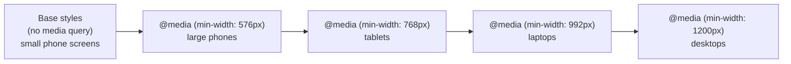

### The viewport meta tag

By default, mobile browsers assume a web page was built for a desktop and try to fit that
full desktop-width page onto the small screen by zooming out — which makes everything tiny
and forces the user to pinch-zoom just to read text. The **viewport meta tag**, placed in
your HTML `<head>`, disables that behavior and tells the browser to render the page at the
device's actual width.

```html
<meta name="viewport" content="width=device-width, initial-scale=1.0">
```

- `width=device-width` — use the actual pixel width of the device, not a fake desktop width.
- `initial-scale=1.0` — start at 100% zoom (no zooming in or out by default).

!!! warning "Never forget this tag"
    Without the viewport meta tag, none of your media queries will work correctly on a real
    phone — the browser will still be pretending it has a much wider screen. This single
    line should be in every HTML page you build from here on.

### Fluid units

A **fluid unit** is a measurement that scales relative to something else, instead of being
a fixed, absolute size like pixels (`px`). Using fluid units is a big part of what makes a
layout genuinely responsive rather than just "resized."

| Unit | Relative to | Example use |
|---|---|---|
| `%` | The size of the parent element | `width: 50%;` — half of the parent's width |
| `rem` | The root (`<html>`) element's font size, usually `16px` by default | `font-size: 1.5rem;` — scales with the user's font-size preference |
| `em` | The current element's own font size | Rarely used for layout; more common inside typography |
| `vw` | 1% of the viewport's (browser window's) width | `width: 100vw;` — always exactly the full screen width |
| `vh` | 1% of the viewport's height | `height: 100vh;` — always exactly the full screen height |

```css
html {
  font-size: 16px; /* 1rem = 16px, by default */
}

.hero {
  width: 100vw;   /* always fills the full screen width */
  height: 60vh;   /* always 60% of the visible screen height */
  padding: 2rem;  /* scales if the user changes their base font size */
}

.card {
  width: 90%; /* always 90% of its parent's width, whatever that is */
}
```

The same page rendered at a wide desktop width and at a narrow mobile width shows why fluid
units matter: the dark `.hero` block always spans the full browser width and 60% of the
browser height, and the light `.card` box always spans 90% of its own container, in both
cases:

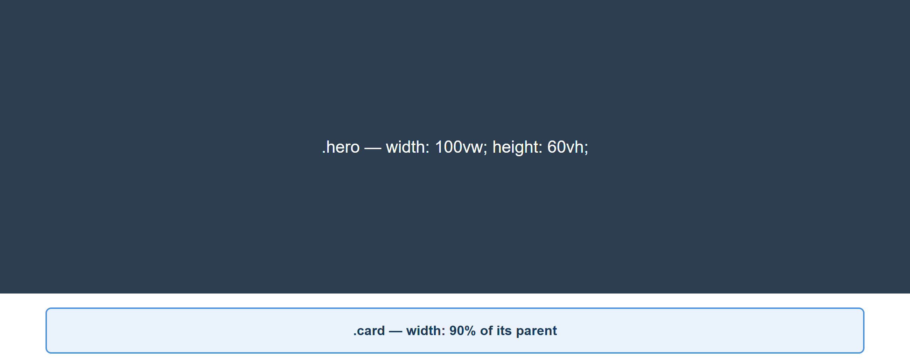

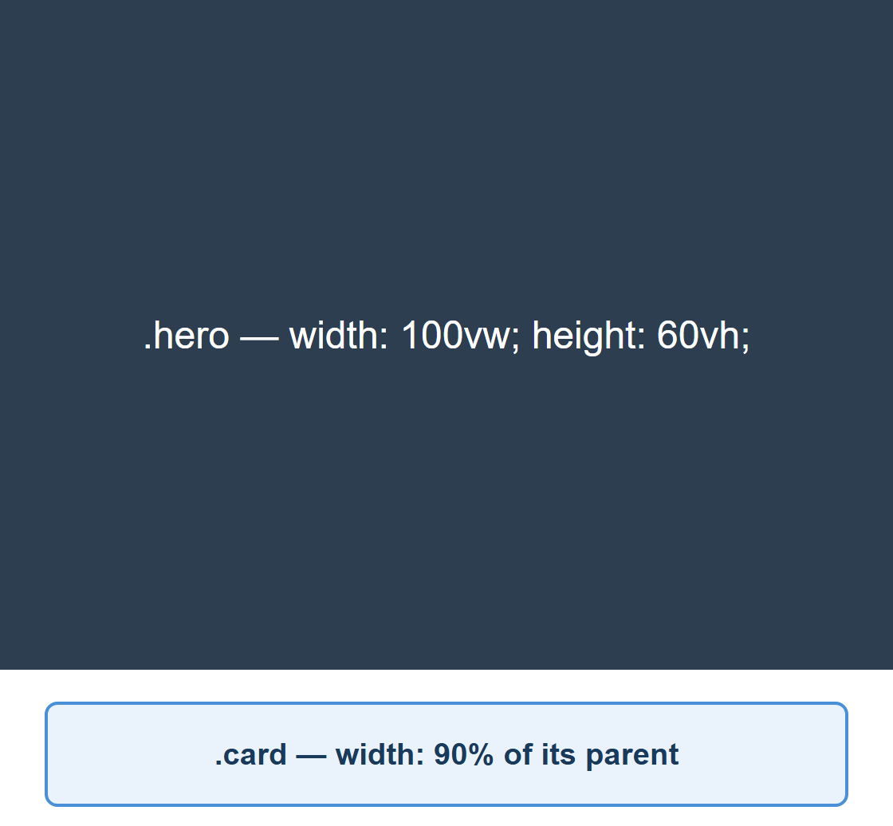

!!! tip "Why rem instead of px for text?"
    Some users increase their browser's default font size for accessibility reasons (poor
    eyesight, for example). Text sized in `px` ignores that setting completely. Text sized in
    `rem` scales along with it, which is why most professional style guides recommend `rem`
    for font sizes.

## Media Queries, Breakpoints, and Responsive Images

### Media queries and breakpoints

You already met the `@media` rule in Lecture 8. A **breakpoint** is simply the specific
screen width at which your layout changes to accommodate more (or less) space — it is the
value you put inside a `min-width` or `max-width` media query.

```css
/* mobile-first base styles: apply to every screen size */
.container {
  display: flex;
  flex-direction: column;
}

/* tablet breakpoint and up */
@media (min-width: 768px) {
  .container {
    flex-direction: row;
  }
}

/* desktop breakpoint and up */
@media (min-width: 1200px) {
  .container {
    max-width: 1140px;
    margin: 0 auto;
  }
}
```

Applying this exact CSS to a `.container` holding three cards shows the collapse in action:
a wide screen lays the cards out in a row, and a narrow screen — below the 768px breakpoint —
stacks them into a single column instead:

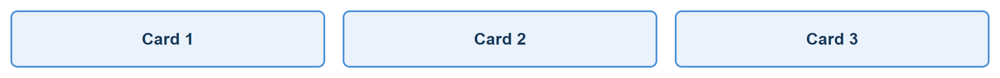

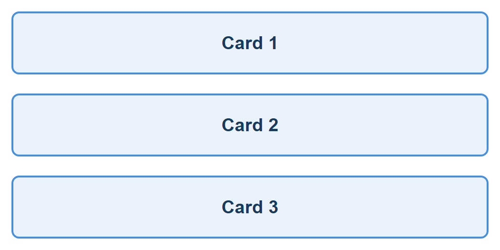

There is no single "correct" set of breakpoints — they should match your actual content,
not a fixed rulebook. That said, most frameworks (including Bootstrap, which you will see
below) converge on a similar rough set of common device widths: around 576px (large
phones), 768px (tablets), 992px (laptops), and 1200px+ (desktops).

### Media Query Syntax: `and`, comma, and `not`

The general shape of a media query is:

```css
@media [not] media-type and (media-feature: value) and (media-feature: value) {
  /* CSS rules to apply */
}
```

- **`media-type`** is optional and is almost always `screen` (or left out entirely, which
  means "all types"). You will also meet the `print` type below.
- **`and`** combines multiple conditions — *every* condition joined by `and` must be true
  for the rule to apply.
- **`,`** (a comma) works like **or** — the media query matches if *any* one of the
  comma-separated conditions is true.
- **`not`** inverts an entire media query's result. If you use `not`, you must also name a
  media type.

#### Combining `min-width` and `max-width`: targeting a range

`and` lets you target a specific band of screen sizes — for example, "tablets only, not
phones and not desktops":

```css
/* Applies only between 768px and 1199px (inclusive) — a "tablet-only" range */
@media (min-width: 768px) and (max-width: 1199px) {
  .sidebar {
    display: none; /* hide the sidebar just on this one range of screens */
  }
}
```

#### Combining conditions with `,` (OR)

```css
/* Applies if EITHER the screen is 480px or narrower, OR the device is in portrait mode */
@media (max-width: 480px), (orientation: portrait) {
  .hero {
    font-size: 1.2rem;
  }
}
```

#### Other media features you will run into

Width and height are the most common media features, but `@media` can test several other
things about the device and the user's preferences:

```css
/* orientation: is the viewport wider than it is tall, or the opposite? */
@media (orientation: landscape) {
  .gallery {
    grid-template-columns: repeat(4, 1fr);
  }
}

/* prefers-color-scheme: respects the user's OS/browser dark mode setting */
@media (prefers-color-scheme: dark) {
  body {
    background: #111;
    color: #eee;
  }
}

/* print: a media TYPE, not a feature — only applies when the page is printed */
@media print {
  nav, footer, .no-print {
    display: none; /* don't waste paper printing navigation or footers */
  }
}
```

| Media feature / type | Matches |
|---|---|
| `min-width` / `max-width` | Viewport at least / at most this wide |
| `min-height` / `max-height` | Viewport at least / at most this tall |
| `orientation: portrait` / `landscape` | Viewport taller-than-wide, or wider-than-tall |
| `prefers-color-scheme: light` / `dark` | The user's OS/browser light or dark mode setting |
| `print` (a media type, not a feature) | The page is being printed or print-previewed |
| `hover` / `pointer` | Whether the input device can hover, and how precise it is (mouse vs. touch) |

None of `orientation`, `prefers-color-scheme`, or `print` can be demonstrated in a static
screenshot — each depends on something about the *device or user setting*, not just window
width — but they use exactly the same `@media (feature: value) { ... }` syntax you have
already seen for `min-width`/`max-width`, so nothing new to learn beyond the feature names
themselves.

!!! tip "Practice these live on W3Schools"
    W3Schools has several free, editable "Try it Yourself" pages built around exactly this
    topic — open one, resize the results pane (or the whole browser window), and watch the
    breakpoint fire in real time:

    - [CSS Media Queries](https://www.w3schools.com/css/css3_mediaqueries.asp) — the full
      `@media` syntax, including `and`, `,`, `not`, and `orientation`
    - [CSS Media Queries — Examples](https://www.w3schools.com/css/css3_mediaqueries_ex.asp) —
      several live, editable breakpoint demos (background colors, column counts) you can
      resize and rerun instantly
    - [Responsive Web Design — Media Queries](https://www.w3schools.com/css/css_rwd_mediaqueries.asp) —
      the same mobile-first breakpoint pattern used earlier in this lecture
    - [Responsive Web Design — Grid View](https://www.w3schools.com/css/css_rwd_grid.asp) —
      a realistic multi-column layout built entirely from breakpoints
    - [How To — Create a Mobile Navigation Menu](https://www.w3schools.com/howto/howto_js_mobile_navbar.asp) —
      a complete, realistic navbar that collapses to a hamburger icon below a breakpoint
    - [CSS `@media` Rule reference](https://www.w3schools.com/cssref/css3_pr_mediaquery.php) —
      the full list of media types and features, for whenever you need one this lecture
      didn't cover

### Responsive images

An image with a fixed `width` in pixels will overflow a small screen's container and force
horizontal scrolling — one of the most common beginner mistakes. The fix is simple:

```css
img {
  max-width: 100%;
  height: auto;
}
```

Here the same 800×400px image sits inside a container fixed at 60% of the page width — the
image scales down to fit the container at both a wide and a narrow page width, instead of
overflowing it:

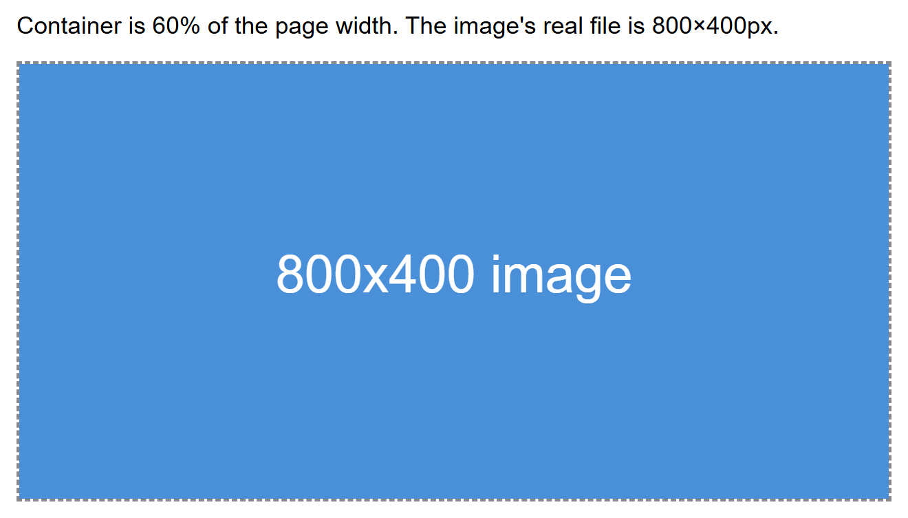

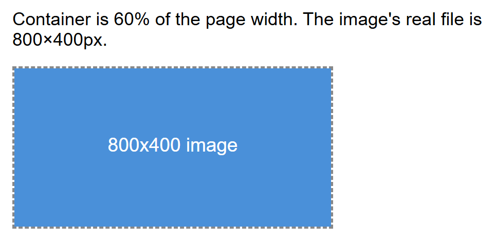

`max-width: 100%` means the image never grows wider than its parent container, while
`height: auto` keeps its aspect ratio correct as it shrinks. This one rule is often applied
globally near the top of a stylesheet.

For more advanced cases — like serving a smaller image file to phones so they are not
forced to download a huge desktop-sized photo — HTML provides the `srcset` attribute, which
lets the browser choose the best-fitting image file from a list you provide:

```html

```

The browser reads `sizes` to figure out roughly how large the image will display at the
current screen width, then downloads whichever file in `srcset` best matches — saving
bandwidth on smaller devices.

## Framework Philosophies: Component-Based vs. Utility-First

Writing every layout and every button style completely from scratch, on every project, is
slow. A **CSS framework** is a pre-written library of CSS (and sometimes JavaScript) that
gives you ready-made building blocks so you can move faster. The two dominant philosophies
today are represented by Bootstrap and Tailwind CSS.

- **Component-based frameworks** (Bootstrap is the classic example) ship pre-styled,
  ready-to-use *components* — a finished button, a finished navbar, a finished card — each
  identified by a class name like `.btn` or `.card`. You mostly assemble your page out of
  these ready-made pieces.
- **Utility-first frameworks** (Tailwind CSS is the classic example) ship hundreds of tiny,
  single-purpose *utility classes* — one class does one job, like `flex`, `p-4` (padding),
  or `text-center`. You compose these small classes directly in your HTML to build your own
  custom-looking components from scratch.

| | Bootstrap (component-based) | Tailwind (utility-first) |
|---|---|---|
| What you get out of the box | Fully-styled components (buttons, cards, navbars) | Small utility classes you combine yourself |
| Visual result by default | Sites can look similar unless customized | Nothing looks "designed" until you style it — no default look to fight against |
| How much custom CSS you write | Less, at first — but overriding built-in styles can fight the framework | Very little separate CSS — most styling lives in your HTML as classes |
| Learning curve | Fast to get a decent-looking page up quickly | Takes longer at first — you must learn many class names |
| Good for | Prototypes, admin panels, projects that need to ship fast with minimal design work | Projects wanting a highly custom, unique look without leaving CSS entirely behind |

!!! note "Neither one is objectively 'better'"
    Both are extremely popular in industry, and the CSC336 lab will let your instructor pick
    either. The important thing is understanding *why* they feel so different to use: one
    hands you finished components, the other hands you building blocks.

## Bootstrap: Grid System, Components, and Utilities

Bootstrap is a CSS (and optional JavaScript) framework you include via a `<link>` tag (or
install as a package). It gives you a responsive grid system, a large library of
pre-styled components, and a set of small utility classes for common tweaks.

```html
<link href="https://cdn.jsdelivr.net/npm/bootstrap@5.3.3/dist/css/bootstrap.min.css" rel="stylesheet">
```

### The Bootstrap grid system

Bootstrap's grid is built on Flexbox internally, organized into 12 columns. You wrap your
content in a `.container`, then a `.row`, then divide that row into `.col-*` classes whose
numbers add up to 12 for a full row.

```html
<div class="container">
  <div class="row">
    <div class="col-md-8">Main content (8 of 12 columns on medium screens+)</div>
    <div class="col-md-4">Sidebar (4 of 12 columns on medium screens+)</div>
  </div>
</div>
```

Rendered with real Bootstrap CSS loaded from the CDN link above, the two columns sit side by
side at their assigned 8/12 and 4/12 widths on a wide screen, then stack full-width on a
narrow screen below the `md` breakpoint — Bootstrap's built-in mobile-first behavior:

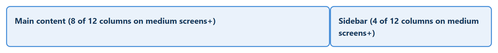

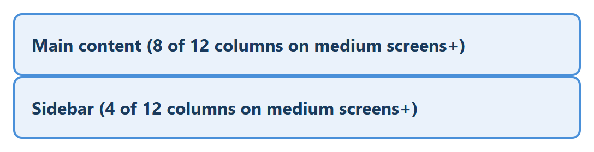

The `md` in `col-md-8` is a **breakpoint prefix** — it means "use 8 columns' width starting
at the medium breakpoint and up." Below that breakpoint, columns you don't size explicitly
stack full-width automatically, which is Bootstrap's built-in mobile-first behavior.

| Prefix | Approx. screen width |
|---|---|
| (none) | All sizes (mobile-first default) |
| `sm` | ≥576px |
| `md` | ≥768px |
| `lg` | ≥992px |
| `xl` | ≥1200px |

### More Grid Techniques

Sizing every column explicitly (`col-md-8`, `col-md-4`) is only the start. The grid has
several other tools for real layouts.

**Equal-width, auto-layout columns.** Leave the number off `.col` entirely and Bootstrap
divides the row evenly among however many columns you add — useful when you don't want to
do the arithmetic yourself:

```html
<div class="row">
  <div class="col">col</div>
  <div class="col">col</div>
  <div class="col">col</div>
</div>
```

**Nesting.** A `.row` can be placed inside a `.col` to build a sub-grid — the nested row's
own columns are sized out of 12, independent of the parent column's actual width:

```html
<div class="row">
  <div class="col-8">
    col-8
    <div class="row">
      <div class="col-6">nested col-6</div>
      <div class="col-6">nested col-6</div>
    </div>
  </div>
  <div class="col-4">col-4</div>
</div>
```

Rendered together, three equal auto-layout columns on top, and an 8/4 split with a nested
2-column row inside the 8-wide column on the bottom:

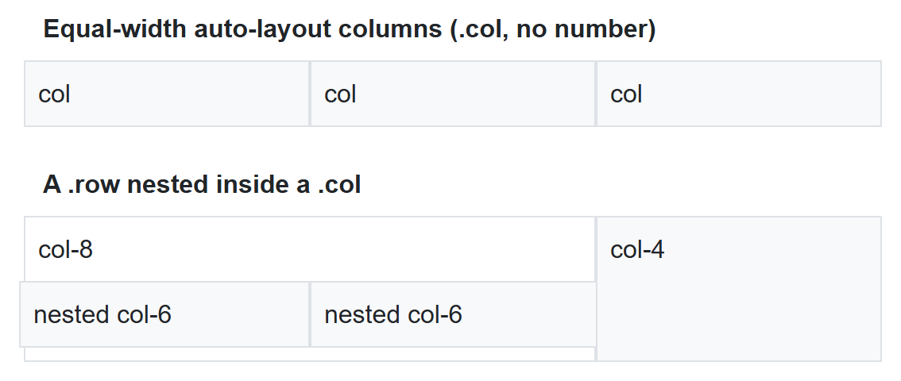

**Offsetting.** `.offset-{breakpoint}-{n}` pushes a column to the right by *n* empty
columns' worth of space, without needing an invisible spacer column:

```html
<div class="row">
  <div class="col-4 offset-md-4">col-4 offset-md-4</div>
</div>
```

`col-4 offset-md-4` leaves 4 empty columns, then places a 4-wide column, then leaves the
remaining 4 empty — centering it in the row.

**Reordering.** `.order-{n}` (0 through 5) changes the *visual* order of columns without
touching their order in the HTML — handy when source order (for accessibility or SEO)
should differ from visual order:

```html
<div class="row">
  <div class="order-3">First in HTML — order-3</div>
  <div class="order-1">Second in HTML — order-1</div>
  <div class="order-2">Third in HTML — order-2</div>
</div>
```

Rendered together — the centered offset column on top, and the three reordered columns
below, visually rearranged even though the middle one is written second in the HTML:


| Class pattern | Effect |
|---|---|
| `.col` (no number) | Auto-layout: shares available width equally with sibling `.col`s |
| `.col-{n}` | Exactly *n* of 12 columns wide, at all screen sizes |
| `.col-{breakpoint}-{n}` | *n* columns wide from that breakpoint up (mobile-first) |
| `.offset-{breakpoint}-{n}` | Pushes the column right by *n* empty columns |
| `.order-{n}` | Visual display order (0–5), independent of HTML source order |
| `.row-cols-{n}` | Shorthand: every direct child column becomes `12/n` wide |
| `.g-{n}` / `.gx-{n}` / `.gy-{n}` | Gutter (gap) size between columns — all / horizontal / vertical |
| `.justify-content-*` / `.align-items-*` on `.row` | Flexbox alignment of columns along/across the row (same values as Lecture 9's Flexbox) |

!!! tip "It's Flexbox underneath"
    Every one of these classes is a thin wrapper around the Flexbox properties from
    Lecture 9 — `.row` is `display: flex`, `.col` is a flex item, and `.justify-content-*`
    on a `.row` is exactly the `justify-content` property you already know. Knowing Flexbox
    is what makes Bootstrap's grid classes predictable instead of memorized.

### Bootstrap components

Components are ready-made pieces of UI — you just add the right classes to your HTML.

```html
<button class="btn btn-primary">Save Changes</button>

<div class="card" style="width: 18rem;">
  <div class="card-body">
    <h5 class="card-title">Card Title</h5>
    <p class="card-text">Some quick example text for this card component.</p>
    <a href="#" class="btn btn-secondary">Read more</a>
  </div>
</div>

<nav class="navbar navbar-expand-lg navbar-light bg-light">
  <a class="navbar-brand" href="#">MySite</a>
</nav>
```

Rendered with Bootstrap's CSS applied, these three lines of HTML alone produce a fully
styled button, card, and navbar — none of the visual polish comes from custom CSS:

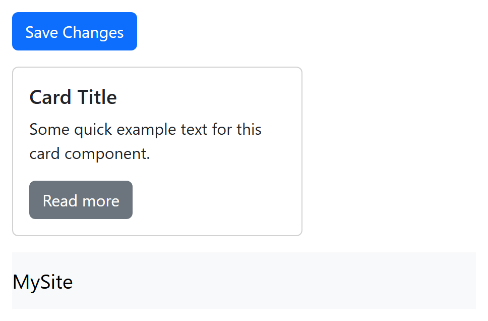

### Bootstrap utilities

Alongside full components, Bootstrap also includes small single-purpose utility classes for
common adjustments like spacing, text alignment, and color — similar in spirit to
Tailwind's approach, just with a smaller set of classes.

```html
<div class="d-flex justify-content-between p-3 mb-4 text-center">
  <!-- d-flex: display: flex
       justify-content-between: justify-content: space-between
       p-3: padding on all sides
       mb-4: margin-bottom
       text-center: centers text -->
</div>
```

Rendered (with a dashed border added just to make the flex container's edges visible), the
"Left item" and "Right item" spans sit at opposite ends of the row, spaced apart by
`justify-content-between`:

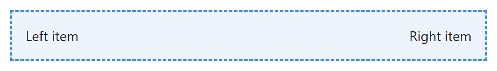

## Tailwind CSS: Utility-Class Structure

Tailwind takes the opposite approach: instead of shipping finished components, it gives you
a very large set of small utility classes, and you build your own look by combining them
directly in your markup.

```html
<script src="https://cdn.tailwindcss.com"></script>
```

```html
<button class="bg-blue-600 hover:bg-blue-700 text-white font-semibold px-4 py-2 rounded-lg shadow">
  Save Changes
</button>
```

Rendered with the Tailwind Play CDN loaded, that single class list produces a fully styled
button with no separate CSS file at all:

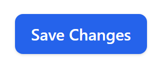

Reading that one class list top to bottom already tells you exactly what the button looks
like, without switching to a separate CSS file:

| Class | Meaning |
|---|---|
| `bg-blue-600` | Background color: a specific shade of blue |
| `hover:bg-blue-700` | On hover, switch to a darker shade of blue |
| `text-white` | White text color |
| `font-semibold` | Semi-bold font weight |
| `px-4 py-2` | Horizontal padding level 4, vertical padding level 2 |
| `rounded-lg` | Large `border-radius` |
| `shadow` | A preset `box-shadow` |

Tailwind is also responsive by default, using breakpoint *prefixes* on any utility class —
the exact same mobile-first idea as Bootstrap's `col-md-8`, just spelled differently:

```html
<div class="flex flex-col md:flex-row">
  <!-- flex-col by default (stacked, mobile-first)
       md:flex-row switches to a row once the screen is "md" width or larger -->
</div>

<div class="w-full lg:w-1/3">
  <!-- full width by default, one-third width from the "lg" breakpoint up -->
</div>
```

The `flex flex-col md:flex-row` example, rendered with three boxes inside it, stacks in a
column on a narrow screen and switches to a row once the screen reaches the `md` breakpoint:

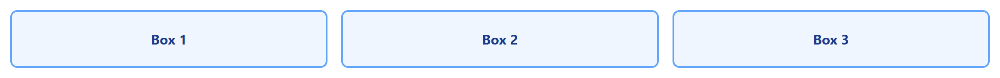

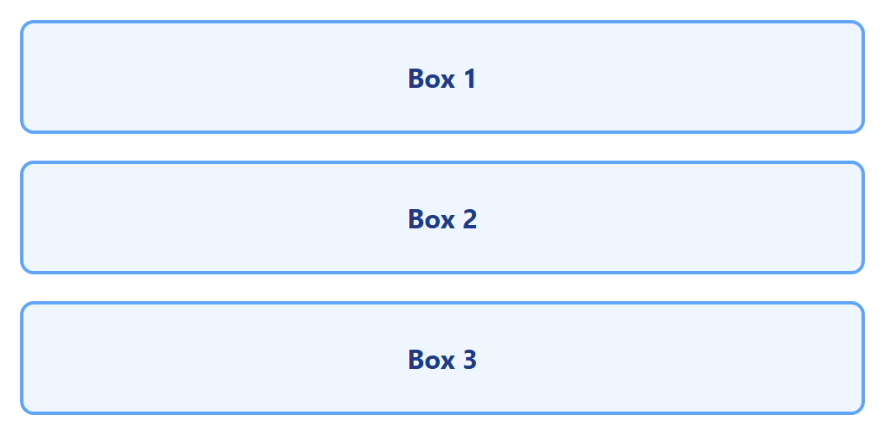

The `w-full lg:w-1/3` example, rendered inside a gray wrapper so the surrounding space is
visible, fills nearly the entire wrapper on a narrow screen but shrinks to about a third of
it once the screen reaches the `lg` breakpoint:

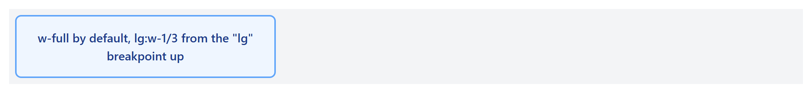

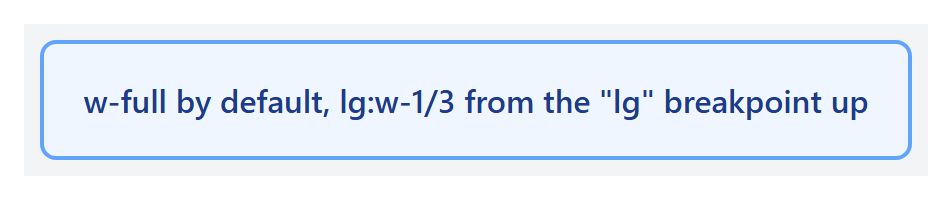

!!! tip "Reading Tailwind classes"
    Most Tailwind class names follow a `property-value` pattern (`text-center`, `p-4`,
    `bg-red-500`), and a breakpoint prefix like `md:` or `lg:` before a class means "only
    apply this class from that screen width and up" — mirroring the same mobile-first logic
    you learned earlier in this lecture.

### More Utility Categories

Tailwind's utilities cover nearly every CSS property. A few categories you will reach for
constantly, beyond spacing and color:

| Category | Example classes | Equivalent CSS |
|---|---|---|
| Flexbox | `flex`, `justify-center`, `items-center`, `gap-4` | `display: flex; justify-content: center; align-items: center; gap: 1rem;` |
| Grid | `grid`, `grid-cols-3`, `col-span-2` | `display: grid; grid-template-columns: repeat(3, 1fr); grid-column: span 2;` |
| Sizing | `w-1/2`, `h-screen`, `max-w-md` | `width: 50%; height: 100vh; max-width: 28rem;` |
| Borders | `border`, `border-2`, `rounded-full` | `border-width: 1px; border-width: 2px; border-radius: 9999px;` |
| Typography | `text-lg`, `font-bold`, `truncate` | `font-size: 1.125rem; font-weight: 700; text-overflow: ellipsis;` |
| State variants | `hover:`, `focus:`, `active:`, `disabled:` | `:hover`, `:focus`, `:active`, `:disabled` — prefix any utility with these |

Tailwind's spacing scale (used by `p-*`, `m-*`, `gap-*`, `w-*`, and more) is a consistent
numeric scale, not arbitrary pixel values: `1` = `0.25rem` (4px), `2` = `0.5rem` (8px), `4` =
`1rem` (16px), and so on — the same "pick a small set of values and only use those" spacing
discipline from Lecture 6, just built into the framework. Colors follow a similar scale per
hue, from `50` (near-white) to `900` (near-black), e.g. `blue-100` through `blue-900`.

### Customizing Tailwind: the Configuration File

The default color palette and spacing scale are only a starting point. A real project
configures Tailwind with a `tailwind.config.js` file, extending (not replacing) the
defaults with your own design tokens:

```js title="tailwind.config.js"
module.exports = {
  theme: {
    extend: {
      colors: {
        brand: '#ff6b35', // now usable as bg-brand, text-brand, border-brand, etc.
      },
    },
  },
};
```

Once configured, `brand` behaves exactly like any built-in color — it works with every
color utility and every state-variant prefix, because it's now a real value in Tailwind's
own color scale, not a one-off custom class:

```html
<button class="bg-brand hover:bg-orange-700 text-white font-semibold px-4 py-2 rounded-lg">
  Save Changes
</button>
```

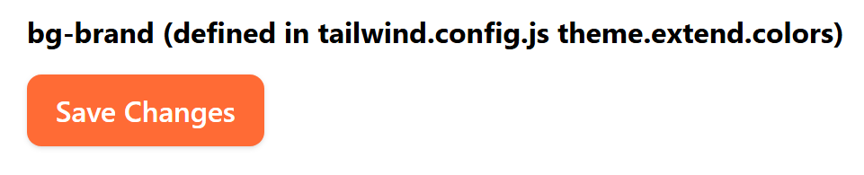

`theme.extend` *adds* new values without discarding Tailwind's defaults; using `theme`
directly (without `extend`) replaces the entire default scale for that key instead — almost
always what you don't want, since it also removes every built-in color or spacing value.

### Dark Mode

Tailwind supports a `dark:` variant that applies only when dark mode is active. With
`darkMode: 'class'` in the config, dark mode activates for any element inside a `dark`
class — commonly placed on `<html>` and toggled with a few lines of JavaScript that read
the user's stored preference or `prefers-color-scheme`:

```js title="tailwind.config.js"
module.exports = {
  darkMode: 'class', // or 'media' to follow the OS setting automatically, no toggle needed
};
```

```html
<div class="bg-white dark:bg-gray-800 text-black dark:text-white">
  Card content
</div>
```

Rendered twice — the same markup, once with no `dark` ancestor and once inside a container
carrying `class="dark"` — shows the `dark:` utilities taking over automatically:

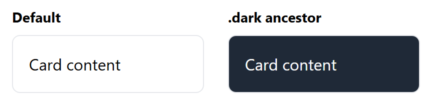

### The `@apply` Directive

When the same combination of utilities repeats across many elements, Tailwind's `@apply`
directive lets you fold them into one custom class inside a real CSS file, without giving
up the utility values themselves:

```css
.btn-primary {
  @apply bg-blue-600 hover:bg-blue-700 text-white font-semibold px-4 py-2 rounded-lg shadow;
}
```

```html
<button class="btn-primary">Save Changes</button>
```

This produces the exact same rendered button as writing out all six utility classes by
hand — `@apply` is purely a way to *name* a repeated combination, not a different way of
styling. Reach for it when the same long class list shows up on many elements; for a
one-off element, the plain utility classes in the HTML are usually clearer.

## Using Custom Classes and Adding Components

Neither framework expects you to only ever use their built-in classes — real projects
almost always mix in your own custom CSS.

=== "Bootstrap"

    Bootstrap components are ordinary HTML with ordinary classes, so you can add your own
    class alongside Bootstrap's and override just the parts you want to change:

    ```html
    <button class="btn btn-primary my-cta-button">Get Started</button>
    ```

    ```css
    .my-cta-button {
      text-transform: uppercase;
      letter-spacing: 1px;
    }
    ```

    Rendered together, Bootstrap's `.btn.btn-primary` styling (color, padding, rounded
    corners) and the custom `.my-cta-button` rule (uppercase, letter-spacing) both apply to
    the same button:

    

    Because `.my-cta-button` is your own class, its rule can add new styles on top of
    whatever `.btn.btn-primary` already sets, as long as it's loaded after Bootstrap's CSS
    (or is specific enough to win).

    You can also build a brand-new "component" simply by combining Bootstrap's grid and
    utility classes into a reusable HTML snippet you copy wherever you need it — Bootstrap
    does not require any special registration step for this.

=== "Tailwind"

    Because Tailwind components are just a combination of utility classes, "creating a
    component" usually means saving that exact combination somewhere reusable — for
    example, as a snippet, a template partial, or (in component-based tools like React) a
    single reusable component function:

    ```html
    <!-- reuse this exact combination everywhere you need a primary button -->
    <button class="bg-blue-600 hover:bg-blue-700 text-white font-semibold px-4 py-2 rounded-lg shadow">
      Get Started
    </button>
    ```

    For styles that don't fit neatly into existing utilities, you can still write plain
    custom CSS and combine it with Tailwind's utilities on the same element:

    ```css
    .brand-underline {
      text-decoration: underline wavy;
      text-underline-offset: 4px;
    }
    ```

    ```html
    <span class="text-blue-600 font-bold brand-underline">New!</span>
    ```

    Rendered together, Tailwind's `text-blue-600 font-bold` utilities and the custom
    `.brand-underline` CSS rule both apply to the same span:

    

In both frameworks, the same rule applies: use the framework for the 80% of common styling
it already solves well, and drop into plain custom CSS for the remaining 20% that makes your
project look like *your* project instead of a generic template.

## CSS Preprocessors: Sass, SCSS, and LESS

Plain CSS lacks things every real programming language has: variables, reusable blocks of
code, and a way to split one large file into smaller, organized pieces. A **CSS
preprocessor** is a separate language that adds those features on top of CSS — you write in
the preprocessor's language, then *compile* it into plain CSS that a browser can actually
read. **Sass** and **LESS** are the two most widely used preprocessors, and Sass in
particular is what Bootstrap itself is written in.

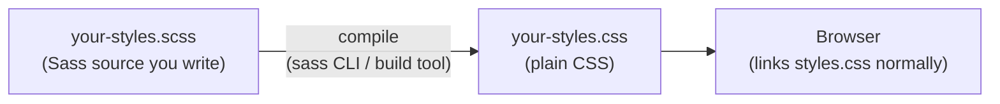

The browser never sees Sass or LESS directly — it only ever loads the compiled, plain `.css`
output. This is exactly the same "source vs. what the browser runs" split you already know
from writing modern JavaScript (Lecture 11 onward) that gets compiled/bundled before it
ships.

!!! note "Sass has two syntaxes"
    Sass actually offers two ways to write it: the original **indented syntax** (`.sass`
    files, no braces or semicolons, indentation-based like Python) and **SCSS** (`.scss`
    files, which look like ordinary CSS with braces and semicolons, just with extra
    features added). SCSS is by far the more common choice today — including in Bootstrap's
    own source — because any valid CSS file is *also* valid SCSS, so adopting it requires no
    rewriting. Every example below uses SCSS.

### Why Not Just Use CSS Custom Properties?

Lecture 8 already introduced CSS custom properties (`--main-color`, read with
`var(--main-color)`) — real *runtime* variables the browser understands natively. Sass
variables look similar but work completely differently:

| | Sass variables (`$name`) | CSS custom properties (`--name`) |
|---|---|---|
| Resolved | At **compile time** — replaced with a literal value before the browser ever sees it | At **runtime**, in the browser itself |
| Can change after page load (JavaScript, media query) | No — it's already a fixed value in the compiled CSS | Yes — this is their main advantage |
| Needs a build step | Yes — a `.scss` file must be compiled | No — works in a plain `<style>` tag |
| Useful for | Configuring a whole framework's source before it compiles (see Bootstrap below) | Theming/dark-mode switches that change live in the browser |

They solve different problems and are often used together: Sass variables configure how a
stylesheet *compiles*, while custom properties let already-compiled CSS *change* in the
browser afterward.

### Sass Fundamentals

**Variables** store a reusable value under a `$name`:

```scss
$primary-color: #6c5ce7;
$spacing: 16px;

.card {
  padding: $spacing;
  border: 1px solid $primary-color;
}
```

**Nesting** lets you write a child selector's rules physically inside its parent's block,
instead of repeating the parent selector every time — including `&`, which refers back to
the parent selector itself (essential for states like `:hover`):

```scss
.card {
  padding: $spacing;
  border: 1px solid $primary-color;

  .title {
    color: $primary-color;
    font-weight: bold;
  }

  &:hover {
    box-shadow: 0 4px 10px rgba(0, 0, 0, 0.2);
  }
}
```

**Mixins** are reusable blocks of declarations — closer to a function than a variable —
defined once with `@mixin` and reused anywhere with `@include`:

```scss
@mixin flex-center {
  display: flex;
  justify-content: center;
  align-items: center;
}

.banner {
  @include flex-center;
  height: 80px;
  background: $primary-color;
  color: white;
}
```

Compiling the variables, nesting, and mixin above with the Sass CLI (`sass input.scss
output.css`) produces ordinary CSS — `.card .title { ... }` written out in full, `&:hover`
expanded to `.card:hover { ... }`, and the mixin's three declarations copied directly into
`.banner`. Rendered in a browser, the result is indistinguishable from CSS written by hand:

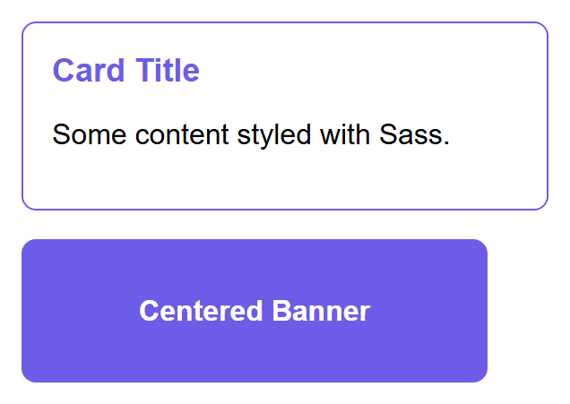

**Partials and `@use`.** A real project splits Sass across many small files instead of one
giant one. A filename starting with an underscore (`_variables.scss`) is a **partial** —
Sass knows not to compile it into its own separate CSS file, only to pull it into whatever
file imports it:

```scss title="_variables.scss"
$primary-color: #6c5ce7;
$spacing: 16px;
```

```scss title="main.scss"
@use 'variables' as v;

.card {
  padding: v.$spacing;
  border: 1px solid v.$primary-color;
}
```

`@use` (the modern replacement for the older `@import`) loads a partial's variables and
mixins under a namespace (`v.` above), keeping large stylesheets organized into logical
files — colors, typography, one file per component — without any of that structure leaking
into the compiled output.

**Math and built-in functions.** Sass supports arithmetic directly in property values, plus
built-in color functions:

```scss
$base: 16px;

.container {
  padding: $base * 2;              /* 32px */
  width: calc(100% - #{$base * 2}); /* interpolate a Sass value inside calc() */
}

.button:hover {
  background: darken($primary-color, 10%); /* 10% darker than $primary-color */
}
```

### LESS: The Same Idea, Different Syntax

**LESS** solves the same problems as Sass — variables, nesting, mixins — with a syntax
close enough to switch between them at a glance, but with `@` instead of `$` for variables
(easy to confuse with CSS's own `@media`/`@import`, one reason many teams now prefer Sass):

```less
@primary-color: #6c5ce7;

.card {
  border: 1px solid @primary-color;

  .title {
    color: @primary-color;
  }
}

.mixin-example() {
  display: flex;
  justify-content: center;
}

.banner {
  .mixin-example();
  background: @primary-color;
}
```

| Feature | Sass (SCSS) | LESS |
|---|---|---|
| Variable syntax | `$name` | `@name` |
| Mixin definition | `@mixin name { ... }` | `.name() { ... }` |
| Mixin use | `@include name;` | `.name();` |
| Compiles via | `sass` (Dart Sass) | `lessc`, or a bundler plugin |
| Used by | Bootstrap 4 and 5, most new projects | Bootstrap 3 (before it switched to Sass), older codebases |

LESS was historically compiled in the browser itself with a JavaScript file, which made it
easy to try without any build tooling — modern projects compile both LESS and Sass ahead of
time as part of the build process instead, for speed and reliability.

### Customizing Bootstrap with Sass

Every Bootstrap component you have used so far is compiled from Sass source files that ship
inside the `bootstrap` package (`node_modules/bootstrap/scss/`) — the CDN `.css` file is
just one specific, pre-compiled build of that source, using Bootstrap's own default
variables. Overriding those variables **before** importing Bootstrap's Sass recompiles the
entire framework around your values — every component, everywhere, automatically.

```scss title="custom.scss"
// Override Bootstrap's own variables BEFORE importing its source
$primary: #ff6b35;         // replaces Bootstrap's default blue everywhere .btn-primary etc. are used
$border-radius: 1rem;      // rounder corners on every component that uses $border-radius
$grid-gutter-width: 3rem;  // wider gaps between every .row's columns, site-wide

@import "bootstrap/scss/bootstrap";
```

```bash
sass custom.scss custom.css   # compiles to a complete, customized Bootstrap build
```

The compiled `custom.css` is a genuine, complete Bootstrap build — every component that
reads `$primary`, `$border-radius`, or `$grid-gutter-width` picks up the new values with no
further edits anywhere. The same button, card, and grid markup, linked against the stock
Bootstrap CDN file versus this custom-compiled one:

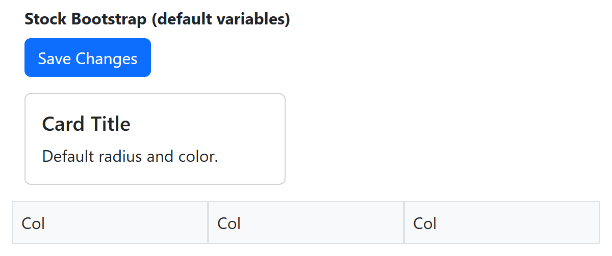

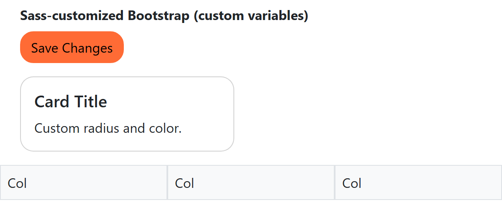

This is the real advantage of Sass over the "add a custom class after the fact" approach
from earlier in this lecture: instead of fighting Bootstrap's specificity component by
component, you configure the *source* once, and every current and future use of that
variable across the entire framework follows automatically. Bootstrap's own documentation
lists every variable available to override this way — colors, spacing, breakpoints, the
number of grid columns (`$grid-columns: 12` by default), fonts, and more.

!!! tip "You don't have to compile it yourself"
    Tools like the Bootstrap Sass build, a bundler (Vite, webpack), or an online Sass
    playground can all run this same compilation step for you. The important idea to take
    away is *what* is happening — your variables are substituted into Bootstrap's own
    source before a single line of final CSS is generated — not memorizing a specific
    command line.

## Try It Yourself

1. Build a simple three-column "feature" section (three cards side by side on desktop,
   stacking to one column on mobile) two ways: once using Bootstrap's `.container`, `.row`,
   and `.col-md-4` classes, and once using Tailwind's `flex flex-col md:flex-row` classes.
   Compare how much of the layout logic lives in your HTML versus a separate CSS file in
   each version.
2. Take a plain `` tag and make it fully responsive: add `max-width: 100%; height: auto;`
   in CSS, then add the viewport meta tag to your page's `<head>` if it is missing, and test
   resizing your browser window from a wide desktop width down to a narrow phone width to
   confirm the image always fits its container without causing horizontal scrolling.
3. Write a `_variables.scss` partial defining two variables (a color and a spacing value)
   and a `@mixin` for centering content with Flexbox. `@use` it from a `main.scss` that
   styles a card with both the variables and the mixin, then compile it (with the `sass`
   CLI, or an online Sass playground) and open the resulting `.css` file to see exactly what
   your nesting and mixin expanded into.
4. Override at least two of Bootstrap's own Sass variables (for example `$primary` and
   `$border-radius`) in a `custom.scss` that imports `bootstrap/scss/bootstrap`, compile it,
   and load the result instead of the Bootstrap CDN link in a test page. Confirm that every
   `.btn-primary` on the page changed color with zero edits to your HTML.

## Key Takeaways

- Mobile-first design starts with base styles for small screens and layers on complexity for
  larger screens using `min-width` media queries.
- The viewport meta tag (`<meta name="viewport" content="width=device-width, initial-scale=1.0">`)
  is required for media queries to behave correctly on real phones.
- Fluid units — `%`, `rem`, `vw`, `vh` — scale relative to something else, instead of being
  fixed like `px`, which is essential for layouts that truly adapt to any screen.
- `@media` conditions combine with `and` (all must be true), `,` (any one must be true), and
  `not` (inverts the whole query) — and test more than just width, including `orientation`,
  `prefers-color-scheme`, and the `print` media type.
- `max-width: 100%; height: auto;` keeps images from overflowing their container;
  `srcset`/`sizes` let the browser pick an appropriately-sized image file per device.
- Component-based frameworks like Bootstrap give you finished, pre-styled UI pieces;
  utility-first frameworks like Tailwind give you small single-purpose classes you compose
  yourself.
- Bootstrap's 12-column, Flexbox-based grid (`.container`, `.row`, `.col-md-*`) and its
  ready-made components (`.btn`, `.card`, `.navbar`) let you assemble a page quickly;
  `.offset-*`, `.order-*`, nesting, and auto-layout `.col`s cover the rest of real layouts.
- Tailwind's utility classes (`flex`, `p-4`, `bg-blue-600`, with breakpoint prefixes like
  `md:`) let you build a fully custom look directly in your HTML; `tailwind.config.js`
  extends the default theme, `dark:` handles dark mode, and `@apply` names a repeated
  combination as a real CSS class.
- Both frameworks expect you to add your own custom CSS or reusable class combinations on
  top of them — frameworks solve the common 80%, not the last 20% that makes a site unique.
- CSS preprocessors (Sass/SCSS, LESS) compile to plain CSS before the browser ever sees
  them, adding variables, nesting, and mixins — Sass variables are resolved at compile
  time, unlike CSS custom properties, which live in the browser and can change at runtime.
- Bootstrap's own source is written in Sass: overriding its variables (`$primary`,
  `$border-radius`, `$grid-gutter-width`, and more) before importing it recompiles the
  entire framework around your values, everywhere, with zero HTML changes.
