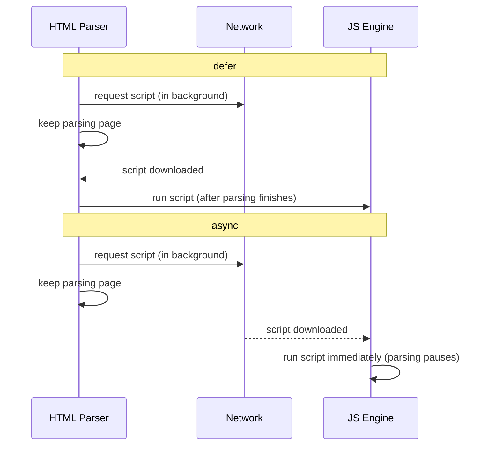

# Lecture 11: Core JavaScript Concepts (ES6+): Functions, Closures and Objects

JavaScript is the only programming language that runs natively inside every web browser, which
is what makes it possible for a web page to react to clicks, validate a form, or update itself
without reloading. This lecture builds your JavaScript foundation from the ground up — variables,
data types, functions, and the two ideas that confuse most beginners the first time they meet
them: `this` and closures.

!!! note "Before you start"
    This lecture assumes you can already program — you know what a variable, a loop, and a
    function are from languages like C++ or Java. What is new here is not "programming," it is
    the specific and sometimes quirky *rules* JavaScript uses.

## In This Lecture

- The role JavaScript plays on the web, and how to embed it in a page
- Declaring variables with `var`, `let`, and `const`, and the difference between primitive and
  reference types
- Operators, type coercion, and why `==` and `===` behave differently
- Control flow: `if`/`else`, loops, and `switch`
- Scope, hoisting, and the "temporal dead zone"
- Three ways to write a function: declarations, expressions, and arrow functions
- Default parameters, rest parameters, the spread operator, and destructuring
- How `this` is determined, and how to control it with `call`, `apply`, and `bind`
- Closures — what they are, why they are useful, and common mistakes
- Objects, arrays, template literals, and ES6 modules

## The Role of JavaScript on the Web

A web page is built from three layers that work together:

| Layer | Language | Job |
|---|---|---|
| Structure | HTML | What content exists on the page |
| Presentation | CSS | How the content looks |
| Behavior | JavaScript | How the page reacts and changes over time |

**JavaScript** is a programming language that runs inside the browser (this is called
**client-side** execution, because it runs on the user's computer, not on the server). It can
change what is on the page, respond to clicks and keystrokes, talk to a server for new data
without reloading the page, and much more. Later in the course you will also see JavaScript
running on a server with Node.js, but for now, think of it as "the language that makes the page
interactive."

### Embedding JavaScript in a Page

You can add JavaScript to an HTML page in three ways:

```html
<!-- 1. Inline: directly on an element (avoid this — hard to maintain) -->
<button onclick="alert('Hello!')">Click me</button>

<!-- 2. Internal: inside a <script> tag in the HTML file -->
<script>
  console.log("Hello from an internal script");
</script>

<!-- 3. External: in a separate .js file, linked with <script src="..."> -->
<script src="app.js"></script>
```

External scripts are the standard approach in real projects, because they keep your HTML and
your JavaScript in separate files, and the browser can cache the `.js` file across page loads.

### `defer` vs. `async`

By default, when the browser meets a `<script>` tag, it **stops parsing the HTML**, downloads the
script, runs it immediately, and only then continues building the page. On a slow connection this
can make a page feel frozen. Two attributes change this behavior:

```html
<script src="app.js" defer></script>
<script src="analytics.js" async></script>
```

- **`defer`**: the script downloads in the background *while the HTML keeps parsing*, and it only
  runs after the whole page has been parsed. Multiple `defer` scripts run in the order they
  appear. Use this for scripts that need the full page (the DOM) to exist, which is most of the
  time.
- **`async`**: the script downloads in the background too, but it runs **as soon as it is
  downloaded**, even if that interrupts HTML parsing. Scripts can run out of order. Use this for
  independent scripts that do not touch the page, like analytics trackers.



!!! tip "Rule of thumb"
    Put `defer` on almost every script you write. Reach for `async` only for scripts that do not
    depend on the DOM and do not need to run in a specific order.

## Variables: `var`, `let`, and `const`

A **variable** is a named container for a value. JavaScript has three keywords for declaring one:

```javascript
var oldStyle = "avoid me";   // function-scoped, can be redeclared — legacy
let counter = 0;             // block-scoped, can be reassigned
const PI = 3.14159;          // block-scoped, cannot be reassigned
```

- Use **`const`** by default. It signals "this name will always point to the same value."
- Use **`let`** when you know the value must change (a loop counter, a running total).
- Avoid **`var`**. It predates modern JavaScript (before 2015) and has confusing scoping rules
  covered below.

!!! warning "`const` does not mean 'unchangeable value'"
    `const` only prevents *reassigning the variable itself*. If the value is an object or array,
    its contents can still be changed:
    ```javascript
    const person = { name: "Ali" };
    person.name = "Sara"; // allowed — we didn't reassign `person`
    // person = {};       // NOT allowed — this would throw an error
    ```

### Primitive vs. Reference Types

JavaScript values fall into two categories:

| | Primitive types | Reference types |
|---|---|---|
| Examples | `string`, `number`, `boolean`, `undefined`, `null`, `symbol`, `bigint` | `object`, `array`, `function` |
| Stored as | The actual value | A pointer to a location in memory |
| Copied by | Value (a real, independent copy) | Reference (both variables point to the same data) |

```javascript
// Primitives copy by value
let a = 5;
let b = a; // b gets its own copy of 5
b = 10;
console.log(a); // 5 — unaffected

// Objects copy by reference
let obj1 = { value: 5 };
let obj2 = obj1; // obj2 points to the SAME object as obj1
obj2.value = 10;
console.log(obj1.value); // 10 — obj1 changed too!
```

This distinction explains a huge number of beginner bugs, so keep it in mind whenever you assign
one variable to another.

## Operators, Type Coercion, and `==` vs. `===`

JavaScript has the usual arithmetic (`+ - * / % **`), comparison (`< > <= >=`), and logical
(`&& || !`) operators. What trips up newcomers is **type coercion**: JavaScript will automatically
convert values between types when it seems convenient.

```javascript
console.log("5" + 3);   // "53"  — number is coerced to a string, then joined
console.log("5" - 3);   // 2     — string is coerced to a number for subtraction
console.log(1 + true);  // 2     — true is coerced to 1
console.log("10" == 10); // true  — coercion happens before comparing
console.log("10" === 10); // false — no coercion, types differ, so not equal
```

- **`==`** ("loose equality") converts both sides to a common type before comparing.
- **`===`** ("strict equality") compares both value *and* type, with no conversion.

!!! warning "Always prefer `===` and `!==`"
    Loose equality produces surprising results (`"" == 0` is `true`, `null == undefined` is
    `true`). Using strict equality by default avoids an entire category of bugs. The same applies
    to `!==` over `!=`.

## Control Flow

Control flow statements decide which code runs, and how many times. These work much like in
other languages you already know:

```javascript
// if / else
let hour = 14;
if (hour < 12) {
  console.log("Good morning");
} else if (hour < 18) {
  console.log("Good afternoon");
} else {
  console.log("Good evening");
}

// for loop
for (let i = 0; i < 3; i++) {
  console.log("Iteration", i);
}

// while loop
let n = 3;
while (n > 0) {
  console.log(n);
  n--;
}

// switch
let day = "Mon";
switch (day) {
  case "Sat":
  case "Sun":
    console.log("Weekend");
    break;
  default:
    console.log("Weekday");
}
```

Note that `switch` uses `===` internally to compare, and each `case` needs a `break` — otherwise
execution "falls through" into the next case.

## Scope, Hoisting, and the Temporal Dead Zone

**Scope** is the region of code where a variable is visible and usable. JavaScript has three
kinds:

- **Global scope**: declared outside any function or block; visible everywhere.
- **Function scope**: `var` is visible anywhere inside the function it was declared in, even
  inside nested blocks.
- **Block scope**: `let` and `const` are visible only inside the `{ }` block where they were
  declared (an `if`, a `for` loop, or any bare `{ }`).

```javascript
function demo() {
  if (true) {
    var fnScoped = "I leak out of the if-block";
    let blockScoped = "I stay inside the if-block";
  }
  console.log(fnScoped);   // works
  console.log(blockScoped); // ReferenceError — blockScoped is not defined here
}
```

### Hoisting

**Hoisting** is JavaScript's behavior of moving declarations to the top of their scope before the
code runs. `var` declarations are hoisted and initialized with `undefined`, so referencing them
before their line doesn't crash, but gives `undefined`:

```javascript
console.log(x); // undefined — not an error, because it's "hoisted"
var x = 5;
```

`let` and `const` are also hoisted, but they are **not** initialized. The gap between the start
of the scope and the actual declaration line is called the **temporal dead zone (TDZ)**: trying
to access the variable in this zone throws an error instead of returning `undefined`.

```javascript
console.log(y); // ReferenceError: Cannot access 'y' before initialization
let y = 5;
```

!!! note "Why the TDZ is a good thing"
    The TDZ turns a silent bug (accidentally using a variable before it has a real value) into a
    loud, immediate error, which makes mistakes far easier to catch.

## Functions: Declarations, Expressions, and Arrow Functions

A **function** is a reusable block of code. JavaScript gives you three ways to write one.

```javascript
// 1. Function declaration — hoisted, can be called before it appears in the file
function add(a, b) {
  return a + b;
}

// 2. Function expression — a function stored in a variable, NOT hoisted the same way
const subtract = function (a, b) {
  return a - b;
};

// 3. Arrow function — shorter syntax, introduced in ES6 (2015)
const multiply = (a, b) => {
  return a * b;
};

// Arrow functions with a single expression can skip the braces and `return`
const square = x => x * x;
```

Arrow functions are not just shorter — they also handle `this` differently, which we cover below.

!!! tip "Which one should you use?"
    Use function declarations for top-level, named functions (they are easy to read and are
    hoisted). Use arrow functions for short, inline callbacks (like the ones you pass to
    `array.map(...)` in the next lecture).

## Default and Rest Parameters, Spread, and Destructuring

These four ES6 features make working with function arguments, arrays, and objects much cleaner.

### Default Parameters

Give a parameter a fallback value used when the caller omits that argument:

```javascript
function greet(name = "Guest") {
  console.log(`Hello, ${name}!`);
}
greet();        // "Hello, Guest!"
greet("Ayesha"); // "Hello, Ayesha!"
```

### Rest Parameters

Collect any number of remaining arguments into a real array, using `...`:

```javascript
function sum(...numbers) {
  return numbers.reduce((total, n) => total + n, 0);
}
sum(1, 2, 3, 4); // 10
```

### Spread Operator

The **spread operator** also uses `...`, but does the opposite job: it expands an array or object
into individual elements.

```javascript
const nums = [1, 2, 3];
console.log(Math.max(...nums)); // same as Math.max(1, 2, 3)

const arr1 = [1, 2];
const arr2 = [3, 4];
const combined = [...arr1, ...arr2]; // [1, 2, 3, 4]

const defaults = { color: "blue", size: "M" };
const custom = { ...defaults, size: "L" }; // { color: "blue", size: "L" }
```

!!! note "Rest vs. spread — same dots, opposite direction"
    Rest **gathers** many values into one array (used in a function's parameter list). Spread
    **expands** one array or object into many values (used when calling a function or building a
    new array/object).

### Destructuring

**Destructuring** unpacks values out of arrays or objects into individual variables in one line:

```javascript
// Array destructuring — position matters
const coordinates = [10, 20];
const [x, y] = coordinates;
console.log(x, y); // 10 20

// Object destructuring — name matters, order doesn't
const student = { name: "Bilal", age: 21 };
const { name, age } = student;
console.log(name, age); // Bilal 21

// Renaming and default values while destructuring
const { name: studentName, gpa = 0 } = student;
console.log(studentName, gpa); // Bilal 0
```

## `this` Binding: `call`, `apply`, and `bind`

`this` is a special keyword whose value depends on **how a function is called**, not where it was
written. This is one of the most confusing parts of JavaScript for beginners.

```javascript
const car = {
  brand: "Toyota",
  describe: function () {
    console.log(`This is a ${this.brand}`);
  },
};
car.describe(); // "This is a Toyota" — `this` is `car`, because we called it as car.describe()

const detached = car.describe;
detached(); // "This is a undefined" — `this` is no longer `car`!
```

Three methods let you explicitly control what `this` refers to:

```javascript
function describe(city) {
  console.log(`${this.brand} is from ${city}`);
}
const car = { brand: "Honda" };

describe.call(car, "Tokyo");        // call: pass `this` and args individually
describe.apply(car, ["Tokyo"]);     // apply: pass `this` and args as an array
const boundDescribe = describe.bind(car); // bind: returns a NEW function with `this` locked in
boundDescribe("Tokyo");
```

- **`call(thisArg, arg1, arg2, ...)`** — calls the function immediately with a given `this`.
- **`apply(thisArg, [argsArray])`** — same as `call`, but arguments are passed as an array.
- **`bind(thisArg)`** — does **not** call the function; it returns a new function permanently
  bound to `thisArg`, useful when passing a method as a callback.

!!! warning "Arrow functions and `this`"
    Arrow functions do **not** have their own `this`. Instead they use `this` from the
    surrounding ("lexical") scope where they were defined. This makes them ideal for callbacks
    inside methods:
    ```javascript
    const timer = {
      seconds: 0,
      start: function () {
        setInterval(() => {
          this.seconds++; // `this` is `timer`, inherited from `start`
          console.log(this.seconds);
        }, 1000);
      },
    };
    ```
    If you had used a regular `function` for the callback above, `this` inside it would not be
    `timer` at all.

## Closures

A **closure** is a function that "remembers" the variables from the place it was created, even
after that outer function has finished running. This works because of **lexical scope**: a
function's access to variables is determined by where it is *written* in the code, not where it
is *called* from.

```javascript
function makeCounter() {
  let count = 0; // this variable is "enclosed" by the returned function
  return function () {
    count++;
    return count;
  };
}

const counter1 = makeCounter();
console.log(counter1()); // 1
console.log(counter1()); // 2

const counter2 = makeCounter(); // a completely separate `count`
console.log(counter2()); // 1
```

Each call to `makeCounter()` creates a brand-new `count` variable and a brand-new inner function
that keeps a private reference to it. `counter1` and `counter2` do not interfere with each other.

### Common Uses of Closures

- **Data privacy**: `count` above cannot be accessed or modified from outside except through the
  returned function — a simple form of encapsulation.
- **Function factories**: creating specialized functions, like `makeCounter` above.
- **Callbacks that need context**: event handlers and `setTimeout` callbacks often rely on
  closures to remember values from when they were set up.

### Common Closure Pitfalls

A classic mistake is creating closures inside a loop using `var`:

```javascript
// BUGGY: prints 3, 3, 3 — because `var` is function-scoped, all three
// callbacks share the SAME `i`, whose final value is 3 by the time they run.
for (var i = 1; i <= 3; i++) {
  setTimeout(() => console.log(i), 100);
}

// FIXED: prints 1, 2, 3 — `let` creates a NEW `i` for each loop iteration.
for (let j = 1; j <= 3; j++) {
  setTimeout(() => console.log(j), 100);
}
```

This is one of the strongest practical reasons to prefer `let` over `var`.

## Objects, Arrays, and Template Literals

**Objects** group related data as key-value pairs. **Arrays** hold ordered lists of values.

```javascript
const book = {
  title: "Eloquent JavaScript",
  year: 2024,
  tags: ["javascript", "programming"],
  isAvailable: true,
};

console.log(book.title);      // dot notation
console.log(book["year"]);    // bracket notation — needed when the key is dynamic
book.pages = 472;             // add a new property

const numbers = [10, 20, 30];
numbers.push(40);             // add to the end
console.log(numbers.length);  // 4
console.log(numbers[0]);      // 10
```

**Template literals** (backtick strings, introduced in ES6) let you embed expressions directly
inside a string using `${}`, and let strings span multiple lines without special characters:

```javascript
const name = "Hina";
const score = 92;

// Old way
console.log("Hello " + name + ", your score is " + score + "%.");

// Template literal
console.log(`Hello ${name}, your score is ${score}%.`);

const multiLine = `Line one
Line two`;
```

## ES6 Modules: `import` and `export`

A **module** is a JavaScript file whose variables and functions are private by default — you must
explicitly `export` what you want other files to use, and `import` it where needed. This keeps
large projects organized and avoids naming collisions.

```javascript
// mathUtils.js
export function add(a, b) {
  return a + b;
}
export const PI = 3.14159;

export default function multiply(a, b) { // a module can have ONE default export
  return a * b;
}
```

```javascript
// main.js
import multiply, { add, PI } from "./mathUtils.js";

console.log(add(2, 3));       // 5
console.log(multiply(2, 3));  // 6
console.log(PI);              // 3.14159
```

To use modules in the browser, you add `type="module"` to the script tag:

```html
<script type="module" src="main.js"></script>
```

!!! note "Modules are deferred automatically"
    Scripts loaded with `type="module"` behave like `defer` by default — they don't block HTML
    parsing.

## Try It Yourself

1. Write a function `makeMultiplier(factor)` that uses a **closure** to return a new function.
   Calling `makeMultiplier(3)` should give you a function that triples any number passed to it —
   `const triple = makeMultiplier(3); triple(5)` should return `15`.
2. Create an object `student` with `name`, `courses` (an array), and a method `addCourse(course)`
   that pushes a new course into the array. Use destructuring to pull `name` and `courses` out
   into two separate variables, and use the spread operator to make a copy of `courses` that
   includes one extra course, without modifying the original array.

## Key Takeaways

- JavaScript adds behavior to a web page; load it with `<script defer src="...">` for scripts
  that need the DOM, and `async` for independent scripts.
- Prefer `const` by default, `let` when reassignment is needed, and avoid `var`.
- Primitives copy by value; objects and arrays copy by reference — this trips up a lot of
  beginners.
- Use `===`/`!==` instead of `==`/`!=` to avoid unexpected type coercion.
- `let`/`const` are block-scoped and sit in the temporal dead zone until their declaration line;
  `var` is function-scoped and hoisted with `undefined`.
- `this` depends on how a function is called; `call`, `apply`, and `bind` let you control it
  explicitly, while arrow functions inherit `this` from their surrounding scope.
- A closure lets an inner function remember variables from its outer function even after that
  outer function has returned — powerful, but watch out for closures inside loops using `var`.
- ES6 modules (`import`/`export`) let you split code across files with explicit, controlled
  sharing between them.
