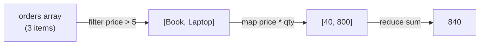

# Lecture 12: Important Built-in Methods and Array Processing

Modern JavaScript code processes lists of data — arrays of products, users, form fields, API
results — constantly. Instead of writing manual `for` loops every time, JavaScript gives you a
set of built-in **array methods** that express *what* you want done, not *how* to loop through
it. Mastering these methods is one of the highest-leverage skills for the rest of this course,
since you'll use them constantly with React and API data.

## In This Lecture

- Iterating over arrays with `forEach` and `for...of`
- Transforming data with `map`, selecting data with `filter`, and aggregating data with `reduce`
- Searching and testing with `find`, `some`, and `every`, and ordering with `sort`
- Frequently used string and object methods, and chaining methods together
- Writing in an immutable, functional style, and avoiding common mutation mistakes

## Iteration: `forEach` and `for...of`

Before transforming data, you need to be able to walk through it. JavaScript gives you a few
ways to do this beyond the classic `for (let i = 0; ...)` loop.

**`forEach`** runs a given function once for every element in an array. It does not return
anything useful (it always returns `undefined`) — use it purely for side effects, like logging.

```javascript
const fruits = ["apple", "banana", "cherry"];

fruits.forEach((fruit, index) => {
  console.log(`${index}: ${fruit}`);
});
// 0: apple
// 1: banana
// 2: cherry
```

**`for...of`** is a loop construct (not a method) that iterates over the *values* of any
iterable — arrays, strings, Maps, Sets. It supports `break` and `continue`, which `forEach` does
not.

```javascript
for (const fruit of fruits) {
  if (fruit === "banana") continue;
  console.log(fruit);
}
```

!!! note "`for...in` vs. `for...of`"
    `for...in` iterates over an object's *keys* (or an array's *indexes*) and is generally used
    for plain objects. `for...of` iterates over *values* and is generally preferred for arrays.
    Mixing them up is a common source of bugs.

## Transformation with `map`

**`map`** creates a **new array** by applying a function to every element of the original array.
The new array always has the same length as the original.

```javascript
const prices = [100, 200, 300];
const withTax = prices.map(price => price * 1.15);
console.log(withTax); // [115, 230, 345]
console.log(prices);  // [100, 200, 300] — original is untouched
```

`map` is ideal whenever you need to convert every item in a list into something else — for
example, turning an array of user objects into an array of just their names.

## Selection with `filter`

**`filter`** creates a **new array** containing only the elements for which the given function
returns `true`. The result can be shorter than (or equal to) the original.

```javascript
const numbers = [1, 2, 3, 4, 5, 6];
const evens = numbers.filter(n => n % 2 === 0);
console.log(evens); // [2, 4, 6]
```

## Aggregation with `reduce`

**`reduce`** boils an array down to a single value — a total, an object, a string, anything —
by repeatedly applying a function that combines an "accumulator" with each element.

```javascript
const cart = [10, 20, 30];
const total = cart.reduce((accumulator, price) => accumulator + price, 0);
console.log(total); // 60
```

`reduce` takes two arguments: the combining function `(accumulator, currentValue) => ...`, and an
**initial value** for the accumulator (`0` above). Walk through it step by step:

| Step | accumulator | currentValue | returns |
|---|---|---|---|
| 1 | 0 | 10 | 10 |
| 2 | 10 | 20 | 30 |
| 3 | 30 | 30 | 60 |

`reduce` is more powerful than it looks — you can use it to build objects, count occurrences, or
even implement `map` and `filter` yourself:

```javascript
const words = ["cat", "dog", "cat", "bird", "dog", "cat"];
const counts = words.reduce((acc, word) => {
  acc[word] = (acc[word] || 0) + 1;
  return acc;
}, {});
console.log(counts); // { cat: 3, dog: 2, bird: 1 }
```

## `find`, `some`, `every`, and `sort`

```javascript
const users = [
  { id: 1, name: "Ali", active: true },
  { id: 2, name: "Sara", active: false },
  { id: 3, name: "Bilal", active: true },
];

// find: returns the FIRST matching element, or undefined
const user = users.find(u => u.id === 2);
console.log(user); // { id: 2, name: "Sara", active: false }

// some: returns true if AT LEAST ONE element matches
console.log(users.some(u => u.active === false)); // true

// every: returns true only if ALL elements match
console.log(users.every(u => u.active === true)); // false
```

**`sort`** reorders an array **in place** (it mutates the original array!) and also returns it.
Without a comparison function, it converts elements to strings and sorts alphabetically — which
gives wrong results for numbers.

```javascript
const nums = [40, 1, 5, 200];
console.log(nums.sort());               // [1, 200, 40, 5] — WRONG, sorted as strings!
console.log(nums.sort((a, b) => a - b)); // [1, 5, 40, 200] — correct, ascending
console.log(nums.sort((a, b) => b - a)); // [200, 40, 5, 1] — descending
```

The comparison function `(a, b) => a - b` returns a negative number when `a` should come first, a
positive number when `b` should come first, and `0` when they're equal.

!!! warning "`sort` mutates the array"
    Unlike `map` and `filter`, `sort` (and also `reverse`, `push`, `pop`, `splice`) change the
    original array instead of returning a new one. If you need to keep the original order intact,
    sort a copy: `[...nums].sort((a, b) => a - b)`.

## Frequently Used String and Object Methods

Strings and objects have their own useful built-in methods:

```javascript
// String methods
const text = "  Hello, World!  ";
console.log(text.trim());               // "Hello, World!"
console.log(text.toLowerCase());        // "  hello, world!  "
console.log(text.includes("World"));    // true
console.log(text.trim().split(", "));   // ["Hello", "World!"]
console.log("5".padStart(3, "0"));      // "005"
console.log(`Hi ${"Ali"}`.slice(0, 2)); // "Hi"

// Object methods
const person = { name: "Ayesha", age: 22 };
console.log(Object.keys(person));   // ["name", "age"]
console.log(Object.values(person)); // ["Ayesha", 22]
console.log(Object.entries(person)); // [["name", "Ayesha"], ["age", 22]]

const merged = Object.assign({}, person, { age: 23 });
console.log(merged); // { name: "Ayesha", age: 23 } — person is unchanged
```

## Method Chaining

Because `map`, `filter`, and similar methods return **new arrays**, you can call another array
method directly on the result — this is called **method chaining**. It lets you express a
multi-step data pipeline in one readable expression.

```javascript
const orders = [
  { item: "Book", price: 20, qty: 2 },
  { item: "Pen", price: 2, qty: 10 },
  { item: "Laptop", price: 800, qty: 1 },
];

const totalForExpensiveItems = orders
  .filter(order => order.price > 5)                 // keep Book and Laptop
  .map(order => order.price * order.qty)             // [40, 800]
  .reduce((sum, lineTotal) => sum + lineTotal, 0);    // 840

console.log(totalForExpensiveItems); // 840
```



!!! tip "Read chains top to bottom"
    When a chain gets long, put each method call on its own line (as above). It reads like a
    numbered list of steps, and makes it much easier to see which step introduced a bug.

## Immutability and Functional Programming Style

**Immutability** means not changing (mutating) existing data — instead, you create a new copy
with the change applied. `map`, `filter`, and `reduce` are all immutable by nature: they never
touch the original array. This style is called **functional programming**, and it has real
benefits:

- It's easier to reason about code when data doesn't change unexpectedly underneath you.
- It avoids subtle bugs caused by two parts of a program sharing and secretly mutating the same
  array or object.
- It's required by frameworks like React, which detect changes by comparing old and new data —
  if you mutate data in place, React may not notice that anything changed at all.

```javascript
// Mutating (avoid)
function addItemMutating(cart, item) {
  cart.push(item); // changes the original array
  return cart;
}

// Immutable (prefer)
function addItemImmutable(cart, item) {
  return [...cart, item]; // returns a brand-new array
}

const cart = ["Book"];
const newCart = addItemImmutable(cart, "Pen");
console.log(cart);    // ["Book"] — untouched
console.log(newCart); // ["Book", "Pen"]
```

The same idea applies to objects — use the spread operator instead of directly assigning a new
property to an existing object you want to keep unchanged elsewhere:

```javascript
const settings = { theme: "light", fontSize: 14 };
const updated = { ...settings, theme: "dark" }; // new object, settings unchanged
```

## Common Mistakes

!!! warning "Methods that mutate vs. methods that don't"
    Mixing these up is one of the most common sources of bugs in JavaScript array code.

    | Mutates the original array | Returns a new array, leaves original alone |
    |---|---|
    | `push`, `pop`, `shift`, `unshift` | `map`, `filter`, `slice`, `concat` |
    | `splice` | `reduce` (usually) |
    | `sort`, `reverse` | spread (`[...arr]`) |

Other frequent mistakes:

```javascript
// 1. Forgetting that forEach returns undefined
const doubled = [1, 2, 3].forEach(n => n * 2); // WRONG — use map instead
console.log(doubled); // undefined

// 2. Forgetting the initial value in reduce on an empty array
const empty = [];
// empty.reduce((a, b) => a + b); // TypeError: Reduce of empty array with no initial value
const safe = empty.reduce((a, b) => a + b, 0); // 0 — safe, because of the initial value

// 3. Using == instead of === inside find/filter callbacks
const strNums = ["1", "2", "3"];
console.log(strNums.filter(n => n === 2)); // [] — no match, "2" !== 2 (types differ)
```

## Try It Yourself

1. Given `const scores = [55, 72, 90, 48, 88, 65];`, use `filter` and `map` together to produce
   an array of only the **passing** scores (60 and above), converted into letter-grade strings
   (`90 → "A"`, `80–89 → "B"`, `70–79 → "C"`, `60–69 → "D"`). Then use `reduce` to compute the
   average of the original `scores` array.
2. Given an array of product objects `{ name, category, price }`, write a chained expression that
   filters for a specific `category`, sorts the result by `price` ascending **without mutating
   the original array**, and returns just the array of `name`s using `map`.

## Key Takeaways

- Use `forEach` or `for...of` when you just need to walk through an array; use `map`, `filter`,
  and `reduce` when you need to produce a new value from it.
- `map` transforms every element (same length in, same length out); `filter` selects a subset;
  `reduce` combines everything into a single result.
- `find` returns the first match (or `undefined`); `some`/`every` return booleans about whether
  any/all elements match.
- `sort` (like `push`, `splice`, and `reverse`) mutates the original array — copy first with
  `[...arr]` if you need to keep the original order.
- Method chaining lets you express multi-step data pipelines clearly, but keep each method on its
  own line once a chain gets long.
- Prefer an immutable, functional style — return new arrays/objects instead of mutating existing
  ones — especially since frameworks like React depend on this.
- Always pass an initial value to `reduce` to avoid a runtime error on empty arrays.
