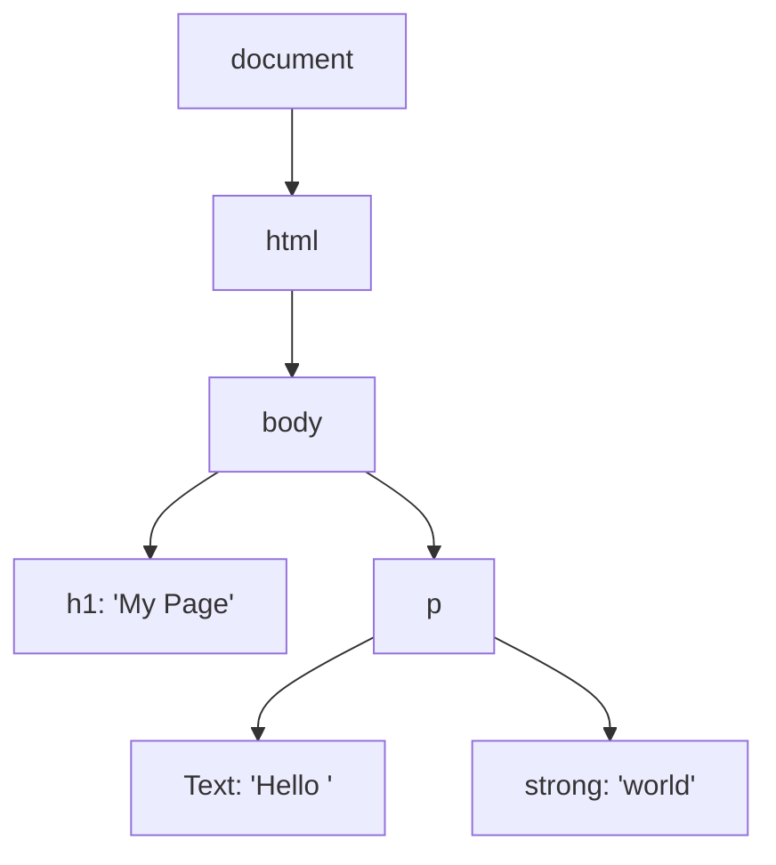
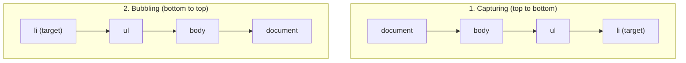

# Lecture 13: DOM Manipulation and Event Handling

Every interactive web page you have ever used — one that updates without a full reload, reacts to
clicks, or validates a form as you type — does it through the **DOM**. This lecture shows you how
JavaScript reads, changes, and reacts to the structure of a web page.

## In This Lecture

- What the DOM tree, nodes, and the `document` object actually are
- Selecting elements with `getElementById`, `querySelector`, and `querySelectorAll`
- Creating, updating, and removing elements
- Working with `classList` and inline styles
- Handling events with `addEventListener` and the event object
- Event bubbling, capturing, delegation, `preventDefault`, and `stopPropagation`

## The DOM Tree, Nodes, and the `document` Object

The **DOM** (Document Object Model) is a live, in-memory, tree-shaped representation of an HTML
page that the browser builds after parsing your HTML. Every tag becomes an object — called a
**node** — that JavaScript can read and modify. When you change the DOM, the browser immediately
redraws the page to match.

```html
<!DOCTYPE html>
<html>
  <body>
    <h1>My Page</h1>
    <p>Hello <strong>world</strong></p>
  </body>
</html>
```



A few important vocabulary words:

- **Node**: any single item in the tree — an element, a piece of text, or a comment.
- **Element**: a node that represents an HTML tag, like `<p>` or `<div>`.
- **`document`**: a special global object that represents the entire page, and is your entry
  point for interacting with the DOM (`document.getElementById(...)`, `document.title`, etc.).
- **Parent / child / sibling**: `body` is the *parent* of `h1` and `p`; `h1` and `p` are
  *siblings* (children of the same parent).

!!! note "The DOM is not the same as your HTML file"
    The DOM is what the browser *builds* from your HTML — and JavaScript can change it after the
    fact. If you use "View Page Source" you see the original HTML file, but if you use "Inspect
    Element" (DevTools) you see the *current* DOM, which may look very different after scripts
    have run.

## Selecting Elements

Before you can change something on the page, you need to select the node(s) you want.

```javascript
// By id — returns a single element, or null if not found
const title = document.getElementById("main-title");

// By CSS selector — returns the FIRST matching element, or null
const firstButton = document.querySelector(".btn");
const firstInput = document.querySelector("input[type='email']");

// By CSS selector — returns ALL matching elements as a NodeList
const allButtons = document.querySelectorAll(".btn");
```

`querySelector` and `querySelectorAll` accept **any valid CSS selector** — by class (`.btn`), by
tag (`div`), by attribute (`[type="text"]`), or combinations (`ul li.active`) — which makes them
far more flexible than the older `getElementById`/`getElementsByClassName` methods.

```javascript
// NodeList supports forEach directly
allButtons.forEach(btn => console.log(btn.textContent));
```

!!! tip "`querySelectorAll` returns a NodeList, not an Array"
    A `NodeList` supports `forEach`, but not `map` or `filter` directly. Convert it first if you
    need those: `Array.from(allButtons)` or `[...allButtons]`.

## Creating, Updating, and Removing Nodes

### Creating and Inserting

```javascript
const newItem = document.createElement("li");   // create a new <li> element
newItem.textContent = "New task";                // give it text content

const list = document.querySelector("#task-list");
list.appendChild(newItem);          // add as the last child
list.prepend(newItem);              // add as the first child
list.insertBefore(newItem, list.children[1]); // insert at a specific position
```

### Updating Content and Attributes

```javascript
const heading = document.querySelector("h1");
heading.textContent = "Updated Title";  // sets plain text (safe — treats input as text)
heading.innerHTML = "<em>Updated</em> Title"; // parses the string AS HTML

const link = document.querySelector("a");
link.setAttribute("href", "https://example.com");
console.log(link.getAttribute("href"));
link.removeAttribute("target");
```

!!! warning "`innerHTML` and security"
    `innerHTML` parses whatever string you give it as real HTML. If that string ever comes from
    user input (a comment box, a search field) and you insert it with `innerHTML`, a malicious
    user could inject a `<script>` tag — this is called **XSS (Cross-Site Scripting)**, and you
    will study it later in this course. Prefer `textContent` unless you specifically need to
    insert HTML markup, and always trust `textContent` over `innerHTML` for anything user-typed.

### Removing Nodes

```javascript
const item = document.querySelector("#task-3");
item.remove();               // modern, simplest way

// Older way, still seen in existing code:
item.parentNode.removeChild(item);
```

## `classList` and Inline Styles

Rather than changing CSS with raw strings, use `classList` to toggle predefined CSS classes — this
keeps styling logic in your CSS file, where it belongs.

```javascript
const box = document.querySelector(".box");

box.classList.add("highlighted");
box.classList.remove("hidden");
box.classList.toggle("active");     // adds it if missing, removes it if present
console.log(box.classList.contains("active")); // true or false
```

You can also set individual CSS properties directly through the `style` property, which writes
**inline styles** (CSS applied directly on the element, with the highest priority):

```javascript
box.style.backgroundColor = "yellow";
box.style.display = "none";
box.style.fontSize = "18px";
```

!!! tip "Prefer `classList` over `style`"
    Toggling a class is usually better than setting individual style properties in JavaScript,
    because it keeps the "what it should look like" (CSS) separate from "when it should look that
    way" (JavaScript), and it's easier to change the look later without touching your script.

## Events and `addEventListener`

An **event** is something that happens in the browser that your code can respond to — a click, a
key press, a page load, a form submission, and many more. An **event listener** is a function you
register to run when a specific event happens on a specific element.

```javascript
const button = document.querySelector("#save-btn");

button.addEventListener("click", function () {
  console.log("Button was clicked!");
});

// Arrow function version
button.addEventListener("click", () => console.log("Clicked!"));
```

`addEventListener(eventType, handlerFunction)` is preferred over the older `onclick = ...` style
because it lets you attach **multiple** listeners to the same event on the same element, and you
can remove a specific one later with `removeEventListener`.

```javascript
function handleClick() {
  console.log("Handled once");
}
button.addEventListener("click", handleClick);
button.removeEventListener("click", handleClick); // must pass the SAME function reference
```

### The Event Object

Every event handler automatically receives an **event object** describing what happened:

```javascript
document.querySelector("input").addEventListener("keydown", (event) => {
  console.log(event.key);        // which key was pressed, e.g. "Enter"
  console.log(event.target);     // the exact element the event happened on
  console.log(event.type);       // "keydown"
});

document.querySelector("form").addEventListener("submit", (event) => {
  event.preventDefault(); // stop the default action (page reload) — see below
  console.log("Form data captured without reloading the page");
});
```

Common events you will use constantly: `click`, `submit`, `input`, `change`, `keydown`,
`keyup`, `mouseover`, `mouseout`, `load`, `DOMContentLoaded`.

## Bubbling, Capturing, and Event Delegation

When an event fires on an element nested inside other elements, it doesn't just affect that one
element — it travels through the DOM tree in two phases:

1. **Capturing phase**: the event travels **down** from `document` to the target element.
2. **Bubbling phase**: the event then travels back **up** from the target element to `document`.



By default, `addEventListener` listens during the **bubbling** phase. You can listen during the
capturing phase instead by passing `true` as a third argument:

```javascript
element.addEventListener("click", handler, true); // capturing phase
element.addEventListener("click", handler, false); // bubbling phase (default)
```

### Event Delegation

Because events bubble up, you can attach **one** listener on a parent element instead of separate
listeners on every child — this is called **event delegation**. It's especially useful for lists
where items are added or removed dynamically, since a listener on individual items would need to
be re-attached every time.

```javascript
const list = document.querySelector("#task-list");

// One listener on the parent handles clicks on ANY current or future <li>
list.addEventListener("click", (event) => {
  if (event.target.tagName === "LI") {
    event.target.classList.toggle("done");
  }
});
```

Here, `event.target` is the specific element that was actually clicked (a particular `<li>`),
while `event.currentTarget` is the element the listener is attached to (`list` itself).

!!! tip "Why event delegation matters"
    If you add 100 new `<li>` items after the page loads, a delegated listener on the parent
    `<ul>` automatically handles clicks on all of them — no need to attach 100 separate listeners
    or re-attach one every time an item is added.

### `preventDefault` and `stopPropagation`

These two methods on the event object control the event's behavior, but they do very different
things:

- **`event.preventDefault()`**: stops the browser's **default behavior** for that event — like
  a form actually submitting and reloading the page, or a link actually navigating.
- **`event.stopPropagation()`**: stops the event from **continuing to bubble (or capture)** to
  other elements — but the default browser behavior still happens unless you also call
  `preventDefault()`.

```javascript
document.querySelector("a.disabled-link").addEventListener("click", (event) => {
  event.preventDefault(); // the link will NOT navigate anywhere
});

document.querySelector(".dropdown-toggle").addEventListener("click", (event) => {
  event.stopPropagation(); // clicking this button won't also trigger a listener
                            // on a parent element (e.g. a "click outside to close" handler)
});
```

!!! warning "Don't confuse the two"
    `preventDefault()` cancels what the browser *would have done*. `stopPropagation()` cancels
    the event from *reaching other listeners* further up (or down) the tree. A single handler can
    call both when needed, but they solve different problems.

## Try It Yourself

1. Build a simple to-do list: an `<input>`, an "Add" `<button>`, and an empty `<ul id="list">`.
   When the button is clicked, create a new `<li>` with the input's text and append it to the
   list, then clear the input. Use `event.preventDefault()` if you wrap the input in a `<form>`.
2. Add **one** delegated `click` listener on `#list` that toggles a `done` CSS class (with a
   line-through style) when any `<li>` is clicked, and removes the `<li>` entirely if the user
   clicks a small "×" you add inside each item — using `event.target` to tell which part was
   clicked.

## Key Takeaways

- The DOM is a live, tree-shaped, in-memory representation of the page; `document` is your entry
  point into it.
- `getElementById` selects by id; `querySelector`/`querySelectorAll` select by any CSS selector
  and are more flexible.
- Prefer `textContent` over `innerHTML` unless you specifically need to insert HTML, to avoid
  XSS security risks with user-supplied text.
- `classList.add/remove/toggle/contains` is the preferred way to change an element's appearance;
  reserve direct `style` changes for one-off, dynamic values.
- `addEventListener` registers event handlers and supports multiple listeners per event; every
  handler receives an event object describing what happened.
- Events bubble up (and can capture down) through the DOM tree — this enables event delegation,
  where one listener on a parent handles events from many (even future) children.
- `preventDefault()` stops the browser's default action; `stopPropagation()` stops the event from
  reaching other listeners — they are not the same thing.
