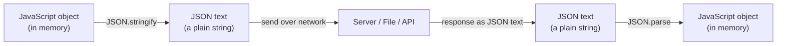

# Lecture 14: Regular Expressions and JSON

Two skills come up in almost every real web project: checking that user input has the right
*shape* (an email address, a phone number, a password with enough strength), and exchanging
structured data with a server. This lecture covers **regular expressions**, a mini-language for
matching patterns in text, and **JSON**, the standard format the web uses to move data around.

## In This Lecture

- Regex syntax: literals, character classes, quantifiers, and anchors
- Groups, alternation, backreferences, and flags (`g`, `i`, `m`)
- JavaScript's regex methods: `test`, `exec`, `match`, `replace`, `split`
- Validating and parsing form data with regex
- JSON syntax, and converting between JSON and JavaScript objects with `JSON.stringify` and
  `JSON.parse`

## What Is a Regular Expression?

A **regular expression** (**regex** for short) is a pattern that describes a set of strings. You
use it to test whether a string matches a shape, find matches inside a larger string, or replace
parts of a string. In JavaScript, you write a regex between forward slashes:

```javascript
const pattern = /hello/;
console.log(pattern.test("hello world")); // true — "hello" appears in the string
console.log(pattern.test("goodbye"));      // false
```

You can also build one dynamically with the `RegExp` constructor, which is useful when the
pattern comes from a variable:

```javascript
const word = "hello";
const dynamicPattern = new RegExp(word);
```

## Regex Syntax

### Literals

The simplest regex just matches the exact characters you write — `/cat/` matches the text "cat"
wherever it appears.

### Character Classes

A **character class** matches any *one* character from a set, written inside square brackets, or
using shorthand codes:

```javascript
/[abc]/     // matches a single "a", "b", or "c"
/[a-z]/     // matches any single lowercase letter (a range)
/[0-9]/     // matches any single digit
/[^0-9]/    // ^ inside [] means NOT — matches any character that is NOT a digit

// Shorthand classes
/\d/  // any digit            — same as [0-9]
/\D/  // any NON-digit
/\w/  // any "word" character — same as [A-Za-z0-9_]
/\W/  // any NON-word character
/\s/  // any whitespace (space, tab, newline)
/\S/  // any NON-whitespace
/./   // any character except a newline
```

### Quantifiers

A **quantifier** says *how many times* the preceding item must repeat:

```javascript
/a*/   // 0 or more "a"s
/a+/   // 1 or more "a"s
/a?/   // 0 or 1 "a" (optional)
/a{3}/ // exactly 3 "a"s
/a{2,4}/ // between 2 and 4 "a"s
/a{2,}/  // 2 or more "a"s
```

### Anchors

**Anchors** don't match characters — they match a *position* in the string:

```javascript
/^Hello/  // ^ means "start of string" — matches only if the string STARTS with "Hello"
/world$/  // $ means "end of string" — matches only if the string ENDS with "world"
/^Hello world$/ // must match the ENTIRE string exactly
/\bcat\b/ // \b is a word boundary — matches "cat" but not "concatenate"
```

## Groups, Alternation, Backreferences, and Flags

### Groups

Parentheses `()` create a **group**, letting you apply a quantifier to more than one character at
once, and letting you extract just that piece of the match later.

```javascript
/(ab)+/.test("ababab"); // true — "ab" repeated one or more times
```

### Alternation

The pipe `|` means "or":

```javascript
/cat|dog/.test("I have a dog"); // true — matches "cat" OR "dog"
```

### Backreferences

A **backreference** refers back to a previously captured group, useful for finding repeated
patterns:

```javascript
// \1 refers back to whatever the first group (\w+) matched
/(\w+)\s\1/.test("hello hello"); // true — the same word repeated
/(\w+)\s\1/.test("hello world"); // false — different words
```

### Flags

**Flags** are letters placed after the closing slash that change how the whole regex behaves:

| Flag | Meaning |
|---|---|
| `g` | Global — find **all** matches, not just the first |
| `i` | Case-insensitive matching |
| `m` | Multiline — `^` and `$` match the start/end of each line, not just the whole string |

```javascript
const text = "Cat cat CAT";
console.log(text.match(/cat/gi)); // ["Cat", "cat", "CAT"] — all matches, ignoring case
```

## JavaScript Regex Methods

### `test()` — does it match?

Returns `true` or `false`. Called on the regex, with the string as the argument.

```javascript
const hasDigit = /\d/;
console.log(hasDigit.test("abc123")); // true
```

### `exec()` — find match details

Called on the regex; returns an array with match details (or `null` if no match), including the
matched text and any captured groups.

```javascript
const dateRegex = /(\d{4})-(\d{2})-(\d{2})/;
const result = dateRegex.exec("Event date: 2026-09-05");
console.log(result[0]); // "2026-09-05" — the full match
console.log(result[1]); // "2026" — first group
console.log(result[2]); // "09"   — second group
console.log(result[3]); // "05"   — third group
```

### `match()` and `matchAll()` — string methods

Called **on the string**, with the regex as the argument.

```javascript
const text = "Call 123-456-7890 or 987-654-3210";
console.log(text.match(/\d{3}-\d{3}-\d{4}/g));
// ["123-456-7890", "987-654-3210"]
```

### `replace()` and `replaceAll()`

```javascript
const messy = "hello   world    there";
console.log(messy.replace(/\s+/g, " ")); // "hello world there" — collapse extra spaces

// Using captured groups in the replacement with $1, $2, ...
const date = "2026-09-05";
console.log(date.replace(/(\d{4})-(\d{2})-(\d{2})/, "$3/$2/$1")); // "05/09/2026"
```

### `split()`

```javascript
const csvLine = "Ali, Sara,  Bilal";
console.log(csvLine.split(/,\s*/)); // ["Ali", "Sara", "Bilal"] — split on comma + optional spaces
```

## Validating and Parsing Form Data

A very common real-world use of regex is checking that user input looks correct before you submit
a form or save it to a database:

```javascript
function isValidEmail(email) {
  const emailRegex = /^[\w.+-]+@[\w-]+\.[a-zA-Z]{2,}$/;
  return emailRegex.test(email);
}
console.log(isValidEmail("student@comsats.edu.pk")); // true
console.log(isValidEmail("not-an-email"));            // false

function isStrongPassword(password) {
  // at least 8 characters, one uppercase, one lowercase, one digit
  const strongRegex = /^(?=.*[a-z])(?=.*[A-Z])(?=.*\d).{8,}$/;
  return strongRegex.test(password);
}
console.log(isStrongPassword("Abcdefg1")); // true
console.log(isStrongPassword("abcdefgh")); // false — no uppercase, no digit

function isValidPakPhone(phone) {
  // e.g. 0300-1234567
  return /^03\d{2}-\d{7}$/.test(phone);
}
console.log(isValidPakPhone("0300-1234567")); // true
```

!!! warning "Regex validates *shape*, not *truth*"
    A regex can confirm that `student@comsats.edu.pk` **looks like** an email address (has an
    `@`, a domain, etc.), but it cannot confirm the mailbox actually exists. Always pair
    client-side shape validation with real server-side verification (like sending a confirmation
    email) for anything important.

!!! tip "Test your regex interactively"
    Tools like regex101.com let you build and test a pattern against sample strings with live
    highlighting — extremely useful while you're still learning the syntax.

## JSON: JavaScript Object Notation

**JSON** (JavaScript Object Notation) is a lightweight, text-based format for representing
structured data. It looks a lot like a JavaScript object literal, which makes it easy to read, but
it is a strict, language-independent format used to exchange data between a browser and a server
(or between any two systems, in any programming language).

```json
{
  "name": "Ayesha",
  "age": 22,
  "isStudent": true,
  "courses": ["Web Technologies", "Databases"],
  "address": {
    "city": "Lahore",
    "zip": "54000"
  },
  "graduationYear": null
}
```

JSON syntax rules are stricter than JavaScript object syntax:

- **Keys must be double-quoted strings** — `"name"`, never `name` or `'name'`.
- String values must also use **double quotes**, not single quotes.
- Allowed value types: string, number, boolean (`true`/`false`), `null`, object, or array.
- **No trailing commas**, and **no comments** are allowed anywhere in JSON.
- **No functions, `undefined`, or dates** — JSON only represents plain data.



### `JSON.stringify()` — object to JSON text

Converts a JavaScript value into a JSON-formatted string, so it can be sent over the network or
saved to a file.

```javascript
const student = {
  name: "Bilal",
  age: 21,
  courses: ["Web Technologies", "OOP"],
};

const jsonText = JSON.stringify(student);
console.log(jsonText);
// '{"name":"Bilal","age":21,"courses":["Web Technologies","OOP"]}'

// Pretty-print with indentation (useful for logging/debugging)
console.log(JSON.stringify(student, null, 2));
```

### `JSON.parse()` — JSON text to object

Converts a JSON-formatted string back into a real JavaScript value you can work with.

```javascript
const jsonText = '{"name":"Bilal","age":21}';
const obj = JSON.parse(jsonText);
console.log(obj.name); // "Bilal"
console.log(obj.age + 1); // 22 — it's a real number, not a string
```

!!! warning "Invalid JSON throws an error"
    `JSON.parse` throws a `SyntaxError` if the string is not valid JSON (for example, if it uses
    single quotes or has a trailing comma). Always wrap `JSON.parse` on data from an external
    source in a `try...catch` block, which you'll practice more in the next lecture.
    ```javascript
    try {
      const data = JSON.parse(someText);
    } catch (error) {
      console.error("Invalid JSON:", error.message);
    }
    ```

You will use `JSON.stringify` and `JSON.parse` constantly starting in the next lecture, whenever
your JavaScript code talks to a server through the Fetch API — request bodies you send are turned
into JSON text with `stringify`, and response bodies you receive are turned back into usable
objects with `parse`.

## Try It Yourself

1. Write a regex-based function `extractHashtags(text)` that returns an array of all hashtags
   (words starting with `#`, made of letters, digits, or underscores) found in a string, e.g.
   `extractHashtags("Loving #WebDev and #JavaScript!")` should return `["#WebDev",
   "#JavaScript"]`.
2. Create a JavaScript object representing a small product catalog (an array of `{ name, price,
   inStock }` objects). Convert it to a pretty-printed JSON string with `JSON.stringify`, then
   parse it back with `JSON.parse` and use a `filter` (from the previous lecture) to log only the
   products where `inStock` is `true`.

## Key Takeaways

- A regex describes a pattern of text using literals, character classes (`\d`, `\w`, `\s`, or
  `[...]`), quantifiers (`*`, `+`, `?`, `{n,m}`), and anchors (`^`, `$`, `\b`).
- Groups `()` capture parts of a match; `|` means alternation ("or"); backreferences (`\1`) refer
  back to an earlier group; flags `g`, `i`, `m` change global/case-insensitive/multiline matching.
- `test()` and `exec()` are regex methods; `match()`, `matchAll()`, `replace()`, and `split()` are
  string methods that also accept a regex.
- Regex is excellent for validating the *shape* of form input (emails, phone numbers, passwords)
  but cannot confirm the data is actually true or real.
- JSON is a strict, text-based data format — double-quoted keys and strings only, no comments, no
  trailing commas, no functions.
- `JSON.stringify` converts a JavaScript value into JSON text; `JSON.parse` converts JSON text
  back into a usable JavaScript value — the core of exchanging data with a server.
- Always wrap `JSON.parse` on external data in a `try...catch`, since malformed JSON throws an
  error.
