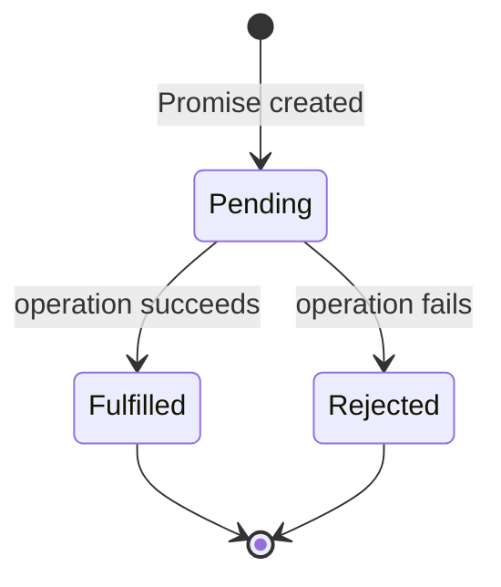
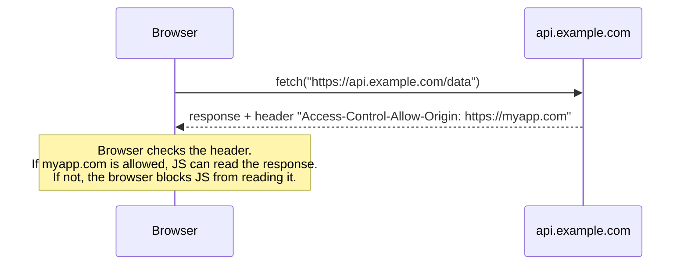

# Lecture 15: Asynchronous JavaScript: Promises and Fetch API

So far, every code example in this unit has run top to bottom, one line finishing before the next
begins. But real web pages constantly wait on things that take time — a file loading, a timer, or
a response from a server — without freezing the whole page while they wait. This lecture explains
how JavaScript manages that waiting, and how to fetch real data from a server.

## In This Lecture

- Synchronous vs. asynchronous execution, and the event loop, task queue, and "callback hell"
- Promises: their three states, `.then/.catch/.finally`, chaining, and `Promise.all`
- `async`/`await`, and error handling with `try...catch`
- Making real network requests with the Fetch API: GET/POST, headers, response parsing, and CORS

## Synchronous vs. Asynchronous Execution

**Synchronous** code runs one instruction at a time, in order, and each instruction must finish
before the next one starts. This is how almost all the code you've written so far behaves.

```javascript
console.log("1");
console.log("2");
console.log("3");
// Always prints: 1, 2, 3 — in that exact order, with no gaps
```

**Asynchronous** code lets some operations happen "in the background" without blocking the rest of
the program. JavaScript starts the operation, moves on immediately to the next line, and comes
back to handle the result once it's ready.

```javascript
console.log("1");
setTimeout(() => console.log("2"), 1000); // scheduled for later, doesn't block
console.log("3");
// Prints: 1, 3, 2 — "2" appears about a second later!
```

This matters because JavaScript in the browser runs on a **single thread** — it can only do one
thing at a time. If a network request or a large computation blocked that one thread, the entire
page (buttons, scrolling, animations) would freeze until it finished. Asynchronous operations
(timers, network requests, file reads) are handed off so the single thread stays free to keep the
page responsive.

### The Event Loop and Task Queue

JavaScript manages this with a mechanism called the **event loop**:

- The **call stack** is where currently-running code executes, one function call at a time.
- When you start an asynchronous operation (like `setTimeout` or a network request), it is handed
  off to the browser, which handles the actual waiting outside of JavaScript.
- When that operation finishes, its callback function is placed into a **task queue** (also
  called the **callback queue**, or a separate **microtask queue** for Promises specifically).
- The **event loop** constantly checks: *is the call stack empty?* If yes, it takes the next
  item from the queue and pushes it onto the call stack to run.

```mermaid
sequenceDiagram
    participant Stack as Call Stack
    participant Browser as Browser / Web APIs
    participant Queue as Task Queue
    participant Loop as Event Loop

    Stack->>Stack: console.log("1")
    Stack->>Browser: setTimeout(fn, 1000) handed off
    Stack->>Stack: console.log("3")
    Note over Stack: Call stack now empty
    Browser->>Queue: after 1000ms, fn is queued
    Loop->>Queue: checks queue (stack is empty)
    Queue->>Stack: fn moved to call stack
    Stack->>Stack: console.log("2") runs
```

!!! note "Microtasks run before macrotasks"
    Promise callbacks (`.then`, `async`/`await`) go into a special **microtask queue** that the
    event loop always empties *completely* before it looks at the regular task queue (where
    `setTimeout` callbacks live). This is why a `Promise.resolve().then(...)` scheduled after a
    `setTimeout(..., 0)` usually still runs first.

### Callback Hell

Before Promises existed, asynchronous code was handled with **callbacks** — functions passed in
to be called later. When one async step depends on the result of the previous one, callbacks
nest deeper and deeper, producing hard-to-read, hard-to-maintain code nicknamed **callback hell**
(or the "pyramid of doom"):

```javascript
getUser(userId, function (user) {
  getOrders(user.id, function (orders) {
    getOrderDetails(orders[0].id, function (details) {
      console.log(details);
      // ...and it keeps growing to the right with every extra step
    }, handleError);
  }, handleError);
}, handleError);
```

Promises (and later `async`/`await`) were introduced specifically to solve this problem.

## Promises

A **Promise** is an object representing a value that isn't available yet, but will be at some
point — either successfully, or with an error. Think of it as a receipt for a value that's still
being prepared.

### The Three States



- **Pending**: the initial state — neither succeeded nor failed yet.
- **Fulfilled**: the operation completed successfully, and the promise now holds a result value.
- **Rejected**: the operation failed, and the promise now holds an error/reason.

A promise is **settled** once it becomes fulfilled or rejected, and it can never change state
again after that.

### Creating and Using a Promise

```javascript
function delay(ms) {
  return new Promise((resolve, reject) => {
    if (ms < 0) {
      reject(new Error("Delay cannot be negative"));
      return;
    }
    setTimeout(() => resolve(`Waited ${ms}ms`), ms);
  });
}

delay(1000)
  .then(result => console.log(result))   // runs if the promise is fulfilled
  .catch(error => console.error(error))  // runs if the promise is rejected
  .finally(() => console.log("Done, either way")); // always runs
```

- **`.then(onFulfilled)`** registers a callback for when the promise succeeds.
- **`.catch(onRejected)`** registers a callback for when the promise fails.
- **`.finally(callback)`** runs regardless of success or failure — great for cleanup, like hiding
  a loading spinner.

### Chaining Promises

Each `.then()` returns a **new promise**, which is what makes chaining possible — this replaces
the nested callback pyramid from before with a flat, readable sequence:

```javascript
getUser(userId)
  .then(user => getOrders(user.id))          // runs after getUser resolves
  .then(orders => getOrderDetails(orders[0].id)) // runs after getOrders resolves
  .then(details => console.log(details))     // runs after getOrderDetails resolves
  .catch(error => console.error("Something failed:", error)); // catches ANY failure above
```

One `.catch()` at the end catches an error from *any* step in the chain — you don't need to
handle errors after every single step.

### `Promise.all`

**`Promise.all`** takes an array of promises and returns a single new promise that fulfills only
once **all** of them have fulfilled (with an array of their results, in the same order) — or
rejects immediately if **any one** of them rejects.

```javascript
const promise1 = delay(1000).then(() => "First");
const promise2 = delay(500).then(() => "Second");
const promise3 = delay(1500).then(() => "Third");

Promise.all([promise1, promise2, promise3]).then(results => {
  console.log(results); // ["First", "Second", "Third"] — after ~1500ms total, not 3000ms
});
```

`Promise.all` is ideal when you need several independent pieces of data before you can continue —
for example, loading a user's profile, their posts, and their friends list all at once, in
parallel, instead of one after another.

## `async`/`await`

**`async`/`await`** is syntax (introduced in ES2017) built on top of Promises that lets
asynchronous code *read* like synchronous code, while still being non-blocking underneath.

```javascript
async function loadOrderDetails(userId) {
  const user = await getUser(userId);         // "pause" here until the promise settles
  const orders = await getOrders(user.id);
  const details = await getOrderDetails(orders[0].id);
  return details;
}
```

Two rules:

- **`async`** before a function makes it always return a Promise, and allows `await` inside it.
- **`await`** pauses execution of *that function* (not the whole program) until the promise it's
  waiting on settles, then "unwraps" the resolved value — or throws if the promise rejected.

### Error Handling with `try...catch`

Because `await` can throw when a promise rejects, you handle errors with an ordinary
`try...catch` block, exactly like handling any other exception:

```javascript
async function loadOrderDetails(userId) {
  try {
    const user = await getUser(userId);
    const orders = await getOrders(user.id);
    const details = await getOrderDetails(orders[0].id);
    return details;
  } catch (error) {
    console.error("Failed to load order details:", error.message);
    throw error; // re-throw if the caller also needs to know
  }
}
```

!!! tip "`async`/`await` vs. `.then` chains"
    They do the same job — `async`/`await` is just easier to read, especially with multiple
    sequential steps and conditional logic. You will see both styles in real codebases, so learn
    to recognize each, but prefer `async`/`await` for new code you write.

## AJAX and the Fetch API

**AJAX** (Asynchronous JavaScript and XML — the name is historical; today it almost always means
JSON, not XML) is the general technique of a web page requesting data from a server in the
background, without a full page reload. The modern, built-in tool for doing this is the
**Fetch API**.

### A GET Request

```javascript
async function loadStudents() {
  const response = await fetch("https://api.example.com/students");
  const students = await response.json(); // parses the response body as JSON
  console.log(students);
}
```

`fetch(url)` returns a Promise that resolves with a `Response` object once the server has
responded with headers — note that the promise resolves even for error responses like 404; it
only *rejects* on a genuine network failure (like no internet connection). That's why you check
`response.ok` or `response.status` yourself:

```javascript
async function loadStudents() {
  const response = await fetch("https://api.example.com/students");
  if (!response.ok) {
    throw new Error(`Request failed with status ${response.status}`);
  }
  const students = await response.json();
  return students;
}
```

### A POST Request with Headers

```javascript
async function createStudent(newStudent) {
  const response = await fetch("https://api.example.com/students", {
    method: "POST",
    headers: {
      "Content-Type": "application/json",
    },
    body: JSON.stringify(newStudent), // JS object -> JSON text, from Lecture 14
  });

  if (!response.ok) {
    throw new Error(`Failed to create student: ${response.status}`);
  }
  return response.json();
}

createStudent({ name: "Hina", age: 20 })
  .then(created => console.log("Created:", created))
  .catch(error => console.error(error));
```

**Headers** are extra metadata sent with a request or response — `Content-Type: application/json`
tells the server "the body I'm sending you is JSON text," so it knows how to parse it.

### Parsing Different Response Types

```javascript
const response = await fetch("/data");
const asJson = await response.json();  // parse as JSON
// const asText = await response.text(); // parse as plain text
// const asBlob = await response.blob(); // parse as raw binary data (e.g. an image)
```

You can only read a response body **once** — call one parsing method per response.

### Putting It All Together

```javascript
async function fetchAllPages() {
  try {
    const [usersRes, postsRes] = await Promise.all([
      fetch("https://api.example.com/users"),
      fetch("https://api.example.com/posts"),
    ]);
    const users = await usersRes.json();
    const posts = await postsRes.json();
    console.log(users, posts);
  } catch (error) {
    console.error("Network error:", error.message);
  }
}
```

### CORS Basics

**CORS** (Cross-Origin Resource Sharing) is a browser security rule that restricts JavaScript
running on one **origin** (a combination of protocol + domain + port, e.g.
`https://myapp.com`) from freely reading responses from a **different origin**
(e.g. `https://api.example.com`), unless that other server explicitly allows it.



- The **server** decides who is allowed, by sending back an `Access-Control-Allow-Origin` header.
- If that header doesn't permit your page's origin, the browser blocks your JavaScript from
  reading the response — you'll see a CORS error in the console, even though the network request
  itself may have technically succeeded.
- CORS is enforced by the **browser**, not by your JavaScript code — you cannot "fix" a CORS
  error from the frontend; the **server** must be configured to allow your origin.

!!! warning "CORS is not something you can bypass from the client"
    If you see a CORS error, the fix belongs on the server (adding the right
    `Access-Control-Allow-Origin` header), not in your `fetch` call. You'll work with server
    configuration, including CORS, starting in Unit 5.

## Try It Yourself

1. Write an `async` function `getRandomJoke()` that fetches data from a public API of your choice
   (for example `https://official-joke-api.appspot.com/random_joke`), parses the JSON response,
   and returns just the joke text. Wrap the network call in `try...catch` and log a friendly
   error message if the request fails.
2. Using `Promise.all`, write a function that fetches two different endpoints at the same time
   and logs both results only once **both** have arrived. Then deliberately point one URL at a
   non-existent server and observe how the `.catch` (or `try...catch`) handles the failure of the
   whole group.

## Key Takeaways

- Synchronous code blocks the single JavaScript thread until each line finishes; asynchronous
  code lets long-running operations happen in the background without freezing the page.
- The event loop constantly checks whether the call stack is empty, and if so, moves the next
  item from the task/microtask queue onto it — this is how `setTimeout` and Promise callbacks
  eventually run.
- A Promise moves through three states — pending, fulfilled, rejected — and is handled with
  `.then`, `.catch`, and `.finally`; chaining `.then` calls replaces nested "callback hell."
- `Promise.all` runs multiple promises in parallel and waits for all of them (or fails fast if
  any one rejects).
- `async`/`await` is Promise-based syntax that reads like synchronous code; errors are handled
  with ordinary `try...catch`.
- The Fetch API makes network requests; check `response.ok` before parsing, since `fetch` only
  rejects on true network failure, not on HTTP error status codes.
- CORS is a browser security rule enforced by checking response headers from the server — it
  cannot be fixed from client-side JavaScript alone.
