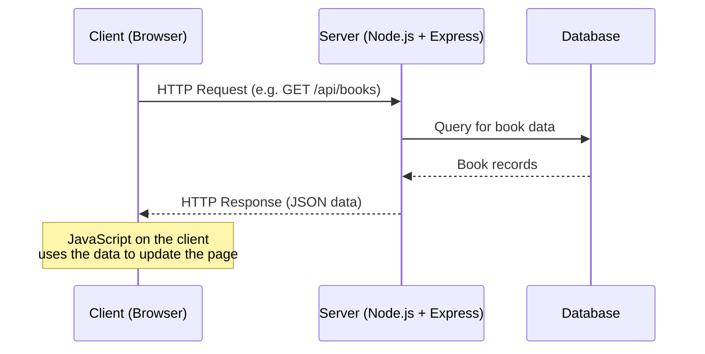
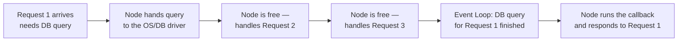
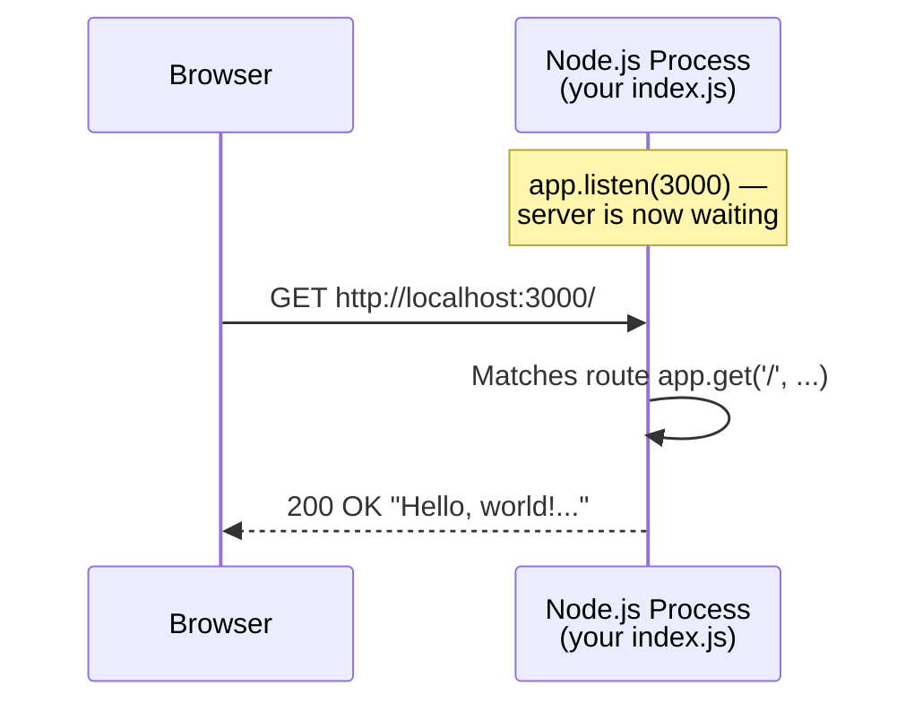

# Lecture 16: Introduction to Server-Side Programming

Up to this point, every line of JavaScript you have written has run **inside a browser**.
In this lecture, you take your JavaScript knowledge and use it to build the *other half*
of a web application: the server. You will learn what server-side programming actually
means, meet Node.js (the tool that lets JavaScript run outside a browser), and write your
very first web server with the Express.js framework.

## In This Lecture

- Understand the difference between client-side and server-side responsibilities
- Learn what a web server, an application server, and a runtime environment are
- Understand Node.js as a JavaScript runtime, and how it stays fast using an event loop
  and non-blocking I/O
- Learn what npm (Node Package Manager) is and how to use it
- Set up a new Express.js project from scratch
- Build your first web server and a basic route

## Client-Side vs. Server-Side Responsibilities

So far in this course, you have written **client-side** code: HTML, CSS, and JavaScript
that a browser downloads and runs on the user's own computer. Client-side code is
responsible for things like:

- Rendering the page the user sees
- Responding to clicks, typing, and other user interactions
- Validating a form *before* sending it (for a nicer experience — never trust this alone)
- Making requests to a server for data (using `fetch`, as you learned in Lecture 15)

**Server-side** code is different. It runs on a computer you (the developer) control —
not the user's computer — and it is responsible for things like:

- Deciding *what data* to send back for a given request
- Talking to a database to read or save information
- Checking whether a user is allowed to see or change something (authentication and
  authorization — you'll study these in detail in later lectures)
- Enforcing business rules that the client should never be trusted to enforce alone (for
  example: "a discount code can only be used once")

!!! note
    A simple rule of thumb: **client-side code is public**. Anyone can open their
    browser's developer tools and read, and even change, your client-side JavaScript.
    Because of this, any check that truly matters — "is this password correct?", "does
    this user own this post?" — must be done **again** on the server, which the user
    cannot tamper with.

| | Client-side | Server-side |
|---|---|---|
| Runs on | The user's device (in the browser) | A computer you control (a server) |
| Can be seen/edited by user? | Yes | No |
| Typical languages | HTML, CSS, JavaScript | JavaScript (Node.js), Python, Java, PHP, and others |
| Typical job | Display, interactivity, UX | Data, business logic, security, storage |

The two sides communicate over HTTP, exactly the request-response pattern you learned in
Lecture 1: the client (browser) sends a request, and the server sends back a response.



## Web Servers, Application Servers, and Runtime Environments

These three terms are related but mean different things, and students often mix them up.

**Web server**: software that listens for incoming HTTP requests and sends back HTTP
responses. At its simplest, a web server's only job is to speak HTTP — receive a request,
send a response. Examples include Apache, Nginx, and the servers you will build yourself
using Node.js.

**Application server**: software that runs your application's actual logic — the code
that decides *what* to send back, not just *how* to send it. In small Node.js/Express
projects (like the ones in this course), the web server and the application server are
usually the **same program**: your Express app both listens for HTTP requests *and* runs
your logic. In larger enterprise systems, these can be separate pieces of software.

**Runtime environment**: the software that actually executes your program's code. For
JavaScript, a **runtime** provides the engine that reads your code and runs it, plus
extra features (like reading files, or listening on a network port) that the language
itself doesn't define. Until now, your JavaScript has always run inside the **browser's**
runtime environment. Today you meet a second one: **Node.js**.

!!! note "Why can't your JavaScript just run anywhere?"
    JavaScript, as a language, only defines things like variables, functions, loops, and
    objects. It does *not* define how to read a file from disk or open a network
    connection — those abilities are added by whatever environment is running the code.
    A browser's runtime gives JavaScript access to the DOM, `fetch`, and `localStorage`.
    Node.js's runtime instead gives JavaScript access to the file system, the network,
    and other operating-system-level features — and deliberately leaves out browser-only
    things like the DOM.

### Node.js: A JavaScript Runtime Outside the Browser

**Node.js** (usually just called "Node") is a JavaScript runtime that lets you run
JavaScript directly on a computer, outside of any browser — including on a server. It was
built in 2009 on top of Google Chrome's V8 engine (the same engine that runs JavaScript
inside Chrome), but it adds capabilities a browser deliberately withholds, such as reading
and writing files, and listening for network connections.

This matters enormously for you as a student: it means the *same language* you already
know — JavaScript, with its variables, functions, arrays, promises, and `async`/`await`
— can now be used to write your server. You do not need to learn a brand-new language to
build the back end of a website.

## The Event Loop and Non-Blocking I/O

Node.js is popular for servers largely because of *how* it handles work. To understand
this, you need two ideas: **I/O** and **blocking**.

**I/O** (Input/Output) refers to any operation where your program talks to something
*outside* itself and has to wait — reading a file from disk, querying a database, or
making a network request. These operations are typically thousands of times slower than
simply running JavaScript in memory.

A **blocking** operation freezes the entire program until it finishes. Imagine a single
cashier at a store who stops serving anyone else while they walk to the back room to find
one customer's item — everyone else in line just waits. If your server code blocked on
every database query, it could only handle **one user at a time**, no matter how many
people were trying to use it simultaneously.

Node.js instead uses **non-blocking I/O**: when it starts a slow operation (like reading
a file or querying a database), it does *not* wait around. It hands the task off and
immediately moves on to handle other work. When the slow task finishes, Node.js is
notified and runs the code you attached to handle the result (often via a callback,
promise, or `async`/`await` — exactly the patterns you learned in Lecture 15).

The mechanism that makes this possible is called the **event loop**. Node.js runs your
JavaScript on a single main thread, but constantly cycles through a loop that checks: "Is
there a finished task waiting for its callback to run? If so, run it. If not, keep
checking." This lets one Node.js process serve many clients at once, even though it is
only doing one thing at any single instant.



!!! tip
    This is exactly why you learned promises and `async`/`await` so thoroughly in Lecture
    15. Server-side Node.js code is full of non-blocking operations — reading files,
    querying databases, calling other APIs — and you will use `async`/`await` constantly
    to write that code cleanly.

!!! warning
    Non-blocking I/O only helps with waiting on *external* things (disk, network,
    database). If you run a huge, slow calculation directly in JavaScript (a long loop
    that never waits on anything), it **will** block the single thread and freeze your
    entire server for every user. Node.js is great at "wait for many slow things at
    once," not at "crunch huge amounts of pure computation."

## npm: The Node Package Manager

Almost no real project is written entirely from scratch — developers rely on
**packages** (also called libraries or modules): reusable pieces of code that someone
else already wrote, tested, and published, so you don't have to reinvent them.

**npm** (Node Package Manager) is the tool, installed automatically alongside Node.js,
that lets you download, install, and manage these packages. npm also maintains the
world's largest registry of JavaScript packages, at [npmjs.com](https://www.npmjs.com).

Every Node.js project has a file called **`package.json`** at its root. This file lists:

- Basic project info (name, version, description)
- Which packages your project depends on (its **dependencies**)
- Custom shortcut commands (**scripts**), like a command to start your server

```json title="package.json (example)"
{
  "name": "my-first-server",
  "version": "1.0.0",
  "description": "My first Express server",
  "main": "index.js",
  "scripts": {
    "start": "node index.js"
  },
  "dependencies": {
    "express": "^4.19.2"
  }
}
```

When you install a package with npm, it downloads the package's code into a folder called
**`node_modules`** and records it in `package.json`. You will see `node_modules` in every
Node.js project — it is never committed to version control (it's excluded via
`.gitignore`) because it can be regenerated at any time by re-running the install command.

## Setting Up an Express.js Project

**Express.js** (usually just "Express") is the most widely used **web framework** for
Node.js. A framework is a collection of tools and conventions that handle common, repeated
tasks for you — like parsing incoming requests, matching URLs to your code, and sending
responses — so that you can focus on your application's actual logic instead of rebuilding
these basics every time.

!!! note "Express is not your only option"
    This course focuses on Express because it lets you keep using JavaScript, the
    language you already know from Units 1–4. The official COMSATS course plan also
    permits Python frameworks such as **Django** and **FastAPI**, which solve the exact
    same problems using Python instead. The *concepts* you learn here — routing, request
    handling, middleware, status codes — apply equally whether you eventually use
    Express, Django, or FastAPI. We'll occasionally note where Python's ecosystem differs.

Setting up a new Express project takes three steps.

**Step 1: Make sure Node.js is installed.** Check this from a terminal:

```bash
node --version
npm --version
```

If these print version numbers (for example `v20.11.0` and `10.2.4`), Node.js and npm are
ready to use. If not, install Node.js from [nodejs.org](https://nodejs.org) first.

**Step 2: Initialize a new project.** Create a new folder for your project, then run:

```bash
mkdir my-first-server
cd my-first-server
npm init -y
```

`npm init` creates a new `package.json` file for your project. The `-y` flag tells it to
accept all the default answers instead of asking you questions interactively (project
name, version, and so on) — you can always edit `package.json` by hand afterward.

**Step 3: Install Express.** Run:

```bash
npm install express
```

This downloads the Express package into `node_modules` and adds it as a dependency in
`package.json`. From now on, anyone (including you, on another computer) can recreate
your `node_modules` folder exactly by running `npm install` with no arguments — npm reads
`package.json` and fetches every listed dependency.

## Building Your First Web Server

With Express installed, you can now write an actual server. Create a file named
`index.js` in your project folder:

```javascript title="index.js"
// 1. Import the express package
const express = require('express');

// 2. Create an application object — this represents your whole server
const app = express();

// 3. Choose a port number for the server to listen on
const PORT = 3000;

// 4. Define a route: what to do when someone requests "GET /"
app.get('/', (req, res) => {
  res.send('Hello, world! This is my first Express server.');
});

// 5. Start the server, listening for connections on PORT
app.listen(PORT, () => {
  console.log(`Server is running at http://localhost:${PORT}`);
});
```

Let's unpack each piece:

- `require('express')` loads the Express package so you can use it (this is Node's
  original module system; you may also see the newer `import express from 'express'`
  syntax in modern projects — both accomplish the same thing).
- `express()` creates an **application object**, usually named `app`. This object
  represents your entire web server and provides methods for defining routes, handling
  requests, and more.
- `app.get('/', callback)` defines a **route**: it tells Express "when an HTTP `GET`
  request arrives for the path `/`, run this function." The function receives two
  important objects: `req` (the incoming **request** — what the client sent) and `res`
  (the outgoing **response** — what you send back).
- `res.send(...)` sends data back to the client and ends the response. Here we send a
  plain text string; Express also lets you send HTML, JSON, and more (you'll see this in
  the next lecture).
- `app.listen(PORT, callback)` starts the server so it actually begins listening for
  incoming network connections on the given **port** — think of a port as a specific
  numbered "door" on your computer that a program listens at. Nothing happens on the
  network until you call `.listen()`.

Run the server from your terminal:

```bash
node index.js
```

You should see `Server is running at http://localhost:3000` printed in your terminal. The
program keeps running (it does not exit) because it is actively listening for requests.
Open a browser and visit `http://localhost:3000` — you'll see your message appear on the
page. Every time you visit that page, your server function runs again and sends a fresh
response.



!!! tip
    `localhost` is a special hostname that always means "this same computer." While you
    are developing, your server and your browser both run on your own machine, so you
    visit it at `localhost` plus whatever port you chose. When you later **deploy** your
    app to a real hosting provider, visitors reach it through a real domain name instead.

!!! warning
    Two programs cannot listen on the exact same port at the same time. If you see an
    error like `EADDRINUSE`, it means something (perhaps an earlier copy of your own
    server) is already using that port. Stop the other process, or choose a different
    port number.

## Try It Yourself

1. Follow the setup steps above to create a new Express project. Add a **second** route,
   `app.get('/about', ...)`, that responds with a short sentence about yourself. Start
   your server and confirm you can visit both `http://localhost:3000/` and
   `http://localhost:3000/about` in your browser.
2. Change the port number to `5000`, restart the server, and confirm it now runs at
   `http://localhost:5000`. Then intentionally start two copies of the server at once
   (in two terminal windows) without stopping the first — read the error message you get,
   and explain in your own words why it happens.

## Key Takeaways

- **Client-side** code runs in the user's browser and can be seen or altered by the user;
  **server-side** code runs on a computer you control and handles data, logic, and
  security that the client cannot be trusted with.
- A **web server** speaks HTTP; an **application server** runs your app's logic; a
  **runtime environment** (like a browser, or Node.js) is what actually executes your
  code. In small Express apps, the web server and application server are the same program.
- **Node.js** is a JavaScript runtime that runs JavaScript outside the browser, including
  on servers.
- Node.js handles many requests at once using **non-blocking I/O** and the **event
  loop**, instead of blocking the whole program while waiting on slow operations.
- **npm** installs and manages reusable packages, tracked in your project's
  `package.json` file, with code stored in `node_modules`.
- **Express.js** is a Node.js web framework that simplifies building servers: create an
  `app` with `express()`, define routes with methods like `app.get()`, and start
  listening with `app.listen()`.
- Python's **Django** and **FastAPI** solve the same problems as Express, and are valid
  alternatives allowed by this course — but this course uses Express as its running
  example.
