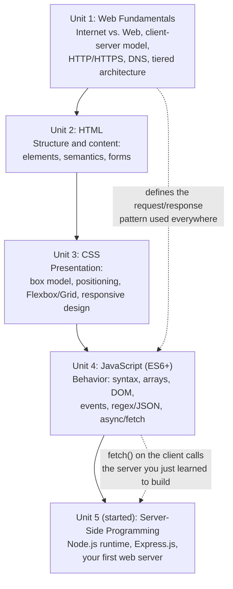

# Lecture 17: Midterm Review

This week is midterm exam week — there is no new topic to learn today. Instead, this
chapter is a **checkpoint**: a consolidated review of everything you've covered so far,
from "what is the web" all the way through your first Express server. Use it to check
which ideas feel solid and which ones need another look before the exam. It will not
re-teach every detail — for that, go back to the individual lectures linked in the
navigation — but it will remind you of the big ideas, connect them together, and give you
questions to test yourself with.

## Concept Map

Everything you've learned so far builds on what came before it. The diagram below shows
how the four units connect: web fundamentals gave you the vocabulary and the
client-server model; HTML gave you structure; CSS gave you presentation; JavaScript gave
you behavior and logic; and server-side programming (which you just started) gives that
logic a second home — on a computer you control, not just in the user's browser.

Notice the thread running through all of it: the **client-server, request-response**
model from Lecture 1 never went away. HTML and CSS build what the *client* shows.
JavaScript makes the client interactive, and (via `fetch`) lets the client talk to a
server. And now, in Unit 5, you've started writing that server yourself.

## Unit 1 Recap — Foundations of the Web

- The **Internet** is the global network; the **Web** is one service (HTML documents,
  URLs, HTTP) running on top of it. Don't confuse the two.
- The **client-server request-response model**: a client (usually a browser) sends a
  request; a server sends back a response. The server does nothing until asked.
- A **URL** breaks into scheme, host, port, path, query string, and fragment — know how
  to identify each part.
- **HTTP** defines the rules of the request/response exchange; **HTTPS** adds encryption
  (TLS). Never treat plain HTTP as safe for sensitive data.
- **DNS** translates human-readable domain names into IP addresses.
- Web standards bodies: **W3C** (HTML/CSS/accessibility), **WHATWG** (HTML Living
  Standard), **ECMA** (JavaScript/ECMAScript spec), **IETF** (HTTP, TLS, DNS via RFCs).
- Application types: **static** (same content for everyone) vs. **dynamic** (content
  varies), and **MPA** (full reload per navigation) vs. **SPA** (one page, JS updates
  content) vs. **PWA** (installable, offline-capable).
- **Tiered architecture**: separating an application into layers (commonly presentation,
  application/business logic, and data) so each layer can change independently. Know the
  difference between a **2-tier**, **3-tier**, and **n-tier** setup, and where the
  client, server, and database sit in each.

!!! warning "Common gotcha"
    Students often say "the Internet" when they mean "the Web," and confuse a **web
    server** (software) with the **physical machine** it runs on. Be precise with this
    vocabulary on the exam.

## Unit 2 Recap — Markup Languages (HTML)

- HTML elements consist of opening tags, content, and closing tags (`
text
`); some
  elements are **void** (self-closing, like `` and ` `).
- **Semantic HTML** (`<header>`, `<nav>`, `<main>`, `<article>`, `<section>`, `<footer>`)
  describes the *meaning* of content, not just its appearance — this matters for
  accessibility and SEO (search engine optimization).
- Forms (`<form>`, `<input>`, `<label>`, `<select>`, `<textarea>`, `<button>`) collect
  user input. Know the common `<input>` `type` values and form attributes like `action`
  and `method`.
- Every `<input>` should be paired with a `<label>` (via `for`/`id`) for accessibility.
- HTML5 introduced structural and multimedia elements (`<video>`, `<audio>`, `<canvas>`)
  and new input types (`email`, `date`, `number`, and others) that give the browser
  built-in validation and better mobile keyboards.

!!! warning "Common gotcha"
    "Semantic" does not mean "styled differently by default" — most semantic elements
    look like a plain `
` until you add CSS. Their value is in *meaning*, not looks.

## Unit 3 Recap — Styling with CSS

- The **box model**: every element is a content box wrapped in padding, border, and
  margin, in that order, moving outward. `box-sizing: border-box` makes width/height
  calculations include padding and border, which is usually what you want.
- **Positioning**: `static` (default), `relative` (offset from its normal spot),
  `absolute` (positioned relative to its nearest positioned ancestor), `fixed`
  (positioned relative to the viewport), and `sticky` (a hybrid that "sticks" once
  scrolled to a threshold).
- **Stacking context** and `z-index` control which elements draw on top of others —
  `z-index` only works on positioned elements (not `static`).
- CSS3 features: transitions, animations, custom properties (CSS variables), and media
  queries for responsive behavior.
- **Flexbox** is for one-dimensional layout (a row or a column); **Grid** is for
  two-dimensional layout (rows and columns together). Know the core properties of each:
  `display: flex`/`display: grid`, `justify-content`, `align-items`,
  `grid-template-columns`, and so on.
- **Responsive design**: using relative units, media queries, and flexible layouts (often
  Flexbox/Grid) so a page adapts to different screen sizes. CSS frameworks (like
  Bootstrap or Tailwind) provide pre-built responsive components and utility classes.

!!! warning "Common gotcha"
    Margin collapsing (adjacent vertical margins combining into one) and the difference
    between `justify-content` (main axis) vs. `align-items` (cross axis) in Flexbox are
    two of the most frequently missed exam points.

## Unit 4 Recap — Modern JavaScript (ES6+)

- ES6+ syntax: `let`/`const` (block-scoped, prefer these over `var`), arrow functions,
  template literals, destructuring, spread/rest operators, and classes.
- Array methods for processing data without manual loops: `map` (transform each item),
  `filter` (keep matching items), `reduce` (combine into one value), `find`,
  `forEach`, and others. These are used constantly in real-world JavaScript.
- **DOM manipulation**: selecting elements (`document.querySelector`, and similar
  methods), changing content/attributes/classes, and creating or removing elements.
- **Events**: attaching handlers with `addEventListener`, understanding the event object,
  and event bubbling/capturing (an event fired on a child element also triggers handlers
  on its ancestors, unless stopped).
- **Regular expressions** for pattern matching in strings (validation, searching,
  replacing), and **JSON** (`JSON.stringify`/`JSON.parse`) as the standard data format
  for exchanging structured data between client and server.
- **Asynchronous JavaScript**: the problem callbacks solve (and the "callback hell" they
  can cause), **promises** as a cleaner abstraction over async work, `async`/`await` as
  syntax that makes promise-based code read like synchronous code, and `fetch()` as the
  browser API for making HTTP requests from JavaScript.

!!! warning "Common gotcha"
    `async`/`await` is still promise-based under the hood — a function marked `async`
    always returns a promise, and `await` only works inside an `async` function (or at
    the top level of a module). Forgetting to `await` a promise is one of the most common
    bugs in async JavaScript.

## Unit 5 (So Far) Recap — Server-Side Programming

- **Client-side** code runs in the browser and is visible/editable by the user;
  **server-side** code runs on a machine you control and is where real security and data
  logic must live.
- **Node.js** is a JavaScript runtime (built on Chrome's V8 engine) that lets JavaScript
  run outside the browser, including on servers.
- Node.js achieves high concurrency through **non-blocking I/O** and the **event loop**,
  rather than blocking the whole program while waiting on slow operations like database
  queries.
- **npm** manages reusable packages, tracked in `package.json`, downloaded into
  `node_modules`.
- **Express.js** is a minimal Node.js web framework: `express()` creates an app,
  `app.get('/path', handler)` defines routes, and `app.listen(port)` starts the server.

## Self-Check Questions

Try answering these from memory before checking your notes. No answers are provided here
on purpose — that's the point of a self-check.

1. Explain, in your own words, the difference between the Internet and the Web.
2. Draw (or describe) the request-response cycle for a browser loading a page that
   includes one image and one stylesheet. How many separate requests happen?
3. What does DNS do, and why can't browsers just use domain names directly without it?
4. In a 3-tier architecture, name the three tiers and give one responsibility of each.
5. What is the difference between semantic HTML and non-semantic HTML? Give an example
   of each.
6. Explain the CSS box model. If an element has `width: 200px`, `padding: 10px`, and
   `border: 2px solid black`, what is its actual rendered width under the default
   `box-sizing`, versus under `box-sizing: border-box`?
7. When would you choose Flexbox over Grid, and vice versa?
8. What is the difference between `map` and `forEach`? Why would you choose one over the
   other?
9. Explain what a promise represents, and describe the three states a promise can be in.
10. Why is client-side validation alone never sufficient for security? What has to happen
    on the server as well?
11. What does "non-blocking I/O" mean, and why does it let Node.js handle many requests
    at once using a single main thread?
12. Walk through, line by line, what happens when you run `node index.js` on a basic
    Express app with one route, from process start to a browser receiving a response.

!!! tip "Study Tips"
    - Don't just re-read the lectures passively — close your notes and try to explain
      each concept above out loud, or write it from memory, then check yourself.
    - Rebuild a couple of the small code examples from scratch (from memory, not
      copy-paste) — typing out `app.get(...)` or a `.map().filter()` chain yourself
      cements it far better than reading it again.
    - Focus extra time on the "Common gotcha" boxes above — they call out the mistakes
      students make most often, which is exactly what exams tend to probe.
    - Group topics by "layer": what happens in the browser (HTML/CSS/client-side JS) vs.
      what happens on the server (Node.js/Express) — the midterm spans both, and mixing
      them up under time pressure is a common source of lost marks.
    - If a topic still feels shaky, revisit that lecture's "Try It Yourself" exercise
      and actually do it again — hands-on practice reveals gaps that re-reading hides.
