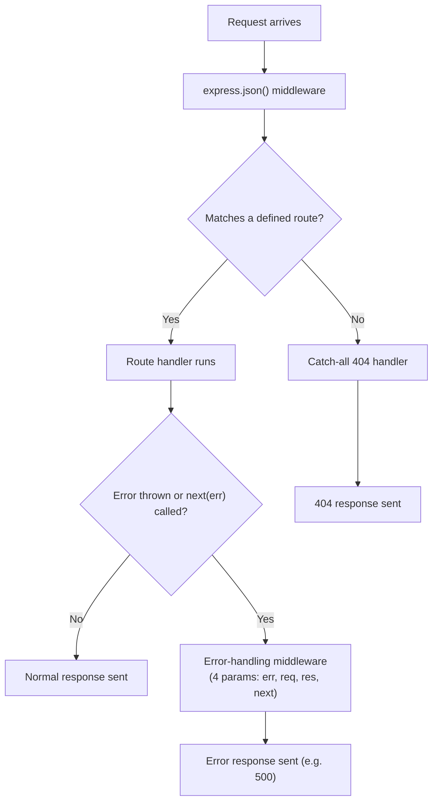

# Lecture 18: Request Handling and Routing

Your first Express server (Lecture 16) had exactly one route. Real applications have
dozens or hundreds. In this lecture, you'll learn how to read every part of an incoming
HTTP request, define routes for all the common HTTP methods, extract data from URLs and
request bodies, serve static files, and organize a growing project so it doesn't turn
into a single giant, unmanageable file.

## In This Lecture

- Break down the anatomy of an HTTP request: method, URL, headers, and body
- Define routes for GET, POST, PUT, PATCH, and DELETE
- Read route parameters and query strings from a URL
- Parse a JSON request body using the `express.json()` middleware
- Serve static files (images, CSS, client-side JS) from an Express app
- Organize routes using Express's Router, and separate route definitions from logic
- Handle unmatched routes (404) and centralize error handling

## Anatomy of an HTTP Request

Every HTTP request, no matter what it's for, has the same four parts. Understanding these
is the foundation for everything else in this lecture.

```http
POST /api/books HTTP/1.1
Host: localhost:3000
Content-Type: application/json
Accept: application/json

{"title": "Clean Code", "author": "Robert C. Martin"}
```

- **Method**: a verb that says what kind of action the client wants (`POST` above). You
  will meet all the common methods in the next section.
- **URL (path)**: which resource on the server the request is about (`/api/books` above).
- **Headers**: key-value metadata about the request — here, `Content-Type` tells the
  server "the body I'm sending you is JSON," and `Accept` tells the server "please send
  your response back as JSON too." You'll study headers in much more depth in Lecture 19.
- **Body**: the actual data being sent (only present on some requests, like `POST` or
  `PUT`) — here, the JSON describing a new book to create.

In Express, all four of these arrive bundled inside a single object your route handlers
receive: the **request object**, always named `req` by convention.

| Request part | Where to find it in Express |
|---|---|
| Method | `req.method` |
| Path | `req.path` (or `req.url`, which also includes the query string) |
| Headers | `req.headers` (e.g., `req.headers['content-type']`) |
| Body | `req.body` (requires middleware — see below) |
| Route parameters | `req.params` |
| Query string | `req.query` |

## Routing for GET, POST, PUT, PATCH, DELETE

**Routing** is the process of matching an incoming request's method and path to the code
that should handle it. Express gives you one method per HTTP verb, each taking a path and
a handler function.

The five methods you'll use constantly:

| Method | Typical purpose | Example |
|---|---|---|
| `GET` | Read/fetch data. Should never change anything on the server. | Fetch a list of books |
| `POST` | Create something new. | Add a new book |
| `PUT` | Replace an existing resource entirely. | Overwrite a book's full record |
| `PATCH` | Partially update an existing resource. | Change only a book's price |
| `DELETE` | Remove a resource. | Delete a book |

```javascript
const express = require('express');
const app = express();

// GET — fetch all books
app.get('/api/books', (req, res) => {
  res.send('Here is the list of all books');
});

// POST — create a new book
app.post('/api/books', (req, res) => {
  res.send('A new book was created');
});

// PUT — fully replace a book with the given id
app.put('/api/books/:id', (req, res) => {
  res.send(`Book ${req.params.id} was fully replaced`);
});

// PATCH — partially update a book with the given id
app.patch('/api/books/:id', (req, res) => {
  res.send(`Book ${req.params.id} was partially updated`);
});

// DELETE — remove a book with the given id
app.delete('/api/books/:id', (req, res) => {
  res.send(`Book ${req.params.id} was deleted`);
});

app.listen(3000, () => console.log('Server running on port 3000'));
```

!!! note
    Notice that the **same path** (`/api/books/:id`) can have completely different
    handlers depending on the **method**. Express matches on the combination of method
    *and* path together, not the path alone. This pairing — a method plus a path — is
    often called an **endpoint**.

!!! tip
    `GET` requests should be **safe**: calling them should never change data on the
    server (no creating, updating, or deleting). This isn't enforced by the language —
    it's a convention that other developers, browsers, and tools all rely on. Breaking it
    (for example, deleting something on a `GET` request) can cause surprising bugs, since
    browsers may pre-fetch or cache `GET` requests.

## Route Parameters and Query Strings

Two different ways of getting extra information out of a URL, and it's important not to
confuse them.

**Route parameters** are named placeholders built into the path itself, marked with a
colon (`:`). They identify *which* specific resource you mean.

```javascript
// URL: /api/books/42
app.get('/api/books/:id', (req, res) => {
  console.log(req.params.id); // "42"
  res.send(`You asked for book number ${req.params.id}`);
});
```

You can have more than one parameter in a single route:

```javascript
// URL: /api/authors/12/books/42
app.get('/api/authors/:authorId/books/:bookId', (req, res) => {
  console.log(req.params.authorId); // "12"
  console.log(req.params.bookId);   // "42"
});
```

**Query strings** are the optional `?key=value` pairs at the end of a URL. They are
typically used for things like filtering, sorting, or pagination — options that modify a
request without identifying a specific resource.

```javascript
// URL: /api/books?genre=fiction&sort=title&page=2
app.get('/api/books', (req, res) => {
  console.log(req.query.genre); // "fiction"
  console.log(req.query.sort);  // "title"
  console.log(req.query.page);  // "2" (always a string, even if it looks numeric!)
  res.send('Filtered book list');
});
```

!!! warning
    Everything coming from `req.params` and `req.query` arrives as a **string**, even if
    it looks like a number. `req.query.page` is `"2"`, not `2`. If you need a number,
    convert it explicitly: `Number(req.query.page)` or `parseInt(req.query.page, 10)`.

| | Route parameter | Query string |
|---|---|---|
| Syntax | `/books/:id` → `/books/42` | `/books?genre=fiction` |
| Purpose | Identifies a specific resource | Filters/modifies a request |
| Required? | Usually required to match the route at all | Usually optional |
| Access in Express | `req.params` | `req.query` |

## Parsing the Request Body with `express.json()`

For `POST`, `PUT`, and `PATCH` requests, the client usually sends data in the request
body — most commonly as **JSON**. But by default, Express does **not** automatically read
and parse that body for you; `req.body` would be `undefined` without extra setup.

**Middleware** is a function that runs *during* the request-response cycle, before your
route handler, typically to inspect or transform the request (or response) in some way.
Express ships with a built-in middleware, `express.json()`, that reads an incoming
request body, parses it as JSON, and attaches the result to `req.body`.

```javascript
const express = require('express');
const app = express();

// Register the middleware — apply it to every incoming request
app.use(express.json());

app.post('/api/books', (req, res) => {
  console.log(req.body); // { title: "Clean Code", author: "Robert C. Martin" }
  const { title, author } = req.body;
  res.status(201).send(`Created "${title}" by ${author}`);
});

app.listen(3000);
```

`app.use(...)` registers middleware that runs for (by default) *every* incoming request,
*before* Express tries to match it to a route. You must call `app.use(express.json())`
before any route handler that expects to read `req.body`.


!!! warning
    If you forget `app.use(express.json())` and the client sends a JSON body,
    `req.body` will be `undefined`, and trying to destructure it (like
    `const { title } = req.body`) will throw an error. This is one of the most common
    beginner mistakes with Express — if `req.body` seems empty, check this first.

## Serving Static Files

Not everything a server sends back needs to be generated by your own code. **Static
files** are files that don't change per-request — images, CSS stylesheets, client-side
JavaScript bundles, and so on. Express has a built-in middleware,
`express.static()`, that serves an entire folder of files automatically.

```javascript
// Serve everything inside the "public" folder directly
app.use(express.static('public'));
```

With a project structure like this:

```text
my-project/
├── index.js
└── public/
    ├── logo.png
    └── style.css
```

A request to `/logo.png` will automatically be served from `public/logo.png` — you don't
need to write a route for it yourself. Express handles matching the URL to the file.

## Organizing Routers and Controllers

As an app grows past a handful of routes, keeping everything in one file (usually
`index.js` or `app.js`) becomes hard to manage. Express solves this with `express.Router`
— a mini, standalone version of an Express app that you can define in a separate file and
then plug into your main app.

A common pattern splits each resource into two files:

- A **router** file: defines the URL paths and methods, and which function handles each.
- A **controller** file: contains the actual logic for each handler function.

```javascript title="routes/books.js"
const express = require('express');
const router = express.Router();
const booksController = require('../controllers/booksController');

router.get('/', booksController.getAllBooks);
router.get('/:id', booksController.getBookById);
router.post('/', booksController.createBook);

module.exports = router;
```

```javascript title="controllers/booksController.js"
exports.getAllBooks = (req, res) => {
  res.send('List of all books');
};

exports.getBookById = (req, res) => {
  res.send(`Book with id ${req.params.id}`);
};

exports.createBook = (req, res) => {
  res.status(201).send(`Created book: ${req.body.title}`);
};
```

```javascript title="index.js"
const express = require('express');
const app = express();
const booksRouter = require('./routes/books');

app.use(express.json());
app.use('/api/books', booksRouter); // mount the router at this path prefix

app.listen(3000);
```

`app.use('/api/books', booksRouter)` **mounts** the router at that path prefix. Inside
`routes/books.js`, `router.get('/:id', ...)` therefore actually handles
`GET /api/books/:id` — the prefix is added automatically. This separation — routers for
"what path/method maps to what," controllers for "what actually happens" — keeps each
file focused and much easier to navigate as your project grows.

## 404 and Centralized Error Routes

What happens if a client requests a path that doesn't match *any* of your routes? Express
needs to be told explicitly what to do — otherwise it sends a generic, unhelpful default
response.

**Handling unmatched routes (404):** place a catch-all handler **after** all your other
routes. Because Express checks routes in the order they're defined, this only runs if
nothing above it matched.

```javascript
// ...all your real routes go above this...

app.use((req, res) => {
  res.status(404).send('Sorry, that page was not found.');
});
```

**Centralized error handling:** instead of writing `try/catch` and custom error responses
in every single route handler, Express supports a special kind of middleware — an
**error-handling middleware** — that catches errors from anywhere in your app in one
place. You recognize it because it takes **four** parameters instead of the usual two or
three, with `err` first:

```javascript
app.get('/api/books/:id', (req, res, next) => {
  try {
    if (req.params.id === '0') {
      throw new Error('Invalid book id');
    }
    res.send(`Book ${req.params.id}`);
  } catch (err) {
    next(err); // pass the error along to the error-handling middleware
  }
});

// Error-handling middleware — must be defined LAST, after all other app.use()/routes
app.use((err, req, res, next) => {
  console.error(err.stack);
  res.status(500).send('Something went wrong on our end.');
});
```

Calling `next(err)` skips all remaining normal routes/middleware and jumps straight to
the nearest error-handling middleware. This gives you **one** place to log errors and
format error responses consistently, instead of repeating that logic everywhere.



!!! tip
    Route and middleware **order matters** in Express. Middleware and routes are checked
    top-to-bottom in the order you register them with `app.use()`/`app.get()`/etc. Your
    404 handler and error-handling middleware must always come **last**, or they'll
    swallow requests meant for routes defined below them.

## Try It Yourself

1. Build a small Express app with an in-memory array of "tasks" (each with an `id` and a
   `title`). Implement `GET /api/tasks` (list all), `GET /api/tasks/:id` (get one, using
   a route parameter), and `POST /api/tasks` (create one, reading `title` from
   `req.body` — remember to add `express.json()` middleware). Test each route using your
   browser (for `GET`) and a tool like Postman, Insomnia, or `curl` (for `POST`).
2. Add a 404 handler that returns a friendly JSON message
   (`res.status(404).json({ error: 'Not found' })`) for any unmatched route, and an
   error-handling middleware that logs the error and returns a `500` response. Then add
   a query string option to `GET /api/tasks`, such as `?completed=true`, and use
   `req.query` inside the handler to filter the returned list.

## Key Takeaways

- Every HTTP request has a **method**, **URL/path**, **headers**, and (optionally) a
  **body** — Express exposes all of these on the `req` object.
- Express provides one method per HTTP verb: `app.get()`, `app.post()`, `app.put()`,
  `app.patch()`, `app.delete()` — routing matches on method **and** path together.
- **Route parameters** (`req.params`, from `:name` in the path) identify a specific
  resource; **query strings** (`req.query`, from `?key=value`) filter or modify a
  request. Both always arrive as strings.
- `express.json()` middleware must be registered with `app.use()` before your routes can
  read a JSON request body via `req.body`.
- `express.static('folderName')` serves static files (images, CSS, client JS) directly,
  without you writing individual routes for them.
- `express.Router()` lets you split routes into separate files, typically paired with
  **controller** functions that hold the actual logic — this keeps larger projects
  organized.
- Route/middleware order matters: register a catch-all **404 handler** and a **4-argument
  error-handling middleware** last, after all your real routes.
