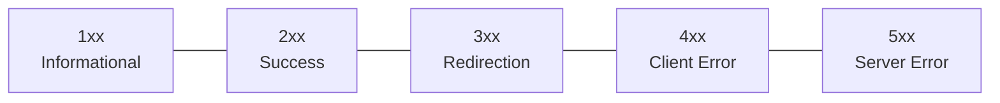
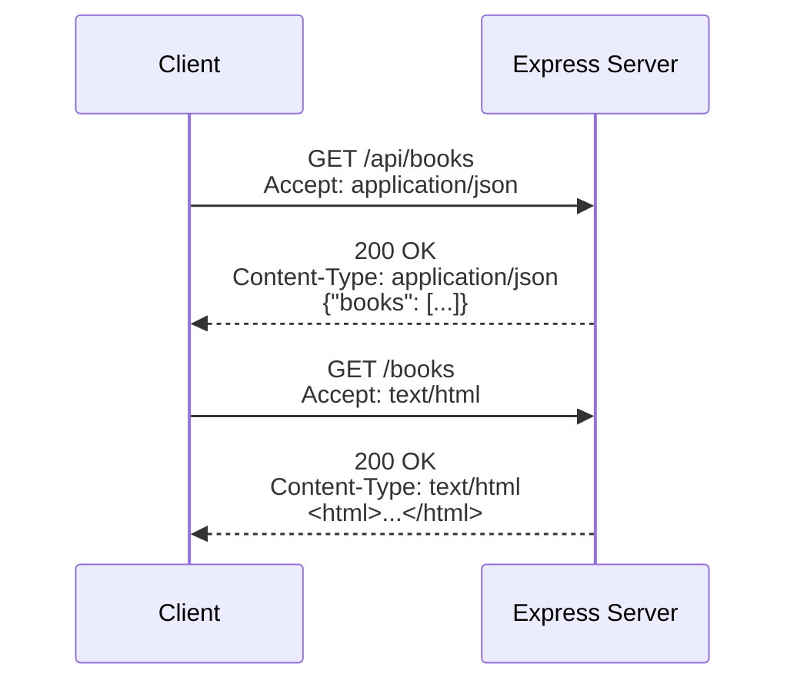

# Lecture 19: HTTP Status Codes and Common Headers

Every HTTP response carries a three-digit **status code** that summarizes what happened,
plus a set of **headers** that carry metadata about the request or response. Reading
these correctly — and setting them correctly in your own Express routes — is one of the
most important skills for building a server that behaves the way clients (browsers, other
servers, mobile apps) expect. This lecture is your reference guide to both.

## In This Lecture

- Understand the five status code families (1xx–5xx) and what each broadly means
- Learn the exact meaning and correct use of the most common specific status codes
- Identify key request headers: `Accept`, `Content-Type`, `Authorization`, `User-Agent`
- Identify key response headers: `Content-Type`, `Cache-Control`, `Set-Cookie`, `Location`
- Understand content negotiation — how client and server agree on a response format

## Status Code Families

An HTTP **status code** is a three-digit number sent at the start of every response,
telling the client, at a glance, what kind of outcome occurred. The *first digit*
determines which of five families it belongs to.



| Family | Meaning | Who is usually "at fault"? |
|---|---|---|
| **1xx** Informational | The request was received and understood; processing continues. Rare to see directly in typical web app code. | — |
| **2xx** Success | The request was received, understood, and accepted successfully. | — |
| **3xx** Redirection | Further action is needed to complete the request, usually following a different URL. | — |
| **4xx** Client Error | The request contains bad syntax, invalid data, or cannot be fulfilled because of something the *client* did wrong. | Client |
| **5xx** Server Error | The server failed to fulfill a request that was otherwise valid — something went wrong on the *server's* side. | Server |

!!! note
    A useful habit: 4xx means "look at what the client sent" (a bad request, a missing
    field, an unauthenticated user). 5xx means "look at your server code" (an unhandled
    exception, a database that's down, a bug). This distinction guides where you start
    debugging.

In Express, you set a status code with `res.status(code)`, chained before you send the
actual response body:

```javascript
res.status(201).json({ message: 'Book created successfully' });
```

If you never call `.status()`, Express defaults to `200`.

## Common Specific Status Codes

You will use a fairly small set of specific codes constantly. Know each one's exact
meaning — using the wrong code is a common and confusing mistake.

| Code | Name | When to use it |
|---|---|---|
| **200** | OK | The default success code — the request succeeded and a response body is included. Used for successful `GET`, `PUT`, `PATCH` requests. |
| **201** | Created | A new resource was successfully created — the standard response to a successful `POST` that creates something. Often paired with a `Location` header pointing to the new resource. |
| **204** | No Content | The request succeeded, but there is no body to send back. Common for a successful `DELETE`, where there's nothing left to return. |
| **301 / 302** | Moved Permanently / Found | The resource has moved to a different URL. `301` says "permanently — update your bookmarks/links"; `302` says "temporarily — this might change back." The new location is given in the `Location` header. |
| **400** | Bad Request | The server can't understand or process the request because the client sent something malformed — e.g. broken JSON, or a required field missing. |
| **401** | Unauthorized | The client did not provide valid authentication credentials (despite the name, this is really about *authentication*, not authorization). "You need to log in." |
| **403** | Forbidden | The client is authenticated, but is not allowed to perform this action. "I know who you are, but you can't do this." |
| **404** | Not Found | No resource exists at the requested URL. |
| **409** | Conflict | The request conflicts with the resource's current state — e.g. trying to create a user with an email that's already taken. |
| **422** | Unprocessable Entity | The request was well-formed (valid JSON, etc.) but failed validation rules — e.g. an `email` field that isn't a valid email format. |
| **500** | Internal Server Error | A generic "something broke on the server" — typically an unhandled exception or bug. |

!!! warning "401 vs. 403 — a very common mix-up"
    **401 Unauthorized** really means "I don't know who you are" (not logged in, missing
    or invalid credentials). **403 Forbidden** means "I know who you are, but you're not
    allowed to do this" (logged in, but insufficient permissions — e.g. a regular user
    trying to access an admin-only route). Many students use them interchangeably; exams
    and real APIs do not treat them as the same thing.

!!! warning "400 vs. 422"
    **400** typically means the request itself is malformed at a structural level (broken
    JSON, wrong content type). **422** means the request was structurally fine and
    understood, but the *data* inside it fails validation (e.g. `age: -5`, or a missing
    required field with otherwise valid JSON). Not every framework/API distinguishes
    these strictly — some just use `400` for both — but you should understand the
    difference conceptually.

Here's how a few of these look in Express route handlers:

```javascript
app.post('/api/books', (req, res) => {
  const { title, author } = req.body;

  if (!title || !author) {
    return res.status(400).json({ error: 'title and author are required' });
  }

  // ... imagine we save the book here ...
  const newBook = { id: 101, title, author };

  res.status(201)
     .location(`/api/books/${newBook.id}`)
     .json(newBook);
});

app.delete('/api/books/:id', (req, res) => {
  // ... imagine we delete the book here ...
  res.status(204).send(); // success, nothing to return
});

app.get('/api/books/:id', (req, res) => {
  const book = null; // imagine we looked it up and found nothing
  if (!book) {
    return res.status(404).json({ error: 'Book not found' });
  }
  res.status(200).json(book);
});
```

## Request Headers

**Headers** are key-value pairs of metadata sent along with a request or response — extra
information that isn't part of the "main content," but that the client or server needs to
process the message correctly. Request headers describe what the client is sending and
what it expects back.

| Header | Purpose |
|---|---|
| **Accept** | Tells the server which content type(s) the client can handle in the response, e.g. `Accept: application/json`. |
| **Content-Type** | Tells the server what format the *request body* is in, e.g. `Content-Type: application/json`. This is what `express.json()` checks before trying to parse `req.body`. |
| **Authorization** | Carries credentials proving who the client is, e.g. `Authorization: Bearer <token>`. You will use this heavily once you cover authentication in a later lecture. |
| **User-Agent** | Identifies the client software making the request — e.g. which browser and operating system, or that the request came from a tool like `curl`. |

In Express, you can read any request header through `req.headers` (all lowercase keys)
or the convenience method `req.get('HeaderName')`:

```javascript
app.get('/api/books', (req, res) => {
  console.log(req.headers['user-agent']);
  console.log(req.get('Accept'));
  res.send('ok');
});
```

## Response Headers

Response headers describe the response itself — what format it's in, how it should be
cached, or where to find something else.

| Header | Purpose |
|---|---|
| **Content-Type** | Tells the client what format the response body is in, e.g. `Content-Type: application/json` or `text/html`. Express sets this automatically based on which method you call (`res.json()` sets it to JSON; `res.send()` guesses based on what you pass it). |
| **Cache-Control** | Tells the client (and any intermediate caches) how long a response may be reused before it must be re-fetched, e.g. `Cache-Control: no-store` (never cache) or `Cache-Control: max-age=3600` (reusable for one hour). |
| **Set-Cookie** | Instructs the client's browser to store a cookie. You'll study this in detail in the next lecture on cookies and sessions. |
| **Location** | Used with `3xx` redirects and `201 Created` responses to point to the relevant URL — where the resource moved to, or where the newly created resource now lives. |

```javascript
app.get('/api/report', (req, res) => {
  res.set('Cache-Control', 'no-store'); // never cache this response
  res.json({ generatedAt: new Date().toISOString() });
});

app.get('/old-path', (req, res) => {
  res.redirect(301, '/new-path'); // sets status 301 + Location header automatically
});
```

## Content Negotiation

**Content negotiation** is the process by which a client and server agree on the best
format for a response, when more than one format is available. The client states its
preferences using the `Accept` header, and the server decides how to respond based on
that (and on what it's actually able to produce).

For example, a browser navigating directly to a URL sends
`Accept: text/html,application/xhtml+xml,...`, hoping for an HTML page back. A JavaScript
app calling your API with `fetch` might instead send `Accept: application/json`, expecting
raw data rather than a full page.



Express provides `res.format()` to respond differently depending on what the client
requested via `Accept`:

```javascript
app.get('/books', (req, res) => {
  res.format({
    'application/json': () => {
      res.json({ books: ['Clean Code', 'The Pragmatic Programmer'] });
    },
    'text/html': () => {
      res.send('<h1>Books</h1><ul><li>Clean Code</li></ul>');
    },
    default: () => {
      res.status(406).send('Not Acceptable'); // format the server can't provide
    }
  });
});
```

!!! tip
    Even without `res.format()`, you are performing a simpler form of content negotiation
    every time you choose `res.json()` versus `res.send()` versus `res.render()` (for
    HTML templates, covered in a later lecture) — you are deciding, on the server side,
    what format to return. Full content negotiation just makes that decision dynamic,
    based on what the specific client asked for.

## Try It Yourself

1. Build an Express route `GET /api/users/:id` backed by a small hardcoded array of
   users. If the `id` doesn't match any user, respond with `404` and a JSON error
   message. If it matches, respond with `200` and the user's data. Test both cases with
   your browser or `curl`, and use your browser's Network tab (or `curl -i`) to confirm
   the actual status code returned.
2. Add a `POST /api/users` route that validates the incoming `req.body` has both a `name`
   and an `email` field. Return `400` if either is missing. Then add a check that the
   `email` isn't already used by an existing user in your array, returning `409` if it
   is. Finally, on success, return `201` with a `Location` header pointing to the new
   user's URL.

## Key Takeaways

- Status codes fall into five families by their first digit: **1xx** informational,
  **2xx** success, **3xx** redirection, **4xx** client error, **5xx** server error.
- Know the exact use of **200, 201, 204, 301/302, 400, 401, 403, 404, 409, 422, and 500**
  — especially the difference between **401** (not authenticated) and **403** (not
  authorized), and between **400** (malformed request) and **422** (failed validation).
- Key **request headers**: `Accept` (what the client wants back), `Content-Type` (what
  format the request body is in), `Authorization` (credentials), `User-Agent` (identifies
  the client software).
- Key **response headers**: `Content-Type` (format of the response), `Cache-Control`
  (caching rules), `Set-Cookie` (store a cookie on the client), `Location` (where to find
  a redirected or newly created resource).
- **Content negotiation** lets a client and server agree on a response format using the
  `Accept` header; Express supports this via `res.format()`.
- Set status codes explicitly in Express with `res.status(code)`, and always choose the
  code that most accurately describes what happened — precision here makes your API much
  easier for other developers (and your future self) to use correctly.
