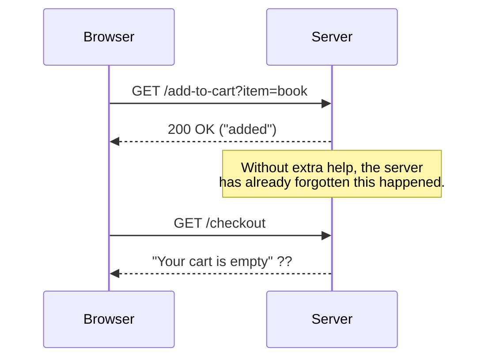
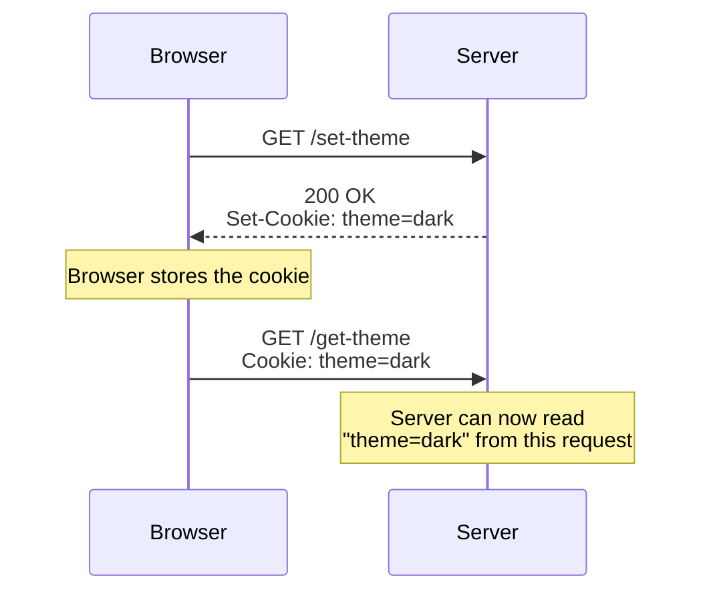
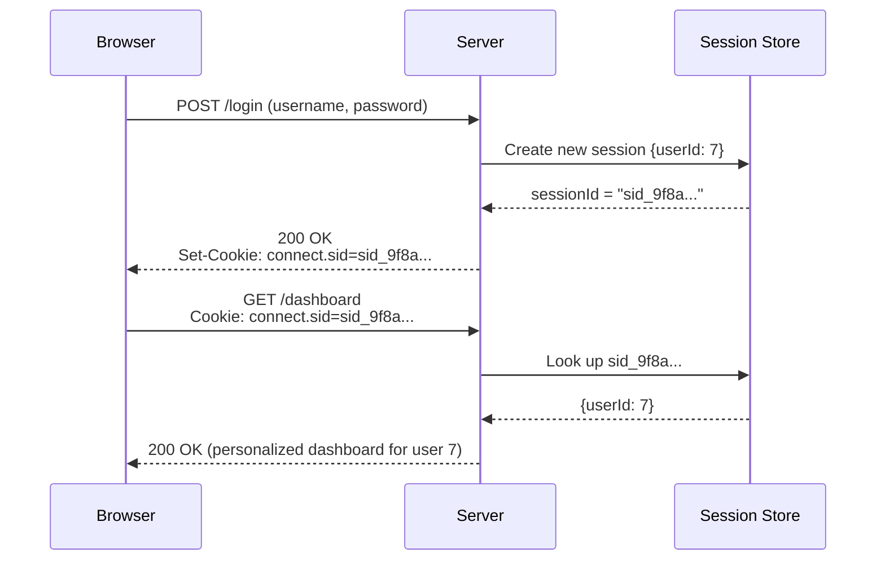
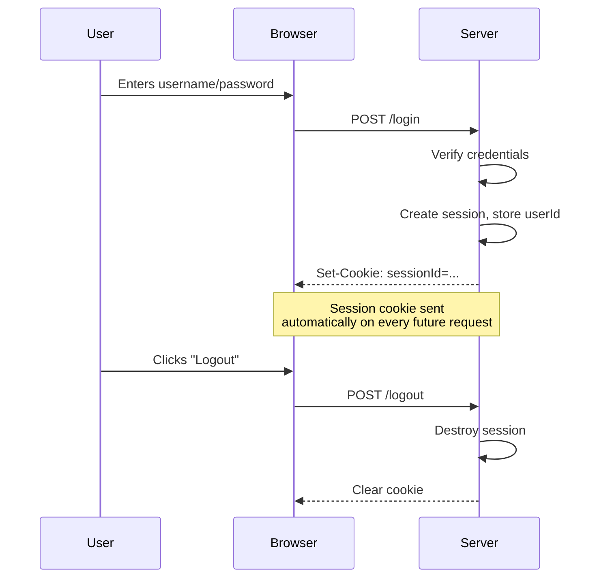

# Lecture 20: Cookies and Sessions

HTTP has a strange property: it forgets everything between requests. Every single request
your server receives is treated as if it's from a total stranger, even if that same
browser sent a request one second ago. Yet real applications clearly *do* remember you —
they keep you logged in, remember what's in your cart, and recognize your preferences.
This lecture explains the mechanisms — cookies and sessions — that make that possible.

## In This Lecture

- Understand why HTTP is stateless, and why applications need a way to manage state
- Learn how cookies are created and understand their key attributes
- Learn how sessions work: session identifiers and server-side session stores
- Compare session-based state management with pure cookie-based state
- Walk through a full login/logout flow, including session expiry
- Understand basic security considerations for cookies and sessions

## The Statelessness of HTTP

**Stateless** means that each request is handled with no memory of any previous request.
When your server receives an HTTP request, it does not automatically know if this is the
first request this visitor has ever made, or their fiftieth. Each request stands
completely alone — the server sees only what's inside that one request, nothing more.

This might sound like a bug, but it's actually intentional, and it's one of the reasons
the web scales so well: a stateless server doesn't need to keep track of every visitor
that's ever contacted it, so it can handle enormous numbers of requests, from enormous
numbers of clients, without needing to store per-client information for each one.

But it creates an obvious problem. Think about a shopping cart: you add an item on one
page, then navigate to another page to keep shopping. Each of those is a *separate* HTTP
request. If the server truly remembers nothing between them, how does it know your cart
still has that item in it when you check out?



The answer is **state management**: some mechanism that lets a stateless protocol *feel*
stateful by carrying identifying information along with each request, so the server can
connect separate requests together as belonging to the same visitor. The two main tools
for this are **cookies** and **sessions**, which you'll often use together.

## Cookies

A **cookie** is a small piece of data (a simple key-value pair, generally limited to
about 4KB) that a server asks a browser to store, and that the browser then automatically
sends back with every subsequent request to that same server. Cookies are the basic
building block that makes state management possible on the web.

### Creating a Cookie

A server creates a cookie by including a `Set-Cookie` response header (which you met
briefly in Lecture 19). The browser sees this header, stores the cookie, and from then on
automatically attaches it to every future request to that server, without you writing any
extra client-side code.

```javascript
app.get('/set-theme', (req, res) => {
  res.cookie('theme', 'dark'); // sets a Set-Cookie header for you
  res.send('Theme preference saved!');
});

app.get('/get-theme', (req, res) => {
  console.log(req.cookies); // reading cookies requires the cookie-parser middleware
  res.send('Check the server console for your saved theme.');
});
```

!!! note
    Express does not parse incoming cookies into `req.cookies` by default — you need the
    small `cookie-parser` middleware package (`npm install cookie-parser`, then
    `app.use(require('cookie-parser')())`) to read cookies sent by the browser. Setting
    cookies with `res.cookie()`, however, works out of the box.



### Cookie Attributes

When setting a cookie, you can attach several **attributes** that control its behavior.
These matter a great deal, both for correctness and for security.

| Attribute | Meaning |
|---|---|
| **Expires** (or `Max-Age`) | When the cookie should be deleted. Without this, a cookie is a **session cookie** — it disappears when the browser closes. With it, a cookie is **persistent** — it survives until the given date (or, with `Max-Age`, for that many seconds). |
| **Path** | Restricts the cookie to only be sent for requests under a specific path, e.g. `Path=/admin` means it's only sent for URLs starting with `/admin`. |
| **HttpOnly** | Prevents client-side JavaScript from reading the cookie (via `document.cookie`). Strongly recommended for any cookie holding sensitive data, like a session identifier — it blocks a common attack (cross-site scripting, or XSS) from stealing it. |
| **Secure** | The cookie is only ever sent over HTTPS, never over plain, unencrypted HTTP. Always use this in production. |
| **SameSite** | Controls whether the cookie is sent along with requests that originate from a *different* website. `Strict` (never sent cross-site), `Lax` (sent for some safe cross-site navigation, the common default), or `None` (always sent cross-site, requires `Secure`). This is a major defense against a certain kind of attack (cross-site request forgery, or CSRF). |

```javascript
app.get('/login', (req, res) => {
  res.cookie('sessionId', 'abc123', {
    maxAge: 24 * 60 * 60 * 1000, // 24 hours, in milliseconds
    httpOnly: true,
    secure: true,     // only sent over HTTPS
    sameSite: 'lax'
  });
  res.send('Logged in!');
});
```

!!! warning
    A cookie **without** `HttpOnly` can be read (and stolen) by any JavaScript running on
    the page — including malicious injected scripts. Any cookie that identifies a logged-
    in user (like a session ID) should always be set with `HttpOnly: true`.

## Sessions

Storing data directly inside a cookie works for small, non-sensitive values (like a theme
preference), but it has real limits: cookies are capped around 4KB, they're visible to
(and can be tampered with by) the user unless specially protected, and you generally don't
want to store sensitive data like "this user is an admin" directly on the client, where it
could be read or modified.

**Sessions** solve this by flipping the approach: instead of storing the actual data in
the cookie, the server stores the data itself, and the cookie only holds a **session
identifier** — a random, unique, hard-to-guess string that acts as a lookup key.

- The **session identifier (session ID)** is generated by the server and sent to the
  browser as a cookie.
- The actual session data (who's logged in, cart contents, and so on) lives in a
  **session store** on the server — this could be as simple as an in-memory JavaScript
  object for testing, though real applications use a database or a fast in-memory data
  store like Redis, so sessions survive a server restart and work across multiple server
  instances.
- On every request, the browser sends back the session ID cookie; the server looks up
  that ID in its session store to retrieve the associated data.



A common package for this in Express is `express-session`:

```javascript
const express = require('express');
const session = require('express-session');
const app = express();
app.use(express.json());

app.use(session({
  secret: 'a-long-random-secret-string', // used to sign the session ID cookie
  resave: false,
  saveUninitialized: false,
  cookie: {
    httpOnly: true,
    secure: false,       // set true in production (requires HTTPS)
    maxAge: 30 * 60 * 1000 // 30 minutes
  }
}));

app.post('/login', (req, res) => {
  // (In a real app: verify username/password against a database first.)
  req.session.userId = 7;
  req.session.username = req.body.username;
  res.send('Logged in!');
});

app.get('/dashboard', (req, res) => {
  if (!req.session.userId) {
    return res.status(401).send('Please log in first.');
  }
  res.send(`Welcome back, ${req.session.username}!`);
});

app.post('/logout', (req, res) => {
  req.session.destroy(() => {
    res.send('Logged out.');
  });
});

app.listen(3000);
```

`express-session` handles the mechanics for you: it generates a session ID, sets the
cookie, creates a `req.session` object you can freely read and write on each request, and
looks up the right session automatically based on the incoming cookie.

### Session-Based vs. Cookie-Based State

| | Cookie-based state (data in the cookie) | Session-based state (ID in the cookie, data on server) |
|---|---|---|
| Where the actual data lives | In the browser (inside the cookie itself) | On the server (in the session store) |
| Size limit | Small (~4KB total per cookie) | Effectively unlimited — server-side storage |
| Can the user tamper with it? | Yes, unless cryptographically signed | No — the user only holds an opaque ID, not the data |
| Server needs storage? | No | Yes (memory, database, or Redis) |
| Good for | Small, low-sensitivity values (theme, language preference) | Anything sensitive or substantial (login state, cart, permissions) |

!!! tip
    You will sometimes hear about **signed cookies**, which are a middle ground: the
    actual data still sits in the cookie, but it's cryptographically signed so the server
    can detect if the user tampered with it. This adds tamper-detection but not secrecy
    — the data is still visible to the user, just not (undetectably) editable. It's still
    not the right choice for genuinely secret data.

## Login/Logout Flow, Expiry, and Security

Putting it together, a typical login/logout flow looks like this:

1. **Login**: the user submits credentials (username/password) to a login route.
2. The server verifies the credentials (checking against a database — you'll cover this
   properly once you reach database connectivity in a later lecture).
3. If valid, the server creates a new session, stores relevant data in it (like the
   user's ID), and sends the session ID back as a cookie.
4. **Authenticated requests**: on every subsequent request, the browser automatically
   attaches the session cookie. The server looks up the session and, if it finds one,
   treats the request as coming from that logged-in user.
5. **Logout**: the user hits a logout route, which destroys the session on the server
   (and typically clears the cookie on the client too). Even if someone else obtained
   that old cookie afterward, it would no longer correspond to a valid session.
6. **Expiry**: sessions should not last forever. Using `maxAge` on the cookie (as shown
   above) makes the browser stop sending it after a set time; well-built session stores
   also expire the *server-side* data independently, so an old session can't be revived
   even by resending an old cookie.



**Basic security considerations:**

- Always set `HttpOnly` on session cookies, so client-side JavaScript can never read the
  session ID — this closes off a major theft vector (XSS).
- Always use `Secure` (and HTTPS) in production, so the session ID is never sent in
  plain, readable text over the network.
- Set a reasonable `SameSite` value and a reasonable `maxAge` — sessions that never
  expire are a standing security risk, especially on a shared or public computer.
- Always **destroy the session on logout**, on the server side, not just by clearing the
  cookie in the browser — otherwise, an attacker who somehow captured the old cookie
  value could still use it after the user thought they logged out.
- Never store highly sensitive raw data (like plaintext passwords) inside a session,
  even server-side — only store what you actually need to identify and authorize the
  user, such as a user ID.

## Try It Yourself

1. Build a small Express app using `express-session`. Create a `POST /login` route that
   accepts a `username` in the request body and stores it in `req.session`, and a
   `GET /me` route that returns the current session's username, or a `401` if no session
   exists. Test the flow using a tool like `curl` with cookie support (`curl -c cookies.txt`
   and `curl -b cookies.txt`) or Postman, which handles cookies automatically between
   requests.
2. Add a `POST /logout` route that destroys the session. Confirm that calling `GET /me`
   after logout correctly returns `401` again. Then set the session cookie's `maxAge` to
   a very short value (e.g. 10 seconds), wait past that time, and confirm that `GET /me`
   also returns `401` once the session has expired — even without calling logout.

## Key Takeaways

- HTTP is **stateless**: each request is handled independently, with no built-in memory
  of previous requests from the same client.
- A **cookie** is a small piece of data the server asks the browser to store and resend
  automatically on future requests, set via the `Set-Cookie` header.
- Key cookie attributes: **Expires/Max-Age** (lifetime), **Path** (scope), **HttpOnly**
  (blocks client-side JS access), **Secure** (HTTPS only), and **SameSite** (controls
  cross-site sending).
- A **session** keeps the actual data on the server (in a **session store**) and uses a
  **session identifier**, held in a cookie, as the lookup key — this is safer and more
  flexible than storing sensitive data directly in a cookie.
- Session-based state suits sensitive or large data; pure cookie-based state suits small,
  low-sensitivity values like a UI preference.
- A login/logout flow creates a session at login, checks it on each authenticated
  request, and destroys it at logout — and sessions should always have a defined expiry.
- Always combine `HttpOnly`, `Secure`, and a sensible `SameSite` setting on cookies that
  carry session identifiers, and always destroy sessions server-side on logout.
