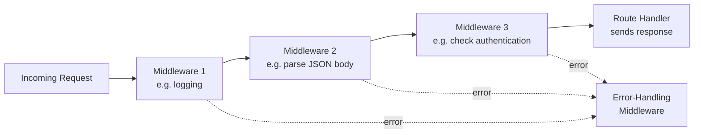

# Lecture 21: Middleware

You already know how to write a basic Express route: a path, an HTTP method, and a
handler function that sends a response. But almost every real application needs to do
things *before* that handler runs — check whether the user is logged in, parse the body
of an incoming request, log what happened, or handle errors in one central place. This
lecture introduces **middleware**, the mechanism Express gives you to do exactly that.

## In This Lecture

- Understand the middleware concept and how requests flow through a pipeline
- Learn the `(req, res, next)` function signature every middleware follows
- Distinguish application-level, router-level, and error-handling middleware
- Use built-in Express middleware (`express.json`, `express.static`) and popular
  third-party middleware (`morgan`, `cors`)
- Write your own custom middleware function

## What Is Middleware?

A **middleware function** is simply a function that sits *in the middle* of the request
and the final response. Express runs a chain of these functions, one after another, for
every incoming request. Each function can:

- Run any code it wants (read data, check permissions, log information)
- Change the `req` (request) or `res` (response) objects
- End the request-response cycle by sending a response
- Pass control to the *next* function in the chain

Think of it like an airport security line: your bag doesn't go straight from the check-in
desk to the plane. It passes through several stations — ticket check, X-ray scanner,
manual inspection — each one either lets it through to the next station or stops it there
(if something is wrong). Express middleware works the same way: every request passes
through a chain of stations before it reaches its final handler.



!!! note
    This chain is often called the **request/response pipeline** — a series of stages
    the request flows through, in order, until something sends a response.

## The `(req, res, next)` Signature

Every regular middleware function in Express has the same shape: three parameters.

```javascript
function myMiddleware(req, res, next) {
  // req  -> the incoming request object (headers, body, params, etc.)
  // res  -> the response object you can use to send data back
  // next -> a function you call to hand control to the next middleware
  console.log(`${req.method} ${req.url}`);
  next(); // IMPORTANT: without this, the request stops here forever
}
```

The `next` parameter is the key idea. Calling `next()` tells Express "I'm done, move on
to whichever middleware or route handler comes next in the chain." If you forget to call
`next()` — and you also don't send a response — the client's browser will simply hang,
waiting forever for a reply that never comes.

!!! warning
    A middleware function must **always** either call `next()` or end the response
    (with `res.send()`, `res.json()`, `res.end()`, etc.). Doing neither is one of the
    most common bugs beginners hit with Express — the request just times out.

You register (or "mount") middleware using `app.use()`:

```javascript
const express = require("express");
const app = express();

app.use(function (req, res, next) {
  console.log(`${req.method} ${req.url}`);
  next();
});

app.get("/", (req, res) => {
  res.send("Home page");
});

app.listen(3000);
```

Every request — no matter which route it eventually matches — passes through the logging
middleware first, because it was registered with `app.use()` before the routes.

!!! tip
    **Order matters.** Express runs middleware in the exact order you register it. A
    middleware registered after your routes will never run for requests that were
    already handled by an earlier route.

## Application-Level Middleware

**Application-level middleware** is bound directly to the `app` object using `app.use()`
or `app.get()`/`app.post()`/etc. It can apply to *every* request, or be limited to
requests matching a specific path.

```javascript
// Runs for every request, regardless of path
app.use((req, res, next) => {
  req.requestTime = Date.now();
  next();
});

// Runs only for requests whose path starts with /admin
app.use("/admin", (req, res, next) => {
  console.log("Someone is hitting the admin area");
  next();
});

// Runs only for GET requests to exactly /profile
app.get("/profile", (req, res, next) => {
  console.log("Loading profile...");
  next();
}, (req, res) => {
  res.send("Profile page");
});
```

Notice the last example: a route can have *multiple* handler functions. Express calls
them in order, and each one must call `next()` to pass control to the next — except the
final one, which usually sends the response instead.

## Router-Level Middleware

As your application grows, you will split routes into separate files using
`express.Router()`. **Router-level middleware** works exactly like application-level
middleware, but it is attached to a router instance instead of the whole app — so it only
runs for requests handled by that router.

```javascript
// routes/users.js
const express = require("express");
const router = express.Router();

// This middleware only runs for requests that reach this router
router.use((req, res, next) => {
  console.log("Time:", Date.now());
  next();
});

router.get("/", (req, res) => {
  res.send("List of users");
});

router.get("/:id", (req, res) => {
  res.send(`User with id ${req.params.id}`);
});

module.exports = router;
```

```javascript
// app.js
const usersRouter = require("./routes/users");
app.use("/users", usersRouter);
```

Now the logging middleware inside `users.js` only fires for requests under `/users/*` —
it never runs for, say, `/products`. This lets you scope behavior (logging, validation,
authentication) to just the part of the application that needs it.

## Error-Handling Middleware

**Error-handling middleware** looks almost the same as regular middleware, but it takes
**four** parameters instead of three: `(err, req, res, next)`. Express recognizes it as
an error handler purely because of that fourth parameter.

```javascript
app.use((err, req, res, next) => {
  console.error(err.stack);
  res.status(500).json({ error: "Something went wrong on the server." });
});
```

Error-handling middleware must be registered **last**, after all your other `app.use()`
and route calls. When any middleware or route handler calls `next(err)` — passing an
error object as the argument — Express skips every remaining regular middleware and jumps
straight to the nearest error-handling middleware.

```javascript
app.get("/risky", (req, res, next) => {
  try {
    doSomethingThatMightFail();
    res.send("It worked!");
  } catch (err) {
    next(err); // hands the error off to the error-handling middleware
  }
});

// ... other routes ...

// Must be defined AFTER all routes
app.use((err, req, res, next) => {
  console.error(err.message);
  res.status(500).send("Internal Server Error");
});
```

!!! note
    You can have multiple error-handling middleware functions (for example, one that
    logs the error and calls `next(err)` again, and a final one that sends the
    response) — the same "chain" idea applies to errors too.

## Built-In Express Middleware

Express ships with a handful of middleware functions built in, so you don't need to
install anything extra to use them.

### `express.json()`

Parses incoming requests whose body is JSON (`Content-Type: application/json`) and makes
the result available as `req.body`. Without this, `req.body` would be `undefined` for
JSON requests.

```javascript
app.use(express.json());

app.post("/api/notes", (req, res) => {
  console.log(req.body); // { title: "Groceries", content: "Milk, eggs" }
  res.status(201).json({ message: "Note created" });
});
```

### `express.urlencoded()`

Parses data submitted by traditional HTML `<form>` elements
(`Content-Type: application/x-www-form-urlencoded`).

```javascript
app.use(express.urlencoded({ extended: true }));
```

### `express.static()`

Serves static files (HTML, CSS, images, client-side JavaScript) directly from a folder,
without you writing a route for each file.

```javascript
app.use(express.static("public"));
// A request for /logo.png will now automatically be served from public/logo.png
```

## Third-Party Middleware

The Node.js ecosystem has thousands of published middleware packages on npm. Two you
will use constantly:

### `morgan` — HTTP request logging

```bash
npm install morgan
```

```javascript
const morgan = require("morgan");
app.use(morgan("dev")); // logs each request like: GET /users 200 12.345 ms
```

`morgan` automatically logs every incoming request — method, path, status code, and
response time — which is invaluable while developing and debugging.

### `cors` — Cross-Origin Resource Sharing

By default, browsers block a web page hosted on one origin (say,
`http://localhost:5173`, where your React app runs) from calling an API hosted on a
different origin (say, `http://localhost:3000`, where your Express server runs). This
browser security rule is called the **same-origin policy**. The `cors` middleware adds
the HTTP headers needed to explicitly allow such requests.

```bash
npm install cors
```

```javascript
const cors = require("cors");
app.use(cors()); // allows requests from any origin (fine for development)

// In production, you usually restrict it:
app.use(cors({ origin: "https://myapp.com" }));
```

!!! warning
    `cors()` with no options allows **any** website to call your API from the browser.
    That's convenient during development but should usually be locked down to specific
    origins before you deploy to production.

## Writing Your Own Custom Middleware

Most of the middleware you'll write yourself falls into a few common patterns: logging,
validation, and authentication checks. Here is a simple authentication-check example that
ties together everything you've learned so far.

```javascript
function requireLogin(req, res, next) {
  if (!req.session || !req.session.userId) {
    return res.status(401).json({ error: "You must be logged in." });
  }
  next(); // user is logged in, continue to the actual route
}

app.get("/dashboard", requireLogin, (req, res) => {
  res.send("Welcome to your dashboard!");
});
```

Here, `requireLogin` is a custom middleware applied to just one route. If the check
fails, it sends a `401 Unauthorized` response and — importantly — does **not** call
`next()`, so the actual `/dashboard` handler never runs. If the check passes, it calls
`next()` and the request continues normally.

You can also combine several small, focused middleware functions instead of one big one:

```javascript
function logRequest(req, res, next) {
  console.log(`${new Date().toISOString()} - ${req.method} ${req.url}`);
  next();
}

function validateNoteBody(req, res, next) {
  if (!req.body.title) {
    return res.status(400).json({ error: "Title is required." });
  }
  next();
}

app.post("/api/notes", logRequest, validateNoteBody, (req, res) => {
  res.status(201).json({ message: "Note created" });
});
```

This style — small, single-purpose middleware functions chained together — is one of the
biggest reasons Express applications stay readable as they grow.

## Try It Yourself

1. Create a small Express app with a `/hello` route. Write a custom middleware function
   that logs the current timestamp and the request method/URL to the console for
   **every** request, and register it with `app.use()` before your routes. Confirm it
   runs even for a route you haven't created yet (like `/anything`), and that Express
   correctly responds with its default `404` for that route.
2. Add `express.json()`, then create a `POST /echo` route that reads `req.body` and sends
   it right back as the response. Then write a custom validation middleware that runs
   before this route and returns a `400` error if the request body is empty.

## Key Takeaways

- **Middleware** functions run in a chain (the request/response pipeline) for each
  incoming request, in the order they are registered.
- Every middleware function receives `(req, res, next)`; it must call `next()` or end
  the response, or the request will hang.
- **Application-level** middleware (`app.use()`) applies globally or to a path prefix;
  **router-level** middleware applies only within an `express.Router()`.
- **Error-handling middleware** has four parameters, `(err, req, res, next)`, must be
  registered last, and is reached via `next(err)`.
- Express ships with built-in middleware like `express.json()`, `express.urlencoded()`,
  and `express.static()`.
- Third-party middleware such as `morgan` (logging) and `cors` (cross-origin requests)
  are installed from npm and plugged in the same way.
- Writing your own middleware — for logging, validation, or authentication — is one of
  the most common and powerful patterns in Express development.
