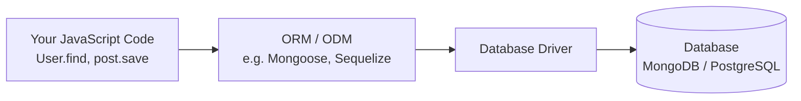
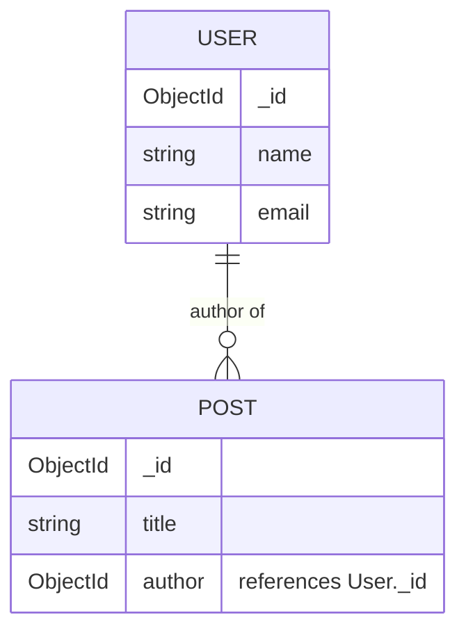

# Lecture 23: Object Relational Mapping (ORM / ODM)

In the last lecture, you talked to databases using raw driver calls — `insertOne`,
`pool.query`, and so on. This works, but it means writing a lot of repetitive code and
manually keeping your JavaScript objects in sync with what's actually stored in the
database. This lecture introduces **ORMs and ODMs**, tools that bridge the gap between
your application's objects and the database, using **Mongoose** (for MongoDB) as the main
example.

## In This Lecture

- Understand what "object-relational mapping" means and why ORMs/ODMs exist
- Define models, schemas, fields, and data types using Mongoose
- Perform CRUD through an ORM/ODM: queries, filtering, projection, pagination
- Work with associations (population in Mongoose, joins/associations in SQL ORMs)
- Understand migrations, seeding, and the trade-offs of using an ORM/ODM

## What Is an ORM/ODM, and Why Use One?

**Object-Relational Mapping (ORM)** is a technique that lets you interact with a
relational database using objects and methods in your programming language, instead of
writing raw SQL by hand. A library that implements this is also called an ORM (as in "an
ORM library").

For document databases like MongoDB, the equivalent tool is called an **ODM**
(**Object-Document Mapper**). The idea is the same: map your database's data onto
JavaScript objects and classes, so you write `User.find(...)` instead of hand-rolled
driver calls.

The most widely used ODM for MongoDB in the Node.js world is **Mongoose**. For SQL
databases, popular ORMs include **Sequelize** and **Prisma**.



Why bother with an extra layer? An ORM/ODM typically gives you:

- **Less repetitive code** — common operations (find, save, update, delete) become
  one-line method calls.
- **Data validation** built into the model definition, checked automatically before data
  is saved.
- **Schema structure** even for MongoDB, where the database itself doesn't enforce one.
- **Relationships** made easier to define and query (population, associations).
- A **consistent API** so switching databases (in theory) requires smaller code changes.

!!! note
    "Object-relational mapping" comes from the relational-database world (mapping table
    rows to objects). When people say "ORM" loosely today, they often mean any of these
    object-mapping tools, including document-database ODMs like Mongoose. This course
    uses "ORM/ODM" to be precise, but don't be surprised to see "ORM" used for both.

## Models, Schemas, Fields, and Data Types

In Mongoose, you define a **schema** — a description of what fields a document should
have and what type each field is — and then compile it into a **model**, which is the
object you actually use to query and save data.

```bash
npm install mongoose
```

```javascript
const mongoose = require("mongoose");
require("dotenv").config();

mongoose.connect(process.env.MONGO_URI)
  .then(() => console.log("Connected to MongoDB via Mongoose"))
  .catch((err) => console.error("Connection error:", err));
```

```javascript
const { Schema, model } = require("mongoose");

const userSchema = new Schema({
  name: { type: String, required: true, trim: true },
  email: { type: String, required: true, unique: true, lowercase: true },
  age: { type: Number, min: 0, max: 120 },
  role: { type: String, enum: ["student", "instructor", "admin"], default: "student" },
  createdAt: { type: Date, default: Date.now },
});

const User = model("User", userSchema);

module.exports = User;
```

Each field in the schema defines:

- **`type`** — the data type (`String`, `Number`, `Boolean`, `Date`, `Array`,
  `Schema.Types.ObjectId`, and more)
- **Validation rules** — like `required`, `min`/`max`, `enum` (a fixed list of allowed
  values), or a custom `validate` function
- **Defaults** — a value used automatically if none is provided

!!! tip
    Mongoose automatically checks these rules whenever you `save()` or `create()` a
    document, and throws a `ValidationError` if something doesn't match — you get free
    validation without writing `if` statements for every field.

### Comparison: Sequelize (SQL ORM)

For a relational database, the same idea looks like this in Sequelize:

```javascript
const { DataTypes } = require("sequelize");

const User = sequelize.define("User", {
  name: { type: DataTypes.STRING, allowNull: false },
  email: { type: DataTypes.STRING, allowNull: false, unique: true },
  age: { type: DataTypes.INTEGER },
});
```

The concepts map closely: a Mongoose "schema" is roughly Sequelize's "model definition,"
and both compile down to an object (`User`) you use to run queries.

## CRUD Through the ORM/ODM

### Create

```javascript
const newUser = await User.create({
  name: "Bilal",
  email: "bilal@email.com",
  age: 20,
});
```

### Read: Queries, Filtering, and Projection

```javascript
// Find all users matching a filter
const students = await User.find({ role: "student" });

// Find one user
const user = await User.findOne({ email: "bilal@email.com" });

// Find by ID (Mongoose's built-in shortcut for _id)
const oneUser = await User.findById("64f1a2b3c4d5e6f7a8b9c0d1");

// Filtering with operators (similar to the raw driver)
const adults = await User.find({ age: { $gte: 18 } });

// Projection: choose which fields to return (here, only name and email)
const emailsOnly = await User.find({}, "name email");
// or: User.find().select("name email")
```

**Projection** means asking the database to return only specific fields instead of the
whole document — useful for performance and for avoiding sending sensitive fields (like a
hashed password) back to the client by accident.

### Pagination

**Pagination** means splitting a large result set into smaller "pages" so you don't load
thousands of records at once.

```javascript
async function getUsersPage(pageNumber, pageSize = 10) {
  const skip = (pageNumber - 1) * pageSize;
  const users = await User.find()
    .sort({ createdAt: -1 })
    .skip(skip)
    .limit(pageSize);
  const total = await User.countDocuments();
  return { users, total, page: pageNumber, totalPages: Math.ceil(total / pageSize) };
}
```

`.skip()` tells MongoDB how many matching documents to jump over, and `.limit()` caps how
many to return — together, they let you fetch page 2, page 3, and so on.

### Update

```javascript
// Update one document and get the updated version back
const updated = await User.findByIdAndUpdate(
  "64f1a2b3c4d5e6f7a8b9c0d1",
  { age: 23 },
  { new: true, runValidators: true }
);

// Update many at once
await User.updateMany({ role: "student" }, { $set: { active: true } });
```

!!! warning
    By default, `findByIdAndUpdate` does **not** run your schema's validation rules on
    the update. Always pass `{ runValidators: true }` if you want Mongoose to check
    fields like `required` or `enum` during an update, not just during creation.

### Delete

```javascript
await User.findByIdAndDelete("64f1a2b3c4d5e6f7a8b9c0d1");
await User.deleteMany({ role: "guest" });
```

## Associations: Population in Mongoose

Because MongoDB documents can embed related data directly, you sometimes don't need
associations at all. But when data is better kept in separate collections — for example,
`Post` documents shouldn't each embed a full copy of their author — Mongoose lets you
**reference** another document by its `_id`, and later **populate** that reference to
pull in the full related document.

```javascript
const postSchema = new Schema({
  title: { type: String, required: true },
  content: String,
  author: { type: Schema.Types.ObjectId, ref: "User" }, // reference to a User document
});

const Post = model("Post", postSchema);
```

```javascript
// Create a post referencing an existing user's ID
await Post.create({
  title: "Learning Mongoose",
  content: "It's pretty handy!",
  author: someUserId,
});

// Later, fetch the post WITH the full author document instead of just its ID
const post = await Post.findOne({ title: "Learning Mongoose" }).populate("author");
console.log(post.author.name); // "Bilal"
```

Without `.populate("author")`, `post.author` would just be the raw ObjectId string. With
it, Mongoose runs a second query behind the scenes and replaces that ID with the actual
`User` document — conceptually similar to a SQL `JOIN`, though implemented as a separate
query rather than a single combined one.



!!! note
    In a SQL ORM like Sequelize, the equivalent idea is called an **association**
    (`User.hasMany(Post)`, `Post.belongsTo(User)`), and behind the scenes it generates
    actual SQL `JOIN` queries.

## Migrations and Seeding

A **migration** is a versioned, scripted change to your database's structure (adding a
column, renaming a table) that can be applied and, ideally, reversed — so your whole team
and every environment (development, staging, production) can keep their database
structure in sync over time. Migrations are a core part of SQL ORMs like Sequelize:

```bash
npx sequelize-cli migration:generate --name add-age-to-users
npx sequelize-cli db:migrate
```

MongoDB's flexible documents mean Mongoose doesn't require formal migrations the way
Sequelize does — but as your schema evolves (e.g., adding a new required field), you
often still need a one-off script to update existing documents. Some teams use a
dedicated tool (like `migrate-mongo`) for this in larger MongoDB projects.

**Seeding** means populating a database with initial or sample data — useful for
development, testing, or setting up default records (like an admin account) on first
deploy.

```javascript
// seed.js
const mongoose = require("mongoose");
const User = require("./models/User");
require("dotenv").config();

async function seed() {
  await mongoose.connect(process.env.MONGO_URI);
  await User.deleteMany({}); // clear existing data
  await User.insertMany([
    { name: "Ayesha", email: "ayesha@email.com", role: "admin" },
    { name: "Bilal", email: "bilal@email.com", role: "student" },
  ]);
  console.log("Database seeded!");
  await mongoose.disconnect();
}

seed();
```

## ORM/ODM Trade-Offs: Convenience vs. Control

Using an ORM/ODM is a trade-off, not a free win.

| Benefit | Cost |
|---|---|
| Less boilerplate code, faster development | An extra layer to learn, on top of the database itself |
| Built-in validation and structure | Generated queries can be less efficient than hand-written ones for complex cases |
| Easier to reason about relationships | "Magic" behavior can hide what's really happening on the database |
| Consistent patterns across a codebase | Occasionally you still need raw queries for advanced features the ORM doesn't expose |

!!! tip
    Most ORMs/ODMs, including Mongoose, let you drop down to raw queries when you need
    to (Mongoose exposes `.aggregate()` for MongoDB's powerful aggregation pipeline, for
    example). You don't have to choose one approach for an entire project — use the ORM
    for everyday CRUD and drop to raw queries for the rare complex case.

## Try It Yourself

1. Define a Mongoose schema for a `Product` (with `name`, `price`, `inStock`, and
   `category` fields, including at least one validation rule like `required` or `min`).
   Create three products, then write a query that finds all products in one category,
   sorted by price, returning only the `name` and `price` fields.
2. Extend the model from the previous exercise: add a `Review` schema that references a
   `Product` by ID. Create a review, then write a query that fetches a product and
   populates all of its reviews.

## Key Takeaways

- An **ORM** (relational) or **ODM** (document, e.g. Mongoose) maps your database's data
  onto objects and methods in your code, reducing repetitive query-writing.
- Mongoose **schemas** define fields, their **data types**, validation rules, and
  defaults; a **model** compiled from a schema is what you actually query with.
- CRUD through Mongoose uses methods like `create`, `find`, `findByIdAndUpdate`, and
  `findByIdAndDelete`, plus filtering, projection (`.select()`), and pagination
  (`.skip()`/`.limit()`).
- **Population** (`.populate()`) resolves a referenced ObjectId into the full related
  document — Mongoose's answer to SQL joins/associations.
- **Migrations** version your database structure over time (central to SQL ORMs like
  Sequelize); **seeding** loads initial or sample data.
- ORMs/ODMs trade some control and query efficiency for a lot of convenience, validation,
  and consistency — and you can still write raw queries when you need to.
