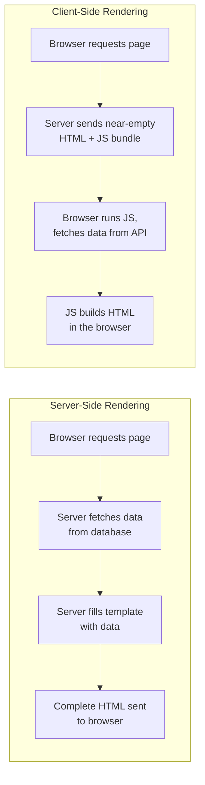

# Lecture 24: Response Generation using Templates

So far, when your Express routes sent HTML, it was probably a single hard-coded string.
Real applications need to build HTML pages dynamically — inserting a logged-in user's
name, listing database records, showing an error message next to a form field. This
lecture covers **template engines**, the tools that let the server generate HTML by
filling in reusable templates with real data, using **EJS** as the primary example.

## In This Lecture

- Recap the difference between server-side rendering (SSR) and client-side rendering
- Understand what a template engine is and see EJS in action
- Pass data from an Express route into a view and interpolate it into HTML
- Use loops, conditionals, partials/includes, and layouts inside templates
- Understand output escaping (basic XSS prevention), form redisplay, and flash messages

## SSR vs. Client-Side Rendering: A Recap

You've already seen these two approaches to building a web page's content; here's a quick
recap before we go further.

**Server-side rendering (SSR)** means the *server* builds the complete HTML page —
including the actual data — and sends it to the browser ready to display. The browser
doesn't need to run extra JavaScript to see the content; it just renders the HTML it
received.

**Client-side rendering (CSR)** means the server sends a mostly-empty HTML page along
with JavaScript, and the *browser* runs that JavaScript (often fetching data from an API)
to build the visible content after the page loads. This is how single-page applications
built with React work — you'll cover that approach later in this course.



This lecture is entirely about the SSR side: how Express, using a template engine,
generates full HTML pages on the server.

## What Is a Template Engine?

A **template engine** is a library that lets you write HTML files with special
placeholders and logic (loops, conditionals) embedded inside them. At request time, the
engine takes your template file, combines it with real data, and produces plain HTML to
send back to the browser. A template file with placeholders is usually called a **view**.

Popular template engines include:

- **EJS** (Embedded JavaScript) — lets you write actual JavaScript inside `<% %>` tags,
  right alongside your HTML. This is our primary example.
- **Pug** (formerly Jade) — uses indentation instead of HTML tags, more compact but a
  different syntax to learn.
- **Handlebars** — a "logic-light" engine that intentionally limits what you can put in a
  template, encouraging you to keep logic in your route handlers.
- **Django templates** — the built-in template language for Python's Django framework;
  conceptually very similar to EJS/Handlebars, just from a different ecosystem.

### Setting Up EJS

```bash
npm install ejs
```

```javascript
const express = require("express");
const app = express();

app.set("view engine", "ejs"); // tells Express to use EJS
app.set("views", "./views");   // folder where your .ejs files live (default is "views")
```

Express will now look for files ending in `.ejs` inside the `views` folder whenever you
call `res.render()`.

## Passing Data to Views and Interpolation

You send data to a view using `res.render(viewName, dataObject)`. Inside the template,
you access that data using EJS tags.

```javascript
app.get("/profile", (req, res) => {
  res.render("profile", {
    username: "Ayesha",
    joinYear: 2023,
  });
});
```

```html
<!-- views/profile.ejs -->
<!DOCTYPE html>
<html>
<head><title>Profile</title></head>
<body>
  <h1>Welcome, <%= username %>!</h1>
  <p>Member since <%= joinYear %>.</p>
</body>
</html>
```

`<%= expression %>` is **interpolation** — it evaluates the JavaScript expression inside
and inserts the result into the HTML, automatically **escaping** it (more on why that
matters below).

## Loops and Conditionals

EJS tags without the `=` sign — just `<% %>` — run raw JavaScript without inserting
anything, which is exactly what you need for control flow like loops and `if` statements.

```javascript
app.get("/products", (req, res) => {
  res.render("products", {
    products: [
      { name: "Notebook", price: 3.5, inStock: true },
      { name: "Pen", price: 1.0, inStock: false },
    ],
  });
});
```

```html
<!-- views/products.ejs -->
<h1>Our Products</h1>

<% if (products.length === 0) { %>
  <p>No products available.</p>
<% } else { %>
  <ul>
    <% products.forEach(function(product) { %>
      <li>
        <%= product.name %> — $<%= product.price.toFixed(2) %>
        <% if (product.inStock) { %>
          <span class="in-stock">In Stock</span>
        <% } else { %>
          <span class="out-of-stock">Out of Stock</span>
        <% } %>
      </li>
    <% }) %>
  </ul>
<% } %>
```

Notice how the `<% %>` tags (for the `if`/`forEach` logic) and `<%= %>` tags (for
inserting values) work together to mix real JavaScript control flow directly into the
HTML structure.

## Partials/Includes and Layouts

As pages grow, you don't want to repeat the same header, navigation bar, and footer in
every single template file. A **partial** (or **include**) is a small, reusable template
fragment you insert into other templates.

```html
<!-- views/partials/header.ejs -->
<header>
  <h1>My Website</h1>
  <nav><a href="/">Home</a> | <a href="/products">Products</a></nav>
</header>
```

```html
<!-- views/products.ejs -->
<%- include('partials/header') %>

<h1>Our Products</h1>
<!-- ... rest of the page ... -->

<%- include('partials/footer') %>
```

!!! note
    `include()` returns raw HTML, so we use `<%- %>` (the **unescaped** output tag)
    instead of `<%= %>` here — otherwise the header's own HTML tags would show up as
    literal text like `&lt;header&gt;` instead of being rendered.

A **layout** takes this a step further: a single "shell" template (with the `<html>`,
`<head>`, header, and footer already in place) that wraps around the unique content of
each page, so you define the outer structure once. EJS doesn't build in layout support
the way some engines do, but you can achieve the same effect with includes, or by adding
the `express-ejs-layouts` package for a more built-in feel:

```javascript
const expressLayouts = require("express-ejs-layouts");
app.use(expressLayouts);
app.set("layout", "layout"); // uses views/layout.ejs as the shared shell
```

```html
<!-- views/layout.ejs -->
<!DOCTYPE html>
<html>
<head><title>My Site</title></head>
<body>
  <%- include('partials/header') %>
  <%- body %>  <!-- each page's unique content is injected here -->
  <%- include('partials/footer') %>
</body>
</html>
```

## Output Escaping and XSS Prevention

**Cross-Site Scripting (XSS)** is an attack where an attacker manages to get their own
JavaScript to run inside your page, usually by submitting malicious text (like a comment
or username) that later gets inserted directly into HTML without being cleaned up. If a
user submits a comment containing `<script>stealCookies()</script>` and your template
inserts it into the page unescaped, that script actually runs in every visitor's browser.

This is exactly why `<%= %>` **escapes** its output by default — it converts special
characters (`<`, `>`, `&`, `"`) into their safe HTML entity equivalents (`&lt;`, `&gt;`,
etc.) so the browser displays them as plain text instead of running them as HTML/script.

```html
<!-- If comment.text is: <script>alert('hacked')</script> -->
<p><%= comment.text %></p>
<!-- Renders safely as visible text: <script>alert('hacked')</script> -->

<p><%- comment.text %></p>
<!-- DANGEROUS: actually executes the script tag in the browser -->
```

!!! danger
    Only use the unescaped `<%- %>` tag for content you trust completely — your own
    partials, or HTML you've deliberately sanitized. **Never** use `<%- %>` on
    user-submitted data. This is one of the most important habits to build early:
    default to escaped output (`<%= %>`) and treat unescaped output as an exception that
    needs a specific reason.

## Form Redisplay

When a user submits a form with an invalid value (say, a missing email), it's much better
to show the form again *with what they already typed* than to make them start over from a
blank form. This pattern is called **form redisplay**.

```javascript
app.post("/signup", (req, res) => {
  const { username, email } = req.body;

  if (!email) {
    return res.render("signup", {
      error: "Email is required.",
      username, // send back what they already typed
      email,
    });
  }

  // ... otherwise, save the user and redirect ...
});
```

```html
<!-- views/signup.ejs -->
<% if (typeof error !== 'undefined') { %>
  <p class="error"><%= error %></p>
<% } %>

<form method="POST" action="/signup">
  <input type="text" name="username" value="<%= typeof username !== 'undefined' ? username : '' %>">
  <input type="email" name="email" value="<%= typeof email !== 'undefined' ? email : '' %>">
  <button type="submit">Sign Up</button>
</form>
```

## Flash Messages

A **flash message** is a short, one-time message (like "Login successful" or "Item
deleted") shown to the user immediately after an action, typically right after a
redirect — and then automatically discarded so it doesn't show up again if the user
refreshes the page. Flash messages rely on **sessions** (which you covered in an earlier
lecture) to temporarily hold the message across the redirect.

```bash
npm install connect-flash express-session
```

```javascript
const session = require("express-session");
const flash = require("connect-flash");

app.use(session({ secret: "some-secret-key", resave: false, saveUninitialized: false }));
app.use(flash());

// Make flash messages available to every template automatically
app.use((req, res, next) => {
  res.locals.successMessage = req.flash("success");
  res.locals.errorMessage = req.flash("error");
  next();
});
```

```javascript
app.post("/items/:id/delete", (req, res) => {
  // ... delete the item ...
  req.flash("success", "Item deleted successfully.");
  res.redirect("/items");
});
```

```html
<!-- views/items.ejs -->
<% if (successMessage.length > 0) { %>
  <p class="flash-success"><%= successMessage[0] %></p>
<% } %>

<% if (errorMessage.length > 0) { %>
  <p class="flash-error"><%= errorMessage[0] %></p>
<% } %>
```

The message is stored in the session when `req.flash()` is called, read (and
automatically removed) the very next time a page is rendered, and gone after that — so
refreshing the `/items` page a second time will not show the message again.

## Try It Yourself

1. Build a small Express + EJS app with a `/students` route that renders a list of at
   least four student objects (`name`, `grade`) passed from the route handler. Use a
   loop to display them in a table, and a conditional to show "No students found" if the
   array is empty.
2. Add a `/comment` form (`GET` to show the form, `POST` to submit it) that requires a
   non-empty `message` field. On an invalid submission, redisplay the form with an error
   message and the text the user already typed. Deliberately type
   `<script>alert(1)</script>` into the field and confirm (using `<%= %>`) that it is
   displayed as harmless text rather than executed.

## Key Takeaways

- **SSR** builds complete HTML on the server before sending it; **client-side
  rendering** sends a near-empty page and builds content with JavaScript in the browser.
- A **template engine** (EJS, Pug, Handlebars, Django templates, etc.) fills HTML
  templates ("views") with real data at request time via `res.render()`.
- EJS uses `<%= %>` for **escaped** interpolation, `<% %>` for control flow (loops,
  conditionals), and `<%- %>` for **unescaped** raw HTML output.
- **Partials/includes** avoid repeating shared markup (headers, footers); **layouts**
  wrap a shared page shell around each view's unique content.
- Escaping output by default is your main defense against **XSS** — never render
  untrusted, user-submitted data with the unescaped tag.
- **Form redisplay** shows a submitted form again with the user's existing input and an
  error message instead of forcing them to start over.
- **Flash messages** use the session to show a one-time message immediately after a
  redirect, then discard it automatically.
