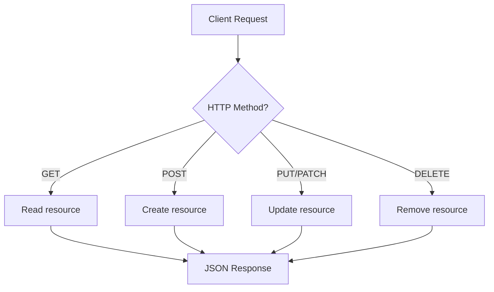
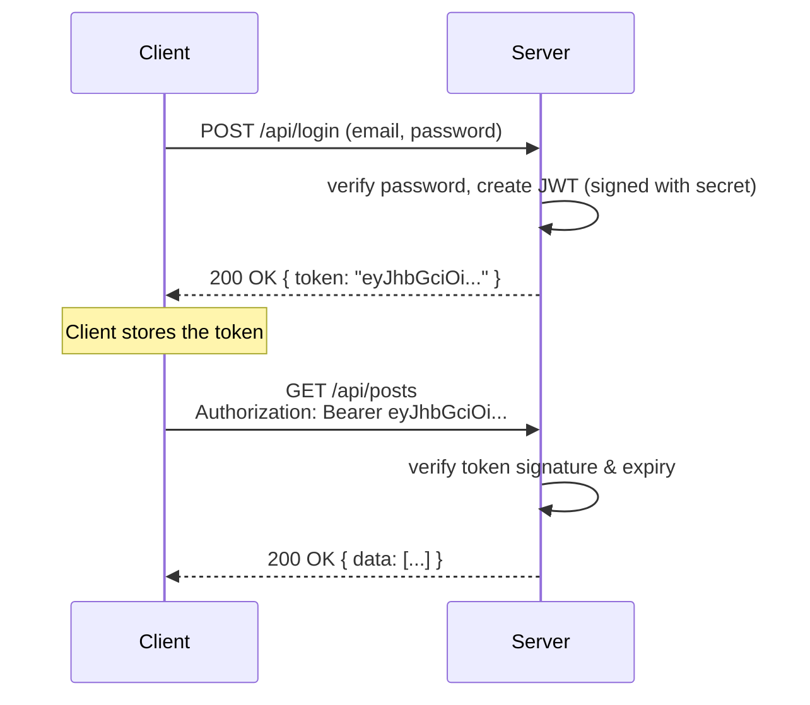

# Lecture 25: REST API Development and Authentication

You've built routes, connected to a database, and generated HTML with templates. This
final lecture in the server-side unit brings it together: designing a clean **REST API**
that a front end (or mobile app, or another service) can consume, and protecting it with
proper **authentication** — first with sessions, then with the token-based approach
(**JWT**) that dominates modern APIs.

## In This Lecture

- Understand REST principles: resources, URIs, HTTP verbs, and statelessness
- Design CRUD endpoints with consistent JSON response shapes
- Compare session-based authentication with token-based authentication (JWT)
- Hash passwords safely with bcrypt
- Protect routes with authentication middleware and implement basic role-based access
  control

## REST Principles

**REST** (Representational State Transfer) is a set of design principles for building
APIs around **resources** — the "nouns" of your application (a user, a post, an order).
A REST API exposes operations on these resources through URLs and standard HTTP methods,
instead of inventing a custom action for every operation (like `/getUser` or
`/deleteUserById`).

### Resources and URIs

Each resource type gets its own URL path, and specific resources are identified by an ID
in that path:

| Resource | Collection URI | Single Resource URI |
|---|---|---|
| Users | `/api/users` | `/api/users/:id` |
| Posts | `/api/posts` | `/api/posts/:id` |
| Comments (nested under a post) | `/api/posts/:postId/comments` | `/api/posts/:postId/comments/:id` |

!!! tip
    Use plural nouns for resource names (`/users`, not `/user`), and never put a verb
    in the URI (avoid `/getUsers` or `/deleteUser/5`) — the HTTP method already
    communicates the action.

### HTTP Verbs

The HTTP method itself tells you *what* to do with a resource:

| Method | Meaning | Example |
|---|---|---|
| `GET` | Read (fetch) a resource, never changes data | `GET /api/users` (list), `GET /api/users/5` (one) |
| `POST` | Create a new resource | `POST /api/users` |
| `PUT` | Replace a resource entirely | `PUT /api/users/5` |
| `PATCH` | Partially update a resource | `PATCH /api/users/5` |
| `DELETE` | Remove a resource | `DELETE /api/users/5` |

### Statelessness

**Statelessness** is a core REST principle: each request from a client must carry
everything the server needs to understand and process it (like an authentication token,
covered below) — the server should not rely on remembering anything about the client from
a previous request. This is why token-based authentication (rather than server-stored
session state) fits REST APIs especially well, though session-based APIs are still
common and useful, particularly for traditional server-rendered apps.



## Designing CRUD Endpoints with Consistent JSON Shapes

A well-designed REST API returns predictable, consistent response shapes so that any
client can parse the response the same way every time.

```javascript
const express = require("express");
const router = express.Router();

// GET /api/posts — list
router.get("/posts", async (req, res) => {
  const posts = await Post.find();
  res.status(200).json({ data: posts });
});

// GET /api/posts/:id — read one
router.get("/posts/:id", async (req, res) => {
  const post = await Post.findById(req.params.id);
  if (!post) {
    return res.status(404).json({ error: "Post not found." });
  }
  res.status(200).json({ data: post });
});

// POST /api/posts — create
router.post("/posts", async (req, res) => {
  try {
    const post = await Post.create(req.body);
    res.status(201).json({ data: post });
  } catch (err) {
    res.status(400).json({ error: err.message });
  }
});

// PATCH /api/posts/:id — partial update
router.patch("/posts/:id", async (req, res) => {
  const post = await Post.findByIdAndUpdate(req.params.id, req.body, { new: true });
  if (!post) return res.status(404).json({ error: "Post not found." });
  res.status(200).json({ data: post });
});

// DELETE /api/posts/:id — delete
router.delete("/posts/:id", async (req, res) => {
  const post = await Post.findByIdAndDelete(req.params.id);
  if (!post) return res.status(404).json({ error: "Post not found." });
  res.status(204).send(); // 204 No Content: success, nothing to return
});
```

Notice the pattern: successful responses wrap the payload in `{ data: ... }`, errors use
`{ error: ... }`, and the status code always matches what actually happened
(`200` OK, `201` Created, `204` No Content, `404` Not Found, `400` Bad Request). Keeping
this shape consistent across every endpoint makes the API much easier for any client to
consume.

## Session-Based vs. Token-Based Authentication

**Authentication** answers the question "who is making this request?" There are two
common approaches you'll encounter constantly.

### Session-Based Authentication (Recap)

As you saw in an earlier lecture, session-based authentication works like this: after a
successful login, the server creates a **session** (data stored server-side) and sends
the client a **session ID** in a cookie. On every future request, the browser
automatically attaches that cookie, and the server looks up the matching session to know
who's asking.

- Storage: the session data lives **on the server** (in memory, a database, or a store
  like Redis); the client only holds a small ID.
- Fits naturally with traditional, server-rendered (SSR) applications, since browsers
  handle cookies automatically.
- Slightly harder to scale across multiple servers, because they all need access to the
  same session store.

### Token-Based Authentication (JWT)

**Token-based authentication** flips this around: instead of the server remembering
anything, the server issues the client a self-contained **token** after login. The client
stores this token itself and sends it back with every request (usually in an
`Authorization` header), and the server verifies the token's authenticity without needing
to look anything up in storage.

The most common token format is a **JWT** (JSON Web Token). A JWT is a string made of
three parts, separated by dots: a **header** (metadata about the token), a **payload**
(the actual data, e.g. the user's ID and role), and a **signature** (created using a
secret key known only to the server, which proves the token hasn't been tampered with).



### Issuing and Verifying a JWT

```bash
npm install jsonwebtoken
```

```javascript
const jwt = require("jsonwebtoken");
require("dotenv").config();

// Issue a token after successful login
function issueToken(user) {
  return jwt.sign(
    { userId: user._id, role: user.role }, // payload
    process.env.JWT_SECRET,                // secret key, kept in .env
    { expiresIn: "1h" }                    // token expires after 1 hour
  );
}

app.post("/api/login", async (req, res) => {
  const { email, password } = req.body;
  const user = await User.findOne({ email });
  const validPassword = user && (await bcrypt.compare(password, user.passwordHash));

  if (!validPassword) {
    return res.status(401).json({ error: "Invalid email or password." });
  }

  const token = issueToken(user);
  res.status(200).json({ data: { token } });
});
```

```javascript
// Middleware to verify a token sent by the client
function verifyToken(req, res, next) {
  const authHeader = req.headers.authorization; // "Bearer eyJhbGciOi..."
  const token = authHeader && authHeader.split(" ")[1];

  if (!token) {
    return res.status(401).json({ error: "No token provided." });
  }

  try {
    const decoded = jwt.verify(token, process.env.JWT_SECRET);
    req.userId = decoded.userId;
    req.userRole = decoded.role;
    next();
  } catch (err) {
    return res.status(401).json({ error: "Invalid or expired token." });
  }
}
```

### Refreshing Tokens

Because a short-lived token (like the 1-hour one above) keeps expiring, apps often issue a
second, longer-lived **refresh token** alongside it. When the short-lived **access
token** expires, the client sends the refresh token to a dedicated endpoint to get a new
access token — without forcing the user to log in again.

```javascript
app.post("/api/refresh", async (req, res) => {
  const { refreshToken } = req.body;

  try {
    const decoded = jwt.verify(refreshToken, process.env.JWT_REFRESH_SECRET);
    const newAccessToken = jwt.sign(
      { userId: decoded.userId },
      process.env.JWT_SECRET,
      { expiresIn: "1h" }
    );
    res.status(200).json({ data: { token: newAccessToken } });
  } catch (err) {
    res.status(401).json({ error: "Invalid refresh token, please log in again." });
  }
});
```

### Comparing the Two Approaches

| | Session-Based | Token-Based (JWT) |
|---|---|---|
| Where identity lives | Server-side session store | Self-contained in the token itself |
| What the client holds | Small session ID (cookie) | The full token (in storage or memory) |
| Server lookup needed? | Yes, on every request | No — the signature is enough to verify |
| Fits well with | Server-rendered (SSR) apps | REST APIs, mobile apps, SPAs |
| Revoking access early | Easy — just delete the session | Harder — token stays valid until it expires (needs an extra "blocklist" if you must revoke immediately) |

!!! note
    Neither approach is universally "better" — session-based auth remains an excellent,
    simple choice for traditional server-rendered applications, while JWTs shine when
    your API is consumed by multiple, separate clients (a React SPA, a mobile app) that
    aren't using browser cookies at all.

## Password Hashing with bcrypt

You must **never** store a user's password as plain text. If your database is ever
compromised, plain-text passwords hand the attacker every user's real password
immediately. Instead, you store a **hash** — the output of a one-way mathematical
function that scrambles the password into something that cannot practically be reversed
back into the original.

**bcrypt** is a widely trusted hashing algorithm designed specifically for passwords —
it's deliberately slow (to resist brute-force guessing) and automatically incorporates a
**salt** (random data mixed in so two identical passwords produce different hashes).

```bash
npm install bcrypt
```

```javascript
const bcrypt = require("bcrypt");

// When a user registers:
app.post("/api/register", async (req, res) => {
  const { email, password } = req.body;
  const passwordHash = await bcrypt.hash(password, 10); // 10 = "salt rounds" (cost factor)

  const user = await User.create({ email, passwordHash });
  res.status(201).json({ data: { id: user._id, email: user.email } });
});

// When a user logs in:
const isMatch = await bcrypt.compare(plainTextPassword, user.passwordHash);
```

`bcrypt.compare()` re-hashes the submitted password using the same salt stored in the
existing hash and checks whether the results match — it never "un-hashes" anything,
because that's not mathematically possible.

!!! warning
    Never log, email, or send a user's plain-text password anywhere, even temporarily,
    and never implement "forgot password" by emailing the old password back — you can't,
    since you never stored it. Instead, send a time-limited reset link/token.

## Protected Routes and Role-Based Access Control

Combine the `verifyToken` middleware from earlier with your routes to require
authentication:

```javascript
app.get("/api/profile", verifyToken, async (req, res) => {
  const user = await User.findById(req.userId).select("-passwordHash");
  res.status(200).json({ data: user });
});
```

**Role-based access control (RBAC)** restricts certain routes to users with a specific
**role** (like `admin`), not just any logged-in user.

```javascript
function requireRole(role) {
  return function (req, res, next) {
    if (req.userRole !== role) {
      return res.status(403).json({ error: "Forbidden: insufficient permissions." });
    }
    next();
  };
}

app.delete("/api/users/:id", verifyToken, requireRole("admin"), async (req, res) => {
  await User.findByIdAndDelete(req.params.id);
  res.status(204).send();
});
```

Here, `verifyToken` runs first (confirms *who* the user is), then `requireRole("admin")`
runs (confirms they're *allowed* to do this specific action). If either check fails, the
request stops there and the actual delete logic never runs.

!!! tip
    Notice this uses the same middleware-chaining pattern from the Middleware lecture —
    authentication and authorization are two of the most common real-world uses for
    custom middleware.

## Try It Yourself

1. Build a small `/api/tasks` REST API (in-memory array or MongoDB, your choice) with
   full CRUD: `GET /api/tasks`, `GET /api/tasks/:id`, `POST /api/tasks`,
   `PATCH /api/tasks/:id`, `DELETE /api/tasks/:id`. Make sure every response follows a
   consistent `{ data: ... }` / `{ error: ... }` shape and uses the correct status code.
2. Add `/api/register` and `/api/login` endpoints that hash passwords with bcrypt and
   issue a JWT on login. Then protect your `/api/tasks` routes with a `verifyToken`
   middleware so only logged-in users can access them, and test it with a tool like
   Postman or `curl` — first without a token (expect `401`), then with a valid one.

## Key Takeaways

- REST organizes an API around **resources** identified by URIs, using standard **HTTP
  verbs** (`GET`, `POST`, `PUT`/`PATCH`, `DELETE`) instead of custom action names.
- REST APIs are ideally **stateless** — each request carries what the server needs to
  process it, rather than relying on server memory of past requests.
- Design CRUD endpoints with **consistent JSON response shapes** and accurate HTTP status
  codes.
- **Session-based auth** keeps identity on the server (a cookie holds only the ID);
  **token-based auth (JWT)** puts a signed, self-contained token in the client's hands —
  each fits different kinds of applications.
- JWTs are **issued** at login, **verified** on protected routes, and often paired with
  a longer-lived **refresh token** to renew access without re-logging in.
- Always hash passwords with **bcrypt** (never store plain text); `bcrypt.compare()`
  checks a login attempt without ever reversing the hash.
- **Authentication middleware** (verifying who someone is) and **role-based access
  control** (checking what they're allowed to do) are typically chained together as
  separate middleware functions on protected routes.
