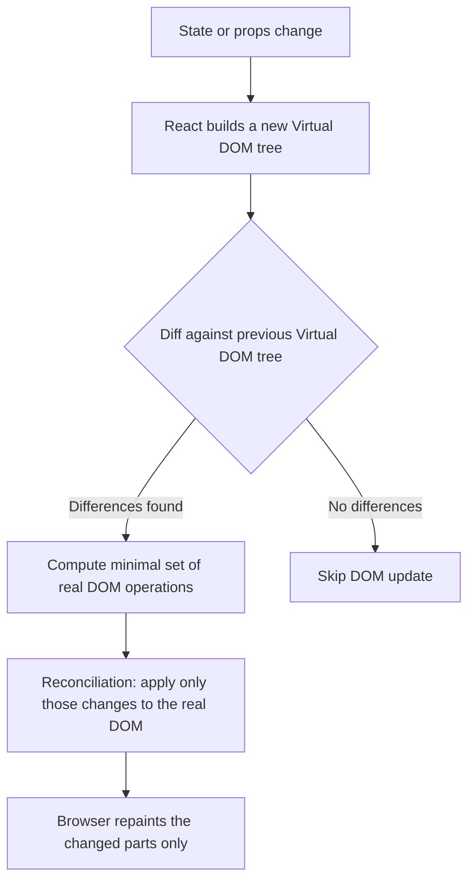
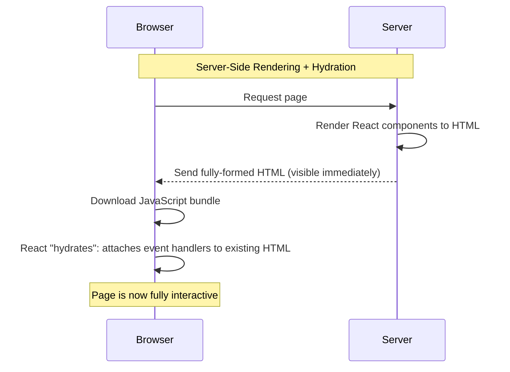

# Lecture 26: Introduction to React.js and Rendering Approaches

Up to now you have built user interfaces by writing HTML and then reaching into it with
vanilla JavaScript — calling `document.querySelector`, creating elements, and manually
updating the DOM whenever data changed. In this lecture you will meet **React**, a
JavaScript library that changes *how* you build UIs: instead of describing the steps to
update the page, you describe *what the page should look like* for any given piece of data,
and React figures out the steps for you.

## In This Lecture

- Why React exists: single-page applications, declarative UI, and components
- The Virtual DOM and how React's reconciliation process updates the real page
- Setting up a React project with Vite, and understanding the folder structure
- JSX: embedding expressions, conditional rendering, and rendering lists with `key`
- A conceptual overview of rendering approaches: CSR, SSR, SSG, and hydration

## Why React?

### From Multi-Page Sites to Single-Page Applications

In earlier lectures, your Express server rendered a full HTML page for every request. Click
a link, and the browser throws away the current page, requests a brand-new one from the
server, and re-renders everything from scratch — even the navigation bar that did not
change. This is the traditional **multi-page application (MPA)** model.

A **single-page application (SPA)** works differently. The browser loads *one* HTML page
(often almost empty), along with a JavaScript bundle. From then on, JavaScript is
responsible for swapping content in and out as the user navigates or interacts, without
ever reloading the whole page. Only the data that changed needs to travel over the network,
and only the parts of the page that need to change are updated. This makes navigation feel
instant, like a desktop or mobile app.

React is the most widely used library for building SPAs (and, as you will see later, it can
also render on the server). It is maintained by Meta and a large open-source community.

!!! note "React is a library, not a framework"
    React itself only handles the "view" layer — turning data into UI. Things like routing
    (Lecture 29) and global state management (Lecture 28) are added separately, either by
    you or through other libraries. This is different from a full framework like Angular,
    which bundles everything together out of the box.

### The Problem with Manual DOM Manipulation

Imagine a shopping cart that shows a list of items and a running total. With vanilla
JavaScript, every time an item is added or removed you must remember to:

1. Update the array of items in memory.
2. Find the right DOM node and add or remove an `<li>`.
3. Recalculate the total.
4. Find the total's DOM node and update its text.

Every one of these is a manual, **imperative** instruction: "go find this element, then
change it this way." As an application grows, keeping the DOM in sync with your data by
hand becomes error-prone — it is easy to forget a step, or to update the DOM in one place
but not another.

### Declarative UI

React lets you write **declarative** UI code instead. You describe what the UI should look
like *for a given state*, and React handles updating the actual DOM when that state
changes. Instead of "add an `<li>` element," you write "the cart section is a list of
these items" — and whenever the list of items changes, React automatically re-renders the
list to match.

```jsx
function CartTotal({ items }) {
  const total = items.reduce((sum, item) => sum + item.price, 0);
  return <p>Total: ${total.toFixed(2)}</p>;
}
```

You never call `document.querySelector` or manually set `.textContent` here. You simply say
"the total paragraph shows this calculation," and React keeps it up to date whenever
`items` changes.

### Components

React applications are built out of **components** — small, self-contained, reusable
pieces of UI, each responsible for one part of the page. A component is just a JavaScript
function that returns a description of some UI (written in JSX, which you will meet
shortly).

```jsx
function Greeting() {
  return <h1>Hello, welcome to the store!</h1>;
}
```

Components can be combined like building blocks: a `Navbar`, a `ProductList`, a
`ProductCard`, and a `Footer` component can all be assembled inside a single `App`
component. This mirrors how you already think about HTML — a page is made of sections — but
each section is now a piece of reusable, testable JavaScript. You will study components,
props, and composition in depth in Lecture 27.

## The Virtual DOM and Reconciliation

Direct changes to the real browser DOM are relatively expensive: the browser may need to
recalculate layout, repaint pixels, and more. React minimizes this cost using a technique
called the **Virtual DOM**.

The **Virtual DOM (VDOM)** is a lightweight, in-memory JavaScript representation of the
real DOM — essentially a plain JavaScript object tree that mirrors the structure of your
UI. Whenever a component's data changes, React does **not** touch the real DOM directly.
Instead, it:

1. Builds a **new** Virtual DOM tree describing what the UI should look like now.
2. Compares this new tree with the **previous** Virtual DOM tree — a process called
   **diffing**.
3. Calculates the smallest set of real DOM changes needed to make the browser match the new
   tree.
4. Applies only those changes to the real DOM. This final step is called **reconciliation**.



Because comparing and updating plain JavaScript objects in memory is much faster than
repeatedly touching the real DOM, this process lets React update complex UIs efficiently,
even when data changes very frequently.

!!! tip "You rarely think about the Virtual DOM directly"
    As a React developer, you almost never interact with the Virtual DOM yourself. You just
    write components that describe the UI for the current data, and React's reconciliation
    process takes care of the rest. It is useful to understand *why* React is fast, but you
    do not need to manage this process manually.

## Setting Up a Project with Vite

To write React code, you need a **build tool** — something that takes your JSX and modern
JavaScript and bundles it into files browsers can run, while also giving you a local
development server with fast reloading.

**Vite** (pronounced "veet," French for "fast") is the modern standard tool for this. It is
fast because it uses native ES modules during development instead of bundling your entire
app on every change.

!!! note "What about Create React App?"
    For years, **Create React App (CRA)** was the official way to start a React project.
    You may still see it in older tutorials and codebases. CRA is no longer actively
    maintained and is noticeably slower during development than Vite, so all new projects
    in this course use Vite.

To create a new React project with Vite:

```bash
npm create vite@latest my-react-app -- --template react
cd my-react-app
npm install
npm run dev
```

This will start a local development server (usually at `http://localhost:5173`) with **hot
module replacement (HMR)** — when you save a file, the browser updates instantly without a
full page reload.

### Folder Structure

A freshly created Vite + React project looks roughly like this:

```text
my-react-app/
├── index.html          # The single HTML page the whole app is injected into
├── package.json         # Project metadata and dependencies
├── vite.config.js       # Vite's configuration file
├── public/               # Static assets copied as-is (favicons, images)
└── src/
    ├── main.jsx          # Entry point: mounts <App /> into index.html
    ├── App.jsx            # The root component
    ├── App.css
    └── index.css
```

`index.html` contains a single empty container, usually `<div id="root"></div>`. `main.jsx`
uses React to render your top-level `App` component into that div:

```jsx title="src/main.jsx"
import { StrictMode } from "react";
import { createRoot } from "react-dom/client";
import App from "./App.jsx";
import "./index.css";

createRoot(document.getElementById("root")).render(
  <StrictMode>
    <App />
  </StrictMode>
);
```

Everything your users see is ultimately rendered inside that one `<div id="root">` — this
is the essence of a single-page application.

## JSX

**JSX (JavaScript XML)** is a syntax extension for JavaScript that lets you write
HTML-like markup directly inside your JavaScript code. Browsers cannot run JSX directly —
Vite transforms it into regular `React.createElement(...)` calls behind the scenes before
the code ever reaches the browser.

```jsx
const element = <h1>Hello, world!</h1>;

// Vite/Babel transforms the line above into approximately:
const element2 = React.createElement("h1", null, "Hello, world!");
```

You write JSX because it reads much closer to the HTML you already know, while still being
plain JavaScript underneath.

### Embedding Expressions

Any JavaScript expression can be embedded inside JSX using curly braces `{ }`:

```jsx
function UserGreeting({ name }) {
  const hour = new Date().getHours();
  const timeOfDay = hour < 12 ? "morning" : "afternoon";

  return (
    <p>
      Good {timeOfDay}, {name.toUpperCase()}!
    </p>
  );
}
```

!!! warning "JSX rules to remember"
    - A component must return a **single** root element (or use the shorthand **Fragment**
      syntax — an empty opening/closing tag pair — to group elements without adding an extra
      DOM node).
    - Use `className` instead of `class`, because `class` is a reserved word in JavaScript.
    - Every tag must be closed, including "self-closing" tags like `` and `<br />`.
    - Curly braces `{ }` can only hold **expressions** (things that produce a value), not
      statements like `if` or `for` loops.

### Conditional Rendering

Because `{ }` only accepts expressions, you cannot write a plain `if` statement inside JSX.
Instead, you use expressions that evaluate to JSX:

```jsx
function LoginStatus({ isLoggedIn }) {
  if (isLoggedIn) {
    return <p>Welcome back!</p>;
  }
  return <p>Please log in.</p>;
}

function Notification({ count }) {
  return (
    <div>
      {count > 0 && <span className="badge">{count} new</span>}
      {count === 0 ? <span>No notifications</span> : null}
    </div>
  );
}
```

The `&&` operator is a common pattern: `count > 0 && <span>...</span>` renders the `<span>`
only when `count > 0` is truthy; otherwise it renders nothing (`false`, which React ignores
during rendering). The ternary operator (`condition ? a : b`) is useful when you need to
choose between two different pieces of UI.

### Rendering Lists and the `key` Prop

To render a list of items, you typically use JavaScript's `.map()` to transform an array of
data into an array of JSX elements:

```jsx
function ProductList({ products }) {
  return (
    <ul>
      {products.map((product) => (
        <li key={product.id}>
          {product.name} — ${product.price}
        </li>
      ))}
    </ul>
  );
}
```

Notice the special `key` prop on each `<li>`. A **key** is a string or number that must be
**unique among siblings** in a list. React uses keys to track which items were added,
removed, or reordered between renders, so it can update the DOM efficiently and correctly
match up existing DOM nodes with the right data.

!!! warning "Don't use the array index as a key when the list can change"
    It is tempting to write `key={index}`, and it works fine for static lists that never
    reorder, get filtered, or have items inserted/removed from the middle. But if the list
    *can* change, using the index can cause React to mix up which DOM element belongs to
    which data — leading to subtle bugs like form inputs showing the wrong value after a
    reorder. Prefer a stable, unique identifier from your data, such as a database `id`.

## Rendering Approaches: An Overview

React components can be turned into actual pixels on the screen in more than one way. You
do not need to master all of these yet — the advanced course covers frameworks like
Next.js that combine several of them — but you should recognize the terms.

| Approach | When HTML is generated | Typical use case |
|---|---|---|
| **CSR** (Client-Side Rendering) | In the browser, after JavaScript downloads and runs | Dashboards, admin panels, apps behind a login |
| **SSR** (Server-Side Rendering) | On the server, for each request | Content that must be fast on first load and SEO-friendly |
| **SSG** (Static Site Generation) | At build time, before deployment | Blogs, documentation, marketing pages |
| **Hydration** | A step *after* SSR/SSG delivers HTML | Making pre-rendered HTML interactive in the browser |

**Client-Side Rendering (CSR)** is what a plain Vite + React app does by default: the
browser downloads a nearly empty HTML page and a JavaScript bundle, then React renders
everything using JavaScript. The first paint can be slow, and search engines that don't
run JavaScript may see an empty page — but once loaded, navigation is very fast.

**Server-Side Rendering (SSR)** runs your React components on the server (in Node.js) for
each incoming request, producing fully-formed HTML that is sent to the browser immediately.
This gives users (and search engines) visible content faster, before any JavaScript has
even loaded.

**Static Site Generation (SSG)** also produces full HTML, but does so **once, at build
time**, rather than per-request. The resulting HTML files can be served instantly from a
CDN, with no server computation needed per visitor. It suits content that is the same for
every user and does not change on every request.

**Hydration** is the process that connects SSR or SSG HTML to React on the client. The
server sends ready-made HTML so the page appears instantly, but that HTML has no event
listeners attached yet — it is not interactive. Hydration is the step where React runs in
the browser, reuses the existing HTML, and "wakes it up" by attaching the JavaScript event
handlers, without re-creating any DOM nodes.



!!! note "This course focuses on CSR"
    In this course you will build a client-side-rendered SPA with Vite, talking to the
    Express REST API you built in Lecture 25. SSR, SSG, and frameworks like Next.js that
    make these approaches easy are covered in depth in the Advanced Web Technologies course.

## Try It Yourself

1. Create a new project with `npm create vite@latest my-first-app -- --template react`,
   run `npm install` and `npm run dev`. Open `src/App.jsx` and replace its contents with a
   component that renders your name and today's date using an embedded JavaScript
   expression.
2. Write a `TaskList` component that receives an array of task objects
   (`{ id, title, done }`) as a prop and renders them as an unordered list. Each list item
   should show the task title, and use conditional rendering (with the ternary or `&&`
   operator) to add the text " (done)" after the title of any completed task. Remember to
   give each `<li>` a proper `key`.

## Key Takeaways

- React lets you build **single-page applications** using a **declarative** style: you
  describe what the UI should look like for the current data, instead of manually updating
  the DOM step by step.
- UIs are built from **components** — reusable functions that return JSX.
- The **Virtual DOM** is an in-memory copy of the UI tree; React **diffs** it against the
  previous version and applies only the minimal necessary changes to the real DOM, a
  process called **reconciliation**.
- **Vite** is the modern tool for creating and running React projects, replacing the older
  Create React App.
- **JSX** lets you write HTML-like syntax in JavaScript; use `{ }` for expressions,
  `className` instead of `class`, and always give list items a stable, unique `key`.
- **CSR**, **SSR**, and **SSG** are three different strategies for turning components into
  HTML, and **hydration** is the step that makes server-delivered HTML interactive in the
  browser.
