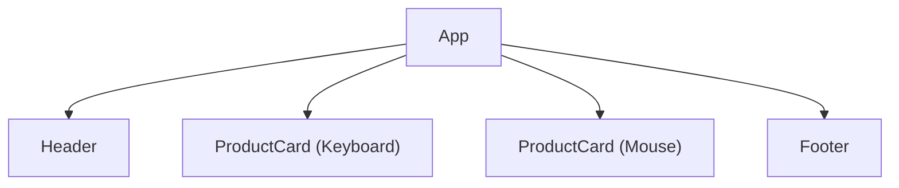
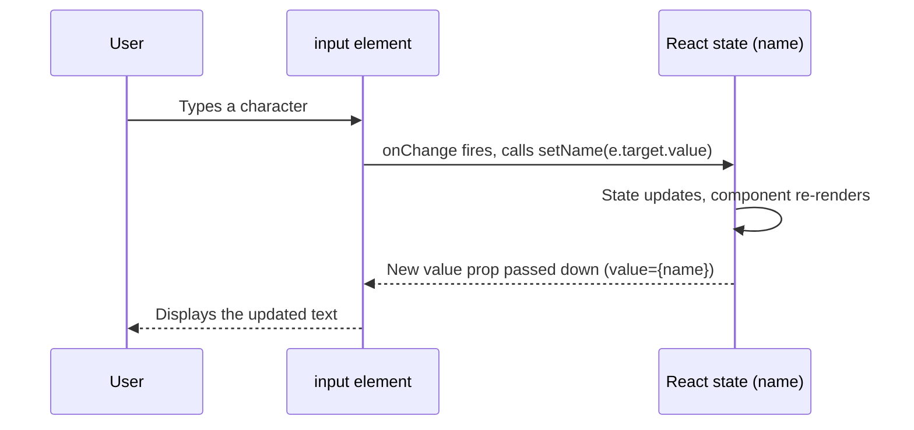

# Lecture 27: Components, Props and Event Handling

In the last lecture you saw that React applications are built from components. In this
lecture you will learn how components talk to each other through **props**, how to compose
small components into larger UIs, what actually causes a component to re-render, and how to
handle user interaction — including building forms — the React way.

## In This Lecture

- Function components, composition, and reusability
- Props, `children`, default props, and the "prop drilling" problem
- What triggers a component to re-render
- Handling events in React and understanding synthetic events
- Controlled components and building forms

## Function Components, Composition, and Reusability

A **function component** is simply a JavaScript function that returns JSX describing a
piece of UI. By convention, component names start with a **capital letter** — this is how
React (and JSX) tells a custom component apart from a regular HTML tag like `<div>`.

```jsx
function Button() {
  return <button>Click me</button>;
}
```

You use a component in JSX just like an HTML tag, but capitalized:

```jsx
function App() {
  return (
    <div>
      <Button />
      <Button />
    </div>
  );
}
```

### Composition

**Composition** means building complex UIs by combining smaller, focused components,
rather than writing one giant component that does everything. This is the same idea as
writing small, single-purpose functions in plain JavaScript — each component should ideally
do one thing well.

```jsx
function Header() {
  return <h1>My Store</h1>;
}

function ProductCard({ product }) {
  return (
    <div className="card">
      <h3>{product.name}</h3>
      <p>${product.price}</p>
    </div>
  );
}

function Footer() {
  return <footer>© 2026 My Store</footer>;
}

function App() {
  return (
    <div>
      <Header />
      <ProductCard product={{ name: "Keyboard", price: 45 }} />
      <ProductCard product={{ name: "Mouse", price: 20 }} />
      <Footer />
    </div>
  );
}
```

Here, `App` is composed of `Header`, two `ProductCard`s, and `Footer`. This mirrors how you
would decompose a page into sections when planning HTML — except each section is now an
independent, reusable, and (as you will see in Lecture 28) independently testable unit.

### Reusability

Because `ProductCard` takes its data as an input rather than hard-coding it, the exact same
component can render *any* product just by passing it different data. This input mechanism
is called **props**, and it is the subject of the next section.



## Props

**Props** (short for "properties") are how a parent component passes data down to a child
component. Props are passed the same way you would set HTML attributes, and are received by
the component as a single object argument.

```jsx
function Greeting(props) {
  return <p>Hello, {props.name}!</p>;
}

// Usage:
<Greeting name="Ayesha" />
```

It is very common to **destructure** props directly in the function's parameter list for
readability:

```jsx
function Greeting({ name }) {
  return <p>Hello, {name}!</p>;
}
```

!!! warning "Props are read-only"
    A component must **never** modify the props it receives. Props flow **one way**: from
    parent to child. If a child needs to change something and have that change reflected
    elsewhere, the parent must pass down a *function* as a prop that the child calls — you
    will practice this pattern later in this lecture and when lifting state up in
    Lecture 28.

### The `children` Prop

Every component automatically receives a special prop called `children`, which contains
whatever was placed **between** its opening and closing tags in JSX. This lets you build
wrapper or "container" components.

```jsx
function Card({ children }) {
  return <div className="card">{children}</div>;
}

// Usage:
function App() {
  return (
    <Card>
      <h3>Keyboard</h3>
      <p>$45</p>
    </Card>
  );
}
```

Here, `Card` does not need to know anything about headings or prices — it simply wraps
whatever content it is given. This is a common way to build reusable layout components like
modals, panels, or page sections.

### Default Props

You can give a prop a fallback value using default parameter syntax, so the component still
works sensibly if the caller forgets to pass that prop:

```jsx
function Avatar({ src, alt = "User avatar", size = 40 }) {
  return ;
}
```

If `<Avatar src="/me.png" />` is used without `size`, it defaults to `40`.

### The Prop Drilling Problem

**Prop drilling** happens when data needs to travel through several layers of components
that don't actually use that data themselves — they only pass it along to a child further
down the tree.

```jsx
function App() {
  const user = { name: "Ayesha" };
  return <Page user={user} />;
}

function Page({ user }) {
  // Page doesn't use `user` itself, only forwards it
  return <Sidebar user={user} />;
}

function Sidebar({ user }) {
  // Sidebar doesn't use `user` itself either
  return <UserBadge user={user} />;
}

function UserBadge({ user }) {
  return <p>Logged in as {user.name}</p>;
}
```

`user` had to pass through `Page` and `Sidebar` even though neither of them needed it,
purely so it could reach `UserBadge`. In a small app this is a minor inconvenience; in a
large app with deeply nested components, prop drilling makes code harder to read and
refactor.

!!! note "The fix comes in the next lecture"
    Prop drilling is exactly the problem the **Context API** (Lecture 28) is designed to
    solve — it lets you make data available to a whole subtree of components without
    passing it through every level manually.

## What Triggers a Re-render?

A component **re-renders** — meaning React calls the function again and re-computes what
its JSX should look like — when any of the following happens:

- Its own **state** changes (via a state updater function, covered in Lecture 28).
- Its **parent** re-renders, which by default re-renders all of its children too.
- The **props** it receives change (which usually happens because a parent's state changed
  and it passed new prop values down).
- A **Context** value it consumes changes (Lecture 28).

Re-rendering does not necessarily mean the real DOM changes — remember from Lecture 26 that
React first computes a new Virtual DOM tree and only updates the real DOM where the diff
shows an actual difference. Re-rendering a component only means "React re-ran the function
to see what it should currently render."

## React Event Handling

Handling user interaction in React looks similar to plain HTML/JavaScript, but with a few
important differences. In vanilla JavaScript, you might write:

```html
<button onclick="handleClick()">Click me</button>
```

In JSX, event handler attribute names are written in **camelCase**, and you pass an actual
**function reference** using curly braces — not a string:

```jsx
function Button() {
  function handleClick() {
    alert("Button clicked!");
  }

  return <button onClick={handleClick}>Click me</button>;
}
```

!!! warning "Don't call the function immediately"
    Write `onClick={handleClick}`, **not** `onClick={handleClick()}`. The second form calls
    `handleClick` immediately while rendering (not when clicked), and passes whatever it
    *returns* as the handler — usually `undefined`, which does nothing on click.

To pass arguments to a handler, wrap the call in an inline arrow function:

```jsx
function ProductList({ products, onAddToCart }) {
  return (
    <ul>
      {products.map((product) => (
        <li key={product.id}>
          {product.name}
          <button onClick={() => onAddToCart(product.id)}>Add to cart</button>
        </li>
      ))}
    </ul>
  );
}
```

### Synthetic Events

The event object your handler receives (e.g. `e` in `function handleClick(e) { ... }`) is
not the browser's raw native event — it is a **SyntheticEvent**, an object that React
creates to wrap the native event. Synthetic events give you a consistent API across all
browsers (so you don't need to worry about cross-browser quirks) and behave much like
native events you already know: `e.target`, `e.preventDefault()`, and `e.stopPropagation()`
all work as expected.

```jsx
function LinkButton() {
  function handleClick(e) {
    e.preventDefault(); // stop the default browser action
    console.log("Link clicked, but navigation was prevented");
  }

  return (
    <a href="https://example.com" onClick={handleClick}>
      Click me
    </a>
  );
}
```

React attaches a single listener at the root of the app and efficiently routes events to
the right component internally, rather than attaching a separate native listener to every
single element — but from your code's perspective, it behaves like a normal event system.

## Controlled Components and Form Handling

In plain HTML, form elements like `<input>` keep their own internal state — the browser
remembers what you typed. In React, it is a common and recommended pattern to make form
inputs **controlled components**: their value is driven entirely by React state, and every
keystroke updates that state through an `onChange` handler.

```jsx
import { useState } from "react";

function NameForm() {
  const [name, setName] = useState("");

  function handleSubmit(e) {
    e.preventDefault(); // don't let the browser reload the page
    alert(`Submitted name: ${name}`);
  }

  return (
    <form onSubmit={handleSubmit}>
      <label htmlFor="name">Name:</label>
      <input
        id="name"
        type="text"
        value={name}
        onChange={(e) => setName(e.target.value)}
      />
      <button type="submit">Submit</button>
    </form>
  );
}
```

Here is what makes `<input>` "controlled":

- Its `value` attribute is always set from React state (`name`), so React state is the
  **single source of truth**.
- Its `onChange` handler updates that state on every keystroke, using `e.target.value`.

Because state changes trigger a re-render, and re-rendering recomputes `value={name}`, the
input's displayed text always matches the state — a full, predictable loop.



!!! tip "Uncontrolled components exist too"
    React also supports **uncontrolled components**, where the DOM itself keeps track of
    an input's value and you read it out using a `ref` only when needed (e.g. on submit).
    You will learn about `ref`s with the `useRef` hook in Lecture 28. Controlled components
    are generally preferred because React state always reflects what's on screen, which
    makes validation, conditional disabling of a submit button, and syncing multiple fields
    much simpler.

Multiple fields can be handled with one state object and one shared handler, which scales
better than one `useState` call per field:

```jsx
function SignupForm() {
  const [formData, setFormData] = useState({ email: "", password: "" });

  function handleChange(e) {
    const { name, value } = e.target;
    setFormData((prev) => ({ ...prev, [name]: value }));
  }

  function handleSubmit(e) {
    e.preventDefault();
    console.log(formData);
  }

  return (
    <form onSubmit={handleSubmit}>
      <input name="email" value={formData.email} onChange={handleChange} />
      <input
        name="password"
        type="password"
        value={formData.password}
        onChange={handleChange}
      />
      <button type="submit">Sign up</button>
    </form>
  );
}
```

Each `<input>` has a `name` attribute matching a key in `formData`, so a single
`handleChange` function can update the right field using computed property syntax
(`[name]: value`).

## Try It Yourself

1. Build a `Rating` component that accepts a `value` prop (a number from 1–5) and a
   `max` prop with a default of `5`, and renders that many star characters, filling in
   `value` of them as "★" and the rest as "☆". Reuse it twice in an `App` component with
   different `value` props to demonstrate reusability.
2. Build a small `LoginForm` component with controlled `email` and `password` inputs and a
   submit button. On submit, prevent the default browser behavior and log the current
   `formData` object to the console instead.

## Key Takeaways

- **Function components** are just functions returning JSX; **composition** means building
  complex UIs from small, focused, reusable components.
- **Props** pass data one-way from parent to child and must never be mutated by the child;
  `children` lets a component wrap arbitrary nested content, and default parameter values
  give props sensible fallbacks.
- **Prop drilling** is the pain of passing data through components that don't need it,
  just to reach a deeply nested child — solved by the Context API in the next lecture.
- A component re-renders when its own state changes, when its parent re-renders, or when
  its props or a consumed context value change.
- React events use **camelCase** names and **SyntheticEvent** objects for consistent,
  cross-browser behavior; always pass a function reference to a handler, not a function
  call.
- **Controlled components** keep form input values in React state via `value` and
  `onChange`, making state the single source of truth for what's displayed.
