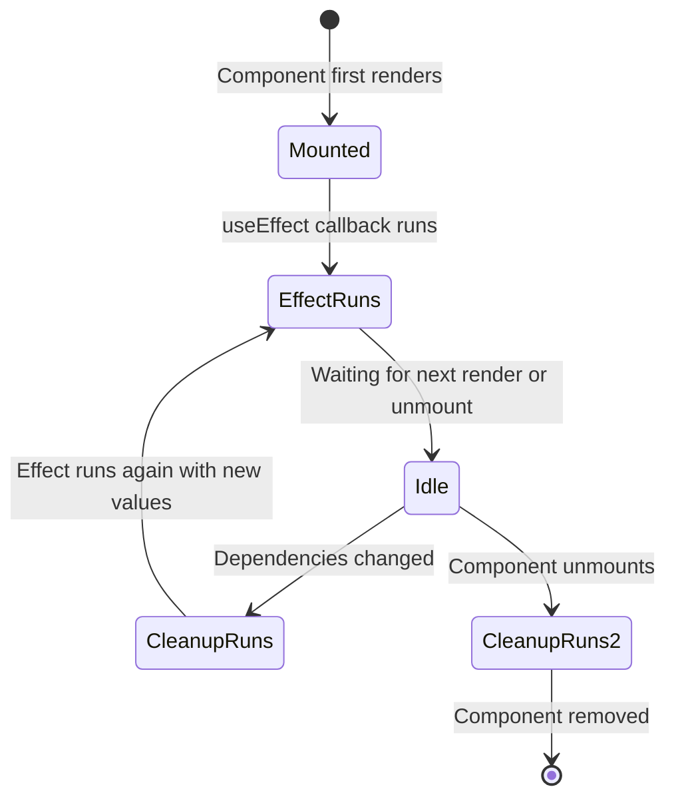

# Lecture 28: Hooks and State Management

Function components on their own cannot "remember" anything between renders, and cannot run
code in response to being displayed or updated. **Hooks** are special functions that let a
function component "hook into" React features like local memory (state) and side effects.
In this lecture you will learn the core hooks, how to share state across components, and
where external state management libraries fit in.

## In This Lecture

- The rules of hooks, and using `useState` for local component state
- Using `useEffect` for side effects, including the dependency array and cleanup functions
- `useRef`, `useMemo`, and `useCallback` for references and performance optimization
- Lifting state up, sharing data with the Context API and `useContext`, and writing custom
  hooks
- A conceptual overview of external state managers: Redux and Zustand

## The Rules of Hooks

All of React's built-in hooks start with the word `use` (`useState`, `useEffect`, and so
on) — this naming convention also applies to any custom hooks you write. Hooks come with
two strict rules that you must follow:

1. **Only call hooks at the top level.** Never call a hook inside a loop, a condition, or a
   nested function. Always call hooks in the same order on every render.
2. **Only call hooks from React function components or from other custom hooks.** Never
   call a hook from a regular JavaScript function, a class component, or an event handler
   callback body directly (call it in the component, then use the value inside the
   handler).

```jsx
// Wrong: hook called conditionally
function Profile({ isLoggedIn }) {
  if (isLoggedIn) {
    const [name, setName] = useState(""); // breaks the rules of hooks
  }
  // ...
}

// Correct: hook always called, condition handled afterward
function Profile({ isLoggedIn }) {
  const [name, setName] = useState("");
  if (!isLoggedIn) return null;
  // ...
}
```

!!! warning "Why this rule exists"
    React keeps track of each hook call by the **order** it was called in during a render,
    not by name. If a hook is skipped conditionally, the order shifts, and React can attach
    the wrong stored value to the wrong hook on the next render. Calling hooks
    unconditionally, at the top of the component, keeps that order stable every time.

## `useState`: Local Component State

**State** is data that a component keeps track of over time, and that can change in
response to user actions, causing the component to re-render with the new value. The
`useState` hook is how a function component declares a piece of state.

```jsx
import { useState } from "react";

function Counter() {
  const [count, setCount] = useState(0); // 0 is the initial value

  return (
    <div>
      <p>Count: {count}</p>
      <button onClick={() => setCount(count + 1)}>+1</button>
    </div>
  );
}
```

`useState(initialValue)` returns an array with exactly two elements: the **current value**
(`count`) and a **setter function** (`setCount`) used to update it. This is destructured
using array destructuring, and by convention named `[thing, setThing]`.

!!! warning "Never mutate state directly"
    Writing `count++` or pushing into a state array directly (`items.push(newItem)`) will
    **not** trigger a re-render, because React only detects a state change when you call
    the setter function with a new value. Always call the setter, and always treat the
    previous state as read-only — create a new value (a new array, a new object) instead of
    mutating the old one.

```jsx
// Wrong: mutates the existing array
function addItem(item) {
  items.push(item);
  setItems(items);
}

// Correct: creates a new array
function addItem(item) {
  setItems([...items, item]);
}
```

When a new state value depends on the previous one, pass a function to the setter instead
of relying on the variable from the current render, especially inside handlers that might
run multiple times before a re-render completes:

```jsx
<button onClick={() => setCount((prevCount) => prevCount + 1)}>+1</button>
```

## `useEffect`: Side Effects

A **side effect** is anything a component does that reaches *outside* of simply computing
and returning JSX — for example, fetching data from an API, subscribing to a browser event,
manually working with a timer, or directly manipulating something outside of React. The
`useEffect` hook lets you run this kind of code in response to rendering.

```jsx
import { useState, useEffect } from "react";

function Clock() {
  const [time, setTime] = useState(new Date());

  useEffect(() => {
    const intervalId = setInterval(() => setTime(new Date()), 1000);

    return () => clearInterval(intervalId); // cleanup function
  }, []); // dependency array

  return <p>Current time: {time.toLocaleTimeString()}</p>;
}
```

`useEffect` takes two arguments: a function containing the side-effect code, and an
optional **dependency array**.

### The Dependency Array

The dependency array controls **when** the effect re-runs:

| Dependency array | Effect runs |
|---|---|
| Omitted entirely | After **every** render |
| `[]` (empty array) | Only **once**, right after the first render |
| `[a, b]` | After the first render, and again whenever `a` or `b` changes |

```jsx
useEffect(() => {
  console.log("Runs after every render");
});

useEffect(() => {
  console.log("Runs only once, on mount");
}, []);

useEffect(() => {
  console.log("Runs on mount, and whenever userId changes");
}, [userId]);
```

!!! warning "Include everything the effect uses"
    Any variable from the component's scope that your effect reads (props, state) should
    generally be listed in the dependency array. Leaving one out is a common source of bugs
    where the effect keeps using a stale, outdated value. Most editors with the official
    ESLint React plugin will warn you when a dependency is missing.

### Cleanup Functions

If the function you pass to `useEffect` **returns** another function, React treats that
returned function as a **cleanup function**. React calls it right before running the effect
again, and also when the component is removed from the page (**unmounted**). Cleanup is
essential for anything that would otherwise leak or keep running after the component is
gone — timers, subscriptions, or event listeners.

```jsx
useEffect(() => {
  function handleResize() {
    console.log("window resized");
  }
  window.addEventListener("resize", handleResize);

  return () => window.removeEventListener("resize", handleResize);
}, []);
```



## `useRef`

The `useRef` hook creates a mutable object that persists across renders **without**
causing a re-render when it changes — unlike state. It has one property, `.current`, which
you can read and write freely.

`useRef` has two common uses:

1. **Accessing a real DOM element directly** (e.g. to call `.focus()` on an input).
2. **Storing a mutable value that should survive re-renders but should not trigger one**,
   such as a timer ID or a previous value for comparison.

```jsx
import { useRef, useEffect } from "react";

function AutoFocusInput() {
  const inputRef = useRef(null);

  useEffect(() => {
    inputRef.current.focus(); // runs once, after the input exists in the DOM
  }, []);

  return <input ref={inputRef} />;
}
```

Setting `ref={inputRef}` on a JSX element tells React to store a reference to that real DOM
node in `inputRef.current` once it is mounted.

## `useMemo` and `useCallback`

Both `useMemo` and `useCallback` exist to avoid unnecessary, expensive recalculation on
every render — a technique called **memoization** (caching a result and reusing it while
its inputs stay the same).

**`useMemo`** caches the **result of a calculation**, and only recomputes it when one of
the listed dependencies changes:

```jsx
import { useMemo } from "react";

function ProductList({ products, searchTerm }) {
  const filteredProducts = useMemo(() => {
    console.log("Filtering...");
    return products.filter((p) =>
      p.name.toLowerCase().includes(searchTerm.toLowerCase())
    );
  }, [products, searchTerm]);

  return (
    <ul>
      {filteredProducts.map((p) => (
        <li key={p.id}>{p.name}</li>
      ))}
    </ul>
  );
}
```

Without `useMemo`, `products.filter(...)` would re-run on **every** render of
`ProductList`, even ones caused by unrelated state changes elsewhere. With `useMemo`, it
only re-runs when `products` or `searchTerm` actually change.

**`useCallback`** is the same idea, but for **functions** instead of values — it returns
the same function reference between renders as long as its dependencies haven't changed.
This matters mainly when passing a callback down to a child component that is optimized
with `React.memo`, since a brand-new function reference on every render would otherwise
defeat that optimization by looking like a changed prop.

```jsx
import { useCallback } from "react";

function ProductList({ products, onAddToCart }) {
  const handleAdd = useCallback(
    (id) => {
      onAddToCart(id);
    },
    [onAddToCart]
  );

  // handleAdd keeps the same reference across renders unless onAddToCart changes
  // ...
}
```

!!! tip "Don't over-optimize"
    `useMemo` and `useCallback` are optimization tools, not something you need on every
    value or function. They add a small amount of overhead themselves. Reach for them when
    you have a genuinely expensive calculation, or a measured performance problem — not by
    default on every component.

## Lifting State Up

**Lifting state up** means moving a piece of state from a child component to their closest
common **parent**, so that multiple sibling components can share and stay in sync with the
same data.

```jsx
function TemperatureConverter() {
  const [celsius, setCelsius] = useState(0);

  return (
    <div>
      <CelsiusInput value={celsius} onChange={setCelsius} />
      <FahrenheitDisplay celsius={celsius} />
    </div>
  );
}

function CelsiusInput({ value, onChange }) {
  return (
    <input
      type="number"
      value={value}
      onChange={(e) => onChange(Number(e.target.value))}
    />
  );
}

function FahrenheitDisplay({ celsius }) {
  return <p>{(celsius * 9) / 5 + 32}°F</p>;
}
```

Neither `CelsiusInput` nor `FahrenheitDisplay` owns the `celsius` state itself — their
shared parent, `TemperatureConverter`, does. This keeps the two children in sync, since
they both read from (and, via a passed-down callback, write to) the same single source of
truth.

## The Context API and `useContext`

Lifting state up works well for a few levels, but as you saw with **prop drilling** in
Lecture 27, passing data through many intermediate components becomes painful. The
**Context API** solves this by letting a parent component make a value available to
*any* descendant, no matter how deeply nested, without passing it through every level as a
prop.

Using context has three steps:

```jsx
import { createContext, useContext, useState } from "react";

// 1. Create a context
const UserContext = createContext(null);

// 2. Provide a value from a parent component
function App() {
  const [user, setUser] = useState({ name: "Ayesha" });

  return (
    <UserContext.Provider value={user}>
      <Page />
    </UserContext.Provider>
  );
}

function Page() {
  return <Sidebar />; // no need to pass `user` through here
}

function Sidebar() {
  return <UserBadge />; // or here
}

// 3. Consume the value with useContext, anywhere below the Provider
function UserBadge() {
  const user = useContext(UserContext);
  return <p>Logged in as {user.name}</p>;
}
```

`UserBadge` reads `user` directly from context with `useContext(UserContext)`, completely
skipping `Page` and `Sidebar`. Context is commonly used for data needed by many parts of an
app: the logged-in user, the current theme, or the selected language.

## Custom Hooks

A **custom hook** is simply a JavaScript function whose name starts with `use` and that
calls other hooks inside it. Custom hooks let you extract and reuse stateful logic between
components, the same way a regular function lets you reuse plain logic.

```jsx
import { useState, useEffect } from "react";

function useWindowWidth() {
  const [width, setWidth] = useState(window.innerWidth);

  useEffect(() => {
    function handleResize() {
      setWidth(window.innerWidth);
    }
    window.addEventListener("resize", handleResize);
    return () => window.removeEventListener("resize", handleResize);
  }, []);

  return width;
}

function ResponsiveMessage() {
  const width = useWindowWidth();
  return <p>{width < 600 ? "Mobile view" : "Desktop view"}</p>;
}
```

`useWindowWidth` bundles up `useState` and `useEffect` logic that tracks the browser
window's width, and any component can now reuse this behavior with a single line. You will
build a similar custom hook for data fetching in Lecture 29.

## External State Managers: Redux and Zustand

For small to medium apps, `useState`, lifted state, and Context are usually enough. As
applications grow very large, with lots of shared state updated from many different places,
teams sometimes reach for a dedicated **state management library** instead.

- **Redux** is the most established option. It keeps your entire application's state in a
  single object called a **store**. State can only change through **actions** (plain
  objects describing "what happened") processed by **reducers** (pure functions that
  compute the new state). Redux is powerful and predictable, but has more boilerplate than
  Context alone.
- **Zustand** is a newer, much simpler alternative. It also centralizes state in a store,
  but with a small, hook-based API and very little boilerplate — you define a store with a
  function and use it directly as a hook in any component, without wrapping your app in a
  `Provider`.

!!! note "You do not need these yet"
    This course does not require Redux or Zustand — `useState`, lifting state up, and the
    Context API are enough for everything you will build here. It is worth knowing these
    names and their general purpose, since you will very likely encounter them in real
    codebases and in the advanced course.

## Try It Yourself

1. Build a `useCounter` custom hook that returns `{ count, increment, decrement, reset }`,
   backed by `useState` internally. Use it inside two separate components on the same page
   to prove each keeps its own independent count.
2. Create a `ThemeContext` that stores `"light"` or `"dark"`, provide it from `App`, and
   consume it with `useContext` inside a deeply nested `Footer` component to set its
   background color — without passing `theme` as a prop through any component in between.

## Key Takeaways

- Hooks must be called unconditionally, at the top level of a function component or
  another custom hook — never inside loops, conditions, or nested functions.
- `useState` gives a component memory across renders; always update state through its
  setter function, never by mutating the previous value directly.
- `useEffect` runs side effects after rendering; its dependency array controls when it
  re-runs, and a returned cleanup function prevents leaks from timers, subscriptions, and
  listeners.
- `useRef` stores a mutable value or a DOM reference that persists across renders without
  triggering one; `useMemo` and `useCallback` memoize expensive values and function
  references to avoid unnecessary recalculation.
- **Lifting state up** shares state between sibling components via their common parent; the
  **Context API** with `useContext` avoids deep prop drilling for widely-needed data.
- **Custom hooks** (functions starting with `use`) let you extract and reuse stateful logic
  across components.
- **Redux** and **Zustand** are external libraries for centralized state management in
  large applications, useful to recognize even though this course relies on React's
  built-in tools.
