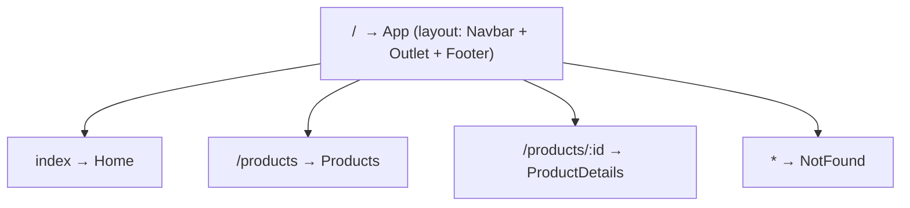
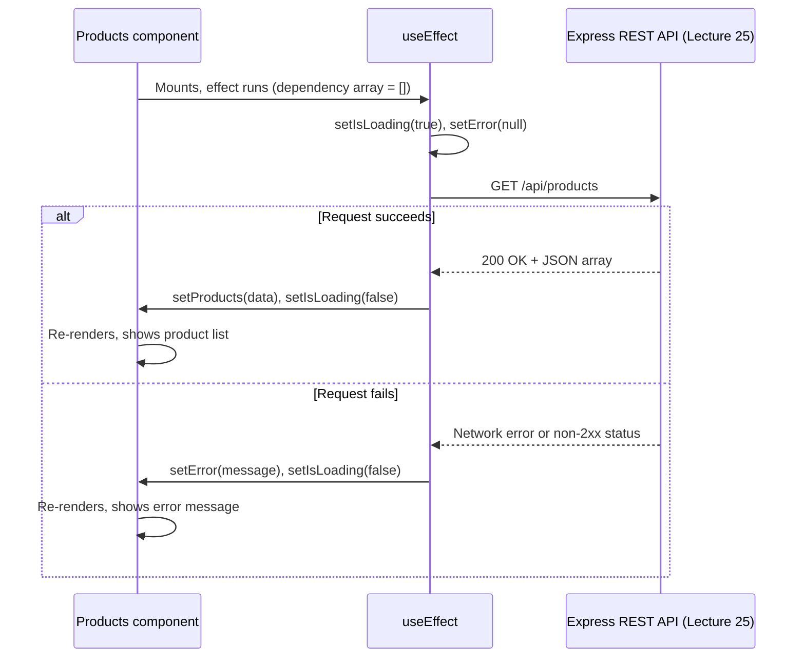

# Lecture 29: Routing and API Integration

A single-page application still needs multiple "pages" — a home page, a product details
page, a login page — and it still needs real data from a server. In this lecture you will
learn how to add client-side navigation with **React Router**, and how to connect your
React front end to the Express REST API you built in Lecture 25.

## In This Lecture

- Client-side routing with React Router: routes, `Link`, and route parameters
- Nested routes, shared layouts, a not-found route, programmatic navigation, and protected
  routes
- Fetching data with `fetch` or `axios` inside `useEffect`, and building a custom data
  hook
- Handling loading and error states while consuming your REST API

## Client-Side Routing with React Router

In Lecture 26 you learned that a single-page application loads one HTML page and uses
JavaScript to swap content in and out. **Client-side routing** is what makes different
URLs (`/`, `/products`, `/products/12`) show different content, *without* the browser
sending a new request to the server for each one. The most widely used library for this in
React is **React Router**.

Install it with:

```bash
npm install react-router-dom
```

### Setting Up Routes

At the root of your app, wrap everything in a `BrowserRouter`, and declare your `Route`s
inside `Routes`:

```jsx title="src/main.jsx"
import { StrictMode } from "react";
import { createRoot } from "react-dom/client";
import { BrowserRouter, Routes, Route } from "react-router-dom";
import App from "./App.jsx";
import Home from "./pages/Home.jsx";
import Products from "./pages/Products.jsx";
import ProductDetails from "./pages/ProductDetails.jsx";
import NotFound from "./pages/NotFound.jsx";

createRoot(document.getElementById("root")).render(
  <StrictMode>
    <BrowserRouter>
      <Routes>
        <Route path="/" element={<App />}>
          <Route index element={<Home />} />
          <Route path="products" element={<Products />} />
          <Route path="products/:id" element={<ProductDetails />} />
          <Route path="*" element={<NotFound />} />
        </Route>
      </Routes>
    </BrowserRouter>
  </StrictMode>
);
```

Each `<Route>` maps a URL `path` to the component (`element`) that should render there.
React Router reads the browser's current URL and renders only the matching route's
component — no page reload happens.

### `Link`: Navigating Without a Reload

Never use a plain `<a href="/products">` to navigate between routes inside your app — that
would trigger a full browser page reload, defeating the purpose of an SPA. Instead, use
React Router's `Link` component, which updates the URL and swaps content using JavaScript:

```jsx
import { Link } from "react-router-dom";

function Navbar() {
  return (
    <nav>
      <Link to="/">Home</Link>
      <Link to="/products">Products</Link>
    </nav>
  );
}
```

!!! tip "NavLink for active-link styling"
    React Router also provides `NavLink`, which behaves like `Link` but automatically adds
    an `active` CSS class (or lets you compute a class/style) when its `to` path matches the
    current URL — handy for highlighting the current page in a navbar.

### Route Parameters

A **route parameter** is a dynamic segment of a URL path, written with a leading colon in
the route definition, like `:id` in `products/:id`. Inside the matching component, read it
with the `useParams` hook:

```jsx title="src/pages/ProductDetails.jsx"
import { useParams } from "react-router-dom";

function ProductDetails() {
  const { id } = useParams(); // reads the :id segment from the URL
  return <p>Showing details for product #{id}</p>;
}

export default ProductDetails;
```

Visiting `/products/12` renders `ProductDetails` with `id` equal to `"12"` (note: route
params are always strings, so convert with `Number(id)` if you need a number).

## Nested Routes and Shared Layouts

Notice that in the route setup above, `Home`, `Products`, and `ProductDetails` are declared
**inside** the `/` route for `App`. This is a **nested route**: `App` acts as a shared
**layout** component — perhaps containing a `Navbar` and `Footer` — and its nested routes'
content is rendered wherever `App` places an `<Outlet />`.

```jsx title="src/App.jsx"
import { Outlet } from "react-router-dom";
import Navbar from "./components/Navbar.jsx";
import Footer from "./components/Footer.jsx";

function App() {
  return (
    <div>
      <Navbar />
      <main>
        <Outlet /> {/* the matching nested route renders here */}
      </main>
      <Footer />
    </div>
  );
}

export default App;
```

`Navbar` and `Footer` render on every page, while `<Outlet />` is replaced with `Home`,
`Products`, or `ProductDetails` depending on the current URL. This avoids repeating shared
UI in every page component.



### A Not-Found Route

The special path `"*"` matches any URL that did not match an earlier route, making it the
perfect catch-all for a **404 / not-found** page:

```jsx title="src/pages/NotFound.jsx"
function NotFound() {
  return <h1>404 — Page not found</h1>;
}

export default NotFound;
```

Placing `<Route path="*" element={<NotFound />} />` last in your route list ensures it only
matches when nothing more specific did.

### Programmatic Navigation

Sometimes you need to navigate in response to code — for example, redirecting a user after
a successful form submission — rather than a click on a `Link`. The `useNavigate` hook
returns a function you can call for this:

```jsx
import { useNavigate } from "react-router-dom";

function LoginForm() {
  const navigate = useNavigate();

  async function handleSubmit(e) {
    e.preventDefault();
    // ... perform login ...
    navigate("/dashboard"); // redirect after success
  }

  return <form onSubmit={handleSubmit}>{/* ...inputs... */}</form>;
}
```

### Protected Routes

A **protected route** only renders its content for authenticated users, redirecting anyone
else (typically to a login page). A common pattern is a small wrapper component:

```jsx title="src/components/ProtectedRoute.jsx"
import { Navigate } from "react-router-dom";
import { useAuth } from "../hooks/useAuth.js";

function ProtectedRoute({ children }) {
  const { user } = useAuth(); // your own auth hook/context

  if (!user) {
    return <Navigate to="/login" replace />;
  }
  return children;
}

export default ProtectedRoute;
```

Then wrap any route that requires login:

```jsx
<Route
  path="dashboard"
  element={
    <ProtectedRoute>
      <Dashboard />
    </ProtectedRoute>
  }
/>
```

`<Navigate to="/login" replace />` redirects the user without them ever seeing the
protected content, and `replace` avoids adding the blocked page to browser history (so the
Back button doesn't return to it).

## Fetching Data from Your REST API

In Lecture 25 you built a REST API with Express — for example, endpoints like
`GET /api/products` and `GET /api/products/:id`. Now you'll call that API from React.

Data fetching is a **side effect** (it reaches outside the component to talk to a server),
so it belongs inside `useEffect`, as you learned in Lecture 28.

### Using `fetch`

```jsx
import { useState, useEffect } from "react";

function Products() {
  const [products, setProducts] = useState([]);

  useEffect(() => {
    fetch("http://localhost:5000/api/products")
      .then((res) => res.json())
      .then((data) => setProducts(data));
  }, []); // empty array: fetch once, when the component mounts

  return (
    <ul>
      {products.map((p) => (
        <li key={p._id}>{p.name}</li>
      ))}
    </ul>
  );
}
```

### Using `axios`

**Axios** is a popular third-party HTTP client library, often preferred over the built-in
`fetch` because it automatically parses JSON responses, has a slightly simpler API, and
makes error handling more consistent (network and non-2xx errors both land in the same
`.catch`, unlike `fetch`, where a 404 or 500 response still resolves successfully and must
be checked manually).

```bash
npm install axios
```

```jsx
import { useState, useEffect } from "react";
import axios from "axios";

function Products() {
  const [products, setProducts] = useState([]);

  useEffect(() => {
    axios
      .get("http://localhost:5000/api/products")
      .then((res) => setProducts(res.data)); // axios parses JSON automatically
  }, []);

  return (
    <ul>
      {products.map((p) => (
        <li key={p._id}>{p.name}</li>
      ))}
    </ul>
  );
}
```

!!! note "async/await works too"
    Both examples can be rewritten using `async`/`await` instead of `.then()` chains. Since
    the function passed to `useEffect` itself cannot be `async` directly, define an `async`
    function inside the effect and call it immediately:
    ```jsx
    useEffect(() => {
      async function loadProducts() {
        const res = await axios.get("http://localhost:5000/api/products");
        setProducts(res.data);
      }
      loadProducts();
    }, []);
    ```

## Loading and Error States

A real request takes time and can fail — because of a network problem, or because the
server returns an error status. Your UI should reflect both possibilities, not just the
successful case. This means tracking (at least) three pieces of state: the data itself, a
loading flag, and an error.

```jsx
import { useState, useEffect } from "react";
import axios from "axios";

function Products() {
  const [products, setProducts] = useState([]);
  const [isLoading, setIsLoading] = useState(true);
  const [error, setError] = useState(null);

  useEffect(() => {
    async function loadProducts() {
      try {
        setIsLoading(true);
        setError(null);
        const res = await axios.get("http://localhost:5000/api/products");
        setProducts(res.data);
      } catch (err) {
        setError("Could not load products. Please try again.");
      } finally {
        setIsLoading(false);
      }
    }

    loadProducts();
  }, []);

  if (isLoading) return <p>Loading products...</p>;
  if (error) return <p role="alert">{error}</p>;

  return (
    <ul>
      {products.map((p) => (
        <li key={p._id}>{p.name} — ${p.price}</li>
      ))}
    </ul>
  );
}
```



### A Custom Data-Fetching Hook

Because "loading, error, data" shows up in almost every component that talks to an API,
it is a great candidate for a **custom hook** (Lecture 28), so you don't repeat this logic
everywhere:

```jsx title="src/hooks/useFetch.js"
import { useState, useEffect } from "react";
import axios from "axios";

function useFetch(url) {
  const [data, setData] = useState(null);
  const [isLoading, setIsLoading] = useState(true);
  const [error, setError] = useState(null);

  useEffect(() => {
    let ignore = false; // avoids updating state if the component unmounts first

    async function load() {
      try {
        setIsLoading(true);
        setError(null);
        const res = await axios.get(url);
        if (!ignore) setData(res.data);
      } catch (err) {
        if (!ignore) setError("Something went wrong. Please try again.");
      } finally {
        if (!ignore) setIsLoading(false);
      }
    }

    load();

    return () => {
      ignore = true; // cleanup: ignore a late response after unmount
    };
  }, [url]);

  return { data, isLoading, error };
}

export default useFetch;
```

Now any component can fetch data from any endpoint of your REST API in one line:

```jsx title="src/pages/Products.jsx"
import useFetch from "../hooks/useFetch.js";

function Products() {
  const { data: products, isLoading, error } = useFetch(
    "http://localhost:5000/api/products"
  );

  if (isLoading) return <p>Loading products...</p>;
  if (error) return <p role="alert">{error}</p>;

  return (
    <ul>
      {products.map((p) => (
        <li key={p._id}>{p.name}</li>
      ))}
    </ul>
  );
}

export default Products;
```

```jsx title="src/pages/ProductDetails.jsx"
import { useParams } from "react-router-dom";
import useFetch from "../hooks/useFetch.js";

function ProductDetails() {
  const { id } = useParams();
  const { data: product, isLoading, error } = useFetch(
    `http://localhost:5000/api/products/${id}`
  );

  if (isLoading) return <p>Loading product...</p>;
  if (error) return <p role="alert">{error}</p>;

  return (
    <div>
      <h1>{product.name}</h1>
      <p>${product.price}</p>
    </div>
  );
}

export default ProductDetails;
```

Combining route parameters (`useParams`) with the `useFetch` custom hook is exactly how a
real "product details" page — backed by the `GET /api/products/:id` endpoint from
Lecture 25 — is built in practice.

!!! warning "CORS during local development"
    If your Express API (e.g. on `http://localhost:5000`) and your Vite dev server (e.g. on
    `http://localhost:5173`) run on different ports, the browser treats them as different
    **origins**, and requests between them are subject to **CORS (Cross-Origin Resource
    Sharing)** rules. Make sure your Express server uses the `cors` middleware (covered in
    Lecture 25) so the browser allows these requests during development.

## Try It Yourself

1. Set up React Router with three routes: `/` (a `Home` page), `/tasks` (a `TaskList`
   page), and a catch-all `*` route rendering a `NotFound` page. Add a `Navbar` with `Link`
   elements to `/` and `/tasks`, rendered through a shared layout using `<Outlet />`.
2. Using the `useFetch` custom hook shown above (or your own version), build a `TaskList`
   page that fetches from an endpoint like `GET /api/tasks` on your Lecture 25 API, shows a
   loading message while the request is in flight, an error message if it fails, and the
   list of tasks once it succeeds. Add a route `/tasks/:id` with a `TaskDetails` page that
   reads the `id` with `useParams` and fetches `GET /api/tasks/:id`.

## Key Takeaways

- React Router enables **client-side routing**: URLs map to components without a full page
  reload; use `Link` (not `<a>`) for in-app navigation.
- Route parameters (`:id`) capture dynamic URL segments, read with `useParams`.
- **Nested routes** combined with `<Outlet />` let you share a layout (navbar, footer)
  across multiple pages; a `path="*"` route provides a not-found page.
- `useNavigate` triggers navigation from code; **protected routes** redirect unauthenticated
  users away from routes that require login.
- Data fetching (`fetch` or `axios`) belongs inside `useEffect`, since it is a side effect;
  `axios` offers automatic JSON parsing and simpler error handling than `fetch`.
- Always track **loading** and **error** state alongside your data, and show the user
  appropriate feedback for each case rather than only the success case.
- A custom `useFetch` hook removes repetition when many components need to load data from
  your REST API.
